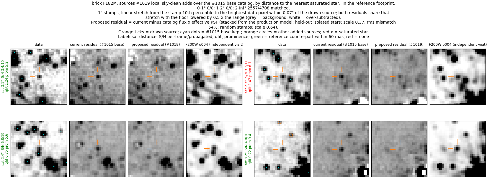
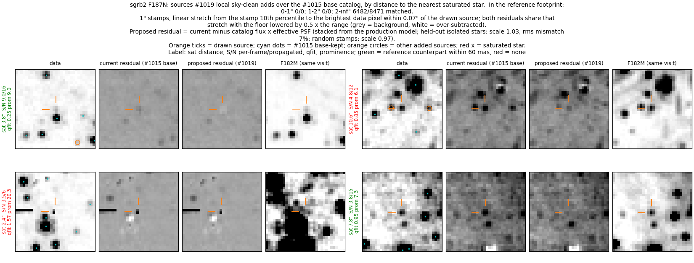
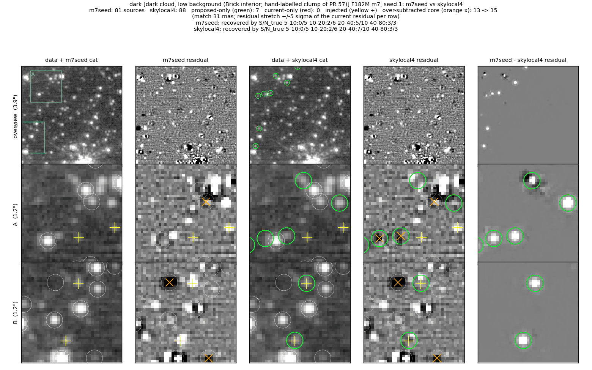
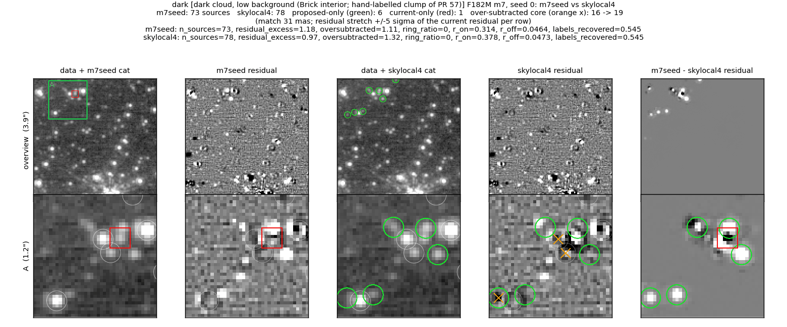
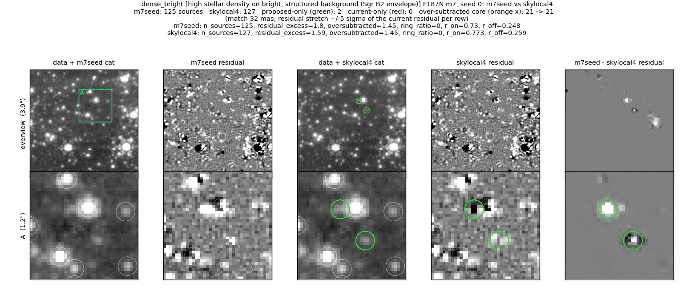

# Sky-clean tier: local 3″ structure reference

The sky-clean keep tier (prominence + S/N, qfit ignored) applies where a
source's annulus floor is within 2 dark-sky σ of the field's dark-sky
reference, the 5th percentile of the whole mosaic.  Outside the darkest lane
of a field every source reads as "on emission" and the tier is inert (Brick
F182M m7: 29k of 35k dropped S/N 5–20 sources failed only this test).  This
branch also marks a source clean when its annulus floor is within 2 i2d ERR
of the 5th percentile of its own 3″ tile.  Tile p25 − p5 measures ~0.8 ERR in
the Brick dark cloud, ~1.8 in the Sgr B2 envelope, ~9 on W51 F187N emission
and ~13 in the Sgr A* cluster, so filaments and crowding stay outside the
tier.  The global test is kept as an OR.

## Full-field replay: how many of the additions are real

The m6 vetting of this branch, replayed on the production merged catalogs at
pipeline defaults and compared row for row with the #1015 base
(`scripts/replay_lsky.sbatch`, `scripts/analyze_lsky.sbatch`; the replay ran
at 54f5bc7f, and the later commits change no default).  Realness of the
additions = (match − chance) / (expected − chance): match within 60 mas
against the reference catalog, chance from shifted positions, expected from
#1015 base-kept sources of the same flux.  The Brick reference is F200W from
an independent visit (1182/o004); the Sgr B2 and W51 references are F182M
from the same visit, which also respond to emission structure, so those two
values read high.

| field | #1015 base kept | this branch kept | added | lost | realness of the additions |
|---|---|---|---|---|---|
| Brick F182M | 377,837 | 383,471 | 5,634 (+1.5%) | 0 | 0.95 (F200W, independent visit) |
| Sgr B2 F187N | 408,591 | 417,062 | 8,471 (+2.1%) | 0 | 1.04 (F182M, same visit) |
| W51 F187N | 20,041 | 21,148 | 1,107 (+5.5%) | 0 | 1.19 (F182M, same visit) |

By per-frame S/N (`flux / flux_err`), n (realness):

| field | S/N < 4 | 4–5 | 5–7 | 7–10 | ≥ 10 |
|---|---|---|---|---|---|
| Brick | 1,677 (1.24) | 1,870 (1.26) | 560 (0.86) | 770 (0.73) | 757 (0.56) |
| Sgr B2 | 2,265 (1.06) | 2,922 (1.13) | 971 (1.05) | 1,111 (1.06) | 1,202 (1.05) |
| W51 | 174 (0.57) | 252 (0.91) | 190 (1.35) | 177 (1.57) | 314 (1.42) |

By qfit:

| field | 0.2–0.4 | 0.4–0.6 | 0.6–1 | ≥ 1 |
|---|---|---|---|---|
| Brick | 735 (0.75) | 943 (0.67) | 2,658 (1.22) | 1,294 (1.10) |
| Sgr B2 | 946 (1.13) | 1,387 (1.04) | 3,736 (1.11) | 2,391 (1.03) |
| W51 | 337 (1.50) | 187 (1.58) | 373 (1.06) | 210 (0.51) |

All additions have prominence ≥ 5 (the tier's requirement); none lies within
2″ of a saturated star.  In the Brick, against the independent visit, the
faint additions (S/N < 5, 63% of them) match as often as base-kept stars of
the same flux, and the brighter additions read lower (0.73 at S/N 7–10, 0.56
at S/N ≥ 10, 1,527 sources together).  At realness 0.95 about 5% of the Brick
additions, roughly 300, are spurious by this measure.  On W51 the weakest
slices are S/N < 4 (0.57) and qfit ≥ 1 (0.51).  Per-bin values are in
[`data/slices_lsky.json`](data/slices_lsky.json) and the totals in
`data/compare_<field>.json` (variant `lsky`).

This measurement uses a second catalog in place of injected stars to
estimate how many of the full-frame additions are real; only the Brick
reference comes from an independent epoch.

Four random Brick F182M additions (1″ stamps; F200W from the independent
visit in the last column).  Per source: data with the #1015 catalog (cyan
dots); the m6 residual with the #1015 sources subtracted (current); the same
with the added source also subtracted as catalog flux × the effective PSF
(proposed).  Both residuals share one stretch whose floor sits below the
background, so an over-subtracted core would read white.  Three sources are
green (F200W counterpart within 60 mas) and their compact peak leaves the
residual with no white core (left column both rows, right column bottom row;
the bottom-left source sits next to a brighter neighbour and appears in F200W
as an elongated blend).  The red one (top right, qfit 1.47) is a compact
F182M peak that the subtraction reduces to a faint remnant; F200W shows a
compact source about one pixel away, outside the 60 mas match radius.  The
Brick effective PSF matches the production model to 54% rms with scale 0.37
on 13 held-out isolated stars (0.64 on 146 random stamps; figure title), so
the proposed Brick column shows where the additions sit and how compact they
are; it is a rough check of their flux.

The same for Sgr B2 F187N (F182M of the same visit in the last column;
effective PSF scale 1.03, 7% rms mismatch).  Top left (green): a faint
source near a brighter star; the proposed residual shows a shallow light
patch at the position, a mild over-subtraction.  Top right (red): the
compact peak at the position drops to a faint remnant; the F182M stamp shows
compact sources at and next to the position, and the vetted F182M catalog has
no entry within 60 mas.  Bottom right (green): a faint source on mottled
background is removed.  Bottom left (red, qfit 1.57, prominence 20.3): the
fit sits 1–2 px from a single-pixel spike beside a horizontal streak, and
the spike stays in both residuals (the white blob below it is the
over-subtracted core of a #1015 star, present in both).  The tier ignores
qfit, so it can admit fits next to artefacts of this kind.

## Reference fields at 10 seeds (dark cloud)

The 3-seed runs below showed the dark field losing one injected star at
S/N 40–80 and gaining three over-subtracted cores in the clean run.  The
dark field was rerun at 10 injection seeds plus the clean run, scored with
the #1014 evaluator (`data/eval10_main.json`, `data/eval10_dark_lskyv2.json`):

| variant | S/N 5-10 | S/N 10-20 | S/N 20-40 | S/N 40-80 | resid excess /as² | over-subtracted /as² (n) | labels | bias mag |
|---|---|---|---|---|---|---|---|---|
| main (#1014 at 500fc69c) | 0/62 | 12/55 | 37/61 | 45/62 | 1.39 | 1.18 (17) | 0.455 | 0.032 |
| this branch (bb91a265, #1015 union off) | 0/62 | 14/55 | 38/61 | 45/62 | 1.25 | 1.18 (17) | 0.455 | 0.031 |

At 10 seeds the S/N 40–80 bin and the over-subtracted count equal `main`;
the branch gains 2 and 1 injected stars at S/N 10–20 and 20–40, within the
binomial noise.  Both rows fail the same six #1014 dark-field thresholds (S/N 5–10 to
40–80 completeness, residual excess, labels), which #1014 is recalibrating
at 10 seeds.  The three other fields were not rerun at 10
seeds; at 3 seeds superdense and W51 are unchanged and dense_bright gains one
star.

## Reference fields at 3 seeds (m7)

Figure layout and metric definitions:
[../faint_reference_fields/README.md](../faint_reference_fields/README.md).
Comparison: `m7seed` (the base branch) → `skylocal4` (this branch).

### Dark cloud (Brick, F182M), injection seed 1

7 added, 0 dropped; the seed's injected S/N 20–40 bin goes 5/10 → 7/10.
Row B: two injected stars (yellow +) are fitted and leave the residual.
Row A: two added sources next to a brighter star carry over-subtracted cores
(13 → 15 in this seed).

### Dark cloud (Brick, F182M), clean run

6 added, 1 dropped; residual excess 1.18 → 0.97 per arcsec², over-subtracted
16 → 19.  Row A: the added sources sit in and around a compact group; after
the refit two existing members and one added star have over-subtracted cores.
This compact group is the same one the qfit and S/N-floor branches touch.

### High density on bright background (Sgr B2, F187N), clean run

2 added, 0 dropped; residual excess 1.80 → 1.59, over-subtracted unchanged
(21).  Row A: one source next to a bright star, on the same residual bar the
qfit branch picks up, and one faint star.

## Metrics (m7)

**superdense (NSC, F212N)** (phase m7)

| variant | S/N 40-80 | S/N 80-160 | S/N 160-320 | S/N 320-640 | resid excess /as² (+/−) | over-subtracted /as² (n) | labels | bias mag |
|---|---|---|---|---|---|---|---|---|
| m7seed | 1/11 | 5/13 | 5/14 | 8/10 | 1.32 (22/3) | 1.32 (19) | — | 0.018 |
| skylocal4 | 1/11 | 5/13 | 5/14 | 8/10 | 1.32 (22/3) | 1.32 (19) | — | 0.018 |

**dense + bright bg (Sgr B2, F187N)** (phase m7)

| variant | S/N 5-10 | S/N 10-20 | S/N 20-40 | S/N 40-80 | resid excess /as² (+/−) | over-subtracted /as² (n) | labels | bias mag |
|---|---|---|---|---|---|---|---|---|
| m7seed | 0/17 | 0/11 | 2/9 | 5/11 | 1.80 (26/0) | 1.45 (21) | — | 0.001 |
| skylocal4 | 0/17 | 0/11 | 3/9 | 5/11 | 1.59 (23/0) | 1.45 (21) | — | -0.004 |

**modest density + bright bg (W51, F187N)** (phase m7)

| variant | S/N 5-10 | S/N 10-20 | S/N 20-40 | S/N 40-80 | resid excess /as² (+/−) | over-subtracted /as² (n) | labels | emission knots cataloged | bias mag |
|---|---|---|---|---|---|---|---|---|---|
| m7seed | 0/11 | 0/6 | 0/13 | 11/18 | 0.55 (10/2) | 0.07 (1) | — | 2/4 | 0.138 |
| skylocal4 | 0/11 | 0/6 | 0/13 | 11/18 | 0.55 (10/2) | 0.07 (1) | — | 2/4 | 0.138 |

**dark cloud (Brick, F182M)** (phase m7)

| variant | S/N 5-10 | S/N 10-20 | S/N 20-40 | S/N 40-80 | resid excess /as² (+/−) | over-subtracted /as² (n) | labels | bias mag |
|---|---|---|---|---|---|---|---|---|
| m7seed | 0/10 | 4/11 | 9/15 | 11/12 | 1.18 (19/2) | 1.11 (16) | 0.55 | 0.050 |
| skylocal4 | 0/10 | 4/11 | 11/15 | 10/12 | 0.97 (16/2) | 1.32 (19) | 0.55 | 0.050 |

## Reproduce

From `scripts/`:

- `WT_SEED=<#1015 worktree> WT_LSKY=<this worktree> sbatch replay_lsky.sbatch`:
  the m6 vetting replay (`vet_variant.py`) of both branches on Brick F182M,
  Sgr B2 F187N and W51 F187N, written to `out/`.
- `sbatch analyze_lsky.sbatch`: `compare.py` (counts, keep paths,
  saturated-star distance bins, realness), `slices.py <field> lsky` (the
  S/N, prominence and qfit tables), `propresid.py` (the effective PSF) and
  `added_gallery.py` (the two galleries).
- Outputs used above, copied into `data/`: `compare_{brick,sgrb2,w51}.json`
  (these also hold the other branches' replays; this branch is variant
  `lsky`) and `slices_lsky.json` (the three `slices_<field>_lsky.json`
  merged, keyed by field).  The 10-seed reference-field results are the
  #1014 evaluator output (`python -m
  jwst_gc_pipeline.photometry.reference_fields.evaluate --fields dark
  --json ...`), in `data/eval10_main.json` and
  `data/eval10_dark_lskyv2.json`.

## Caveats

- In the 3-seed runs over-subtracted cores rise on the dark field (16 → 19
  clean, 13 → 15 seed 1), all inside crowded groups next to brighter stars;
  at 10 seeds (above) the count equals `main`.
- Unchanged on superdense and W51 at m7, as intended (their tiles have
  large p25 − p5).
- The local reference is the tile's 5th percentile; a tile that is entirely
  inside a smooth bright plateau counts as clean.  The tier assumes that a
  smooth plateau does not produce PSF-like peaks; the prominence and S/N
  requirements of the tier still apply, and 23% of the full-frame Brick
  additions have qfit ≥ 1.  The full-field realness measurement above tests
  this assumption.
- The full-field realness relies on a catalog match: a real star missing
  from the reference catalog counts as spurious, and a reference entry on an
  artefact or emission knot counts as a confirmation.  The Brick value uses
  an independent visit and is the least affected.
