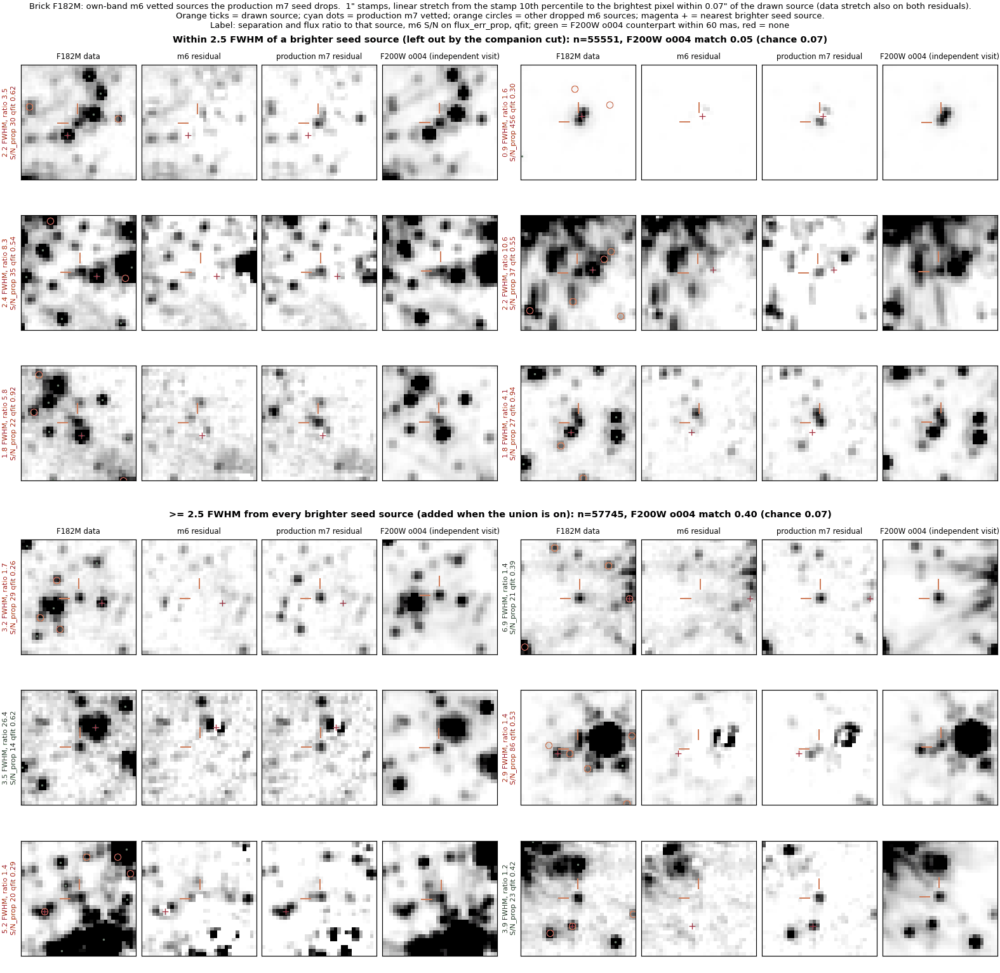
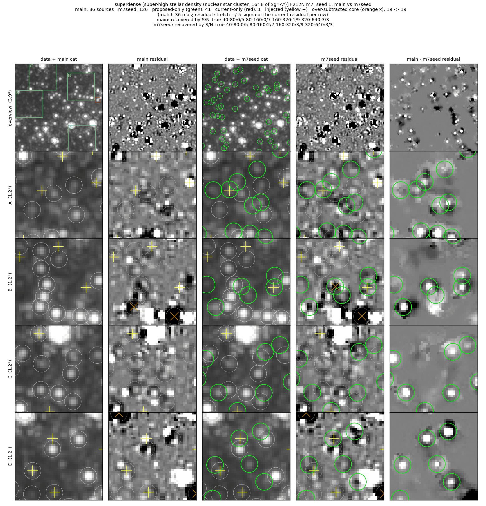
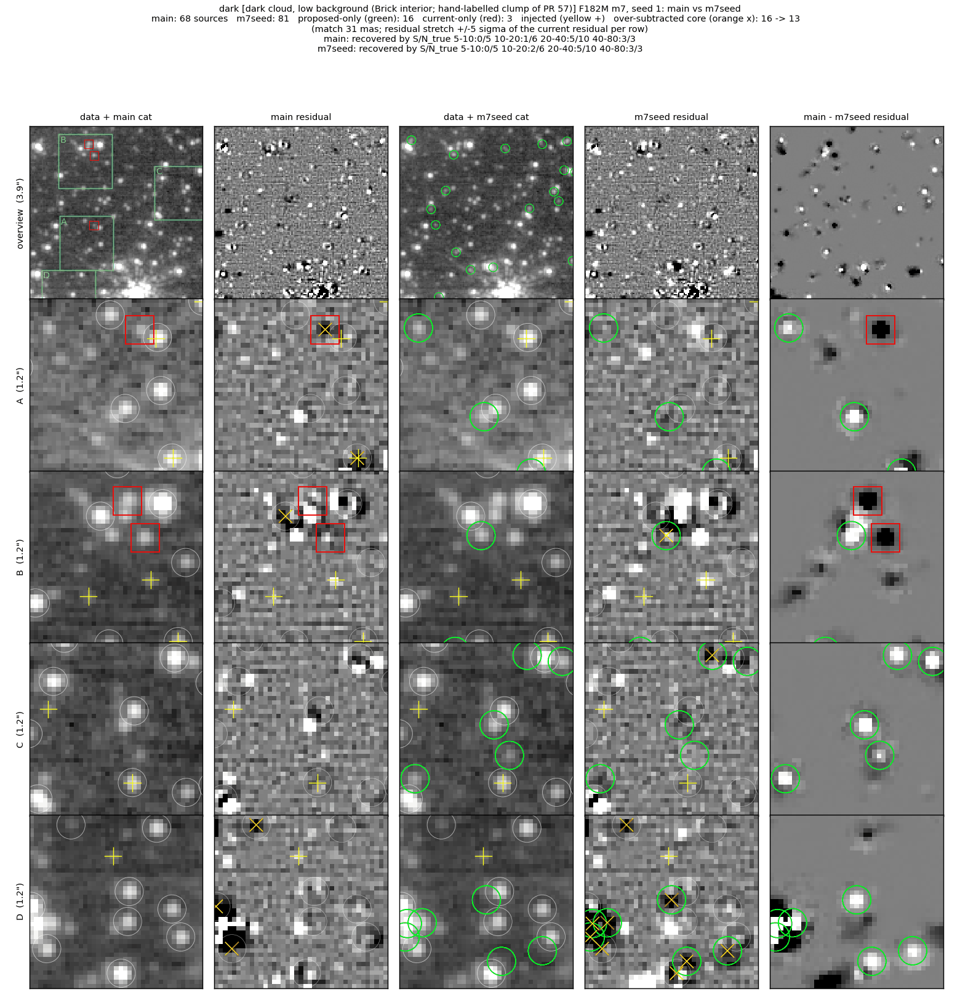
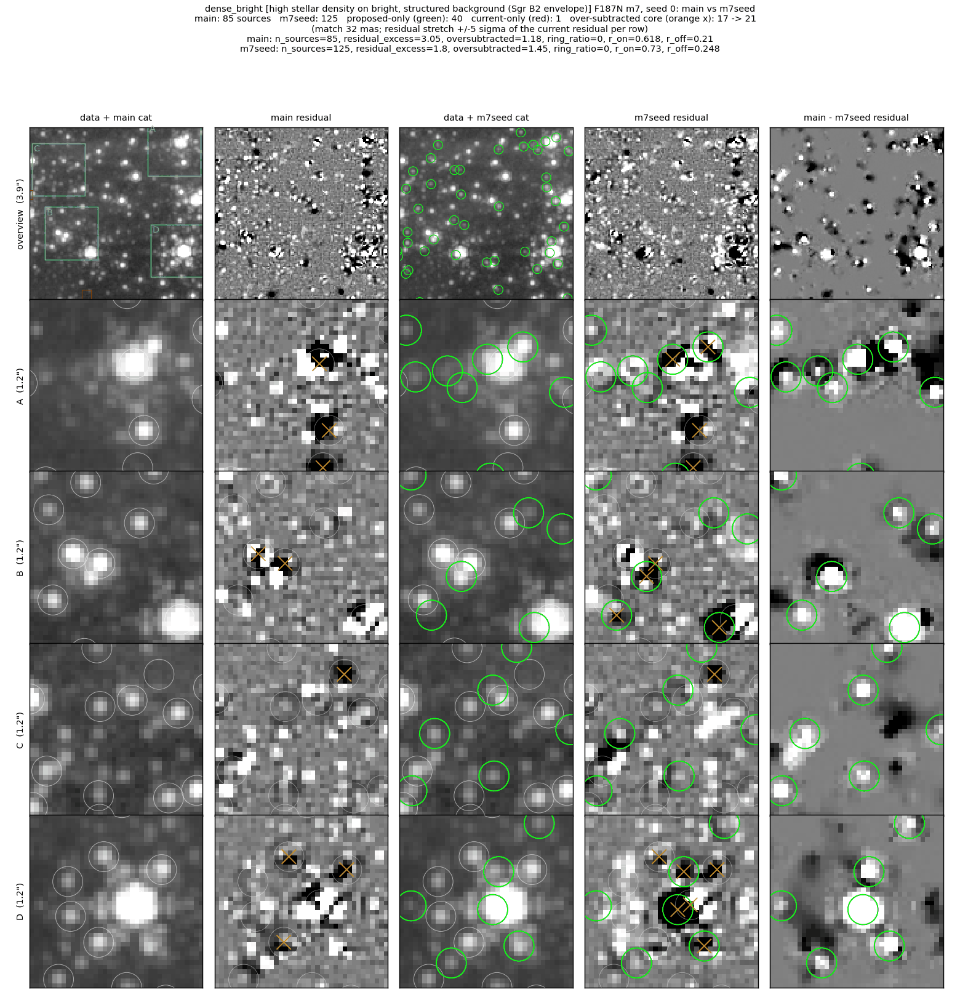
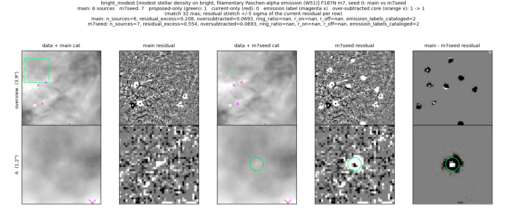
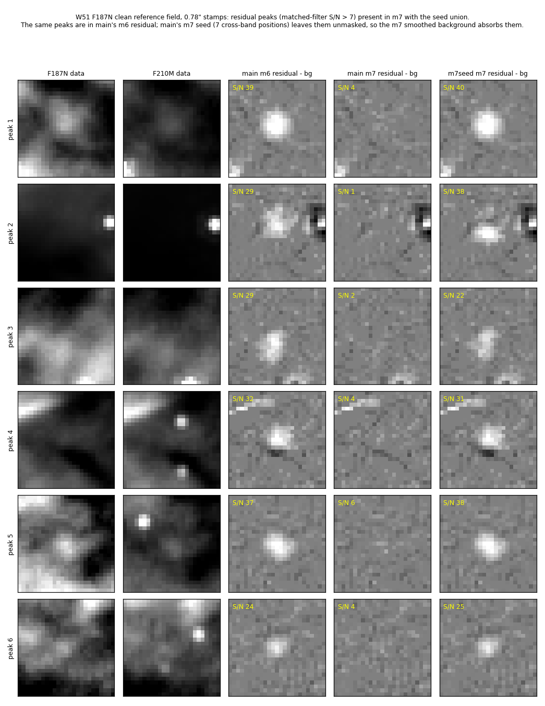

# m7 seed: opt-in union of the own-band m6 vetted catalog

`main` builds each band's m7 seed from the ≥2-filter cross-band seed only.  A
third of the m6 vetted catalog in Brick F182M (and in Sgr B2 and Sgr A*) has
no cross-band counterpart and does not enter the m7 seed; m7's own iterative
detection finds some of these again.  This branch adds
`--manual-m7-seed-own-band` (`manual_m7_seed_own_band`, **default off**),
which unions each band's own m6 vetted catalog, and daofind detections on the
m6 residual − background, into that band's m7 seed.  Own-band sources within
`--manual-m7-seed-own-band-companion-fwhm` (2.5) PSF FWHM of a brighter seed
source are not added.

The full-field test below measures how often an independent visit confirms
the sources the union adds.  In the SW bands about half of them sit within
2.5 FWHM of a brighter star and are confirmed at the chance rate (fits to the
PSF-mismatch ring).
The remainder are confirmed 0.4–0.8× as often as the m6 vetted sources that
production m7 already has, depending on band.  The union is therefore off by
default, and applies the companion cut when on.

## Full-field realness (Brick)

`scripts/seeds_fullfield.py` builds, outside the production tree, the m7 seed
this branch builds per band (union on, before the companion cut) from the
production Brick 2221/o001 m6 products, records each seed row's origin and
its separation to the nearest production m7 vetted source.  Each group is
matched within 60 mas against the Brick 1182/o004 F200W m7 vetted catalog
(independent visit, other detectors; F444W o004 for the LW bands).  The
chance rate comes from the same positions shifted by ~2″.  rel =
(match − chance) / (expected − chance), where the expectation is the match
rate of the own-band m6 vetted sources production m7 also has, in the same
flux bin: 1 means as often confirmed as those, 0 means chance
(`scripts/seed_realness.py`).

| F182M m7 seed group (in the F200W o004 footprint) | n | match | chance | rel |
|---|---|---|---|---|
| cross-band seed | 58,740 | 0.93 | 0.07 | 1.37 |
| own-band m6 vetted, in production m7 | 171,390 | 0.88 | 0.07 | 1.00 |
| own-band m6 vetted, not in production m7 (**the union adds these**) | 113,296 | 0.23 | 0.07 | 0.21 |
| m6 residual daofind, in production m7 | 9,599 | 0.68 | 0.07 | 0.77 |
| m6 residual daofind, not in production m7 | 98,572 | 0.17 | 0.07 | 0.13 |

Production m7 runs its own iterative detection on the m6 residual, so it
contains 171,390 of the 284,686 own-band m6 vetted sources although only
58,740 of them are in its cross-band seed.

The low rel holds at every local density.  Matched in flux and in local
density (m7 seeds within 1″), rel is 0.25 / 0.21 / 0.16 from the lowest to the
highest density tertile; the added and the production groups have the same
median density (`scripts/seed_gallery.py`).  The m6 vetting properties
separate the confirmed ones weakly: the best slice, `qfit` ≤ 0.4 with
prominence ≥ 10, reaches rel 0.29 (`scripts/seed_cuts.py`).

**Companions of brighter stars.**  The separation to the nearest brighter
seed source does separate them (`scripts/seed_sep_band.py`).  rel of the
added sources by that separation, in units of the band's PSF FWHM:

| band (FWHM; reference) | < 1.5 | 1.5–2 | 2–2.5 | 2.5–3 | 3–4 | 4–6 | > 6 | added before → after the 2.5 FWHM cut | rel after |
|---|---|---|---|---|---|---|---|---|---|
| F182M (0.062″; F200W) | −0.01 | −0.05 | 0.01 | 0.15 | 0.35 | 0.50 | 0.80 | 113,296 → 57,745 | 0.42 |
| *F182M in production m7 (control)* | *0.58* | *0.42* | *0.53* | *0.71* | *1.00* | *1.06* | *1.09* | | |
| F212N (0.072″; F200W) | −0.03 | 0.04 | 0.37 | 0.66 | 0.68 | 0.77 | 0.90 | 16,175 → 7,612 | 0.77 |
| F405N (0.136″; F444W) | 0.13 | 0.28 | 0.42 | 0.51 | 0.56 | 0.59 | 0.81 | 23,747 → 9,384 | 0.59 |
| F410M (0.137″; F444W) | 0.10 | 0.23 | 0.36 | 0.40 | 0.42 | 0.42 | 0.36 | 55,884 → 18,622 | 0.41 |

In F182M and F212N the added sources within 2 FWHM (F182M: 2.5 FWHM) of a
brighter seed source are confirmed at the chance rate.  Production m7
sources at the same separations are confirmed at 0.37–0.58 of the far-field
rate, so the reference visit does detect real close companions; the added
ones are m6 fits to the positive PSF-mismatch ring of the brighter star.  In
the LW bands the close bins are low (0.10–0.28 below 2 FWHM) without reaching
chance.  A cut at 2.0 / 2.5 / 3.0 FWHM gives F182M rel 0.32 / 0.42 / 0.49 and
F212N 0.70 / 0.77 / 0.78; this branch uses 2.5.

Random Brick F182M own-band m6 vetted sources that the production m7 seed
drops, 1″ stamps: F182M data, the m6 residual (the source is fitted and
subtracted), the production m7 residual (the current final residual) and the
F200W image of the independent visit.  The magenta + marks the nearest
brighter seed source.  Top three rows: sources within 2.5 FWHM of it, which
the companion cut leaves out.  Row 1 right is one star (S/N 456) split into
two m6 sources 0.9 FWHM apart; the F200W visit shows one star.  The others
sit on a brighter star's wing or on extended emission.  None of the six has an
F200W counterpart within 60 mas (the group: 0.05, chance 0.07).  Bottom three
rows: sources ≥ 2.5 FWHM from every brighter seed source, which the union adds
when it is on.  Rows 4 right and 6 right are faint isolated stars that
production m7 leaves in its residual and the F200W visit detects.  Three of
the six are confirmed (the group: 0.40, chance 0.07).  Row 5 right sits on a
saturated star's residual ring; the cut keeps it.  `scripts/` holds the
seed-table builder (`seeds_fullfield.py`), the realness tables
(`seed_realness.py`, `seed_cuts.py`, `seed_sep_band.py` with its
`seed_sep_band_*.txt` outputs), the density-matched test
(`seed_gallery.py`) and this figure (`seed_gallery_split.py`).

**Scope.**  These are seed-level numbers.  The effect of the union on the
final m7 catalog, after m7 fitting and vetting, needs a full-field m7 run
with the union on, which this branch does not include.

## Reference fields (union on, before the companion cut)

The comparisons below were run before the companion cut and with the union
on: `main` (current) → `m7seed` (this branch, union on).  The other
faint-star vetting branches stack on this one and their m7 reference-field
metrics also have the union on; their full-field replays are of the m6
vetting and do not depend on it.

Figure layout and metric definitions:
[../faint_reference_fields/README.md](../faint_reference_fields/README.md).

### Super-high density (NSC, F212N), injection seed 1

41 sources added, 1 dropped.  Rows A–D: faint stars between the bright ones
are fitted and leave the residual.  Injected recovery at S/N 80–320 goes from
1/16 to 5/16 in this seed.

### Dark cloud (Brick, F182M), injection seed 1

16 added, 3 dropped; over-subtracted cores 16 → 13.  The dropped sources (red
boxes, rows A–B) leave negative cores in `main`'s residual (black in the
difference column).

### High density on bright background (Sgr B2, F187N), clean run

40 added; residual excess 3.05 → 1.80 per arcsec².  Rows A and D: some new
sources next to bright stars carry over-subtracted cores (17 → 21 field-wide);
see caveats.

### Modest density on bright, filamentary emission (W51, F187N), clean run

One source added.  The residual gains compact Pa-α peaks, shown next.

Six residual peaks (S/N 22–40) are in `main`'s m6 residual and in this
branch's m7 residual.  `main`'s m7 residual hides them because its 7-position
seed leaves them unmasked and its smoothed background absorbs them.  None has
an F210M counterpart; all are vetted out of the catalog.

## Metrics (m7)

**superdense (NSC, F212N)** (phase m7)

| variant | S/N 40-80 | S/N 80-160 | S/N 160-320 | S/N 320-640 | resid excess /as² (+/−) | over-subtracted /as² (n) | labels | bias mag |
|---|---|---|---|---|---|---|---|---|
| main | 1/11 | 1/13 | 2/14 | 7/10 | 1.66 (27/3) | 1.11 (16) | — | -0.048 |
| m7seed | 1/11 | 5/13 | 5/14 | 8/10 | 1.32 (22/3) | 1.32 (19) | — | 0.018 |

**dense + bright bg (Sgr B2, F187N)** (phase m7)

| variant | S/N 5-10 | S/N 10-20 | S/N 20-40 | S/N 40-80 | resid excess /as² (+/−) | over-subtracted /as² (n) | labels | bias mag |
|---|---|---|---|---|---|---|---|---|
| main | 0/17 | 0/11 | 2/9 | 5/11 | 3.05 (44/0) | 1.18 (17) | — | -0.058 |
| m7seed | 0/17 | 0/11 | 2/9 | 5/11 | 1.80 (26/0) | 1.45 (21) | — | 0.001 |

**modest density + bright bg (W51, F187N)** (phase m7)

| variant | S/N 5-10 | S/N 10-20 | S/N 20-40 | S/N 40-80 | resid excess /as² (+/−) | over-subtracted /as² (n) | labels | emission knots cataloged | bias mag |
|---|---|---|---|---|---|---|---|---|---|
| main | 0/11 | 0/6 | 1/13 | 11/18 | 0.21 (4/1) | 0.07 (1) | — | 2/4 | 0.154 |
| m7seed | 0/11 | 0/6 | 0/13 | 11/18 | 0.55 (10/2) | 0.07 (1) | — | 2/4 | 0.138 |

**dark cloud (Brick, F182M)** (phase m7)

| variant | S/N 5-10 | S/N 10-20 | S/N 20-40 | S/N 40-80 | resid excess /as² (+/−) | over-subtracted /as² (n) | labels | bias mag |
|---|---|---|---|---|---|---|---|---|
| main | 0/10 | 3/11 | 9/15 | 10/12 | 1.39 (22/2) | 1.18 (17) | 0.45 | 0.045 |
| m7seed | 0/10 | 4/11 | 9/15 | 11/12 | 1.18 (19/2) | 1.11 (16) | 0.55 | 0.050 |

## Caveats

- Sgr B2 over-subtracted cores rise 17 → 21.  Some added sources sit on a
  bright neighbour's PSF wing, where PSF-model mismatch leaves a positive
  ring.  The prominence-keep branch adds a concentration guard for these.
- W51 residual excess rises 0.21 → 0.55 per arcsec².  The added peaks are the
  Pa-α knots above, masked from the m7 background because the m6 i2d
  augmentation now detects them.  This is the existing "mask vetted ∪ seed"
  background behaviour applied to a fuller seed.  Knots cataloged stays 2/4.
- The faint-star gains here are modest because the m6 vetting still rejects
  most S/N < 20 stars; the vetting branches stacked on this one carry the rest.
