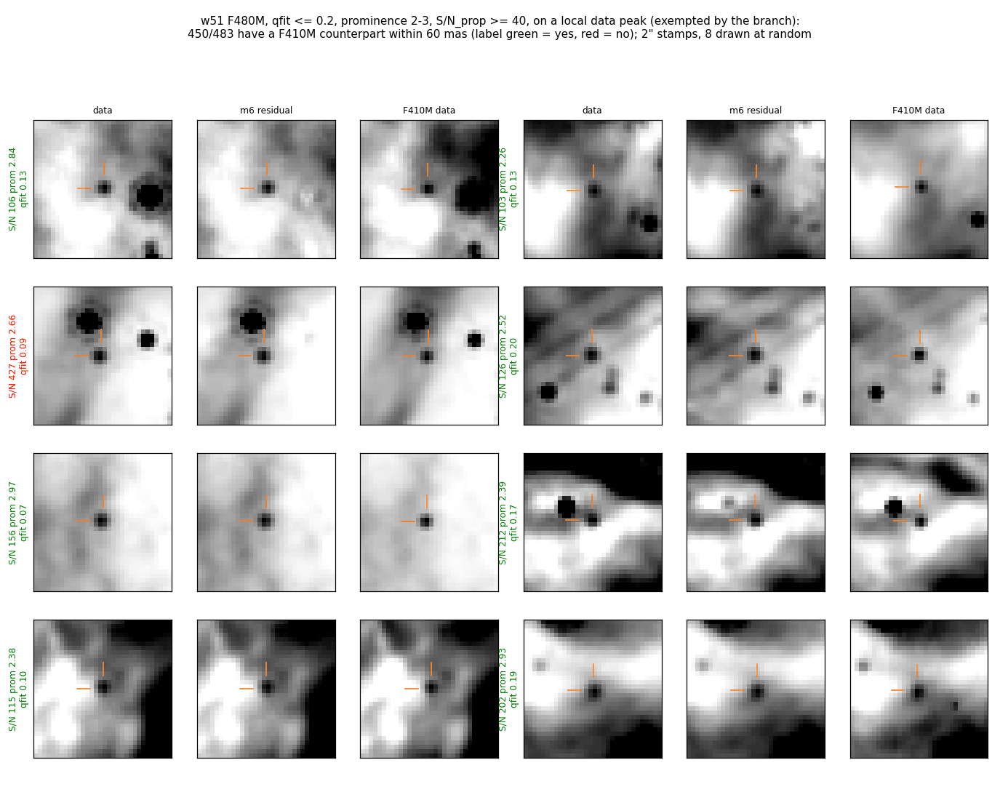
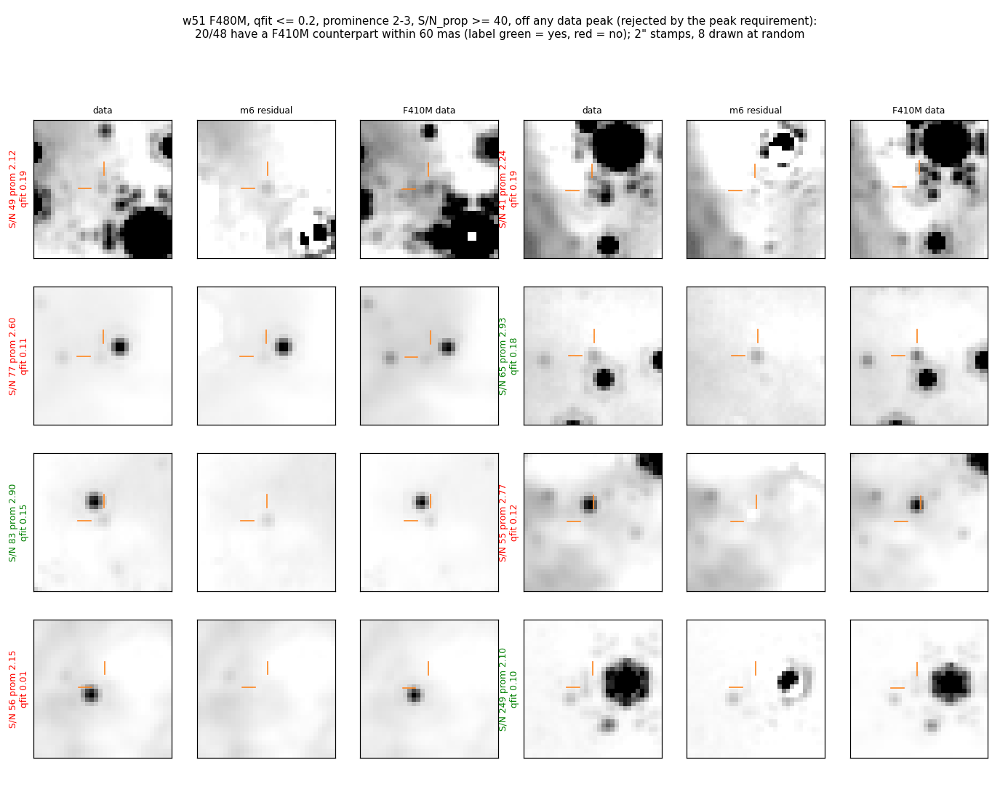
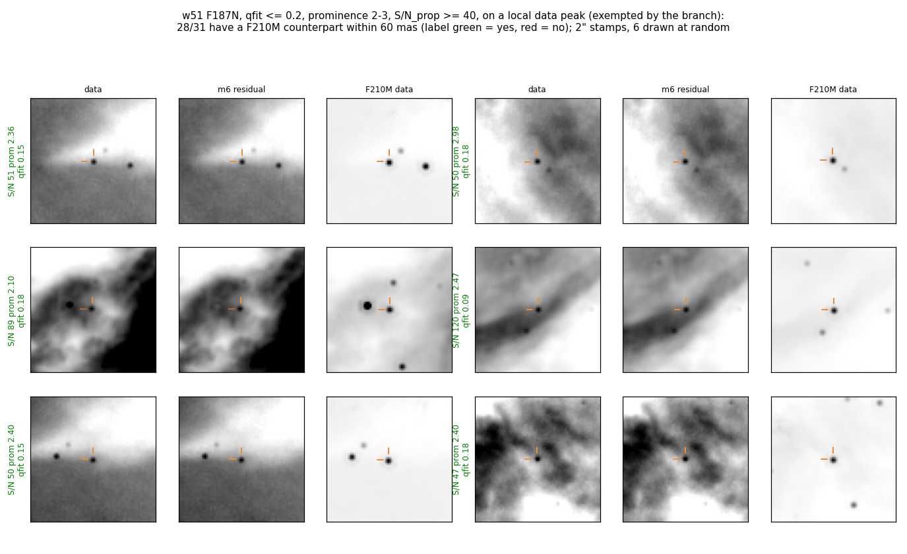
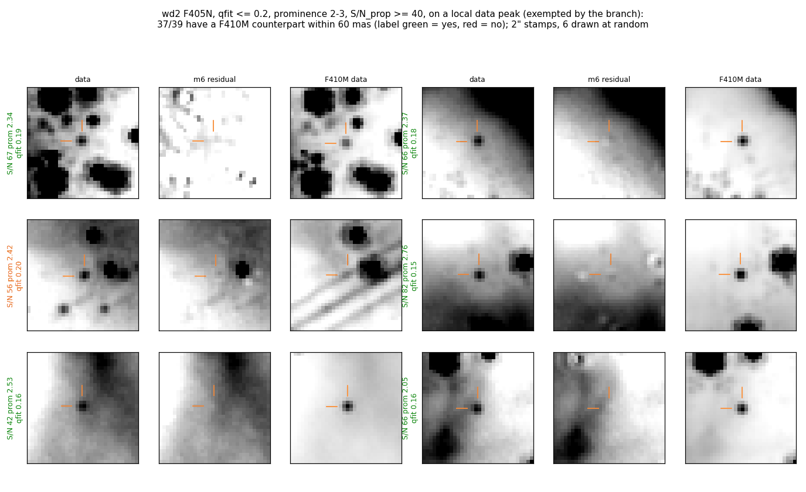
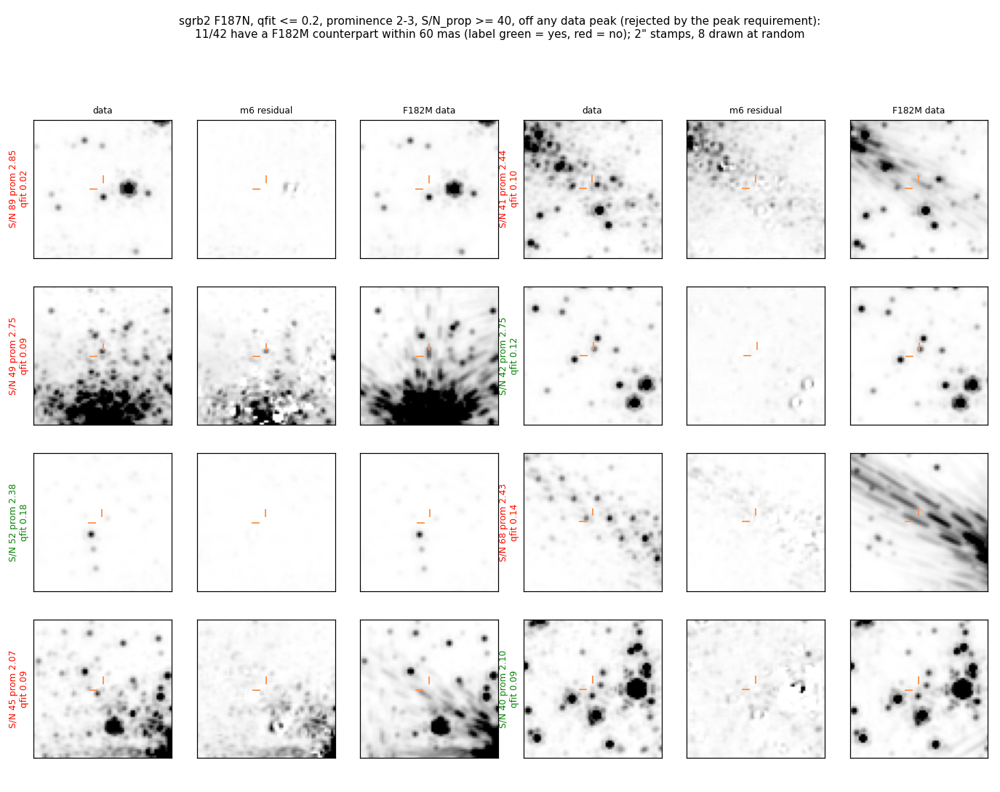
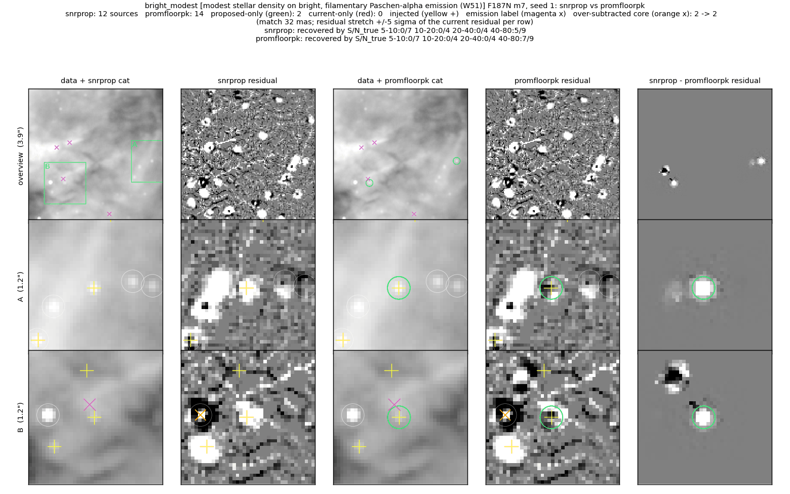
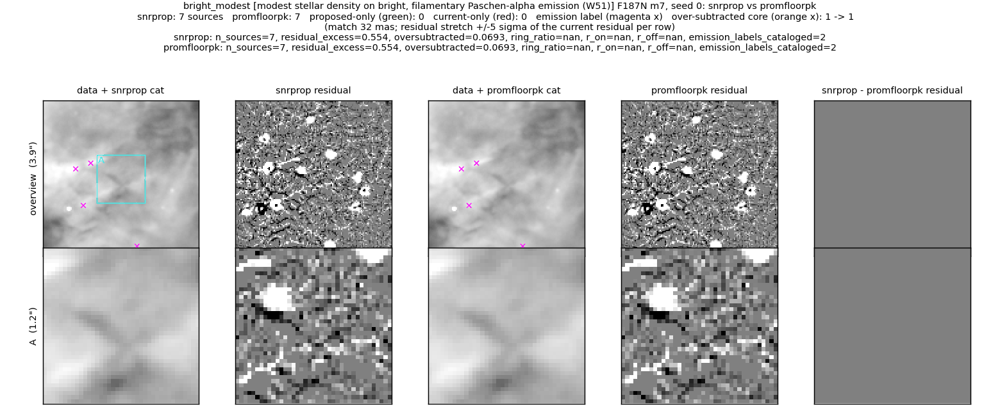
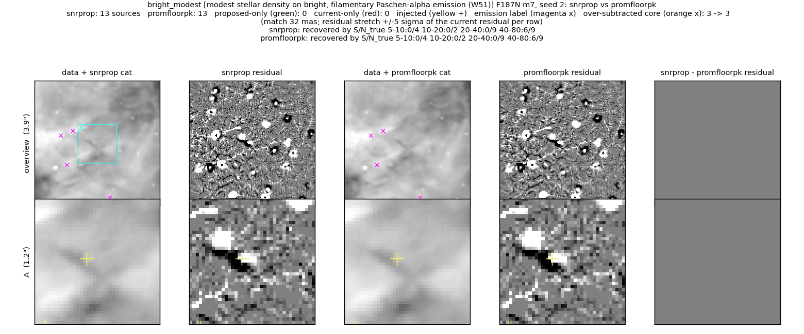

# Exempt tight, bright fits from the extended-emission prominence floor

On extended-emission targets (w51, sickle, wd2, ngc6334) vetting applies a
hard prominence floor of 3.0.  Prominence is normalized by the MAD of the
4–10 px annulus, and on a nebular field that MAD is set by emission structure,
so a real bright star can read prominence 2–3.  In the W51 F187N reference
field, injected stars at S/N_true 52 and 76 were fitted with qfit 0.17 and
0.09 and deleted by the floor alone (prominence 2.55 and 2.71).

This branch passes a source at prominence ≥ 2.0 when all three hold:

- `qfit ≤ 0.2`;
- merged S/N (`flux / flux_err_prop`) ≥ 40;
- the data_i2d has a local peak at the fitted position: the brightest pixel of
  the 7×7 box lies within 1 px of it.

## Full-field purity per S/N bin

Region: `qfit ≤ 0.2`, prominence 2–3, full m6 catalogs.  Label: a continuum
counterpart (S/N ≥ 3) within 60 mas.  Purity = (m − ch) / (cmax − ch): m is
the match fraction, ch the chance fraction from ±1.5″ shifts of the same
positions, cmax the match fraction of unambiguous stars (S/N_prop > 30,
prominence > 10) in the same catalog.  Only sources inside the continuum
footprint count.  Values above 1 mean the region matches more often than
the cmax stars; the 68% Jeffreys intervals are in
[`exempt_bins.txt`](exempt_bins.txt).  Sgr B2 is not an extended-emission
target; it is the negative control on dense nebular emission.

Each cell: purity (matched/n) without the peak requirement → with it.

| field, band / continuum | S/N 20–25 | 25–30 | 30–40 | 40–60 | ≥ 60 |
|---|---|---|---|---|---|
| W51 F187N / F210M | 1.11 (1/1) → — | 1.11 (1/1) → — | 1.11 (4/4) → 1.11 (4/4) | 1.00 (9/10) → 1.00 (9/10) | 1.01 (20/22) → 1.01 (19/21) |
| W51 F480M / F410M | 0.23 (4/18) → 0.88 (4/5) | 0.62 (12/21) → 1.10 (9/9) | 0.96 (44/50) → 1.07 (40/41) | 0.96 (116/132) → 1.07 (110/113) | 0.98 (354/397) → 1.01 (340/368) |
| Wd2 F187N / F182M | 0.00 (0/1) → — | 0.00 (0/1) → — | 0.00 (0/2) → — | 0.00 (0/2) → — | 0.81 (5/8) → 1.03 (4/5) |
| Wd2 F405N / F410M | 0.00 (0/4) → 0.00 (0/1) | 0.39 (1/3) → — | 0.46 (2/6) → 0.92 (2/3) | 1.19 (18/21) → 1.31 (17/18) | 1.22 (23/26) → 1.32 (20/21) |
| NGC 6334 F187N / F182M ¹ | — | — | 1.23 (1/1) → same | 1.23 (1/1) → same | 1.23 (2/2) → same |
| Sickle F187N / F210M | — | — | — | — | — |
| Sgr B2 F187N / F182M | 0.14 (4/24) → 1.06 (1/1) | 0.05 (3/23) → — | 0.16 (6/22) → — | 0.09 (5/30) → 1.06 (1/1) | 0.53 (7/13) → — |
| Sgr B2 F480M / F410M | 0.59 (19/33) → 0.47 (4/9) | 0.59 (14/24) → 0.35 (1/3) | 0.57 (41/73) → 0.69 (8/12) | 0.71 (147/215) → 0.90 (66/77) | 0.94 (2674/2975) → 1.00 (1839/1926) |

¹ The 6778 F187N and 7213 F182M footprints overlap for 12% of the sources.

Without the peak requirement the purity at S/N_prop 30–60 depends on the
field: 0.96 in W51 F480M, 0.46 in Wd2 F405N at 30–40, 0.09–0.16 in Sgr B2
F187N.  With it, every field and band with n ≥ 5 is at 0.90 or above at
S/N_prop ≥ 40.  Sgr B2 F480M at 30–40 (0.69, 8/12) sets the S/N 40
threshold.

The sources the floor already keeps at prominence 3–5 and the same S/N give
the comparison scale ([`exempt_bins.txt`](exempt_bins.txt), last column).
At S/N_prop 40–60 and ≥ 60 they read 1.06 and 1.03 (W51 F480M), 1.03 and
1.01 (W51 F187N), 1.25 and 1.12 (Wd2 F405N), 0.81 and 0.99 (Sgr B2 F480M).
The exempt + peak sources match or exceed these values in every one of
these cells.

### What the peak requirement measures

Fraction of sources on a local data_i2d peak ([`peak_check.txt`](peak_check.txt)):

| field, band | control: qfit ≤ 0.2, prominence ≥ 5, S/N ≥ 60 | exempt region, S/N_prop ≥ 60 |
|---|---|---|
| W51 F187N | 0.99 | 21/22 |
| W51 F480M | 0.97 | 370/399 |
| Wd2 F187N | 0.97 | 5/8 |
| Wd2 F405N | 0.96 | 21/26 |
| NGC 6334 F187N | 0.99 | 6/6 |
| Sgr B2 F187N | 0.97 | 0/13 |
| Sgr B2 F480M | 0.91 | 1926/2975 |

The Sgr B2 F187N exempt-region sources sit off every peak, in bright-star
halos and diffraction spikes, yet 7 of 13 match an F182M source within
60 mas: the same PSF features appear in both filters, so the continuum
label overstates them.  In W51 F480M the peak requirement removes 29 of
399 sources at S/N_prop ≥ 60, 14 of them with an F410M counterpart.

### Stamps

2″ stamps of random sources in the region.  Columns: band data_i2d, the
production m6 residual, continuum data_i2d.  The production vetting removed
every source shown (prominence < 3).  In the W51 stamps the star stays in
the m6 residual; in the Wd2 stamps the m6 residual has it subtracted, while
the vetted catalog omits it.  Label colour: continuum counterpart within
60 mas (green) or not (red).  Display: 10th percentile of the stamp to the
peak of the central 0.5″ of the data stamp; the residual uses the data
scale.  Off-peak sources are mostly fits 1.5–5 px from a star or in a
diffraction spike; in most of them the residual has the star subtracted,
so another entry fits it.

W51 F480M, admitted by this branch (on a peak, S/N_prop ≥ 40; 450/483
continuum-matched):

W51 F480M, rejected by the peak requirement (the cost; 20/48
continuum-matched).  Most are fits 2–5 px from a star; in four of the
eight the residual shows that star subtracted by another entry:

W51 F187N, admitted by this branch (28/31 continuum-matched):

Wd2 F405N, admitted by this branch (37/39 continuum-matched):

Sgr B2 F187N, rejected by the peak requirement (negative control; 11/42
continuum-matched, most in bright-star halos and spikes):

## Reference fields

Figure layout and metric definitions:
[../faint_reference_fields/README.md](../faint_reference_fields/README.md).
Comparison: `snrprop` (the base branch, S/N-floor fix) → `promfloorpk`
(this branch, clean commit 509a4682).  W51 is the only reference field on
an extended-emission target, so the other three fields are unchanged.

### Modest density on bright, filamentary emission (W51, F187N), injection seed 1

2 added, 0 dropped; the seed's injected S/N 40–80 bin goes 5/9 → 7/9.  Rows
A and B: the two injected stars the floor deleted are fitted and leave the
residual.  Neither is near a hand-labelled knot (magenta ×).

### W51, clean run (seed 0) and seed 2

No catalog change in either.

### Metrics (m7, seeds 1 and 2)

| variant | S/N 5-10 | S/N 10-20 | S/N 20-40 | S/N 40-80 | resid excess /as² (+/−) | over-subtracted /as² (n) | labels | emission knots cataloged | bias mag |
|---|---|---|---|---|---|---|---|---|---|
| snrprop | 0/11 | 0/6 | 0/13 | 11/18 | 0.55 (10/2) | 0.07 (1) | — | 2/4 | 0.138 |
| promfloor (S/N 30, no peak test) | 0/11 | 0/6 | 0/13 | 13/18 | 0.55 (10/2) | 0.07 (1) | — | 2/4 | -0.025 |
| promfloorpk (this branch) | 0/11 | 0/6 | 0/13 | 13/18 | 0.55 (10/2) | 0.07 (1) | — | 2/4 | -0.025 |

The S/N 40 and peak requirements leave the reference-field result of the
first version unchanged: both injected stars sit at S/N_prop ≥ 40 on a
data peak.

## Caveats

- The W51 reference field fails `emission_labels_cataloged_max` (2 of 4
  hand-labelled knots cataloged, threshold 1).  The base branch and main
  catalog the same 2 knots; this branch adds no knot.
- W51 completeness below S/N_true 40 stays 1/30 or lower in every variant.
  This branch changes only fits with merged S/N ≥ 40.
- The continuum label counts a real star without a continuum counterpart
  (an F480M-only embedded source) as unmatched, so purity is a lower bound
  where such sources are common.
- The default-on decision for the four targets rests on full-field W51 and
  Wd2 (two bands each) and NGC 6334 (6 sources); the Sickle F187N catalog
  has no source in the region.
- Fields outside `_EXTENDED_EMISSION_TARGETS` are unchanged: the exemption
  only relaxes the floor, and the floor runs only on those targets.

## Reproduce

Scripts in [`scripts/`](scripts/):
`build_pl.py` (applies `_filter_extended_emission` to a production m6
catalog and adds the continuum match), `anal_exempt_bins.py` (the per-bin
table), `peak_check.py` (the peak fractions), `exempt_gallery.py` (the
stamps).
