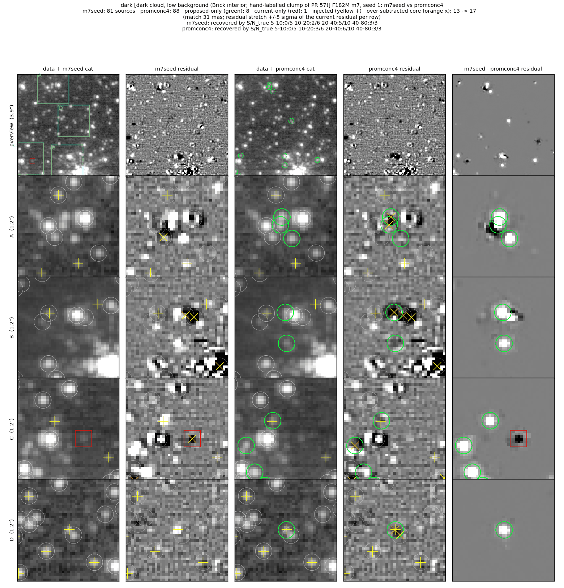
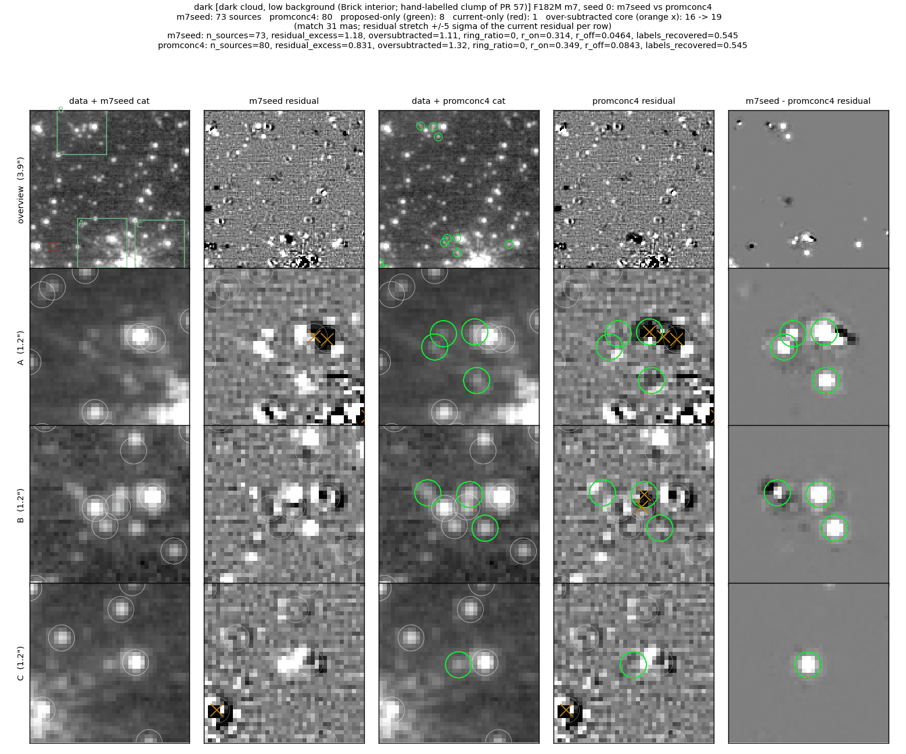
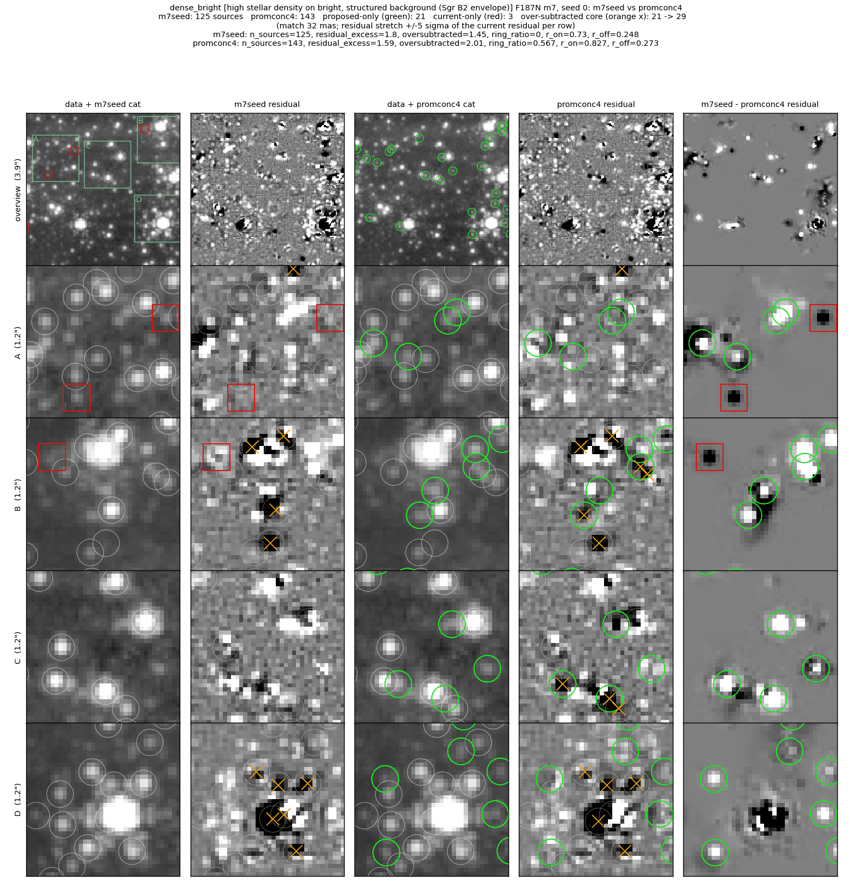
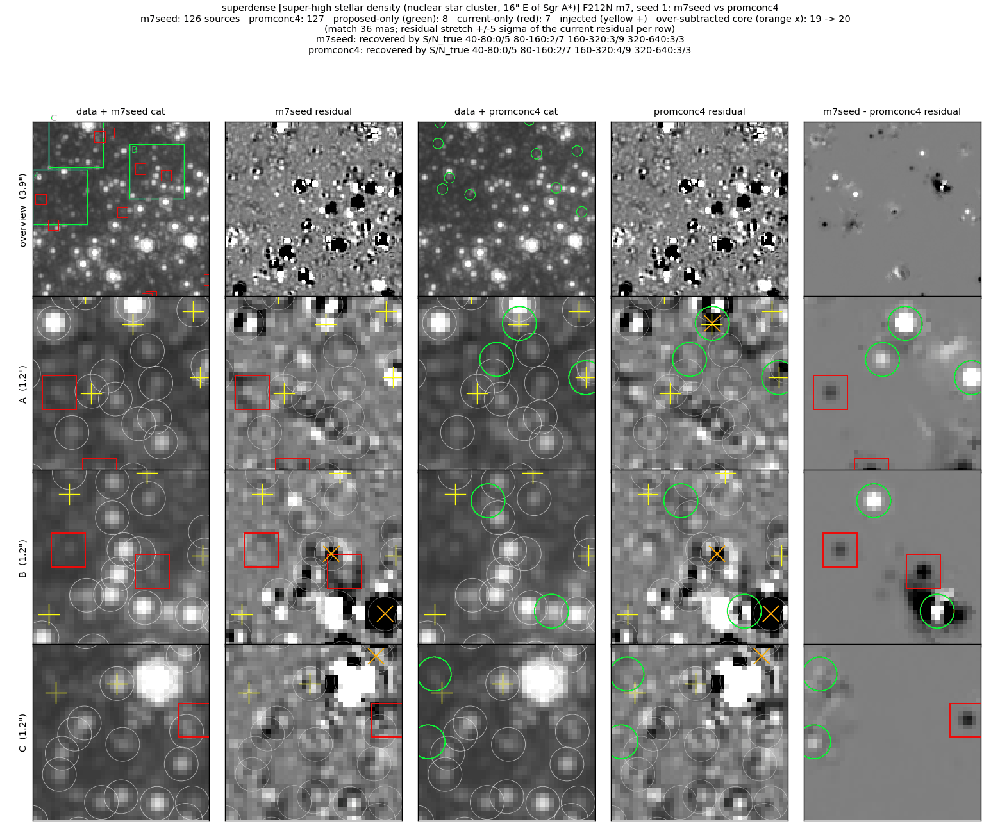

# Vetting bright-star branch: prominence, robust prominence, concentration guard

The `star_like` peak branch required `peak_SB > 20 × local_bkg`.  `local_bkg`
is fit on background-subtracted frames and scatters about zero, so its sign
decides the branch (Brick F182M: faint high-qfit sources kept 92% when
`local_bkg > 0`, 6% when ≤ 0), and on W51 F187N the admitted and rejected sets
have the same continuum-match purity (0.45 vs 0.48).  This branch replaces the
test in four steps (one commit each):

1. data-i2d annulus prominence ≥ 5 (core peak − 4–10 px annulus median, over
   the annulus MAD);
2. OR neighbour-robust prominence ≥ 8 (25th-percentile annulus floor,
   lower-half MAD), because neighbours' wings inflate the plain MAD in crowded
   fields (superdense: prominence alone dropped 13 of 124 real faint stars);
3. the robust branch AUTO-off on extended-emission targets, where the dark
   flanks of a narrow filament make ridge points read robust 8–14;
4. a concentration guard on the robust branch: a fit whose data-i2d core
   (r ≤ 1.5 px above the 2.5–4 px ring) per unit fitted flux is below 0.6 of
   the field's bright-star median, with a core deficit > 5σ, is refused.  Next
   to a bright star the robust floor reads the dark side of the star's wing,
   so bumps in the wing (PSF-model mismatch) read high robust prominence.

Figure layout and metric definitions:
[../faint_reference_fields/README.md](../faint_reference_fields/README.md).

### Dark cloud (Brick, F182M), injection seed 1: `m7seed` → `promconc4` (this branch)

8 added, 1 dropped; the seed's S/N 10–20 bin goes 2/6 → 3/6 and 20–40 goes
5/10 → 6/10.  Rows C and D: injected stars fitted.  Row A: three sources added
to a compact group; one carries an over-subtracted core (13 → 17 in this
seed).

### Dark cloud, clean run: `m7seed` → `promconc4`

8 added, 1 dropped; residual excess 1.18 → 0.83 per arcsec², over-subtracted
16 → 19.  Row C: a faint star beside a brighter one leaves the residual.
Rows A–B: the added sources around the compact groups refit their
neighbours, and two existing members end up over-subtracted.

### High density on bright background (Sgr B2, F187N), clean run: `m7seed` → `promconc4`

21 added, 3 dropped; residual excess 1.80 → 1.59, over-subtracted 21 → 29.
Rows A and D: faint stars in the gaps.  Rows B and C: added sources beside
bright stars, some over-subtracted; these are the cases the guard leaves in.

### Concentration guard alone (Sgr B2, clean run): `promkeep24` (steps 1–2) → `promconc4` (steps 1–4)

15 dropped, 2 added; over-subtracted 40 → 29, residual excess 1.18 → 1.59.
Row A: without the guard, seven fits form a ring around a bright star, all
over-subtracted, and the star itself is not cataloged; with the guard the ring
is gone and the star is fitted (its core is over-subtracted: PSF-model
mismatch).  Rows B–D: the same pattern around other bright
stars.

### Super-high density (NSC, F212N), injection seed 1: `m7seed` → `promconc4`

8 added, 7 dropped; the seed's 160–320 bin goes 3/9 → 4/9.  The dropped
sources (red boxes) are faint fits the prominence test refuses; the
difference column shows small residual peaks there.

### Robust branch off on W51 (F187N, clean run): `promkeep24` (step 2 active) → `promkeep34` (step 3)

5 dropped, 1 added; hand-labelled emission knots cataloged 4 → 1.  Rows A–B:
the robust branch had admitted fits on knots and a filament ridge.  The one
knot still cataloged (row A, green) passes the pre-existing `flags == 1`
branch; see caveats.

## Metrics (m7)

Injection completeness (recovered/injected, seeds 1+2) per injected-S/N bin, clean-run residual metrics, and median flux bias.  Base = fix 4 (`m7seed`); steps 1–2 only = `promkeep24`; this branch = `promconc4`.  The W51 row for this branch is the step-3 run (`promkeep34`): step 4 gates only the robust branch, which step 3 turns off on W51.

**superdense (NSC, F212N)** (phase m7)

| variant | S/N 40-80 | S/N 80-160 | S/N 160-320 | S/N 320-640 | resid excess /as² (+/−) | over-subtracted /as² (n) | labels | bias mag |
|---|---|---|---|---|---|---|---|---|
| fix 4 (base) | 1/11 | 5/13 | 5/14 | 8/10 | 1.32 (22/3) | 1.32 (19) | — | 0.018 |
| steps 1–2 only | 1/11 | 5/13 | 6/14 | 8/10 | 1.39 (24/4) | 1.45 (21) | — | -0.016 |
| steps 1–4 (this branch) | 1/11 | 5/13 | 6/14 | 8/10 | 1.39 (24/4) | 1.39 (20) | — | -0.009 |

**dense + bright bg (Sgr B2, F187N)** (phase m7)

| variant | S/N 5-10 | S/N 10-20 | S/N 20-40 | S/N 40-80 | resid excess /as² (+/−) | over-subtracted /as² (n) | labels | bias mag |
|---|---|---|---|---|---|---|---|---|
| fix 4 (base) | 0/17 | 0/11 | 2/9 | 5/11 | 1.80 (26/0) | 1.45 (21) | — | 0.001 |
| steps 1–2 only | 0/17 | 0/11 | 3/9 | 7/11 | 1.18 (17/0) | 2.77 (40) | — | -0.025 |
| steps 1–4 (this branch) | 0/17 | 0/11 | 3/9 | 6/11 | 1.59 (23/0) | 2.01 (29) | — | -0.006 |

**modest density + bright bg (W51, F187N)** (phase m7)

| variant | S/N 5-10 | S/N 10-20 | S/N 20-40 | S/N 40-80 | resid excess /as² (+/−) | over-subtracted /as² (n) | labels | emission knots cataloged | bias mag |
|---|---|---|---|---|---|---|---|---|---|
| fix 4 (base) | 0/11 | 0/6 | 0/13 | 11/18 | 0.55 (10/2) | 0.07 (1) | — | 2/4 | 0.138 |
| steps 1–2 only | 0/11 | 0/6 | 1/13 | 11/18 | 0.28 (6/2) | 0.21 (3) | — | 4/4 | 0.097 |
| steps 1–4 (this branch) | 0/11 | 0/6 | 0/13 | 9/18 | 0.48 (11/4) | 0.07 (1) | — | 1/4 | -0.041 |

**dark cloud (Brick, F182M)** (phase m7)

| variant | S/N 5-10 | S/N 10-20 | S/N 20-40 | S/N 40-80 | resid excess /as² (+/−) | over-subtracted /as² (n) | labels | bias mag |
|---|---|---|---|---|---|---|---|---|
| fix 4 (base) | 0/10 | 4/11 | 9/15 | 11/12 | 1.18 (19/2) | 1.11 (16) | 0.55 | 0.050 |
| steps 1–2 only | 0/10 | 6/11 | 10/15 | 12/12 | 0.69 (11/1) | 1.52 (22) | 0.55 | 0.050 |
| steps 1–4 (this branch) | 0/10 | 6/11 | 10/15 | 12/12 | 0.83 (14/2) | 1.32 (19) | 0.55 | 0.050 |

## Caveats

- The guard does not remove every wing fit: Sgr B2 over-subtracted cores are
  21 on the base branch, 40 without the guard and 29 with it.  The remaining
  ones include blended real stars and PSF-model mismatch at bright stars,
  which this vetting cannot fix.
- On W51 this branch alone recovers 9 of 18 injected stars at S/N 40–80
  (base 11): with the robust branch off, a star on nebular structure needs
  plain prominence ≥ 5.  With all fixes combined W51 recovers 12/18; which
  of the other fixes restores those stars is not isolated here.
- The guard turns itself off with fewer than 5 calibration sources
  (prominence ≥ 10, flags 0), e.g. sparse F405N cutouts.
- The log's "refused N" counts would-be robust admissions; some of those are
  kept by another branch (Brick m4: logged 9, net catalog change −2).
- On W51 the remaining cataloged knot passes the `flags in keep_flags = (1,)`
  branch: photutils flag 1 marks one masked pixel in the fit box and the
  branch admits any such fit.  That is pre-existing and left for a separate
  change.
