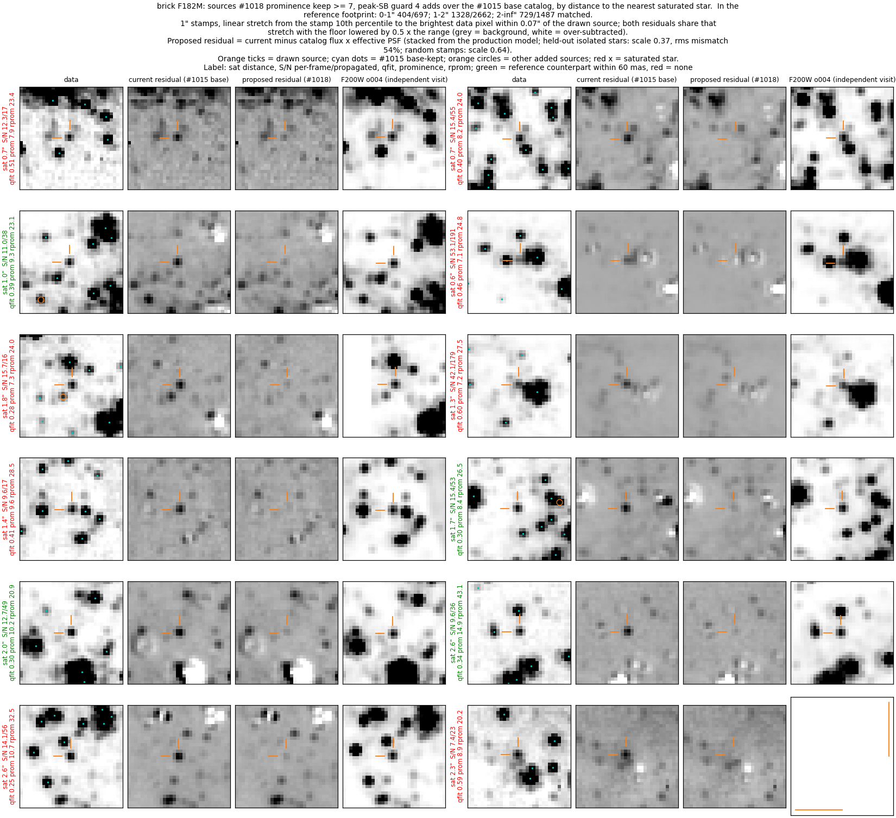
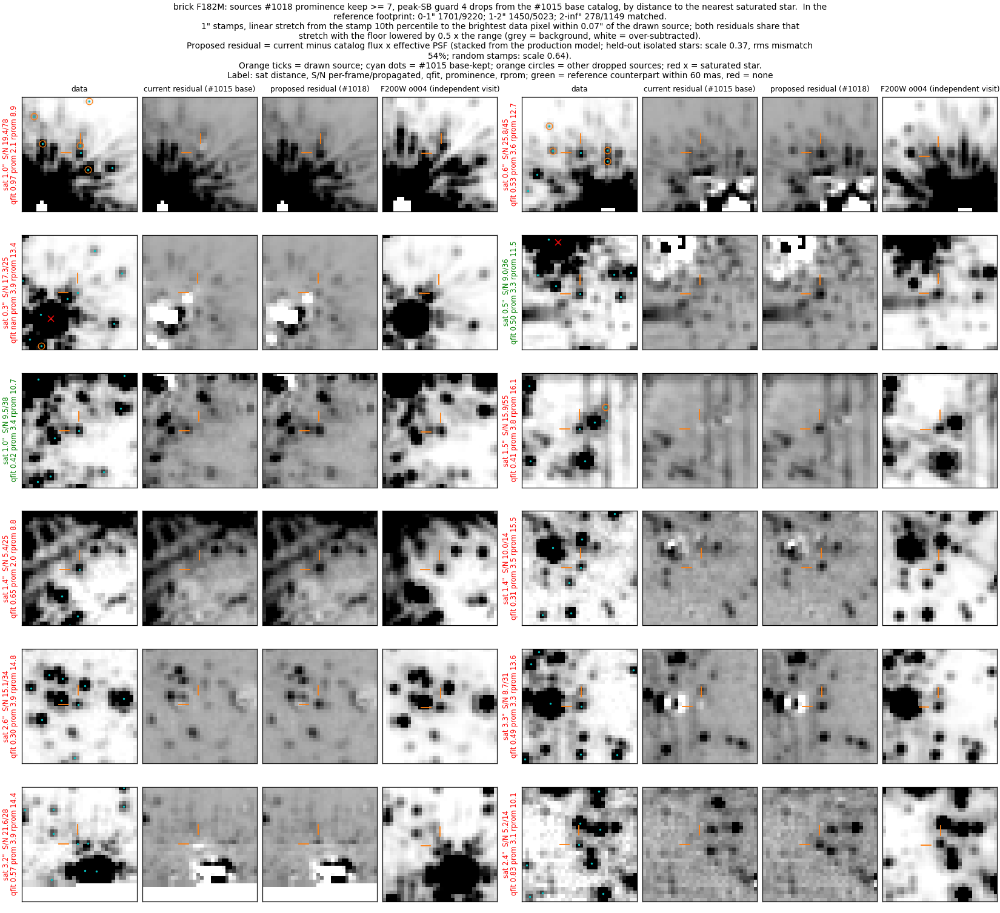
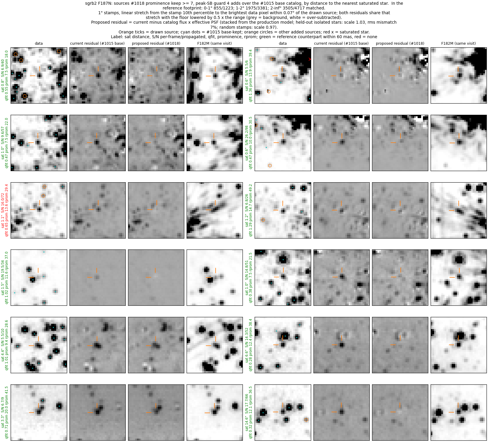
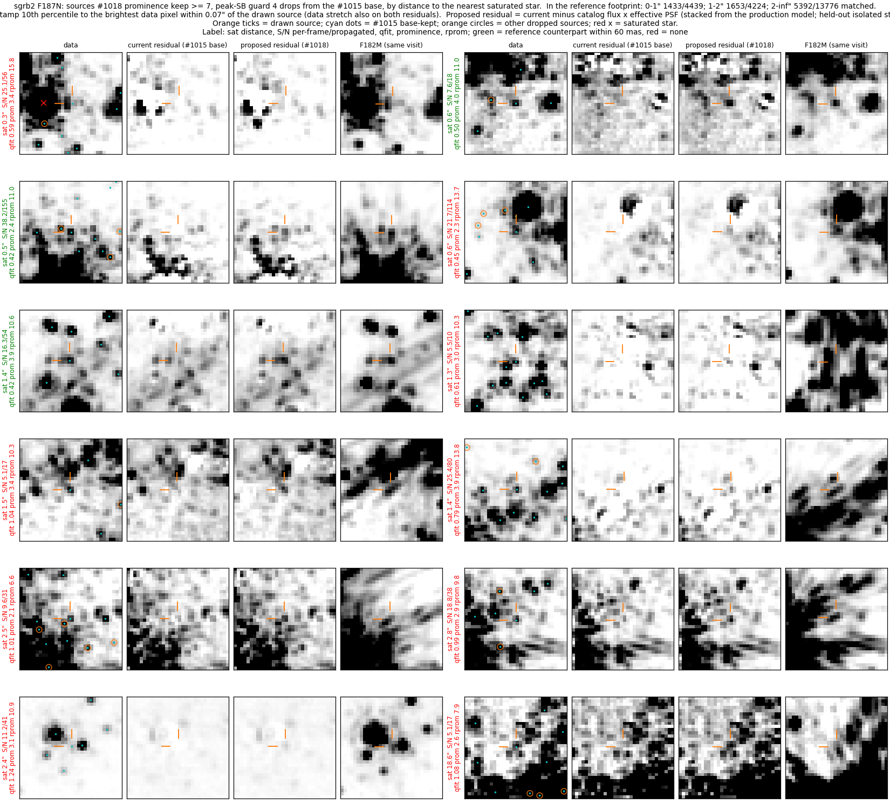
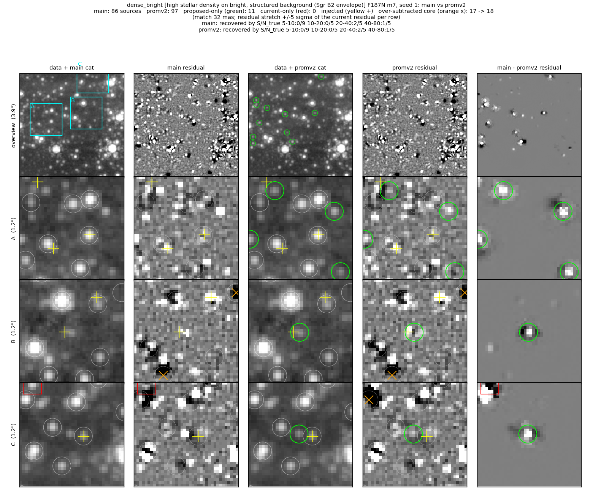
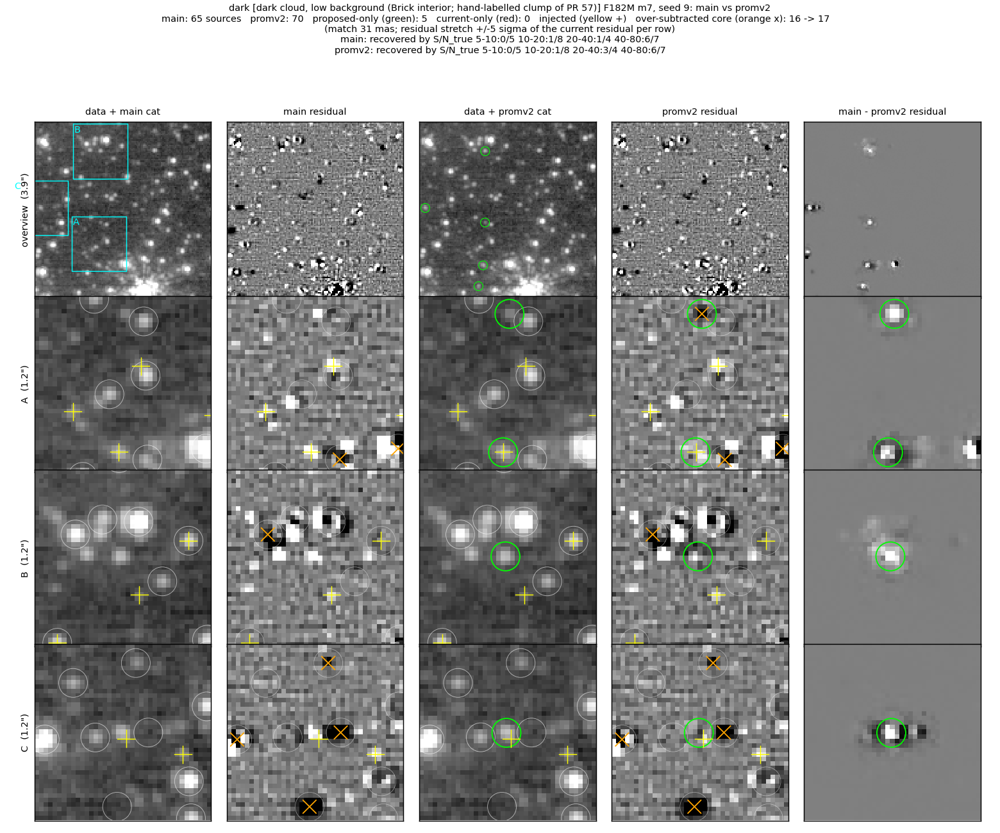
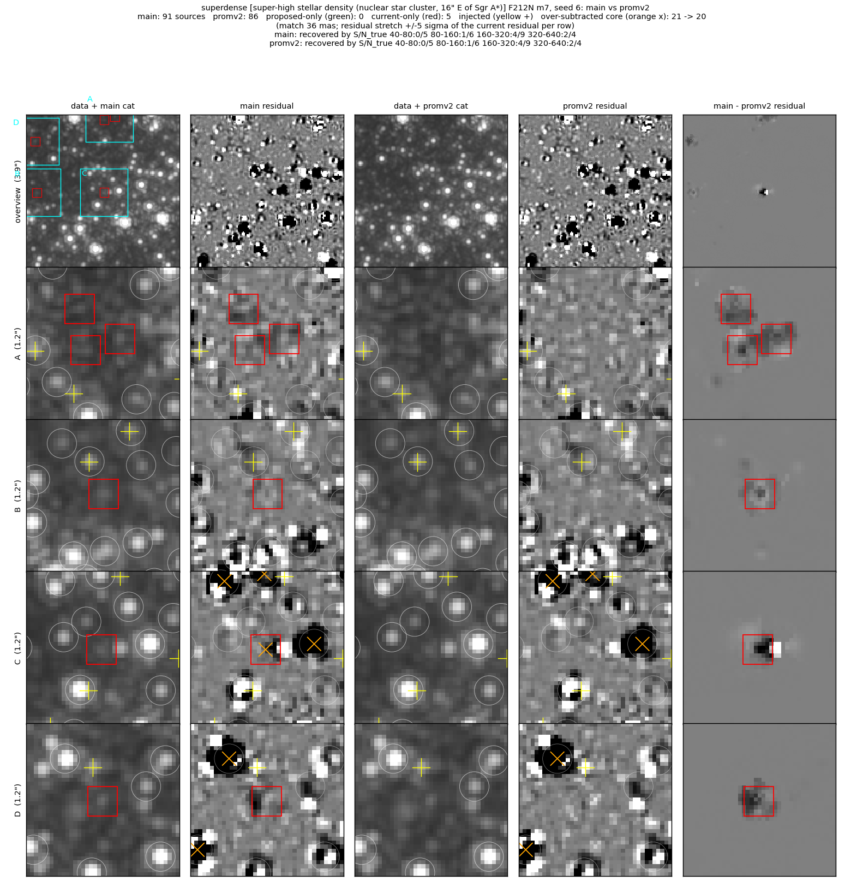
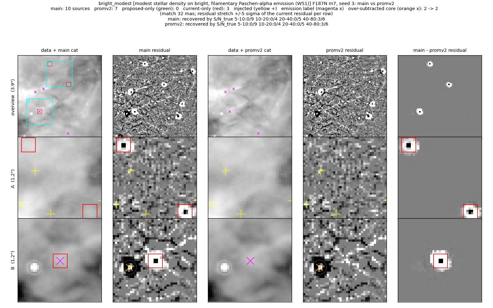
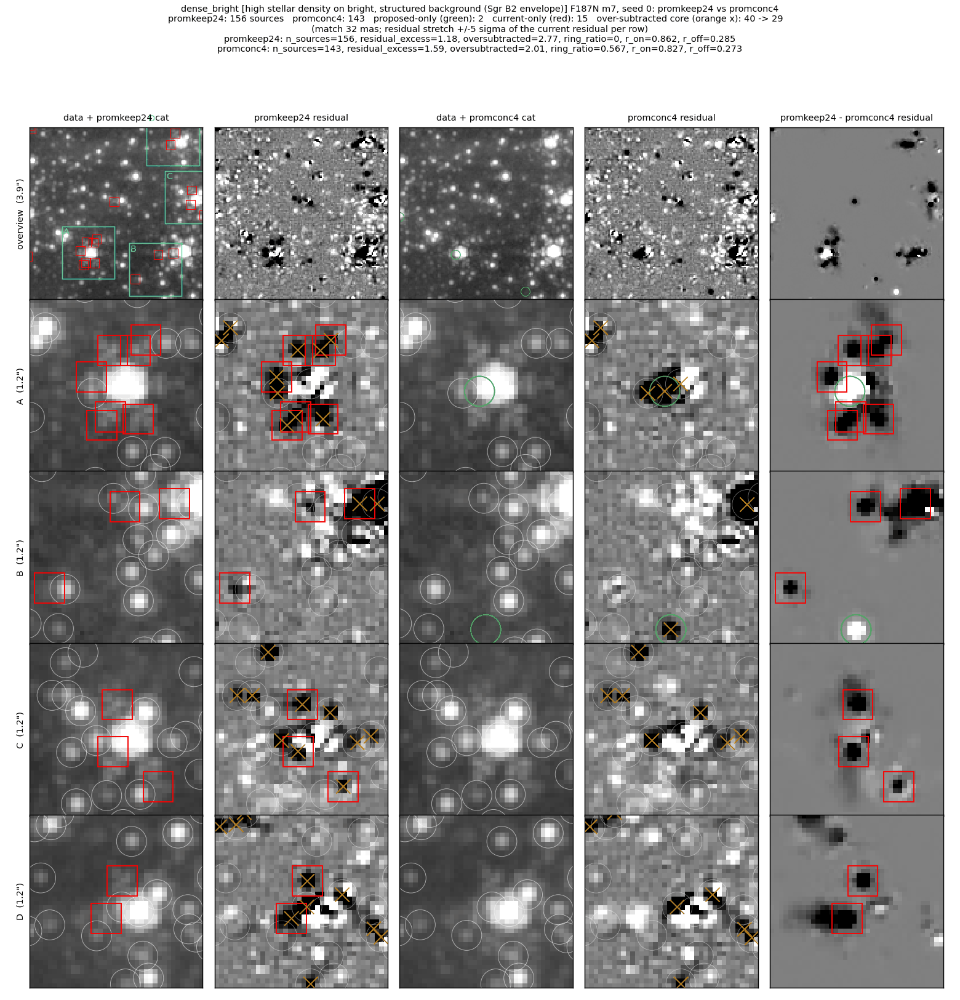
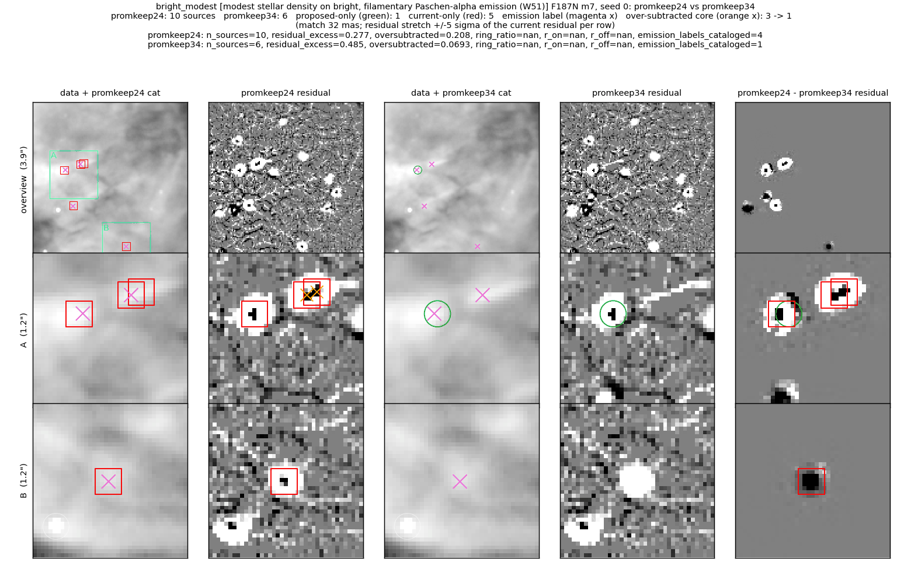

# Vetting bright-star branch: prominence guard on peak_SB, prominence ≥ 7 keep

The `star_like` branch of `_filter_extended_emission` keeps a source when
`peak_SB > 20 × local_bkg`.  `local_bkg` is fit on background-subtracted
frames and scatters about zero, so its sign decides the branch (Brick F182M:
faint high-qfit sources kept 92% when `local_bkg > 0`, 6% when ≤ 0).  This
branch keeps that test and adds two prominence terms, where prominence is the
data-i2d annulus prominence (core peak − 4–10 px annulus median, over the
annulus MAD):

1. **Guard on the peak_SB keep** (`--manual-ext-star-prom-peak-min`, new,
   default 4): a source kept by peak_SB also needs prominence ≥ 4 where
   prominence is measured.
2. **Prominence keep** (`--manual-ext-star-prom-min`, default 7): prominence
   ≥ 7 keeps a source whatever the sign of `local_bkg`.
3. **Neighbour-robust prominence branch off by default**
   (`--manual-ext-star-prom-robust-min`, default 0; −1 selects the earlier
   AUTO).  On the full-field Brick F182M replay the 21,540 sources it adds at
   robust prominence ≥ 8 match the independent F200W visit at 0.10 of the
   rate of kept stars of the same flux.  The robust branch and its
   concentration guard stay available as options; their evidence is in the
   last section.

**Release note.**  This changes the shipped catalogs of every NIRCam field.
On the full-field m6 replays below the kept count changes by −3.0% in the
Brick F182M, −3.2% in Sgr B2 F187N and +3.4% in W51 F187N.  In the Brick
the dropped sources match the independent visit at 0.28 (about 4,700
real-star equivalents of 16,809) and the added sources at 0.81 (about 4,500
of 5,577).  It removes about 12,100 spurious-equivalent fits and adds about
1,100, for a net change of about −200 real-star equivalents.  `--manual-ext-star-prom-peak-min=0
--manual-ext-star-prom-min=0` restores the previous keep.  The same note is
in `PHOTOMETRY_PIPELINE.md` (History Notes).

Figure layout and metric definitions of the reference fields:
[../faint_reference_fields/README.md](../faint_reference_fields/README.md).

## Full-field replay (m6 vetting on the production m6 merged catalogs)

`scripts/vet_variant.py` cuts the vetting call out of the branch's own
`cataloging.py` and runs it with pipeline-default options on a production m6
merged catalog; `scripts/sweep_prom2.sbatch` runs guard 3, 4 and 5 (commit
d29fedb2).  **Realness** of a set of sources is
`(match − chance) / (expected − chance)`: `match` is the fraction with a
reference-catalog counterpart within 60 mas, `chance` the same fraction at
positions shifted by ~2″, and `expected` the match fraction of the #1015
base-kept sources of the same flux (`scripts/compare.py`,
`scripts/slices.py`; the matching code is
`../faint_m7_seed_union/scripts/realness.py`).  A set at realness 1 matches
like the kept stars of its flux; at 0 it matches at chance.  If the kept
stars are real, a set below ~0.5 holds more spurious sources than real ones.

References: Brick F182M against F200W from the **independent** 1182/o004
visit; Sgr B2 F187N and W51 F187N against F182M from the **same visit**,
which shares the frames' artefacts and reads high.

| field | added | lost, guard 3 | lost, guard 4 (default) | lost, guard 5 |
|---|---|---|---|---|
| Brick F182M (base kept 377,837) | 5,577 at 0.81 | 8,259 at 0.20 | 16,809 at 0.28 | 27,218 at 0.37 |
| Sgr B2 F187N (base kept 408,591) | 9,321 at 0.82 | 10,381 at 0.30 | 22,439 at 0.42 | 36,293 at 0.53 |
| W51 F187N (base kept 20,041) | 1,338 at 1.19 | 0 | 659 at 0.61 | not run |

The additions are the same for every guard (prominence ≥ 7 keep).  Each step
of the guard drops one band of prominence:

| prominence band dropped | Brick | Sgr B2 | W51 |
|---|---|---|---|
| < 3 (guard 3) | 8,259 at 0.20 | 10,381 at 0.30 | 0 |
| 3–4 (guard 3 → 4) | 8,550 at 0.36 | 12,058 at 0.53 | 659 at 0.61 |
| 4–5 (guard 4 → 5) | 10,409 at 0.52 | 13,854 at 0.72 | — |

Guard 4 is the step at which the band dropped on the independent-visit field
(Brick) is below 0.5; the next band reads 0.52.  On Sgr B2 and W51 the 3–4
band reads 0.53 and 0.61 against same-visit references, so guard 4 also
drops real stars there; guard 3 drops none on W51.

Slices of the additions with low realness (overlapping):

| slice of the added sources | Brick | Sgr B2 | W51 |
|---|---|---|---|
| prominence 7–8.5 | 2,883 at 0.68 | 3,241 at 0.89 | 251 at 1.09 |
| qfit ≥ 1 | 101 at 0.31 | 647 at 0.23 | 74 at 0.06 |
| per-frame S/N 20–50 | 246 at 0.06 | 1,156 at 0.34 | 34 at 0.22 |
| per-frame S/N ≥ 50 | 48 at 0.04 | 150 at 0.27 | 7 at 0.37 |

### Added sources, Brick F182M


12 additions drawn by distance to the nearest saturated star (`scripts/added_gallery.py`).  Columns:
data, current residual (#1015 base), proposed residual, F200W from the
independent visit.  Label colour green = F200W counterpart within 60 mas.
Most are faint stars between brighter ones that leave the residual when
added.  The two unmatched S/N > 40 additions (right column, rows 2–3) sit in
the wing of a bright star 0.6″ and 1.3″ from a saturated star: these are the
high-S/N, low-realness slice above.

### Dropped sources, Brick F182M


9,220 of the 15,392 dropped sources in the F200W footprint lie within 1″ of a
saturated star (18% with a raw counterpart there, against 29% at 1–2″ and
24% beyond; raw fractions, not chance-corrected).  The drawn examples split
into fits on a saturated star's wing or spike pattern (left column, rows 1–2)
and compact peaks that stay in the proposed residual (right column, rows
3–6), most of those without an F200W counterpart within 60 mas.

### Added and dropped sources, Sgr B2 F187N



The reference column is F182M from the same visit.  Additions: faint stars
in gaps and on the filament edges.  Dropped: fits on filaments and on the
wings of bright stars; several stamps show the dropped position on a
filament that F182M also shows as extended.  Some dropped positions are
compact peaks with an F182M counterpart that stay in the proposed residual
(left column, row 3).

## Reference fields (m7, injection seeds 1–10 + clean run)

All 44 runs of this branch from commit d29fedb2 (clean tree).  Comparison
`main` → `promv2` (this branch).

### High density on bright background (Sgr B2, F187N), injection seed 1


86 → 97 sources: 11 added, 0 dropped; over-subtracted cores 17 → 18.  Row A:
faint stars in the gaps between brighter ones are added and leave the
residual (difference column).  Row B: a source is added at an injected star
(yellow +), offset from it by more than the 32 mas match radius, so the
seed's tally does not change.  Row C: a source added beside an injected
star.  Across the 10 seeds this field adds 9–12 sources per seed and drops
0–1.

### Dark cloud (Brick, F182M), injection seed 9


65 → 70 sources: 5 added, 0 dropped; injected S/N 20–40 recovered 1/4 →
3/4; over-subtracted 16 → 17.  Rows A (bottom) and C: added sources at
injected stars.  Row B: a faint star beside a compact group.  Row A (top):
an added source whose core is over-subtracted after the refit.  Across the
10 seeds: 1–5 added and 0–3 dropped per seed.

### Super-high density (NSC, F212N), injection seed 6


91 → 86 sources: 5 dropped, 0 added; over-subtracted 21 → 20.  The guard
drops faint fits: row A three in a smooth faint patch with no distinct peak
in the data, rows B–D single faint fits (row C: the dropped fit had an
over-subtracted core).  Across the 10 seeds: 0 added and 1–5 dropped
per seed.

### Modest density on bright emission (W51, F187N), injection seed 3


10 → 7 sources: 3 dropped, 0 added.  Each dropped fit has a negative core on
smooth emission in the current residual; dropping it flattens the residual.
Row B: one of them is a hand-labelled emission knot (magenta x).  Across the
10 seeds: 0 added and 0–3 dropped per seed.

## Metrics (m7, 10 injection seeds)

Injection completeness (recovered/injected, seeds 1–10) per injected-S/N
bin, clean-run residual metrics, and median flux bias.

**superdense (NSC, F212N)** (phase m7)

| variant | S/N 40-80 | S/N 80-160 | S/N 160-320 | S/N 320-640 | resid excess /as² (+/−) | over-subtracted /as² (n) | labels | bias mag |
|---|---|---|---|---|---|---|---|---|
| main | 1/51 | 6/64 | 18/74 | 26/51 | 1.66 (27/3) | 1.11 (16) | — | -0.025 |
| promv2 | 1/51 | 5/64 | 18/74 | 26/51 | 1.66 (27/3) | 1.18 (17) | — | -0.009 |

**dense + bright bg (Sgr B2, F187N)** (phase m7)

| variant | S/N 5-10 | S/N 10-20 | S/N 20-40 | S/N 40-80 | resid excess /as² (+/−) | over-subtracted /as² (n) | labels | bias mag |
|---|---|---|---|---|---|---|---|---|
| main | 0/49 | 1/69 | 11/58 | 28/64 | 3.05 (44/0) | 1.18 (17) | — | 0.030 |
| promv2 | 0/49 | 1/69 | 12/58 | 32/64 | 2.35 (34/0) | 1.25 (18) | — | 0.032 |

**modest density + bright bg (W51, F187N)** (phase m7)

| variant | S/N 5-10 | S/N 10-20 | S/N 20-40 | S/N 40-80 | resid excess /as² (+/−) | over-subtracted /as² (n) | labels | emission knots cataloged | bias mag |
|---|---|---|---|---|---|---|---|---|---|
| main | 0/53 | 1/56 | 5/68 | 32/62 | 0.21 (4/1) | 0.07 (1) | — | 2/4 | -0.145 |
| promv2 | 0/53 | 0/56 | 3/68 | 31/62 | 0.21 (4/1) | 0.07 (1) | — | 1/4 | -0.147 |

**dark cloud (Brick, F182M)** (phase m7)

| variant | S/N 5-10 | S/N 10-20 | S/N 20-40 | S/N 40-80 | resid excess /as² (+/−) | over-subtracted /as² (n) | labels | bias mag |
|---|---|---|---|---|---|---|---|---|
| main | 0/62 | 12/55 | 37/61 | 45/62 | 1.39 (22/2) | 1.18 (17) | 0.45 | 0.032 |
| promv2 | 0/62 | 13/55 | 41/61 | 47/62 | 1.25 (20/2) | 1.18 (17) | 0.45 | 0.027 |

Net injected recoveries: dark +7, dense_bright +5, superdense −1, W51 −4.
The W51 losses are injected stars on emission whose prominence is 3–4: the
guard drops them together with the emission fits (knots cataloged 2/4 →
1/4).  The dense_bright and dark rows equal those of #1017 (`qfitsnr7`)
exactly; the two branches were run from different commits, and I have not
compared them star by star.

## Neighbour-robust branch and concentration guard (opt-in)

These figures are from the first version of this branch, in which the robust
branch was on by default.  It is off by default now; the options remain.

### Concentration guard alone (Sgr B2, clean run): `promkeep24` (robust on, no guard) → `promconc4` (robust on, guard)


15 dropped, 2 added; over-subtracted 40 → 29, residual excess 1.18 → 1.59.
Row A: without the guard, seven fits form a ring around a bright star, all
over-subtracted, and the star itself is not cataloged; with the guard the
ring is gone and the star is fitted (its core is over-subtracted: PSF-model
mismatch).  Rows B–D: the same pattern around other bright stars.

### Robust branch on W51 (F187N, clean run): `promkeep24` (robust on) → `promkeep34` (robust AUTO-off)


5 dropped, 1 added; hand-labelled emission knots cataloged 4 → 1.  Rows A–B:
the robust branch had admitted fits on knots and a filament ridge.

## Reproducing

From `scripts/`, with worktrees at the #1015 tip (05b6d0a4) and at d29fedb2:

```
WT_BASE=<#1015 worktree> WT=<d29fedb2 worktree> sbatch replay_prom2.sbatch
sbatch compare_prom2.sbatch      # after the replay finishes
```

`replay_prom2.sbatch` runs `vet_variant.py` (base, guard 4, guard 3, guard 5
on Brick, Sgr B2 and W51) and writes `scripts/out/*.fits`, about 1 GB, which
is not committed.  `compare_prom2.sbatch` runs `compare.py` and `slices.py`
(realness tables) and, on Brick and Sgr B2, `propresid.py` (the i2d ePSF
stamp used for the proposed residuals) and `added_gallery.py` (the
full-field galleries).  The realness tables used in this README are in
`data/`: `compare_<field>.json` (added and lost counts and realness, per
saturated-star distance bin) and `slices_<field>_<variants>.json` (the
prominence, S/N and qfit slices).  They also hold the other faint-star
branches' replays, which share the same base catalogs.

## Caveats

- The guard threshold rests on one field with an independent reference
  (Brick).  On Sgr B2 and W51 the dropped 3–4 band reads 0.53 and 0.61
  against same-visit references, which overstate realness by an unknown
  amount; W51 also loses 4 of 239 injected stars in the reference runs.
- The additions include small low-realness slices (qfit ≥ 1, S/N ≥ 20) that
  sit in the wings of bright stars; prominence ≥ 7 does not reject a bump in
  a bright star's wing.
- On W51 the remaining cataloged knot passes the `flags in keep_flags = (1,)`
  branch: photutils flag 1 marks one masked pixel in the fit box and the
  branch admits any such fit.  That is pre-existing and left for a separate
  change.
- The concentration guard (robust branch only) turns itself off with fewer
  than 5 calibration sources (prominence ≥ 10, flags 0).
