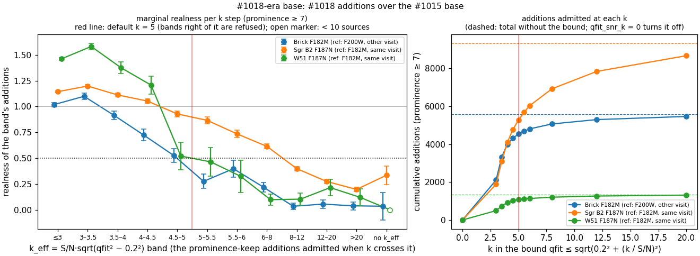
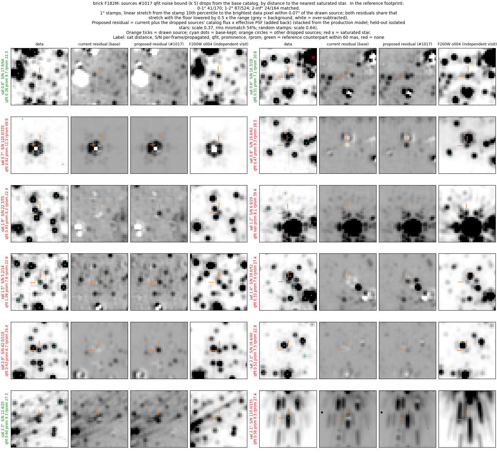
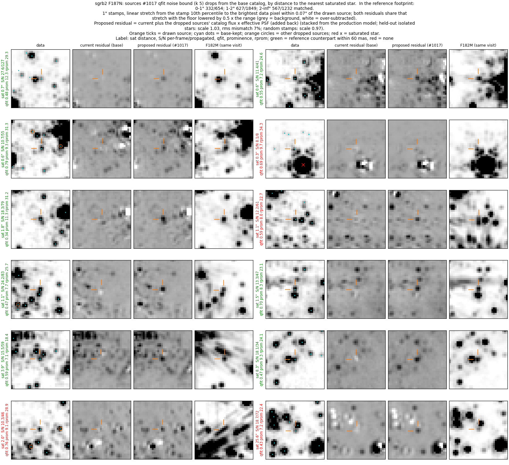
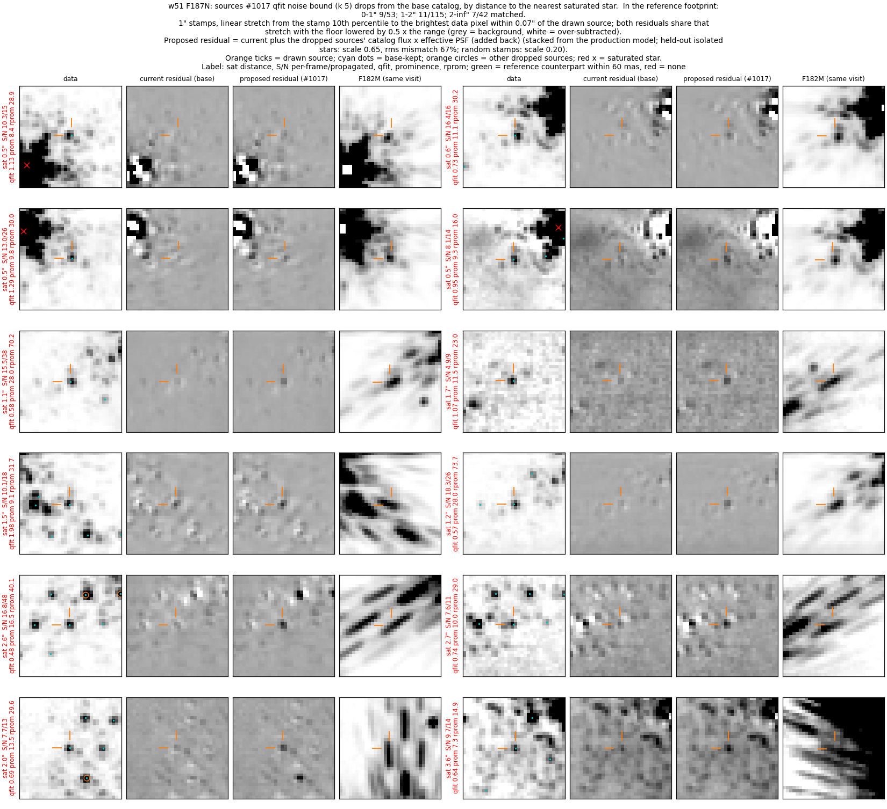
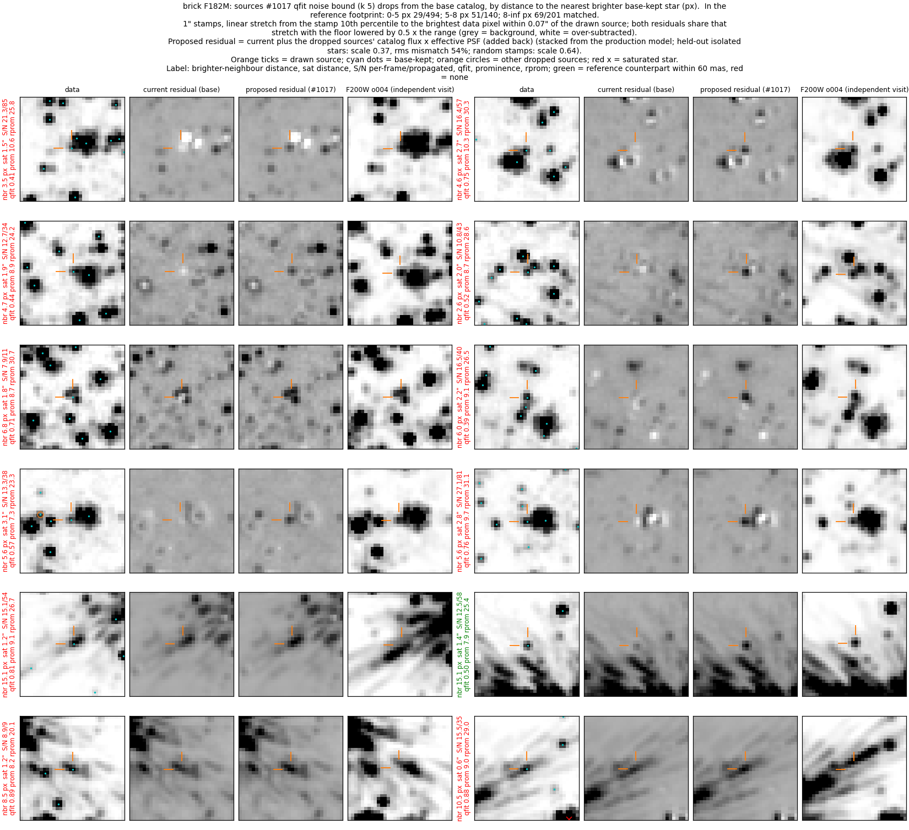
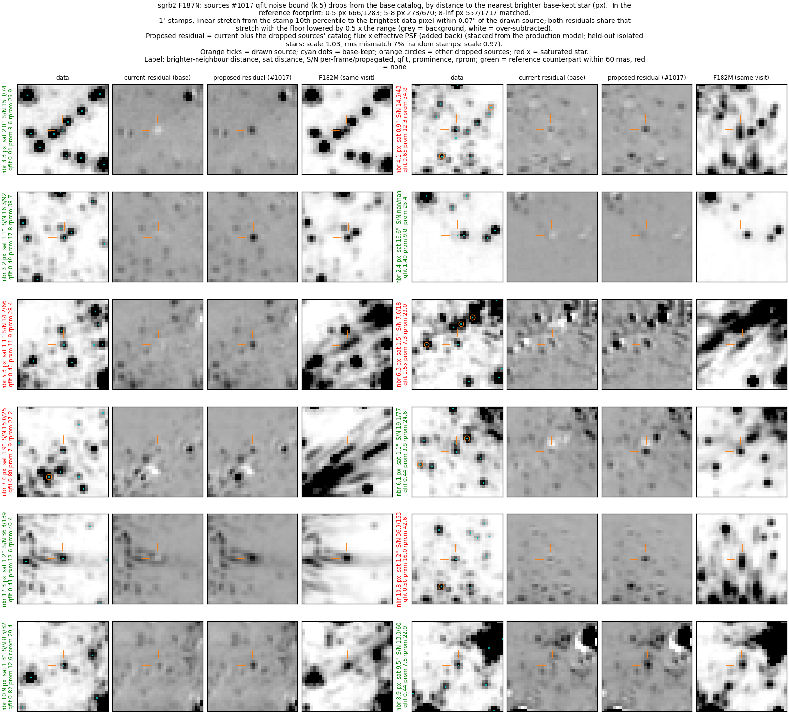
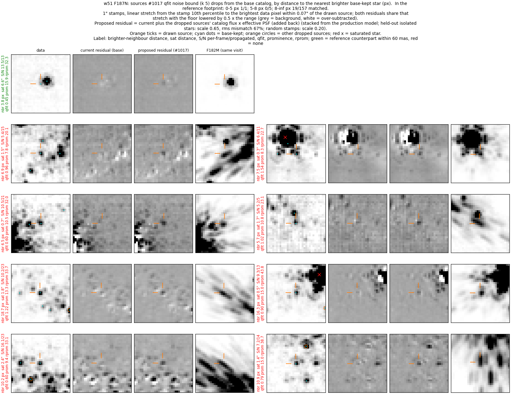

# Prominence keep: qfit pixel-noise bound (#1017)

#1018 keeps a source whose data-i2d prominence is ≥ 7 whatever its qfit.
`qfit = Σ|resid|/flux` of a perfect PSF fit is ≈ 3.4–4.6/(S/N) from pixel
noise alone (median `qfit × S/N` over eight fields), so a faint star has a
large qfit even when its fit is as good as the noise allows.  A bright source
with a large qfit has a fit that the noise does not explain: a fit in a
bright star's wing or Airy ring, a blend, or an emission knot.  This branch
makes the prominence keep (and the robust-prominence keep, when that is on)
also require

    qfit ≤ sqrt(qfit_max² + (k / S/N)²),   k = 5   (--manual-ext-qfit-snr-k)

with S/N the per-frame `flux/flux_err`.  A NaN qfit fails the bound; a
source with non-finite or non-positive S/N gets the flat `qfit_max`.  The
bound touches no other `star_like` branch (qfit ≤ qfit_max, peak_SB with its
prominence guard, keep_flags, bright isolated, the local sky-clean tier), and
`k = 0` restores the base.  Equivalently, the keep refuses a source whose
`k_eff = S/N · sqrt(qfit² − qfit_max²)` exceeds k.

**Release note.**  On the merge-target base (`pr/faint-reference-fields` at
ef01f404, which carries #1015, #1016, #1018, #1019, #1020 and #1021) the
bound removes 986 sources from the Brick F182M catalog (389,555 → 388,569),
3,735 from Sgr B2 F187N (413,946 → 410,211) and 256 from W51 F187N
(21,631 → 21,375), and adds none.  The refused sources read realness
0.20 ± 0.02 (Brick, 858 in the reference footprint, independent visit),
0.42 ± 0.01 (Sgr B2) and 0.18 ± 0.03 (W51, 210 in the footprint; both
against the same visit).  Scaled to the full refused counts, that is about
190 / 1,590 / 45 real-star equivalents and 790 / 2,150 / 210 spurious fits.
`--manual-ext-qfit-snr-k=0` restores the base.  The same note is in
`PHOTOMETRY_PIPELINE.md` (History Notes).

**These counts differ from the PR description** (1,045 / 4,054 / 261)
because the base changed.  The description counts the sources #1018 keeps
and the first #1017 does not, on the #1018-era base (d29fedb2).  This README
counts the sources this branch refuses on ef01f404.  949 / 3,631 / 236
sources are in both sets.  37 / 104 / 20 are refused here only: sources with
per-frame S/N < 5 that #1016's floor on the propagated flux uncertainty now
admits to the prominence keep.  96 / 423 / 25 of the #1018-era set are kept
here by #1019's local sky-clean tier, which the bound does not touch.

## Why the PR changed (#1018-era base)

This PR first proposed the noise term as a new admission path (the flat
qfit cut widened by `(k/S/N)²`, with a prominence guard).  On the full-field
m6 replays of the #1018-era base its additions are a subset of #1018's in
all three fields:

| field | first #1017 adds | #1018 adds | both | #1017 only | #1018 only |
|---|---:|---:|---:|---:|---:|
| Brick F182M | 4,532 | 5,577 | 4,532 | 0 | 1,045 |
| Sgr B2 F187N | 5,267 | 9,321 | 5,267 | 0 | 4,054 |
| W51 F187N | 1,077 | 1,338 | 1,077 | 0 | 261 |

The shared part reads realness 0.98 (Brick), 1.12 (Sgr B2) and 1.42 (W51);
the #1018-only part reads 0.15 ± 0.02, 0.46 ± 0.01 and 0.18 ± 0.03.  Every
#1018-only source with finite qfit and S/N has k_eff > 5 (minimum 5.00); the
rest have NaN qfit (10 / 26 / 0) or non-finite S/N (6 / 39 / 2).  So the
useful part of the first proposal is the bound: stacked on #1018 it removes
the #1018-only part and nothing else.  The first version is kept on
`backup/faint-qfit-snr-v1` (prominence guard 7 at f6c5400e) and
`backup/faint-qfit-snr-v1-replay` (bd107e81, the commit the replay ran, with
the guard set to 7 by option).

## Full-field replay on the merge-target base

m6 vetting replayed on the production m6 merged catalogs (`vet_variant.py`):
`seed` = #1015, `base1016` = ef01f404, `promq5b` = this branch at its
defaults, `promq0b` = k = 0, `promqeb` = k = 10⁻⁶ (the bound is then the flat
`qfit_max`, so `promq0b & ~promqeb` is every source whose keep depends on the
bound).  `verify_promq_b.py` (`data/verify_promq_b.json`):

| | Brick F182M | Sgr B2 F187N | W51 F187N |
|---|---:|---:|---:|
| #1015 kept | 377,837 | 408,591 | 20,041 |
| base kept | 389,555 | 413,946 | 21,631 |
| k = 0 kept | 389,555 | 413,946 | 21,631 |
| k = 0 keeps the same rows as the base | yes | yes | yes |
| k = 5 kept | 388,569 | 410,211 | 21,375 |
| k = 5 rows the base does not keep | 0 | 0 | 0 |
| refused (base and not k = 5) | 986 | 3,735 | 256 |
| refused: minimum prominence | 7.006 | 7.001 | 7.002 |
| refused: minimum k_eff | 5.006 | 5.003 | 5.015 |
| refused: no finite k_eff (NaN qfit or S/N ≤ 0) | 15 | 60 | 2 |
| refused and in the #1015 catalog | 0 | 0 | 0 |
| bound-dependent (k = 0 and not k = 10⁻⁶) | pending (`promqeb`) | | |
| k = 10⁻⁶ rows k = 5 does not keep | pending (`promqeb`) | | |
| refused = bound-dependent with k_eff > 5 or none | pending (`promqeb`) | | |

Realness as in the #1018 README: `(match − chance) / (expected − chance)` at
60 mas, `expected` from #1015-kept stars of the same flux; Brick against
F200W from the independent 1182/o004 visit, Sgr B2 and W51 against F182M
from the same visit (which shares the frames' artefacts and reads high).
Errors are binomial on the match fraction,
`sqrt(m(1 − m)/n) / (expected − chance_expected)`.

### Choice of k: realness of each k_eff band

The k_eff bands on this base need the k = 10⁻⁶ replay (`promqeb`, queued);
this section then gets the current-base table and `kband_realness.png`.
The refused bands (k_eff > 5) on this base are in the next section.  The
band study on the #1018-era base, where the prominence-keep additions are
`prom2` over #1015 (`KBAND_VARIANT=prom2 python kband_fig.py`):



Left: realness of the prominence-keep additions in each k_eff band, that is,
the sources a step of k from the band's lower to its upper edge admits.
Right: cumulative additions against k.

| k_eff band | Brick | Sgr B2 | W51 |
|---|---|---|---|
| ≤ 3 | 2,106 at 1.02 ± 0.02 | 1,883 at 1.14 ± 0.01 | 493 at 1.46 ± 0.01 |
| 3–3.5 | 1,206 at 1.10 ± 0.03 | 1,213 at 1.20 ± 0.01 | 237 at 1.58 ± 0.03 |
| 3.5–4 | 679 at 0.92 ± 0.04 | 989 at 1.11 ± 0.02 | 196 at 1.38 ± 0.06 |
| 4–4.5 | 329 at 0.72 ± 0.06 | 690 at 1.05 ± 0.02 | 103 at 1.21 ± 0.09 |
| 4.5–5 | 212 at 0.53 ± 0.07 | 492 at 0.93 ± 0.03 | 48 at 0.52 ± 0.13 |
| **5–5.5 (refused from here)** | 152 at 0.28 ± 0.07 | 416 at 0.87 ± 0.03 | 34 at 0.46 ± 0.14 |
| 5.5–6 | 122 at 0.40 ± 0.08 | 348 at 0.74 ± 0.04 | 24 at 0.32 ± 0.15 |
| 6–8 | 260 at 0.22 ± 0.05 | 891 at 0.61 ± 0.02 | 68 at 0.10 ± 0.05 |
| 8–12 | 230 at 0.03 ± 0.03 | 916 at 0.40 ± 0.02 | 61 at 0.10 ± 0.06 |
| 12–20 | 165 at 0.06 ± 0.04 | 827 at 0.27 ± 0.02 | 47 at 0.21 ± 0.08 |
| > 20 | 100 at 0.04 ± 0.04 | 591 at 0.20 ± 0.02 | 25 at 0.12 ± 0.08 |
| no k_eff (NaN qfit or S/N) | 16 at 0.03 ± 0.13 | 65 at 0.33 ± 0.09 | 2 (0 matched) |

k = 5 sits where the Brick, the field with an independent reference, crosses
0.5: the 4.5–5 band reads 0.53 ± 0.07 and the 5–5.5 band 0.28 ± 0.07, a 2.5σ
difference.  In W51 the two bands read 0.52 ± 0.13 and 0.46 ± 0.14, within
1σ, so W51 does not locate the step; its realness falls between 4–4.5 (1.21)
and 4.5–5.  In Sgr B2 realness falls gradually and crosses 0.5 near k_eff 8.
k = 4.5 would refuse 212 / 492 / 48 more sources at 0.53 / 0.93 / 0.52;
k = 6 would keep 274 / 764 / 58 more at 0.33 / 0.81 / 0.41.

### What the refused sources are

Realness of the refused set by k_eff, per-frame S/N and distance to the
nearest saturated star (`refused_slices.py`; n is the full count, realness
uses the sources in the reference footprint):

| slice | Brick | Sgr B2 | W51 |
|---|---|---|---|
| k_eff 5–6 | 263 at 0.42 ± 0.06 | 677 at 0.76 ± 0.03 | 58 at 0.37 ± 0.10 |
| k_eff 6–8 | 246 at 0.28 ± 0.05 | 796 at 0.56 ± 0.02 | 63 at 0.08 ± 0.05 |
| k_eff 8–12 | 207 at 0.05 ± 0.04 | 852 at 0.37 ± 0.02 | 62 at 0.10 ± 0.06 |
| k_eff 12–20 | 155 at 0.06 ± 0.04 | 798 at 0.27 ± 0.02 | 46 at 0.22 ± 0.08 |
| k_eff > 20 | 100 at 0.04 ± 0.04 | 552 at 0.20 ± 0.02 | 25 at 0.12 ± 0.08 |
| S/N < 10 | 203 at 0.54 ± 0.07 | 717 at 0.50 ± 0.03 | 117 at 0.15 ± 0.05 |
| S/N 10–20 | 492 at 0.17 ± 0.03 | 1,712 at 0.48 ± 0.02 | 97 at 0.18 ± 0.05 |
| S/N 20–50 | 237 at 0.07 ± 0.03 | 1,119 at 0.33 ± 0.02 | 33 at 0.23 ± 0.09 |
| S/N > 50 | 48 at 0.04 ± 0.05 | 148 at 0.25 ± 0.05 | 7 at 0.37 ± 0.30 |
| < 1″ from a saturated star | 191 at 0.26 ± 0.05 | 654 at 0.54 ± 0.03 | 53 at 0.23 ± 0.07 |
| 1–2″ | 604 at 0.19 ± 0.03 | 1,849 at 0.33 ± 0.01 | 147 at 0.13 ± 0.04 |
| > 2″ | 191 at 0.15 ± 0.05 | 1,232 at 0.50 ± 0.02 | 56 at 0.24 ± 0.08 |

In the Brick and Sgr B2 realness falls with k_eff, as the bound assumes; in
W51 it is 0.08–0.22 above k_eff 6 with no trend.  In the Brick it also falls
with S/N: the brighter a refused source, the less likely it is real.

**Brick.**  Per S/N bin, 38–62 % of the refused sources sit within 5 px of
a brighter kept star, at a median 3.5–3.9 px (S/N ≥ 5) and a median flux
ratio 0.29–0.38: the position and brightness of a fit on the first Airy
ring.  At S/N ≥ 7 those read catalog realness −0.07 to 0.07, and the refused
sources beyond 5 px read 0.18–0.55 (`lsky_snr_diag.py`).  #1015-kept stars
in the same ring also read low (0.0–0.14), so catalog realness has limited
power inside 5 px; the image test fills that gap.  `img_realness.py` asks
whether the independent F200W image has a local maximum within 1.5 px, with
a chance rate from positions rotated about the brighter star.  At S/N ≥ 10:

| distance to the brighter star | refused | #1015-kept, same S/N and distance |
|---|---|---|
| 0–3 px | 59 at 0.10 | 0.20 |
| 3–5 px | 341 at 0.24 | 0.57 |
| 5–8 px | 96 at 0.62 | 0.93 |
| 8–12 px | 65 at 0.56 | 0.94 |
| 12–20 px | 87 at 0.26 | 0.97 |
| > 20 px | 23 at 0.29 | 0.99 |

The faint refused sources look different: the 34 refused sources at S/N < 5
read catalog realness 1.21, and the 27 of them the image test reports
(3–8 px from the brighter star) read 1.00; and at S/N 5–10 the image test reads 0.55 / 0.80 / 0.56 at 3–5 / 5–8 /
8–12 px.  So the bound costs real stars at low S/N in the Brick, where the
`(k/S/N)²` term is large but qfit is larger still.

**Sgr B2.**  14–34 % of the refused sources sit within 5 px of a brighter
star, and those read catalog realness 0.27–0.85, comparable to or above the
rest (0.25–0.75).  The image test (F182M, same visit) at S/N ≥ 10 reads
0.12 / 0.30 / 0.70 / 0.67 / 0.74 / 0.78 at 0–3 / 3–5 / 5–8 / 8–12 / 12–20 /
> 20 px, against 0.22 / 0.54 / 0.92 / 0.89 / 0.97 / 1.00 for #1015-kept stars.
The refused set here is a near-even trade: many of the sources away from
bright stars have F182M counterparts and look like stars in the galleries.

**W51.**  Almost none of the refused sources sit within 5 px of a brighter
kept star (0–1 %).  They read catalog realness −0.02 to 0.28 per S/N bin.
The image test reads 0.32 (8–12 px, 42), 0.60 (12–20 px, 54) and 0.63
(> 20 px, 38) at S/N ≥ 10, against 0.47 / 0.83 / 0.97 for #1015-kept stars.
F182M contains Paα (as F187N does), so a compact line-emission knot can make
a local maximum in the F182M image while the F182M catalog vetting rejects
it; the image test does not separate stars from knots in W51 or Sgr B2.
The F200W reference used for the Brick also contains Paα; the Brick has
little ionised emission.

### Galleries: current and proposed catalogs and residuals

Each row shows two refused sources; columns per source:

- **data**: the band's data i2d; cyan dots = base-kept sources (the current
  catalog), orange circles = other refused sources, red × = saturated stars,
  orange ticks = the drawn source.  The proposed catalog is the cyan dots
  without the ticked source and the orange circles.
- **current residual (base)**: the production m6 residual i2d, corrected to
  the base catalog's membership (`propresid.py`).
- **proposed residual (#1017)**: the current residual with the refused
  sources added back, each as catalog flux × the effective PSF stacked from
  the production model image.  A compact dark spot here marks flux the base
  catalog had modeled; whether that flux is a star is what the reference
  column and the label colour address.
- **reference**: the independent-visit F200W image (Brick) or F182M from the
  same visit (Sgr B2, W51).

Labels: distance to the nearest brighter base-kept star (`nbr`), distance
to the nearest saturated star, per-frame / propagated S/N, qfit, prominence,
robust prominence (`rprom`);
green = a reference-catalog counterpart within 60 mas, red = none.  1″
stamps; both residuals share one stretch.

Grouped by distance to the nearest saturated star (0–1″, 1–2″, > 2″):





Grouped by distance to the nearest brighter base-kept star (0–5, 5–8,
> 8 px):





In the Brick most drawn sources within 5 px of a brighter star sit on its
core or first ring, and several farther ones sit on diffraction spikes; the
5–8 px and > 8 px groups also hold clear stars with F200W counterparts
(29 / 494, 51 / 140 and 69 / 201 matched in the footprint per group).  In
Sgr B2 many drawn sources are compact stars with F182M counterparts
(666 / 1,283, 278 / 670 and 557 / 1,717 matched).  In W51 the drawn sources
are compact and isolated in F187N, and most lack F182M counterparts
(9 / 53, 11 / 115 and 7 / 42 matched per saturated-star group); the F182M
stamps there are dominated by bright-star spike streaks, so some may be
stars the F182M catalog misses near spikes and some Paα knots.

## Reference fields (m7, injection seeds 1–10 + clean run)

Queued: the four reference fields at seeds 1–10 plus the clean run for
`base1016` (ef01f404) and `promq5b` (this branch), submitted with
`python -m jwst_gc_pipeline.photometry.reference_fields.run --variant <v>`.
The per-field pass/fail and the metric differences go here when they finish.

## Tests

`jwst_gc_pipeline/photometry/tests/test_qfit_noise_term.py` (10 tests):
the test star is prominent and off the peak_SB branch; faint star with a
noisy qfit kept; bright fit above the noise floor refused; quadrature sum
(S/N 16: qfit 0.36 kept, 0.38 refused; k 6 keeps 0.42); NaN qfit refused;
unmeasured S/N gets the flat qfit_max; negative S/N gets the flat qfit_max;
peak_SB, keep_flags, qfit ≤ qfit_max and bright-isolated branches untouched;
on a random 90-star field `kept(k=5) == where(within bound, kept(k=0),
kept(no prominence keep))`; pipeline default 5 and the CLI wiring.

Mutation check (14 mutants, each a non-empty diff of 1–2 lines, all
killed): linear sum instead of quadrature; `k/S/N` alone; NaN qfit passes;
non-finite S/N unbounded; bound computed but not applied; bound never on;
bound applied to the peak_SB branch; bound applied to every star_like
branch; function default k = 5; wired to the wrong option; not wired;
pipeline default 4; S/N dropped from the bound; S/N ≤ 0 treated as
measured.

## Reproducing

From `scripts/` (outputs go to `scripts/out/`, about 1 GB, not committed):

```
# base1016 / promq5b / promq0b / promqeb on Brick F182M, Sgr B2 F187N, W51 F187N
WT_BASE=<worktree at ef01f404> WT=<worktree at this branch> sbatch replay_promq.sbatch
```

The `seed` (#1015) and `prom2` (#1018 at d29fedb2) replays are
`docs/evidence/faint_prominence_keep/scripts/replay_prom2.sbatch`; link or
copy their `out/*_seed.fits` and `out/*_prom2.fits` here.  The published
seed files came from an earlier #1015 commit that differs from the #1015 tip
only in the m7 seed code, which the m6 replay does not run.  `qsnrp7` (the
first #1017) is `vet_variant.py` on `backup/faint-qfit-snr-v1-replay`
(bd107e81) with
`REPLAY_OPTS='{"manual_ext_qfit_snr_prom_min": 7.0}'`.  Then:

```
python verify_promq_b.py                         # identity table
python kband_qsnr.py <field> promq0b-promqeb     # k_eff bands on this base
python kband_fig.py ../kband_realness.png
python kband_qsnr.py <field> prom2               # k_eff bands on the #1018-era base
KBAND_VARIANT=prom2 python kband_fig.py ../kband_realness_1018era.png
python refused_slices.py <field>                 # k_eff / S/N / saturated-star slices
python lsky_snr_diag.py <field> base1016-promq5b # neighbour distance and catalog realness
python img_realness.py <field> base1016-promq5b  # image test
python added_gallery.py <field> promq5b@base1016 ../refused_<field>.png 4 lost
GALLERY_GROUP=nbr python added_gallery.py <field> promq5b@base1016 ../refused_<field>_nbr.png 4 lost
```

`<field>` is `brick`, `sgrb2` or `w51`.  The scripts write their JSON next
to themselves; the published copies are in `data/`.  The diagnostics' printed tables
call the A-B set "added" (the sources A keeps over #1015 that B does not);
for `base1016-promq5b` that is the refused set.

## Caveats

- k = 5 rests on the Brick, the one field with an independent-visit
  reference.  W51 does not locate a step and Sgr B2 has a gradual decline.
- In Sgr B2 the refused set is a near-even trade against a same-visit
  reference, and the galleries show real stars among the refused sources.
- In the Brick the bound refuses real faint stars (S/N < 10 reads 0.54 by
  catalog and higher by image) along with ring and spike fits.
- In W51 the refused sources are compact isolated F187N sources; neither
  realness test separates stars from Paα knots there.
- Realness against a same-visit reference (Sgr B2, W51) reads high.
