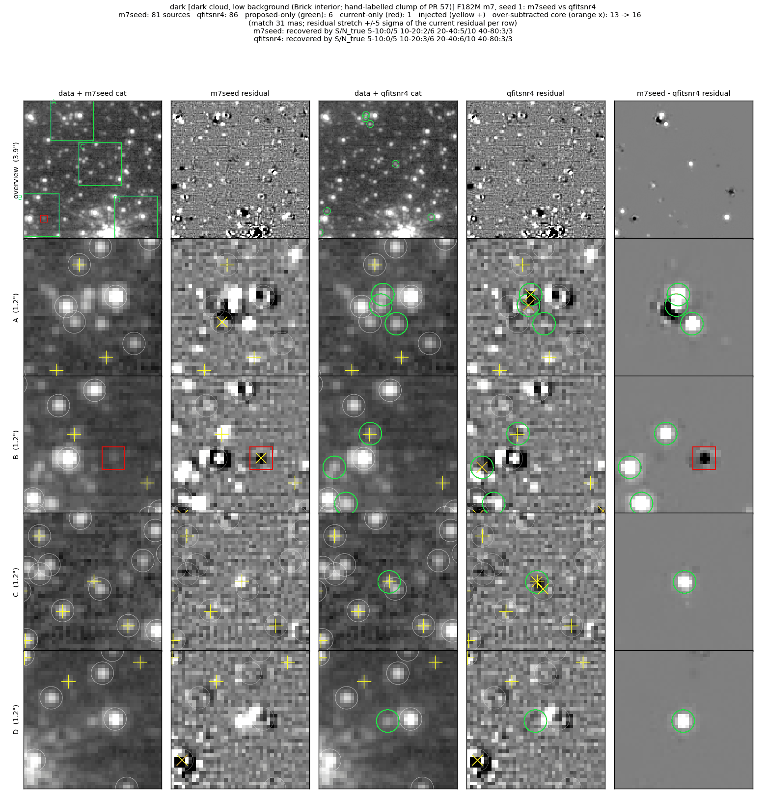
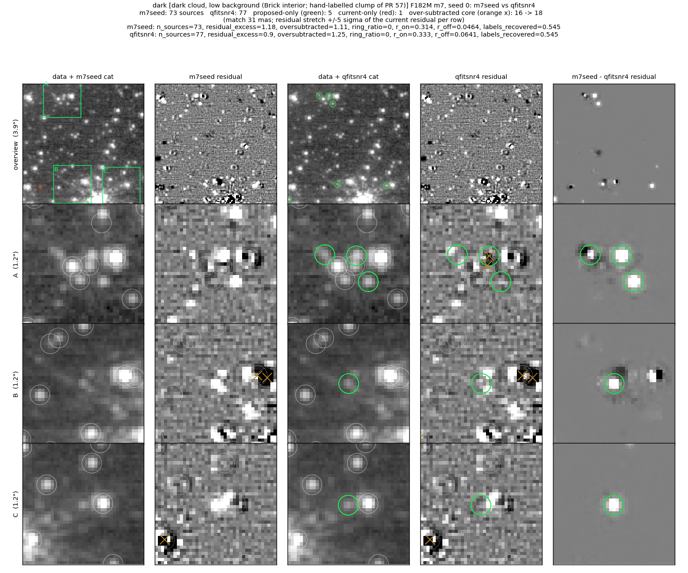
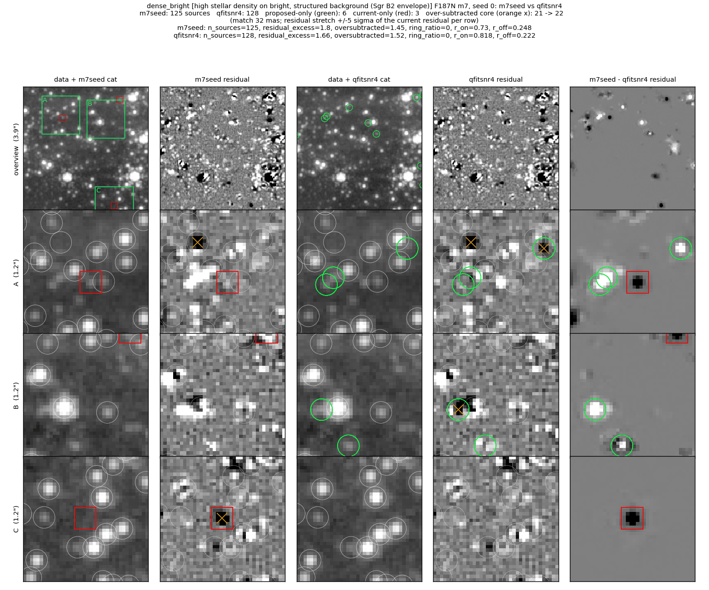

# Vetting qfit gate with a pixel-noise term

`qfit = Σ|resid|/flux` of a perfect PSF fit is ≈ 3.4/(S/N) from pixel noise
alone (Brick F182M dark-sky stars: median `qfit × S/N` 3.4, all eight fields
checked 3.4–4.6), so the flat `qfit ≤ 0.2` star-like cut is reachable only at
S/N ≳ 17.  This branch uses `qfit ≤ sqrt(qfit_max² + (k/S/N)²)`, k = 5, and
requires data-i2d prominence ≥ 3 for a source admitted by the noise term (an
emission knot fits badly too).

Figure layout and metric definitions:
[../faint_reference_fields/README.md](../faint_reference_fields/README.md).
Comparison: `m7seed` (the base branch) → `qfitsnr4` (this branch).

### Dark cloud (Brick, F182M), injection seed 1

6 added, 1 dropped; the seed's injected S/N 10–20 bin goes 2/6 → 3/6 and
20–40 goes 5/10 → 6/10.  Row B: an injected star is fitted, and the dropped
source (red box) was an over-subtracted fit.  Row D: a faint isolated star
leaves the residual.  Rows A and C: an added source inside a group and one
injected star carry over-subtracted cores (13 → 16 in this seed).

### Dark cloud (Brick, F182M), clean run

5 added, 1 dropped; residual excess 1.18 → 0.90 per arcsec², over-subtracted
16 → 18.  Rows B and C: faint stars next to brighter ones leave the residual.
Row A: three sources added to a compact group; the middle one is
over-subtracted.

### High density on bright background (Sgr B2, F187N), clean run

6 added, 3 dropped; residual excess 1.80 → 1.66, over-subtracted 21 → 22.
Row A: two sources added on an elongated residual bar (structure rather than
a point source).  Row B: an added source beside a bright star has an
over-subtracted core.  Row C: the dropped source was over-subtracted.

## Metrics (m7)

**superdense (NSC, F212N)** (phase m7)

| variant | S/N 40-80 | S/N 80-160 | S/N 160-320 | S/N 320-640 | resid excess /as² (+/−) | over-subtracted /as² (n) | labels | bias mag |
|---|---|---|---|---|---|---|---|---|
| m7seed | 1/11 | 5/13 | 5/14 | 8/10 | 1.32 (22/3) | 1.32 (19) | — | 0.018 |
| qfitsnr4 | 1/11 | 5/13 | 5/14 | 8/10 | 1.32 (22/3) | 1.32 (19) | — | 0.018 |

**dense + bright bg (Sgr B2, F187N)** (phase m7)

| variant | S/N 5-10 | S/N 10-20 | S/N 20-40 | S/N 40-80 | resid excess /as² (+/−) | over-subtracted /as² (n) | labels | bias mag |
|---|---|---|---|---|---|---|---|---|
| m7seed | 0/17 | 0/11 | 2/9 | 5/11 | 1.80 (26/0) | 1.45 (21) | — | 0.001 |
| qfitsnr4 | 0/17 | 0/11 | 2/9 | 5/11 | 1.66 (24/0) | 1.52 (22) | — | 0.001 |

**modest density + bright bg (W51, F187N)** (phase m7)

| variant | S/N 5-10 | S/N 10-20 | S/N 20-40 | S/N 40-80 | resid excess /as² (+/−) | over-subtracted /as² (n) | labels | emission knots cataloged | bias mag |
|---|---|---|---|---|---|---|---|---|---|
| m7seed | 0/11 | 0/6 | 0/13 | 11/18 | 0.55 (10/2) | 0.07 (1) | — | 2/4 | 0.138 |
| qfitsnr4 | 0/11 | 0/6 | 1/13 | 12/18 | 0.55 (10/2) | 0.07 (1) | — | 2/4 | 0.138 |

**dark cloud (Brick, F182M)** (phase m7)

| variant | S/N 5-10 | S/N 10-20 | S/N 20-40 | S/N 40-80 | resid excess /as² (+/−) | over-subtracted /as² (n) | labels | bias mag |
|---|---|---|---|---|---|---|---|---|
| m7seed | 0/10 | 4/11 | 9/15 | 11/12 | 1.18 (19/2) | 1.11 (16) | 0.55 | 0.050 |
| qfitsnr4 | 0/10 | 6/11 | 10/15 | 11/12 | 0.90 (15/2) | 1.25 (18) | 0.55 | 0.054 |

## Caveats

- On its own (on top of the m7 seed union) the gain is small: most faint
  stars the noise term admits are still removed by the per-frame S/N floor.
  The S/N-floor branch and this one work together; the combined stack is in
  the integration PR.
- Row A of the Sgr B2 figure shows the risk this gate carries: a bar of
  residual structure passes the noise term and the prominence ≥ 3 guard.
  The prominence guard is calibrated on F187N continuum-match purity
  (commit message) and does not remove every case.
- Superdense: unchanged (its stars sit above S/N 17).
