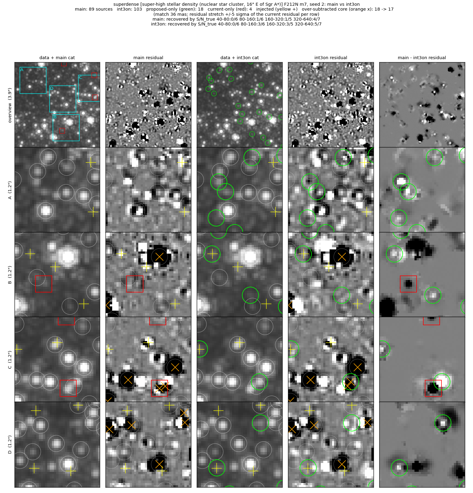
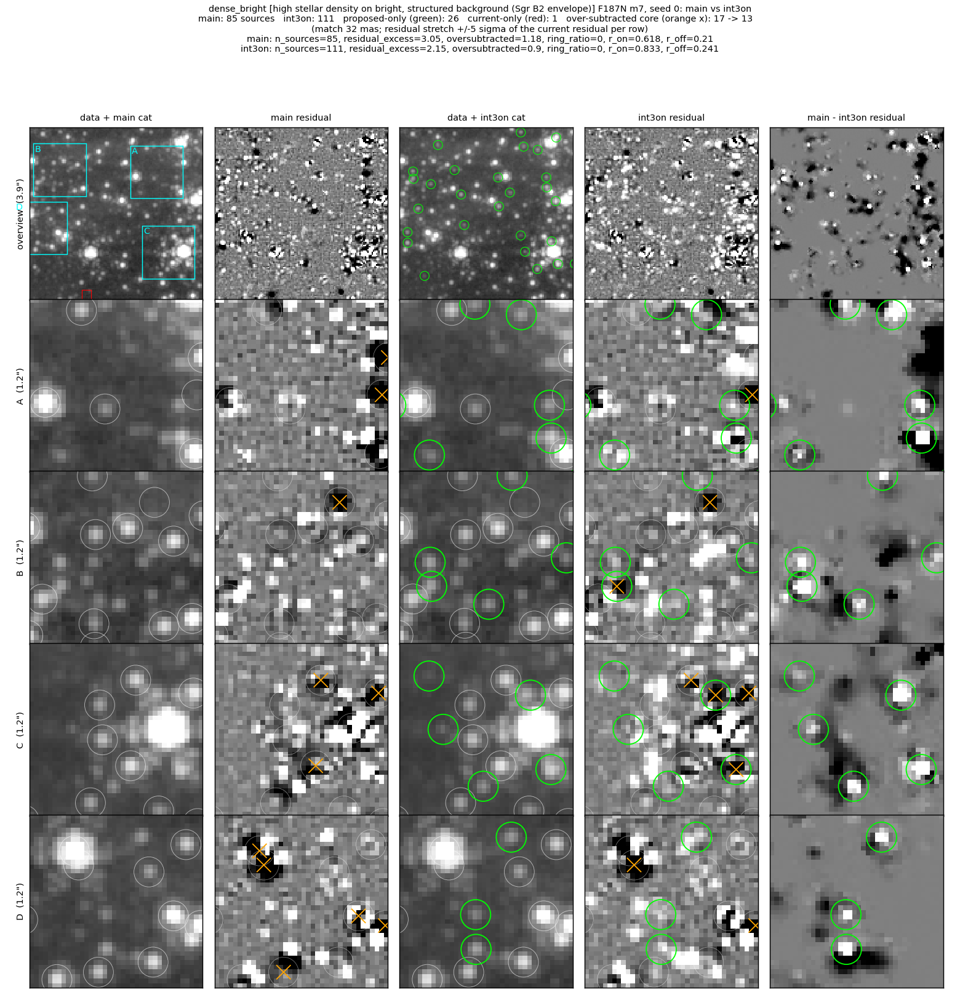
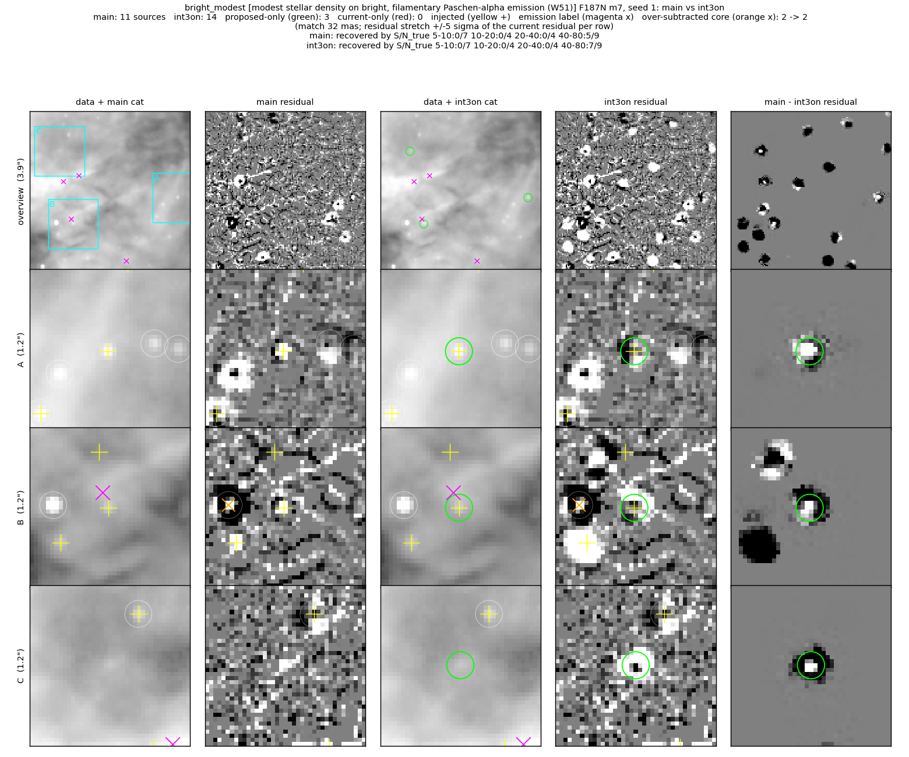
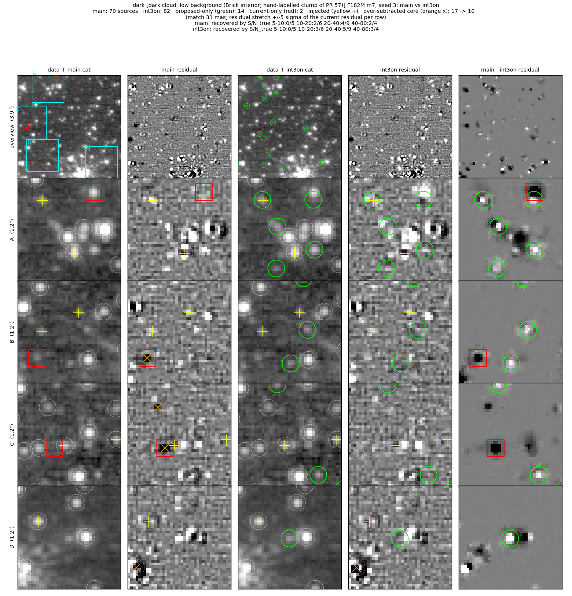
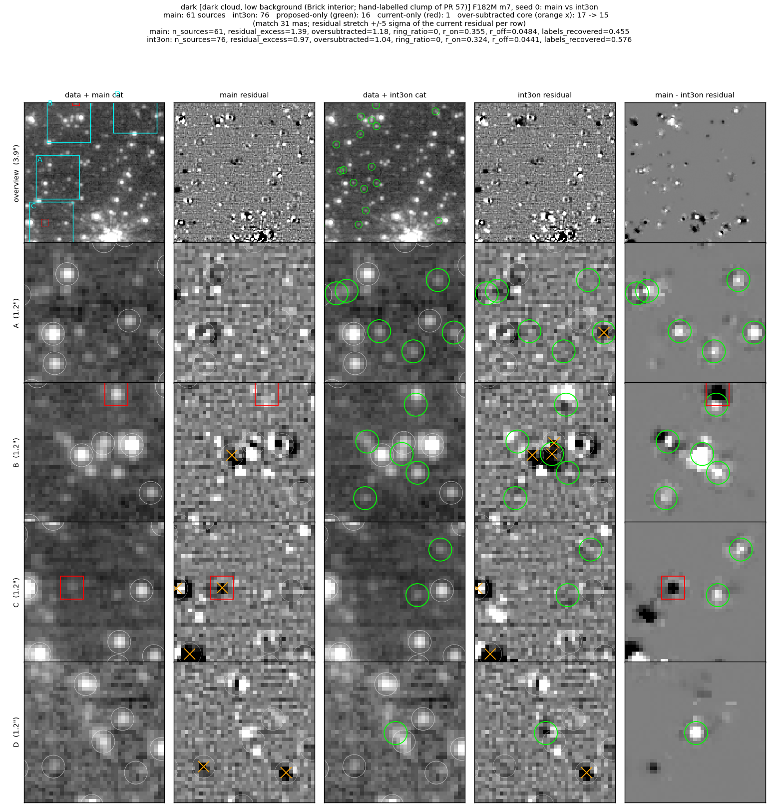

# Faint-star reference fields

Four 5″ cutouts, one per crowding/background environment, run through the
full manual chain (m12 → m7) once clean (seed 0) and ten times with 24 frozen
artificial stars injected (seeds 1–10, about 60 stars per S/N bin per field).
`evaluate.py` scores each field and `fields.yaml` holds the field's pass
thresholds.  The thresholds belong to the field: any change to detection or
vetting defaults has to pass all four.

| field | environment | data | bands |
|---|---|---|---|
| `superdense` | super-high stellar density: nuclear star cluster, 16″ E of Sgr A* | 1939 obs 001 | F212N (+F405N) |
| `dense_bright` | high stellar density on bright, structured background: Sgr B2 envelope | 5365 obs 001 | F187N (+F212N) |
| `bright_modest` | modest stellar density on bright, filamentary Pa-α emission: W51 | 6151 obs 001 | F187N (+F210M) |
| `dark` | dark cloud, low background: Brick interior (hand-labelled clump of PR 57) | 2221 obs 001 | F182M (+F212N) |

The first band is scored; the second is the run's cross-band partner (the m7
seed needs at least two bands) and the continuum companion for the purity
statistic.

## Running

```
# submit the 44 runs of one code version (one SLURM job each)
python -m jwst_gc_pipeline.photometry.reference_fields.run --variant <name> \
    --pipe-root <checkout> --submit
# score them against fields.yaml (--baseline adds star-by-star gained/lost
# counts and a sign test against another variant's --json output)
python -m jwst_gc_pipeline.photometry.reference_fields.evaluate --variant <name> --json out.json
# comparison figures (data, catalogs, residuals; current vs proposed)
python -m jwst_gc_pipeline.photometry.reference_fields.figures \
    --variant <proposed> --base <current> --phase m7 --fields dark,dense_bright --seeds 0,1 --out figs/
# re-derive the thresholds from a variant's --json output
python -m jwst_gc_pipeline.photometry.reference_fields.evaluate --calibrate out.json \
    --commit <sha> --nsigma 2.5
```

The calibration run `int3on` was submitted from a checkout of 94033cf0 with
the two opt-in faint-star options on (`--extra` applies to every listed field;
the loose roundness window stays off on the extended-emission field):

```
python -m jwst_gc_pipeline.photometry.reference_fields.run --variant int3on --pipe-root <94033cf0> \
    --fields superdense,dense_bright,dark --submit \
    --extra '--manual-m7-seed-own-band --manual-seed-round-loose-max=0.8'
python -m jwst_gc_pipeline.photometry.reference_fields.run --variant int3on --pipe-root <94033cf0> \
    --fields bright_modest --submit --extra '--manual-m7-seed-own-band'
```

A run takes 15–40 min on one node.  `jwst_gc_pipeline/photometry/tests/test_reference_fields.py` checks
the configuration, the frozen injection tables and the metric code on
synthetic images; it does not run the pipeline.

## Thresholds

Each field's `thresholds:` block in `fields.yaml` (phase m7, inner box), with
the counts they came from in the field's `calibration:` block:

| field | completeness floors (injected S/N bin: min fraction; calibration k/n) | resid excess max /as² (cal.) | over-subtracted max /as² (cal.) | other | neutral-change pass prob. |
|---|---|---|---|---|---|
| `superdense` | 80–160: 0.05 (11/64), 160–320: 0.24 (29/74), 320–640: 0.39 (29/51) | 2.1 (1.52) | 1.4 (1.25) | \|bias\| ≤ 0.1 mag (+0.012) | 0.982 |
| `dense_bright` | 20–40: 0.11 (15/58), 40–80: 0.40 (36/64) | 2.65 (2.15) | 1.25 (0.90) | \|bias\| ≤ 0.1 mag (+0.049) | 0.986 |
| `bright_modest` | 40–80: 0.40 (35/62) | 0.7 (0.48) | 0.15 (0.07) | ≤ 1 of 4 emission knots cataloged (1/4); \|bias\| ≤ 0.24 mag (−0.135) | 0.986 |
| `dark` | 10–20: 0.35 (29/55), 20–40: 0.59 (45/61), 40–80: 0.63 (48/62) | 1.25 (0.97) | 1.3 (1.04) | ≥ 12 of the 33 labelled stars (19/33); \|bias\| ≤ 0.1 mag (+0.041) | 0.974 |

How they were set:

- Calibration run: `int3on`, the integration branch (94033cf0: main plus
  #1014–#1021) with the m7 own-band seed union (#1015) on in every field and
  the loose seed roundness window (#1020, ±0.8) on in the three star fields.
  These two options ship off; a follow-up PR turns them on by default, with
  these runs as its evidence.
- Each threshold sits 2.5 standard errors on the passing side of the
  calibration value: binomial for the completeness and label fractions, the
  seed-to-seed scatter of the 10 injection runs for the two residual
  densities, the quoted error for the bias, with a 0.1 mag minimum on the
  bias limit and 0.05 on a completeness floor (`evaluate.py --calibrate`).
- "Neutral-change pass probability" is the chance that a code change which
  leaves every metric's true value at its calibration value still passes the
  field, from simulating the binomial and Gaussian scatter.  Joint over the
  four fields: 0.93.  At 2.0 standard errors the joint probability was 0.77,
  which would fail one neutral PR in four.
- A bin carries no floor where no tested code version recovers stars there:
  superdense S/N 40–80 (1/51 in every variant; confusion sets the noise),
  Sgr B2 below S/N 20 (at most 1/69), W51 below S/N 40 (at most 5/68), Brick
  S/N 5–10 (at most 2/62).
- Two limits guard against fake sources.  `oversubtracted_max` bounds
  catalog sources whose residual core is over-subtracted, which is how fits to
  a bright star's PSF wings show up; `residual_excess` cannot see them because
  it scores the residual only away from catalog sources, so a wing fit lowers
  it.  `emission_labels_cataloged_max` bounds fits to the four hand-labelled
  W51 nebular knots; W51's `residual_excess_max` stays loose for the same
  reason (fitting a knot lowers the excess).
- `ring_ratio` and `emission_purity` are reported but carry no threshold.
  Every variant has 0 ring companions in every field, with 0.2–1.3 expected
  by chance in Sgr B2 and the Brick and none in the other two (no star bright
  enough for the ring test), too few to set a limit.  `emission_purity` is
  NaN in all four fields: the companion band separates injected stars from
  chance positions by less than the 0.2 the estimator needs
  (`r_real − r_off`), or the field has no faint sources.
- W51: every variant recovers the injected stars 0.13–0.15 mag bright (main
  −0.145 ± 0.035, 37 stars at S/N_true ≥ 20), so its bias limit is 0.24 mag.
  The other three fields keep 0.1 mag.

`test_reference_field_passes` scores the run of `JWST_GC_REFFIELD_VARIANT`
(default `main`) against these thresholds and skips where that run's products
are absent (CI) or were made by different pipeline code.  The pipeline at its
shipped defaults fails the Brick field (next section); that failure is the
faint-star problem the default-on follow-up PR addresses.

## main, the shipped defaults, and the calibration run

Variants (all 10 injection seeds plus the clean run):

- `main`: 500fc69c, `origin/main` plus this harness.
- `int3`: 94033cf0, the integration branch (#1014–#1021) at its shipped
  defaults; #1015 and #1020 are off.
- `int3on`: 94033cf0 with #1015 and #1020 on (the calibration run above).

Completeness is recovered/injected summed over seeds 1–10.  "[seeds]" is the
median ± standard deviation of the metric over the 10 injection runs (the
clean value is the threshold's subject).

**superdense (NSC, F212N)** (phase m7)

| variant | S/N 40-80 | S/N 80-160 | S/N 160-320 | S/N 320-640 | resid excess /as² (+/−) [seeds] | over-subtracted /as² (n) [seeds] | bias mag (n) |
|---|---|---|---|---|---|---|---|
| main (500fc69c) | 1/51 | 6/64 | 18/74 | 26/51 | 1.66 (27/3) [1.42 ± 0.10] | 1.11 (16) [1.32 ± 0.08] | -0.025 ± 0.022 (51) |
| int3 (94033cf0, defaults) | 1/51 | 5/64 | 18/74 | 26/51 | 1.66 (27/3) [1.52 ± 0.16] | 1.25 (18) [1.25 ± 0.09] | -0.018 ± 0.023 (50) |
| int3on (94033cf0 + #1015, #1020) | 1/51 | 11/64 | 29/74 | 29/51 | 1.52 (28/6) [1.32 ± 0.22] | 1.25 (18) [1.21 ± 0.06] | +0.012 ± 0.025 (70) |

**dense + bright bg (Sgr B2, F187N)** (phase m7)

| variant | S/N 5-10 | S/N 10-20 | S/N 20-40 | S/N 40-80 | resid excess /as² (+/−) [seeds] | over-subtracted /as² (n) [seeds] | bias mag (n) |
|---|---|---|---|---|---|---|---|
| main (500fc69c) | 0/49 | 1/69 | 11/58 | 28/64 | 3.05 (44/0) [2.60 ± 0.13] | 1.18 (17) [1.18 ± 0.08] | +0.030 ± 0.014 (39) |
| int3 (94033cf0, defaults) | 0/49 | 1/69 | 12/58 | 32/64 | 2.29 (33/0) [1.90 ± 0.15] | 1.18 (17) [1.21 ± 0.09] | +0.032 ± 0.015 (44) |
| int3on (94033cf0 + #1015, #1020) | 0/49 | 1/69 | 15/58 | 36/64 | 2.15 (31/0) [1.90 ± 0.19] | 0.90 (13) [0.83 ± 0.13] | +0.049 ± 0.013 (51) |

**modest density + bright bg (W51, F187N)** (phase m7)

| variant | S/N 5-10 | S/N 10-20 | S/N 20-40 | S/N 40-80 | resid excess /as² (+/−) [seeds] | over-subtracted /as² (n) [seeds] | knots cataloged | bias mag (n) |
|---|---|---|---|---|---|---|---|---|
| main (500fc69c) | 0/53 | 1/56 | 5/68 | 32/62 | 0.21 (4/1) [0.17 ± 0.07] | 0.07 (1) [0.07 ± 0.02] | 2/4 | -0.145 ± 0.035 (37) |
| int3 (94033cf0, defaults) | 0/53 | 0/56 | 3/68 | 34/62 | 0.21 (4/1) [0.17 ± 0.07] | 0.07 (1) [0.07 ± 0.02] | 1/4 | -0.130 ± 0.040 (37) |
| int3on (94033cf0 + #1015, #1020) | 0/53 | 0/56 | 3/68 | 35/62 | 0.48 (11/4) [0.42 ± 0.08] | 0.07 (1) [0.07 ± 0.02] | 1/4 | -0.135 ± 0.039 (38) |

**dark cloud (Brick, F182M)** (phase m7)

| variant | S/N 5-10 | S/N 10-20 | S/N 20-40 | S/N 40-80 | resid excess /as² (+/−) [seeds] | over-subtracted /as² (n) [seeds] | labels | bias mag (n) |
|---|---|---|---|---|---|---|---|---|
| main (500fc69c) | 0/62 | 12/55 | 37/61 | 45/62 | 1.39 (22/2) [1.14 ± 0.12] | 1.18 (17) [1.04 ± 0.09] | 15/33 | +0.032 ± 0.008 (82) |
| int3 (94033cf0, defaults) | 0/62 | 18/55 | 42/61 | 47/62 | 1.32 (21/2) [1.04 ± 0.13] | 1.11 (16) [1.04 ± 0.09] | 15/33 | +0.031 ± 0.009 (89) |
| int3on (94033cf0 + #1015, #1020) | 2/62 | 29/55 | 45/61 | 48/62 | 0.97 (16/2) [0.90 ± 0.09] | 1.04 (15) [0.87 ± 0.09] | 19/33 | +0.041 ± 0.010 (93) |

Pass/fail against the thresholds:

| code | `superdense` | `dense_bright` | `bright_modest` | `dark` |
|---|---|---|---|---|
| main (500fc69c) | pass | **fail**: residual_excess_max: 3.05 vs 2.65 | **fail**: emission_labels_cataloged_max: 2 vs 1 | **fail**: completeness[10-20] = 0.22 (12/55) < 0.35; residual_excess_max: 1.39 vs 1.25 |
| int3 (94033cf0, defaults) | pass | pass | pass | **fail**: completeness[10-20] = 0.33 (18/55) < 0.35; residual_excess_max: 1.32 vs 1.25 |
| int3on (94033cf0 + #1015, #1020) | pass | pass | pass | pass |

`main` passes `superdense` on the floors; its deficit there shows in the
paired comparison below (int3on gains 11 stars at S/N 160–320 and loses none).

Star-by-star comparison (the same injected star in both runs; gained / lost,
exact two-sided sign-test p over the gained+lost stars):

**int3 vs main**

| field | bin 1 | bin 2 | bin 3 | bin 4 |
|---|---|---|---|---|
| `superdense` | S/N 40-80: +0/−0 (p=1) | S/N 80-160: +0/−1 (p=1) | S/N 160-320: +0/−0 (p=1) | S/N 320-640: +0/−0 (p=1) |
| `dense_bright` | S/N 5-10: +0/−0 (p=1) | S/N 10-20: +0/−0 (p=1) | S/N 20-40: +1/−0 (p=1) | S/N 40-80: +4/−0 (p=0.12) |
| `bright_modest` | S/N 5-10: +0/−0 (p=1) | S/N 10-20: +0/−1 (p=1) | S/N 20-40: +0/−2 (p=0.5) | S/N 40-80: +3/−1 (p=0.62) |
| `dark` | S/N 5-10: +0/−0 (p=1) | S/N 10-20: +6/−0 (p=0.031) | S/N 20-40: +5/−0 (p=0.062) | S/N 40-80: +2/−0 (p=0.5) |

**int3on vs main**

| field | bin 1 | bin 2 | bin 3 | bin 4 |
|---|---|---|---|---|
| `superdense` | S/N 40-80: +0/−0 (p=1) | S/N 80-160: +6/−1 (p=0.12) | S/N 160-320: +11/−0 (p=0.00098) | S/N 320-640: +3/−0 (p=0.25) |
| `dense_bright` | S/N 5-10: +0/−0 (p=1) | S/N 10-20: +0/−0 (p=1) | S/N 20-40: +5/−1 (p=0.22) | S/N 40-80: +9/−1 (p=0.021) |
| `bright_modest` | S/N 5-10: +0/−0 (p=1) | S/N 10-20: +0/−1 (p=1) | S/N 20-40: +0/−2 (p=0.5) | S/N 40-80: +4/−1 (p=0.38) |
| `dark` | S/N 5-10: +2/−0 (p=0.5) | S/N 10-20: +18/−1 (p=7.6e-05) | S/N 20-40: +9/−1 (p=0.021) | S/N 40-80: +4/−1 (p=0.38) |

**int3on vs int3** (what turning on #1015 and #1020 adds)

| field | bin 1 | bin 2 | bin 3 | bin 4 |
|---|---|---|---|---|
| `superdense` | S/N 40-80: +0/−0 (p=1) | S/N 80-160: +6/−0 (p=0.031) | S/N 160-320: +11/−0 (p=0.00098) | S/N 320-640: +3/−0 (p=0.25) |
| `dense_bright` | S/N 5-10: +0/−0 (p=1) | S/N 10-20: +0/−0 (p=1) | S/N 20-40: +4/−1 (p=0.38) | S/N 40-80: +5/−1 (p=0.22) |
| `bright_modest` | S/N 5-10: +0/−0 (p=1) | S/N 10-20: +0/−0 (p=1) | S/N 20-40: +0/−0 (p=1) | S/N 40-80: +1/−0 (p=1) |
| `dark` | S/N 5-10: +2/−0 (p=0.5) | S/N 10-20: +12/−1 (p=0.0034) | S/N 20-40: +4/−1 (p=0.38) | S/N 40-80: +2/−1 (p=1) |

At shipped defaults the integration branch gains 6 stars at S/N 10–20 in
the Brick (p = 0.031) and changes the other fields' completeness by at most
four stars per bin, none with p < 0.1; it also lowers the Sgr B2 residual
excess from 3.05 to 2.29 per arcsec².  In the superdense and Brick fields most
of the completeness gain comes from #1015 and #1020; in Sgr B2 the S/N 40–80
gain splits between the defaults (+4/−0) and the two options (+5/−1).  An earlier fix stack that also included the old #1017 admission path
(removed in that PR's re-scope) catalogued 113 sources and 24/33 labelled
stars in the clean Brick run, against 76 and 19/33 for `int3on`; how much of
that difference each component carries was not measured.

### Figures (main vs int3on)

#### Super-high density (NSC, F212N), injection seed 2


89 → 103 sources: 18 added, 4 dropped; this seed's injected stars at S/N
80–160 go 1/6 → 3/6 and 160–320 1/5 → 3/5; over-subtracted cores 18 → 17.
Row B: an injected star (yellow +) left of the bright star is fitted, and a
main-only source (red box) on a faint feature drops.  Row D: an injected star
(lower left) is fitted.  Row A: faint stars between brighter ones are fitted
and leave the residual (white blobs in the difference column).  Row C: a
main-only fit on a bright neighbour's wing (red box) is replaced by a fit
about one pixel away; both have over-subtracted cores.

#### High density on bright background (Sgr B2, F187N), clean run


85 → 111 sources: 26 added, 1 dropped; residual excess 3.05 → 2.15 per
arcsec², over-subtracted cores 17 → 13.  Rows A–D: faint stars in the gaps
between brighter stars are fitted.  Row B: one addition has an
over-subtracted core (orange ×, lower left).  Row C: additions around the
bright star sit in its wing structure; the residual there stays structured in
both runs.

#### Modest density on bright emission (W51, F187N), injection seed 1


11 → 14 sources: 3 added, 0 dropped; this seed's S/N 40–80 bin goes 5/9 →
7/9; over-subtracted cores 2 → 2.  The loose roundness window is off here.
Row A: an injected star on the emission gradient is fitted.  Row B: an
injected star beside a labelled knot (magenta ×) is fitted; the knot is not
cataloged.  Row C: a compact source on the filament with no injected star
and no label is fitted; the main residual shows it as a positive point-like
blob, and these data do not establish whether it is a star or a knot.

#### Dark cloud (Brick, F182M), injection seed 3


70 → 82 sources: 14 added, 2 dropped; this seed's injected stars at S/N
10–20 go 2/6 → 3/6, 20–40 4/9 → 5/9, 40–80 2/4 → 3/4; over-subtracted cores
17 → 10.  Row A: an injected star (yellow +, upper left) left in the main
residual is fitted, and a main-only source (red box) is re-fitted about one
pixel lower.  Rows B and C: main-only fits with over-subtracted cores (red
boxes, orange ×) drop out.  Rows A–D: faint stars around the clump leave the
residual.

#### Dark cloud, clean run


61 → 76 sources: 16 added, 1 dropped; residual excess 1.39 → 0.97,
hand-labelled stars cataloged 15/33 → 19/33, over-subtracted cores 17 → 15.
Row A: five faint stars are fitted; one has an over-subtracted core.  Row B:
faint stars around a blended group are fitted, with three over-subtracted
cores in the group (one in main).  Row C: a main-only fit with an over-subtracted core (red
box) drops and two faint stars are added.  Row D: a faint star beside a
brighter one is fitted.

## Limits of the test

- The injected PSF is the frame's own fitting grid
  (`jwst_gc_pipeline/photometry/injection.py`, module docstring): an injected
  star is a perfect PSF, so the test measures detection and vetting losses and
  leaves out PSF-model mismatch.  The completeness here is therefore an upper
  bound for real stars of the same S/N, and the |flux bias| a lower bound.
- `injection.py` does not avoid DQ-flagged pixels.  Counted over the run
  frames (`dq_inj_check.py`, `dq_inj_check.json`; DQ is the parent frame's, so
  one run serves every seed), the injected stars whose 3×3 core touches a
  DO_NOT_USE or SATURATED pixel in the majority of their frames in the scored
  band are 3/240 in `superdense`, 2/240 in `bright_modest` and 0/240 in
  `dense_bright` and `dark`.  Stars flagged in at least one frame number
  41, 21, 90 and 85.  The `superdense` F405N companion band carries most of
  that field's flags (50 majority-flagged across both bands).  The effect on
  the scored completeness is at most a few stars per field.
- The bright, extended-emission environment is one W51 field with four
  hand-labelled knots; a fit to emission elsewhere in the field shows only in
  `residual_excess` and the figures.

## How to read the comparison figures

Each figure is one reference field (`jwst_gc_pipeline/photometry/reference_fields/fields.yaml`)
at phase m7, produced by `python -m jwst_gc_pipeline.photometry.reference_fields.figures`.

- Columns: data + current catalog | current residual | data + proposed catalog |
  proposed residual | current − proposed residual.
- Residual = residual i2d − smoothed-background i2d (what the next phase would
  see), stretched to ±5σ of the current residual in every row.
- Row 1 is the 3.9″ inner box; rows A–D are 1.2″ zooms centred on catalog
  differences (cyan boxes in the overview).
- White circles: sources in both catalogs.  Green circles: proposed-only.
  Red boxes: current-only.  Yellow +: injected star (seeds 1–10; seed 0 is
  the clean run).  Orange ×: catalog source with an over-subtracted core
  (3×3 matched-filter minimum < −7σ).  Magenta ×: hand-labelled W51 emission
  knot.
- Title lines give source counts and, for injection seeds, recovered/injected
  per injected-S/N bin for that seed.

## Metrics in the tables

All at phase m7 inside the inner box.  Completeness = one-to-one recovered /
injected stars per injected-S/N bin, summed over seeds 1–10 (24 injected
stars per seed).  The clean-run (seed 0) metrics: "resid excess" = positive
minus negative unsubtracted matched-filter peaks (|S/N| > 7, away from catalog
sources) per arcsec², with the positive/negative counts in brackets;
"over-subtracted" = catalog sources with an over-subtracted core per arcsec²
(count in brackets); "labels" = hand-labelled Brick clump stars cataloged;
"knots cataloged" = hand-labelled W51 knots with a catalog source within
0.1″; "bias" = median recovered − injected magnitude over matched stars with
S/N_true ≥ 20, with its error and star count.
