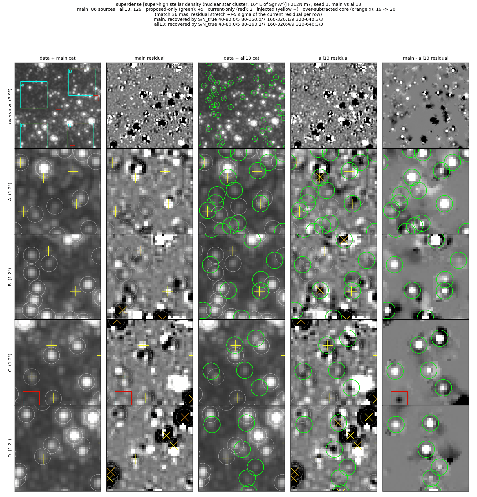
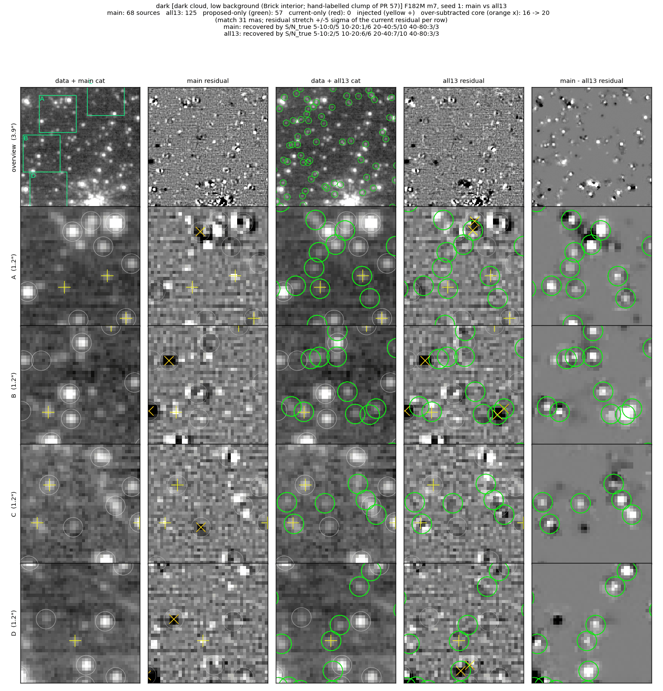

# Faint-star reference fields

Four 5″ cutouts, one per crowding/background environment, run through the
full manual chain (m12 → m7) once clean (seed 0) and twice with 24 frozen
artificial stars injected (seeds 1, 2).  `evaluate.py` scores each field and
`fields.yaml` holds the field's pass thresholds.  The thresholds belong to the
field: any change to detection or vetting defaults has to pass all four.

| field | environment | data | bands |
|---|---|---|---|
| `superdense` | super-high stellar density: nuclear star cluster, 16″ E of Sgr A* | 1939 obs 001 | F212N (+F405N) |
| `dense_bright` | high stellar density on bright, structured background: Sgr B2 envelope | 5365 obs 001 | F187N (+F212N) |
| `bright_modest` | modest stellar density on bright, filamentary Pa-α emission: W51 | 6151 obs 001 | F187N (+F210M) |
| `dark` | dark cloud, low background: Brick interior (hand-labelled clump of PR 57) | 2221 obs 001 | F182M (+F212N) |

The first band is scored; the second is the run's cross-band partner (the m7
seed needs at least two bands) and the continuum companion for the purity
statistic.

## Running

```
# submit the 12 runs of one code version (one SLURM job each)
python -m jwst_gc_pipeline.photometry.reference_fields.run --variant <name> \
    --pipe-root <checkout> --submit
# score them against fields.yaml
python -m jwst_gc_pipeline.photometry.reference_fields.evaluate --variant <name> --json out.json
# comparison figures (data, catalogs, residuals; current vs proposed)
python -m jwst_gc_pipeline.photometry.reference_fields.figures \
    --variant <proposed> --base <current> --phase m7 --fields dark,dense_bright --seeds 0,1 --out figs/
```

A run takes 15–40 min on one node.  `jwst_gc_pipeline/photometry/tests/test_reference_fields.py` checks
the configuration, the frozen injection tables and the metric code on
synthetic images; it does not run the pipeline.

## Thresholds

Each field's `thresholds:` block in `fields.yaml` (phase m7, inner box):

| field | completeness floors (injected S/N bin: min fraction) | resid excess max /as² | over-subtracted max /as² | other |
|---|---|---|---|---|
| `superdense` | 80–160: 0.30, 160–320: 0.40, 320–640: 0.70 | 1.5 | 1.6 | \|bias\| ≤ 0.1 mag |
| `dense_bright` | 10–20: 0.15, 20–40: 0.30, 40–80: 0.45 | 1.2 | 2.2 | \|bias\| ≤ 0.1 mag |
| `bright_modest` | 40–80: 0.60 | 0.8 | 0.5 | ≤ 1 of 4 emission knots cataloged; \|bias\| ≤ 0.1 mag |
| `dark` | 5–10: 0.40, 10–20: 0.85, 20–40: 0.65, 40–80: 0.90 | 0.6 | 1.6 | ≥ 23 of the 33 labelled stars; \|bias\| ≤ 0.1 mag |

How they were set:

- Calibrated on the full proposed fix stack (the follow-up PRs combined,
  branch `pr/faint-integration`, run label `all13`) with roughly one star of
  margin per bin.  The fix stack passes every field; current `main` fails
  every field (table below).
- A bin carries no floor where no tested code version recovers stars there:
  superdense S/N 40–80 (1/11 in every variant; confusion sets the noise),
  Sgr B2 S/N 5–10 (at most 1/17), W51 below S/N 40 (at most 1/30).
- Two limits guard against fake sources.  `oversubtracted_max` bounds
  catalog sources whose residual core is over-subtracted, which is how fits to
  a bright star's PSF wings show up; `residual_excess` cannot see them because
  it scores the residual only away from catalog sources, so a wing fit lowers
  it.  `emission_labels_cataloged_max` bounds fits to the four hand-labelled
  W51 nebular knots; W51's `residual_excess_max` stays loose for the same
  reason (fitting a knot lowers the excess).
- `ring_ratio` and `emission_purity` are reported but carry no threshold.
  Ring companions number 0–1 per field (0.2–2.5 expected), too few to set a
  limit.  `emission_purity` is NaN in all four fields: the companion band
  separates injected stars from chance positions by less than the 0.2 the
  estimator needs (`r_real − r_off`), or the field has no faint sources.
- The W51 flux bias rests on about 13 matched stars (S/N_true ≥ 20).

`test_reference_field_passes` scores the run of `JWST_GC_REFFIELD_VARIANT`
(default `main`) against these thresholds and skips where that run's products
are absent (CI).  On a machine with the `main` runs it fails today; it is
meant to: the failures below are the faint-star problems the follow-up PRs fix.

## Current main vs the proposed fix stack

**superdense (NSC, F212N)** (phase m7)

| variant | S/N 40-80 | S/N 80-160 | S/N 160-320 | S/N 320-640 | resid excess /as² (+/−) | over-subtracted /as² (n) | labels | bias mag |
|---|---|---|---|---|---|---|---|---|
| main | 1/11 | 1/13 | 2/14 | 7/10 | 1.66 (27/3) | 1.11 (16) | — | -0.048 |
| all fixes | 1/11 | 5/13 | 7/14 | 8/10 | 1.39 (23/3) | 1.39 (20) | — | -0.042 |

**dense + bright bg (Sgr B2, F187N)** (phase m7)

| variant | S/N 5-10 | S/N 10-20 | S/N 20-40 | S/N 40-80 | resid excess /as² (+/−) | over-subtracted /as² (n) | labels | bias mag |
|---|---|---|---|---|---|---|---|---|
| main | 0/17 | 0/11 | 2/9 | 5/11 | 3.05 (44/0) | 1.18 (17) | — | -0.058 |
| all fixes | 1/17 | 3/11 | 4/9 | 6/11 | 0.90 (13/0) | 1.94 (28) | — | 0.004 |

**modest density + bright bg (W51, F187N)** (phase m7)

| variant | S/N 5-10 | S/N 10-20 | S/N 20-40 | S/N 40-80 | resid excess /as² (+/−) | over-subtracted /as² (n) | labels | emission knots cataloged | bias mag |
|---|---|---|---|---|---|---|---|---|---|
| main | 0/11 | 0/6 | 1/13 | 11/18 | 0.21 (4/1) | 0.07 (1) | — | 2/4 | 0.154 |
| all fixes | 0/11 | 0/6 | 1/13 | 12/18 | 0.48 (11/4) | 0.07 (1) | — | 1/4 | -0.004 |

**dark cloud (Brick, F182M)** (phase m7)

| variant | S/N 5-10 | S/N 10-20 | S/N 20-40 | S/N 40-80 | resid excess /as² (+/−) | over-subtracted /as² (n) | labels | bias mag |
|---|---|---|---|---|---|---|---|---|
| main | 0/10 | 3/11 | 9/15 | 10/12 | 1.39 (22/2) | 1.18 (17) | 0.45 | 0.045 |
| all fixes | 5/10 | 11/11 | 11/15 | 12/12 | 0.35 (7/2) | 1.39 (20) | 0.73 | 0.045 |

Pass/fail against the thresholds (each fix alone, then combined; `m7seed` is
the m7 seed union every other fix builds on):

| code | `superdense` | `dense_bright` | `bright_modest` | `dark` |
|---|---|---|---|---|
| main | **fail**: S/N 80-160 1/13, S/N 160-320 2/14, excess 1.66 | **fail**: S/N 10-20 0/11, S/N 20-40 2/9, excess 3.05 | **fail**: bias 0.154, knots 2 | **fail**: S/N 5-10 0/10, S/N 10-20 3/11, S/N 20-40 9/15, S/N 40-80 10/12, excess 1.39, labels 0.455 |
| fix 4 m7 seed union | **fail**: S/N 160-320 5/14 | **fail**: S/N 10-20 0/11, S/N 20-40 2/9, excess 1.8 | **fail**: bias 0.138, knots 2 | **fail**: S/N 5-10 0/10, S/N 10-20 4/11, S/N 20-40 9/15, excess 1.18, labels 0.545 |
| fix 4 + 7 S/N floor on flux_err_prop | **fail**: S/N 160-320 5/14 | **fail**: S/N 10-20 1/11, S/N 20-40 2/9, excess 1.39 | **fail**: bias 0.138, knots 2 | **fail**: S/N 5-10 1/10, S/N 10-20 8/11, S/N 20-40 9/15, excess 0.831, labels 0.667 |
| fix 4 + 1 qfit noise term | **fail**: S/N 160-320 5/14 | **fail**: S/N 10-20 0/11, S/N 20-40 2/9, excess 1.66 | **fail**: bias 0.138, knots 2 | **fail**: S/N 5-10 0/10, S/N 10-20 6/11, excess 0.9, labels 0.545 |
| fix 4 + 2 prominence keep + guard | pass | **fail**: S/N 10-20 0/11, excess 1.59 | **fail**: S/N 40-80 9/18 | **fail**: S/N 5-10 0/10, S/N 10-20 6/11, excess 0.831, labels 0.545 |
| fix 4 + 3 local sky-clean | **fail**: S/N 160-320 5/14 | **fail**: S/N 10-20 0/11, excess 1.59 | **fail**: bias 0.138, knots 2 | **fail**: S/N 5-10 0/10, S/N 10-20 4/11, S/N 40-80 10/12, excess 0.97, labels 0.545 |
| fix 4 + 5 seed roundness | pass | **fail**: S/N 10-20 0/11, S/N 20-40 2/9, excess 2.08 | **fail**: bias 0.138, knots 2 | **fail**: S/N 5-10 0/10, S/N 10-20 6/11, S/N 20-40 9/15, excess 1.18, labels 0.545 |
| fix 4 + 7 + 8 bright-fit floor exemption | — | — | **fail**: knots 2 | — |
| all fixes (integration) | pass | pass | pass | pass |

### Figures (main vs fix stack)

"main" is `origin/main` (c1339e87); "all fixes" is the integration branch
(run label `all13`; on W51 `all12`, identical code there because the
concentration guard acts only on the robust-prominence branch, which is off on
extended-emission targets).

#### Super-high density (NSC, F212N), injection seed 1


45 added, 2 dropped; this seed's injected stars at S/N 80–160 go 0/7 → 2/7
and 160–320 1/9 → 4/9; over-subtracted cores 19 → 20.  Rows A–D: faint stars
between the bright ones are fitted and leave the residual (white blobs in the
difference column).

#### High density on bright background (Sgr B2, F187N), clean run


89 added, 2 dropped; residual excess 3.05 → 0.90 per arcsec², over-subtracted
17 → 28.  Rows B and D: faint stars in the gaps are fitted.  Row A: the bright
star main leaves out is fitted, with an over-subtracted core, and fits sit on
its wing.  Row C: fits along a bright star's wing, some over-subtracted.
These PSF-mismatch cases are what `oversubtracted_max` bounds.

#### Modest density on bright emission (W51, F187N), injection seed 1


3 added, 1 dropped; this seed's S/N 40–80 bin goes 5/9 → 6/9.  Row B: an
injected star on a filament is fitted.  Row C: an injected star beside a
labelled knot (magenta ×) is fitted; the knot is not cataloged.  Row A: an
injected star main had fitted (red box; over-subtracted in the main residual)
drops out, and a faint source (green, lower left) is added.

#### Dark cloud (Brick, F182M), injection seed 1


57 added, 0 dropped; this seed's injected stars at S/N 5–10 go 0/5 → 2/5,
10–20 1/6 → 6/6, 20–40 5/10 → 7/10.  Rows A, B and D: injected stars (yellow
+) left in the main residual are fitted.  Rows A–C: faint stars around the
clump leave the residual.  Over-subtracted cores 16 → 20 (row B: two adjacent
fits).

#### Dark cloud, clean run


52 added, 0 dropped; residual excess 1.39 → 0.35, hand-labelled stars
cataloged 15/33 → 24/33, over-subtracted 17 → 20 (row D: three fits on a
blended group).

## How to read the comparison figures

Each figure is one reference field (`jwst_gc_pipeline/photometry/reference_fields/fields.yaml`)
at phase m7, produced by `python -m jwst_gc_pipeline.photometry.reference_fields.figures`.

- Columns: data + current catalog | current residual | data + proposed catalog |
  proposed residual | current − proposed residual.
- Residual = residual i2d − smoothed-background i2d (what the next phase would
  see), stretched to ±5σ of the current residual in every row.
- Row 1 is the 3.9″ inner box; rows A–D are 1.2″ zooms centred on catalog
  differences (cyan boxes in the overview).
- White circles: sources in both catalogs.  Green circles: proposed-only.
  Red boxes: current-only.  Yellow +: injected star (seeds 1 and 2; seed 0 is
  the clean run).  Orange ×: catalog source with an over-subtracted core
  (3×3 matched-filter minimum < −7σ).  Magenta ×: hand-labelled W51 emission
  knot.
- Title lines give source counts and, for injection seeds, recovered/injected
  per injected-S/N bin for that seed.

## Metrics in the tables

All at phase m7 inside the inner box.  Completeness = one-to-one recovered /
injected stars per injected-S/N bin, summed over seeds 1 and 2 (24 injected
stars per seed).  The clean-run (seed 0) metrics: "resid excess" = positive
minus negative unsubtracted matched-filter peaks (|S/N| > 7, away from catalog
sources) per arcsec², with the positive/negative counts in brackets;
"over-subtracted" = catalog sources with an over-subtracted core per arcsec²
(count in brackets); "labels" = fraction of the hand-labelled Brick clump stars
cataloged; "emission knots cataloged" = hand-labelled W51 knots with a catalog
source within 0.1″; "bias" = median recovered − injected magnitude.
