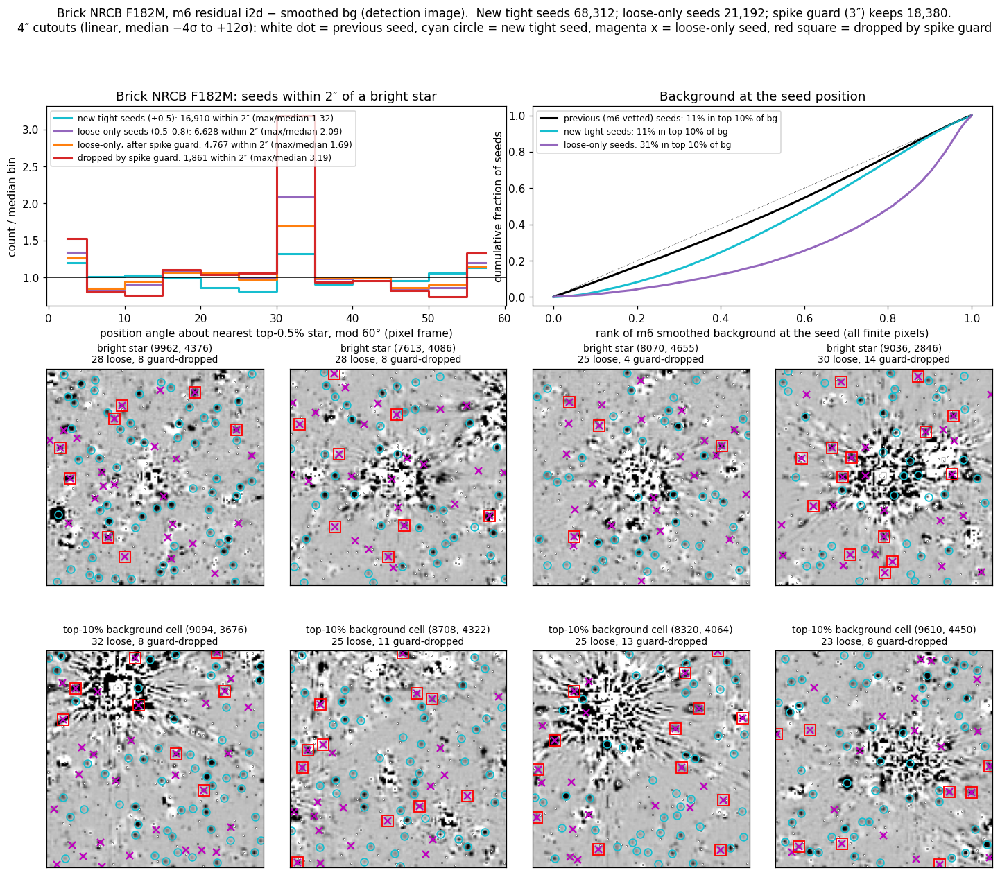
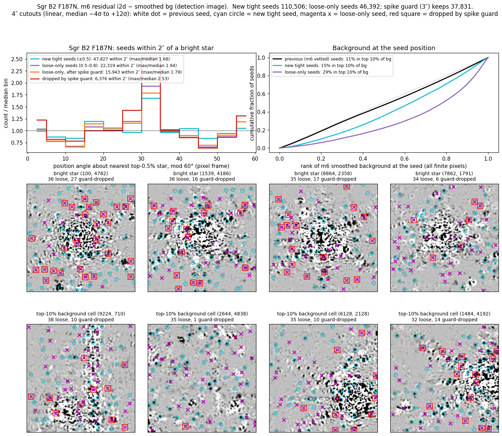
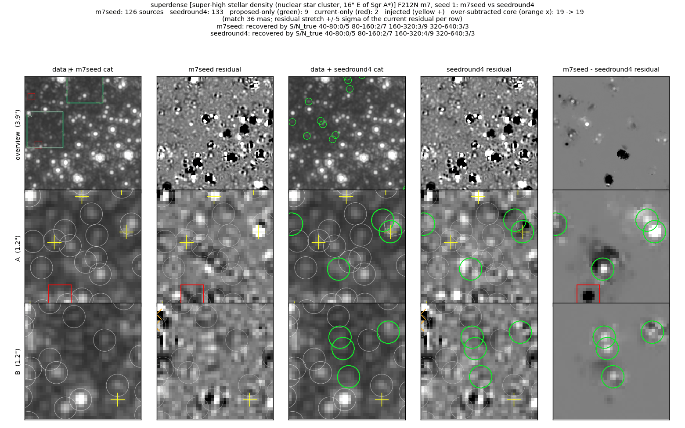
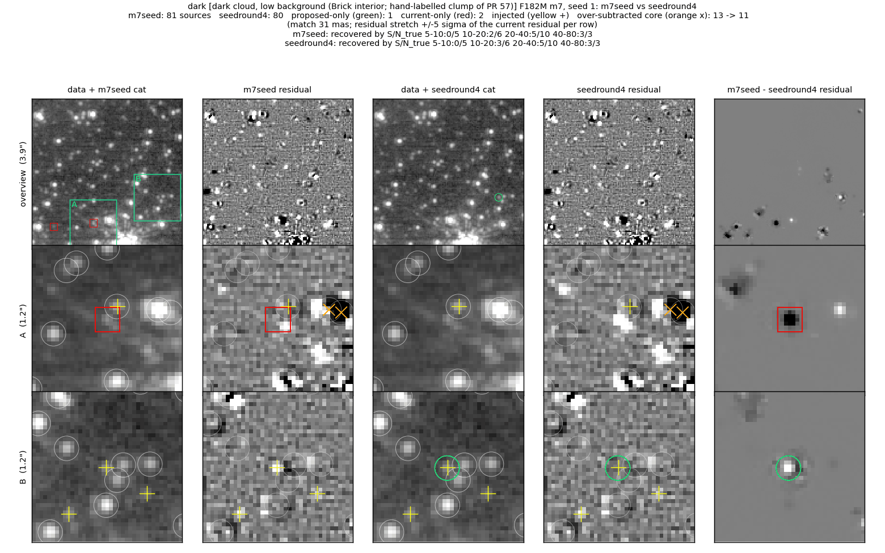
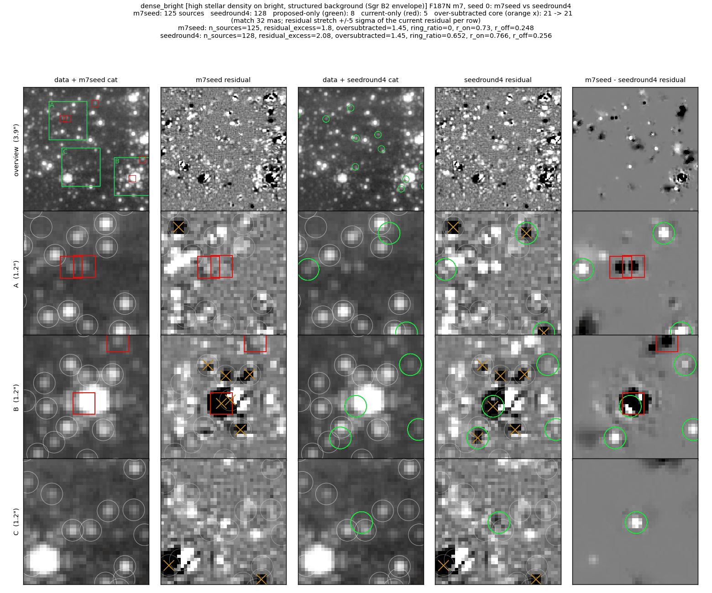

# i2d residual seed: opt-in roundness to ±0.8 above local structure

The coadd i2d-seed daofind keeps `|roundness| ≤ 0.5`.  On the Brick F182M m7
residual 55% of the S/N > 7 residual peaks pass that cut and 78% pass ±0.8.
Those counts include spurious peaks; they show that the cut is active on the
residual, and they do not measure how many real stars it loses.  A faint star
distorted by noise or by a neighbour's subtracted wing can fail the tight cut
and never enter the seed.

This branch adds an **opt-in** loose window (`--manual-seed-round-loose-max`,
default 0 = off; 0.8 tested): detections with roundness in (0.5, 0.8] enter
the seed when their annulus prominence on the detection image is ≥
`--manual-seed-round-loose-prom-min` (5).  The i2dseed catalog gains a
`seed_round_loose` column (True for the loose-only detections) so their fate
can be followed through the fit and vetting.

The window is off by default because the full-frame measurement below shows
that the loose-only seeds concentrate on bright background and on
diffraction-spike position angles, and a spike guard built for it was not
selective.  The prominence test does not reject emission knots or spike knots:
a thin linear feature covers a small part of the 4–10 px annulus, so the
annulus median and MAD stay low and the knot reads as prominent.

No realness or survival measurement exists for the loose-only seeds: the
evidence below counts seeds and locates them, and no run has followed them
through the m7 fit and vetting or matched them against an independent
catalog.  A field that opts in needs that measurement first.

Figure layout and metric definitions of the reference fields:
[../faint_reference_fields/README.md](../faint_reference_fields/README.md).

## Full-frame seed measurement (m6 → m7 seed step)

`scripts/seedspike.py` runs `_build_i2d_augmented_seed` on the production m6
residual i2d minus the m6 smoothed background, with the m6 vetted catalog as
the previous seed, as the m7 seed step does.  Fields: Brick NRCB F182M and
Sgr B2 F187N (merged).  Three runs per field: (A) tight cut only, (B) loose
0.8, (C) loose 0.8 plus the spike guard tested below.  These are seed counts;
the m7 fit and vetting run afterwards and were not run here.

| | Brick F182M | Sgr B2 F187N |
|---|---|---|
| seed, tight only (A) | 271,625 | 519,097 |
| new tight i2d seeds | 68,312 | 110,506 |
| seed, loose 0.8 (B) | 292,817 | 565,489 |
| loose-only seeds | 21,192 (+7.8%) | 46,392 (+8.9%) |

**Background.**  Rank of the m6 smoothed background at the seed position,
over all finite pixels of the mosaic:

| seeds | Brick: in top 10% of bg | Sgr B2: in top 10% of bg |
|---|---|---|
| previous (m6 vetted) | 11% | 11% |
| new tight | 11% | 15% |
| loose-only | 31% | 29% |

The loose-only seeds sit on the brightest tenth of the background about three
times as often as the previous seeds.  In the Brick the brightest-background
cells are the halos of saturated stars (bottom row of the figure); in Sgr B2
they also include filaments and a linear artefact.

**Diffraction spikes.**  Position angle, modulo 60°, of each seed within 2″ of
its nearest top-0.5% star (by flux), in 12 bins of 5°:

| seeds | Brick: within 2″ | Brick: peak bin / median bin | Sgr B2: within 2″ | Sgr B2: peak bin / median bin |
|---|---|---|---|---|
| new tight | 16,910 | 1.32 | 47,827 | 1.68 |
| loose-only | 6,628 | 2.09 | 22,319 | 1.94 |

The peak is the 30–35° bin in both fields.  Counting the excess over the
median bin in the 30–35° bin and in the two bins either side of 0°/60°, about
800 of the 6,628 Brick loose-only seeds near bright stars sit on spike angles
(12%; 4% of all loose-only seeds).

**Spike guard (built, measured, removed).**  Commit 6761eea4 added a guard
that dropped a loose seed whose second-moment axis (ellipticity ≥ 0.1, 7×7 px
box) lies within 15° of the line to a bright star 2 px to 3″ away: the shape
of a spike knot, stretched radially from its star.  It flags loose seeds at
about the rate it flags tight seeds, to which it was never applied:

| | Brick | Sgr B2 |
|---|---|---|
| tight new seeds within 3″ of a bright star that the guard would flag | 7,020 / 32,895 (21.3%) | 17,979 / 76,047 (23.6%) |
| loose-only seeds within 3″ dropped by the guard | 2,812 / 11,376 (24.7%) | 8,561 / 33,355 (25.7%) |
| peak bin / median bin, loose-only after the guard | 1.69 | 1.79 |

On the Brick the guard removes about half of the spike-bin excess (≈ 290 of
≈ 550 seeds) and about 2,400 seeds off the spike angles.  The guard and its
AUTO default are removed in this branch; 6761eea4 stays in the history
because the measurement ran from it.

### Brick NRCB F182M

Top: position-angle histograms (left) and background-rank CDFs (right).
Row 2: 4″ cutouts around the four bright stars with the most loose seeds
within 2″.  The new tight seeds (cyan) mostly sit on compact positive peaks
(dark at this stretch); the loose-only seeds (magenta) are spread through
the residual halo, many on faint smudges with no compact peak.  Row 3: the
four brightest-background cells with the most loose seeds are all
saturated-star halos; loose seeds follow the halo's radial streaks (first
and third panels).  Guard drops (red squares) occur at all angles around the
star.

### Sgr B2 F187N

Row 2: as in the Brick, loose seeds fill the residual halos of bright stars,
and the guard drops seeds at all angles (first panel: 27 of 36).  Row 3:
loose seeds, and some new tight seeds, line a vertical linear feature (first
panel) and a diagonal streak (fourth panel); in the second panel they sit on
mottled extended emission.

## Reference fields (opt-in runs, m7)

These runs are from the first version of this branch, in which the loose
window was on by default on star fields (`seedround4`, loose 0.8).  With the
default now off, the default code path is identical to the base branch on all
four fields.  Comparison: `m7seed` (the base branch) → `seedround4`.

### Super-high density (NSC, F212N), injection seed 1

9 added, 2 dropped; the seed's injected S/N 160–320 bin goes 3/9 → 4/9.
Row A: an injected star and two faint neighbours enter the seed.  Row B:
three faint stars in a gap between bright ones.

### Dark cloud (Brick, F182M), injection seed 1

1 added, 2 dropped; S/N 10–20 bin 2/6 → 3/6; over-subtracted 13 → 11.
Row B: an injected star blended with a neighbour (distorted shape) enters the
seed and is fitted.  Row A: the dropped source left a negative core in the
base branch's residual.

### High density on bright background (Sgr B2, F187N), clean run

8 added, 5 dropped; residual excess 1.80 → 2.08 per arcsec², over-subtracted
unchanged (21).  Row A: two base-branch sources on an elongated residual bar
are gone.  Row B: the bright star is refitted at a different position and its
core stays over-subtracted (PSF mismatch).  Row C: a faint star added.

## Metrics (m7, opt-in runs)

**superdense (NSC, F212N)** (phase m7)

| variant | S/N 40-80 | S/N 80-160 | S/N 160-320 | S/N 320-640 | resid excess /as² (+/−) | over-subtracted /as² (n) | labels | bias mag |
|---|---|---|---|---|---|---|---|---|
| m7seed | 1/11 | 5/13 | 5/14 | 8/10 | 1.32 (22/3) | 1.32 (19) | — | 0.018 |
| seedround4 | 1/11 | 5/13 | 7/14 | 8/10 | 1.39 (23/3) | 1.32 (19) | — | -0.048 |

**dense + bright bg (Sgr B2, F187N)** (phase m7)

| variant | S/N 5-10 | S/N 10-20 | S/N 20-40 | S/N 40-80 | resid excess /as² (+/−) | over-subtracted /as² (n) | labels | bias mag |
|---|---|---|---|---|---|---|---|---|
| m7seed | 0/17 | 0/11 | 2/9 | 5/11 | 1.80 (26/0) | 1.45 (21) | — | 0.001 |
| seedround4 | 0/17 | 0/11 | 2/9 | 6/11 | 2.08 (30/0) | 1.45 (21) | — | -0.004 |

**modest density + bright bg (W51, F187N)** (phase m7)

| variant | S/N 5-10 | S/N 10-20 | S/N 20-40 | S/N 40-80 | resid excess /as² (+/−) | over-subtracted /as² (n) | labels | emission knots cataloged | bias mag |
|---|---|---|---|---|---|---|---|---|---|
| m7seed | 0/11 | 0/6 | 0/13 | 11/18 | 0.55 (10/2) | 0.07 (1) | — | 2/4 | 0.138 |
| seedround4 | 0/11 | 0/6 | 1/13 | 11/18 | 1.11 (19/3) | 0.07 (1) | — | 2/4 | 0.154 |

**dark cloud (Brick, F182M)** (phase m7)

| variant | S/N 5-10 | S/N 10-20 | S/N 20-40 | S/N 40-80 | resid excess /as² (+/−) | over-subtracted /as² (n) | labels | bias mag |
|---|---|---|---|---|---|---|---|---|
| m7seed | 0/10 | 4/11 | 9/15 | 11/12 | 1.18 (19/2) | 1.11 (16) | 0.55 | 0.050 |
| seedround4 | 0/10 | 6/11 | 9/15 | 11/12 | 1.18 (19/2) | 1.04 (15) | 0.55 | 0.050 |

On W51 the loose window admits 60–70 detections per phase at m5–m7, of which
25–29 pass prominence ≥ 5, and the residual excess doubles (0.55 → 1.11) for
+1/48 injected stars.  The completeness changes on the other fields are one
or two injected stars per bin, within the binomial noise of these runs.

## Scripts

- `scripts/seedspike.py`, `scripts/seedspike.sbatch`: the full-frame seed
  runs and the position-angle, background and guard statistics.  They call
  the guard keyword `round_loose_spike_radius_as`, which exists only at
  6761eea4; the runs used a worktree at that commit (`WT=<worktree>
  sbatch seedspike.sbatch` from `scripts/`).
- `scripts/spikefig.py`, `scripts/spikefig.sbatch`: the two full-frame
  figures, from the `seedspike.py` outputs.
- `scripts/seedspike_brick_f182m_nrcb.json`,
  `scripts/seedspike_sgrb2_f187n_merged.json`: the `seedspike.py` summaries
  behind the tables above (seed counts, position-angle histograms, the guard's
  flag rates on tight and loose seeds, background ranks).

## Caveats

- Seed counts only: how many loose-only seeds survive the m7 fit and vetting
  at full frame, and how many of them are real, was not measured.  The
  `seed_round_loose` column makes both measurable on any opt-in run.
- The prominence test passes emission knots, filament points and spike knots.
  A field that turns the window on needs its own check of where the loose
  seeds land (the two figures above are the template).
- With the window off, `seed_round_loose` is False for every row.
