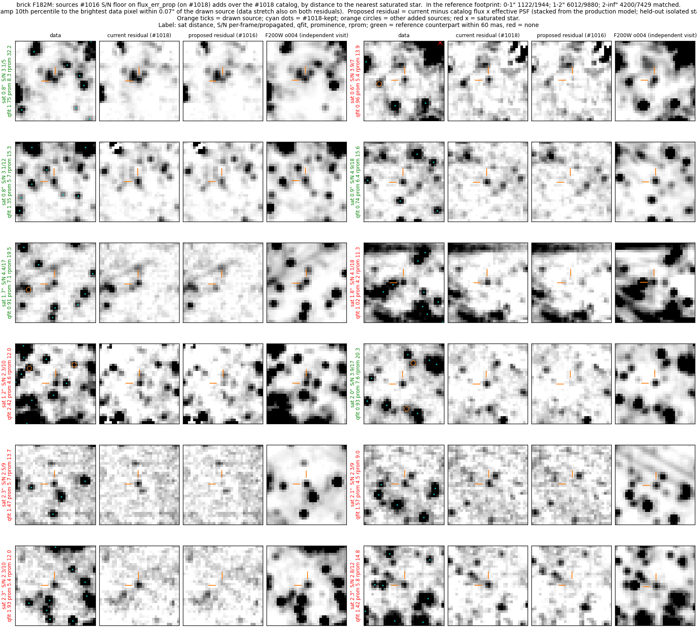
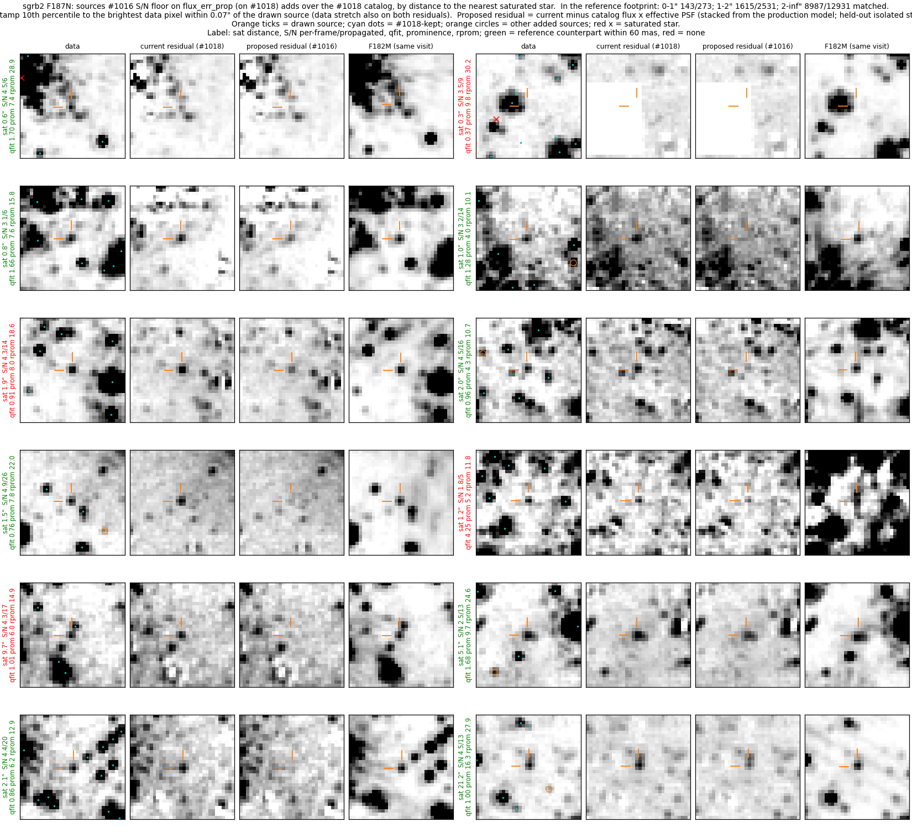

# Vetting S/N floors on the merged-flux uncertainty (`flux_err_prop`)

A merged catalog's `flux` is the mean over `nmatch` per-frame fits, but its
`flux_err` is the weighted mean of the per-frame errors (one frame's
uncertainty).  The vetting floor `local_snr_min = 5` on `flux/flux_err`
therefore acts as ~5√nmatch on the merged flux (Brick
`f182m_merged_o001_indivexp_merged_resbgsub_m6_dao_basic.fits`: median
`flux_err/flux_err_prop` 3.16, equal to the median √nmatch_good; 66,913 of
506,114 sources below the per-frame floor and above it on `flux_err_prop`).
This branch applies the local S/N floor to `flux/flux_err_prop`.

This branch is based on the prominence-keep branch (#1018).  The
reference-field runs and the first full-field replay below ran before that
rebase and compare against the seed-union base (#1015); the section
"Combined with the prominence guard (#1018 v2)" restates the full-field
numbers on #1018 v2.

Figure layout and metric definitions:
[../faint_reference_fields/README.md](../faint_reference_fields/README.md).
Comparison: `m7seed` (the #1015 base) → `snrprop` (this floor on #1015).

### Dark cloud (Brick, F182M), injection seed 1

9 added, 0 dropped; the seed's injected S/N 10–20 bin goes from 2/6 to 4/6.
Row A, right: an injected star (yellow +) that the per-frame floor rejects is
fitted and leaves the residual.  Row A, left: one added source next to a
brighter star has an over-subtracted core (13 → 14 in this seed).

### Dark cloud (Brick, F182M), clean run

12 added, 0 dropped; residual excess 1.18 → 0.83 per arcsec², over-subtracted
cores 16 → 14, hand-labelled clump stars 0.55 → 0.67.  Row B: isolated faint
stars on the dark cloud.

### High density on bright background (Sgr B2, F187N), clean run

17 added, 2 dropped; residual excess 1.80 → 1.39, over-subtracted 21 → 20.
Rows A–C: faint stars between brighter ones.

## Full-field replay (Brick, Sgr B2)

The m6 vetting of this floor (on #1015, b829c571) and of the #1015 base was
replayed on the production m6 merged catalogs (`scripts/vet_variant.py`,
which executes each worktree's own vetting call with pipeline defaults).

**Keep path.**  The local S/N floor moves to `flux_err_prop`; the sky-clean
floor stays on the per-frame S/N (see "Sky-clean floor" below).

| field, band | base kept | this branch | added | via local floor | of which qfit > 0.2 | lost |
|---|---|---|---|---|---|---|
| Brick F182M | 377,837 | 408,951 | 31,114 | 31,114 (31,062 peakSB, 52 flags) | 31,090 | 0 |
| Brick F212N | 117,039 | 149,763 | 32,724 | 32,724 (32,595 peakSB, 129 flags) | — | 0 |
| Brick F405N | 92,291 | 102,959 | 10,668 | 10,668 (10,632 peakSB, 36 flags) | — | 0 |

The added F182M sources have median per-frame S/N 3.6, median S/N on
`flux_err_prop` 12.1, median `nmatch` 16 and median prominence 4.8.

**Realness.**  Added sources are matched against an independent catalog
within 60 mas.  The chance rate comes from the same positions shifted by
~2″.  The expectation is the match rate of base-kept sources of the same
flux, in the same bin of distance to the nearest saturated star:
rel = (match − chance) / (expected − chance); 1 means as real as the
current catalog at that flux, 0 means chance.

| field (reference) | sat. distance | added | match | chance | expected | rel |
|---|---|---|---|---|---|---|
| Brick F182M (F200W 1182/o004 m7, independent visit) | 0–1″ | 5,239 | 0.37 | 0.07 | 0.28 | 1.44 |
| | 1–2″ | 15,145 | 0.51 | 0.07 | 0.34 | 1.62 |
| | > 2″ | 11,028 | 0.49 | 0.07 | 0.49 | 0.99 |
| Sgr B2 F187N (F182M m6, same visit) | 0–1″ | 1,340 | 0.26 | 0.10 | 0.25 | 1.18 |
| | 1–2″ | 5,550 | 0.46 | 0.10 | 0.35 | 1.45 |
| | > 2″ | 25,365 | 0.54 | 0.09 | 0.63 | 0.83 |

(This replay predates the sky-clean correction below and includes its 298
Brick F182M sky-clean additions; they change these rates by < 0.01.)
Within 2″ of a saturated star the base catalog itself is confirmed less
often than far from one, so rel > 1 there reflects a lower expectation; the
added sources' match rate (0.37–0.54) is close to the far-field base rate.
The Sgr B2 reference is another filter of the same visit, so PSF artifacts
of bright stars can match in both; it overstates realness.

**Realness by keep path and prominence.**  The same replay, with the
expectation taken over all saturated-star distances (`scripts/slices.py`).
Keep path is the first of qfit ≤ 0.2, flags = 1, peakSB > 20 × local_bkg,
other (the prominence keep or the sky-clean tier) that applies.  The merged `flags` column is the mean over
frames, and the vetting keeps flags = 1 only for a mean of exactly 1.

| slice | Brick n | Brick rel | Sgr B2 n | Sgr B2 rel |
|---|---|---|---|---|
| all added | 31,412 | 1.02 | 32,255 | 0.81 |
| via flags = 1 | 52 | 0.14 | 110 | 0.15 |
| via peakSB | 31,146 | 1.02 | 31,871 | 0.81 |
| via other (prominence keep, sky-clean) | 214 | 1.21 | 274 | 1.06 |
| peakSB, prominence < 4 | 10,590 | 0.51 | 16,971 | 0.54 |
| peakSB, prominence ≥ 4 | 20,556 | 1.27 | 14,900 | 1.09 |
| prominence 0–2 | 1,767 | 0.20 | 3,404 | 0.17 |
| prominence 2–3 | 3,564 | 0.37 | 6,021 | 0.44 |
| prominence 3–4 | 5,296 | 0.70 | 7,575 | 0.77 |
| prominence 4–5 | 5,884 | 0.94 | 6,916 | 1.00 |
| prominence 5–7 | 8,409 | 1.29 | 5,310 | 1.17 |
| prominence 7–10 | 4,679 | 1.47 | 2,114 | 1.19 |
| prominence ≥ 10 | 1,805 | 1.63 | 857 | 1.04 |
| qfit 0.2–0.4 | 230 | −0.11 | 363 | 0.17 |
| qfit 0.4–0.6 | 288 | −0.05 | 395 | 0.29 |
| qfit 0.6–1 | 12,394 | 1.12 | 8,950 | 0.94 |
| qfit ≥ 1 | 18,476 | 0.98 | 22,522 | 0.76 |

Nearly every addition enters through the peakSB test.  Their realness falls
with prominence: below prominence 3 the additions are confirmed at 0.2–0.4
of the rate of base-kept stars of the same flux.  The prominence guard of
#1018 v2 (guard 4 on the peakSB branch) removes the prominence < 4 peakSB
additions; the section below measures what remains.

Random added sources in Brick F182M, four per bin of distance to the
nearest saturated star (2″ stamps).  Per source: F182M data with the current
catalog (cyan dots), other added sources (orange circles) and saturated
stars (red ×); the production m7 residual (the current final residual); the
production m6 residual, in which every m6 fit, the added source included, is
subtracted; the F200W image of the independent visit.  Green labels have an
F200W counterpart within 60 mas: 6 of the 12 drawn here, and 0.48 of all
28,962 added sources in the F200W footprint (chance 0.07).  Row 2 left: a
faint star left in the current m7 residual and removed by the m6 fit.  The
red-labelled sources include one beside a bright star (row 2 right), one on
a diffraction spike (row 5 right) and faint isolated peaks (rows 4 and 6,
right).  `scripts/` holds the replay (`vet_variant.py`), the comparison
(`compare.py`), the realness slices (`slices.py`) and this gallery
(`added_gallery.py`).

The same for Sgr B2 F187N, with the same-visit F182M image as reference.

## Combined with the prominence guard (#1018 v2)

#1018 v2 keeps a peakSB source only when its prominence is ≥ 4 and keeps any
source with prominence ≥ 7.  The full-field replay was repeated at this
branch's tip (76f8abbf, `scripts/replay_snrp2.sbatch`): `snrp2` runs the
pipeline defaults, and `snrp2pf` runs the same code with
`--manual-ext-snr-floor-per-frame`, which puts the floors back on the
per-frame S/N.  `snrp2pf` keeps the same rows as the #1018 v2 replay on all
three fields, so the additions below come from the floor change alone.

| field, band | #1015 base kept | #1018 v2 kept | this branch kept | added over #1018 v2 | lost |
|---|---|---|---|---|---|
| Brick F182M | 377,837 | 366,605 | 387,581 | 20,976 | 0 |
| Sgr B2 F187N | 408,591 | 395,473 | 411,208 | 15,735 | 0 |
| W51 F187N | 20,041 | 20,720 | 21,308 | 588 | 0 |

Realness of the additions over #1018 v2 (`scripts/slices.py
<field> snrp2@prom2`; expectation from #1015 base-kept sources of the same
flux).  The W51 reference is F182M of the same visit.

| slice | Brick n | Brick rel | Sgr B2 n | Sgr B2 rel | W51 n | W51 rel |
|---|---|---|---|---|---|---|
| all added | 20,976 | 1.27 | 15,735 | 1.08 | 588 | 0.73 |
| via flags = 1 | 52 | 0.14 | 107 | 0.16 | 41 | 0.35 |
| via peakSB (prominence ≥ 4) | 20,472 | 1.27 | 14,806 | 1.09 | 435 | 0.72 |
| via other (prominence ≥ 7 keep, sky-clean) | 452 | 1.58 | 822 | 0.98 | 112 | 0.90 |
| prominence 4–5 | 5,884 | 0.94 | 6,916 | 1.00 | 135 | 0.54 |
| prominence 5–7 | 8,165 | 1.29 | 5,060 | 1.16 | 163 | 0.70 |
| prominence 7–10 | 4,974 | 1.48 | 2,616 | 1.16 | 201 | 0.89 |
| prominence ≥ 10 | 1,908 | 1.64 | 1,056 | 1.06 | 77 | 0.69 |
| S/N on `flux_err_prop` 5–7 | 1,925 | 1.38 | 1,579 | 0.71 | 201 | 0.61 |
| S/N on `flux_err_prop` 7–10 | 3,670 | 1.31 | 1,681 | 1.00 | 189 | 0.64 |
| S/N on `flux_err_prop` 10–17 | 11,152 | 1.24 | 7,413 | 1.16 | 198 | 0.92 |
| S/N on `flux_err_prop` ≥ 17 | 4,229 | 1.29 | 5,062 | 1.10 | 0 | — |

Three small subsets sit near chance (`scripts/subsets.py`):

| subset of the additions | Brick n | Brick rel | Sgr B2 n | Sgr B2 rel | W51 n | W51 rel |
|---|---|---|---|---|---|---|
| prominence < 4 (not via peakSB) | 45 | −0.03 | 87 | 0.05 | 12 | 0.78 |
| qfit 0.2–0.6 | 304 | −0.01 | 359 | 0.32 | 9 | 0.75 |
| via flags = 1 | 52 | 0.14 | 107 | 0.16 | 41 | 0.35 |
| union of the three | 329 | 0.02 | 403 | 0.31 | 44 | 0.37 |
| the rest | 20,647 | 1.30 | 15,332 | 1.10 | 544 | 0.76 |

The qfit 0.2–0.6 additions have qfit × S/N ≈ 1.6 (median), below the
≈ 3.7 that noise alone gives a faint PSF fit, so their per-frame `flux_err`
is large compared with their fit residual.  The union is 1.6% of the Brick
additions and 2.6% of the Sgr B2 additions.  This branch does not add a rule
for them; a cut such as qfit × S/N ≥ 3 would need its own reference-field
runs.  Issue #1025 tracks this follow-up.

On W51 the additions are confirmed less often than base-kept stars of the
same flux at every prominence and S/N (rel 0.54–0.92).  They are 588
sources, 2.8% of the W51 catalog, on extended emission where the
same-visit F182M reference also responds to emission structure, so their
real purity may be below 0.73 (at 0.73, about 160 of the 588 are spurious).
A W51 run that needs the lower false-positive rate can pass
`--manual-ext-snr-floor-per-frame`, which reproduces the #1018 v2 catalog
row for row (the `snrp2pf` control above).

Random sources this branch adds over #1018 v2 in Brick F182M, four per bin
of distance to the nearest saturated star (2″ stamps).  Per source: F182M
data with the #1018 v2 catalog (cyan dots); the m6 residual with only the
#1018 v2 sources subtracted (current); the same with the added sources also
subtracted, each as catalog flux × the effective PSF (proposed); the F200W
image of the independent visit.  Green labels have an F200W counterpart
within 60 mas: 6 of the 12 drawn here.  In ten stamps the compact peak at
the tick is removed in the proposed residual; in the left column, rows 1
and 2, a fainter peak remains.  Several red-labelled sources (left column,
rows 5 and 6; right column, rows 1, 5 and 6) have an F200W peak a few
pixels from the tick, outside the 60 mas match radius.  Right column, row 3
sits on the edge of emission that F200W also shows.

The same for Sgr B2 F187N with the same-visit F182M image as reference: 8
of the 12 drawn have a counterpart.  The compact peak at the tick is removed
in the left column, rows 2–6.  In the right column, rows 5 and 6, the
residual peak is broader than the PSF and is only partly removed.  Right
column, row 1 is 0.3″ from a saturated star, inside its masked core.  Left
column, rows 3 and 5, are red-labelled with a compact F182M source at the
tick: the reference is the vetted F182M catalog, and a star missing from it
counts as unmatched.

**Reproducing.**  From `scripts/`, with the #1015 base (`seed`) and #1018
v2 (`prom2`) replays already in `out/`
(`../../faint_prominence_keep/scripts/replay_prom2.sbatch` writes both; link
its `out/`): `WT=<worktree at this branch> sbatch replay_snrp2.sbatch`, then
`sbatch analyze_snrp2.sbatch`, which runs `slices.py`, `compare.py`,
`subsets.py` and `added_gallery.py`.  The proposed residual stamps come from
`propresid.py`.  `data/` holds the slices, the comparison tables and the
subset table behind this section.

**Sky-clean floor.**  The sky-clean tier keeps sources on clean sky
regardless of `qfit`, with S/N ≥ 3 as its only fit-quality cut.  Applying the
propagated S/N to that floor as well admitted 298 Brick F182M sources (678
F212N, 344 F405N) with median per-frame S/N 2.6, so this branch leaves
`sky_clean_snr_min` on `flux / flux_err`
(`test_sky_clean_floor_stays_per_frame`).

## Metrics (m7)

**superdense (NSC, F212N)** (phase m7)

| variant | S/N 40-80 | S/N 80-160 | S/N 160-320 | S/N 320-640 | resid excess /as² (+/−) | over-subtracted /as² (n) | labels | bias mag |
|---|---|---|---|---|---|---|---|---|
| m7seed | 1/11 | 5/13 | 5/14 | 8/10 | 1.32 (22/3) | 1.32 (19) | — | 0.018 |
| snrprop | 1/11 | 5/13 | 5/14 | 8/10 | 1.32 (22/3) | 1.32 (19) | — | 0.018 |

**dense + bright bg (Sgr B2, F187N)** (phase m7)

| variant | S/N 5-10 | S/N 10-20 | S/N 20-40 | S/N 40-80 | resid excess /as² (+/−) | over-subtracted /as² (n) | labels | bias mag |
|---|---|---|---|---|---|---|---|---|
| m7seed | 0/17 | 0/11 | 2/9 | 5/11 | 1.80 (26/0) | 1.45 (21) | — | 0.001 |
| snrprop | 0/17 | 1/11 | 2/9 | 5/11 | 1.39 (20/0) | 1.39 (20) | — | 0.001 |

**modest density + bright bg (W51, F187N)** (phase m7)

| variant | S/N 5-10 | S/N 10-20 | S/N 20-40 | S/N 40-80 | resid excess /as² (+/−) | over-subtracted /as² (n) | labels | emission knots cataloged | bias mag |
|---|---|---|---|---|---|---|---|---|---|
| m7seed | 0/11 | 0/6 | 0/13 | 11/18 | 0.55 (10/2) | 0.07 (1) | — | 2/4 | 0.138 |
| snrprop | 0/11 | 0/6 | 0/13 | 11/18 | 0.55 (10/2) | 0.07 (1) | — | 2/4 | 0.138 |

**dark cloud (Brick, F182M)** (phase m7)

| variant | S/N 5-10 | S/N 10-20 | S/N 20-40 | S/N 40-80 | resid excess /as² (+/−) | over-subtracted /as² (n) | labels | bias mag |
|---|---|---|---|---|---|---|---|---|
| m7seed | 0/10 | 4/11 | 9/15 | 11/12 | 1.18 (19/2) | 1.11 (16) | 0.55 | 0.050 |
| snrprop | 1/10 | 8/11 | 9/15 | 11/12 | 0.83 (14/2) | 0.97 (14) | 0.67 | 0.050 |

## Caveats

- Superdense and W51 are unchanged at m7: in the NSC the injected stars are
  well above both floors, and in W51 the extended-emission prominence floor
  (see the prom-floor-bright branch) decides.
- Dark clean run, row A: three new sources on one compact residual blob next
  to a diagonal dust/emission edge.  It is fitted as a close group; it may be
  one extended source split three ways.
- Sgr B2 clean run, row D: two new sources on a diffuse residual patch;
  the F212N companion band does not settle whether they are stars.
- The bright-isolated keep (`snr_high_keep`) stays on the per-frame S/N
  (`test_bright_isolated_keep_stays_per_frame`), and so does the m7
  cross-band seed confirmation (`--manual-crossband-seed-snr-min`), which
  force-fits its positions in every band.
- `flux_err_prop` propagates the per-frame formal errors as independent.
  Terms common to every frame (the shared background model, the shared
  neighbour model, the shared seed position) do not average down; they are
  largest for faint stars on structured background, which is where this
  branch adds sources.  The realness table above measures the net effect.
