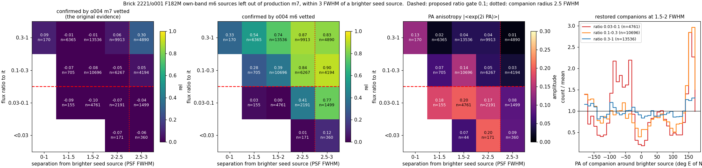
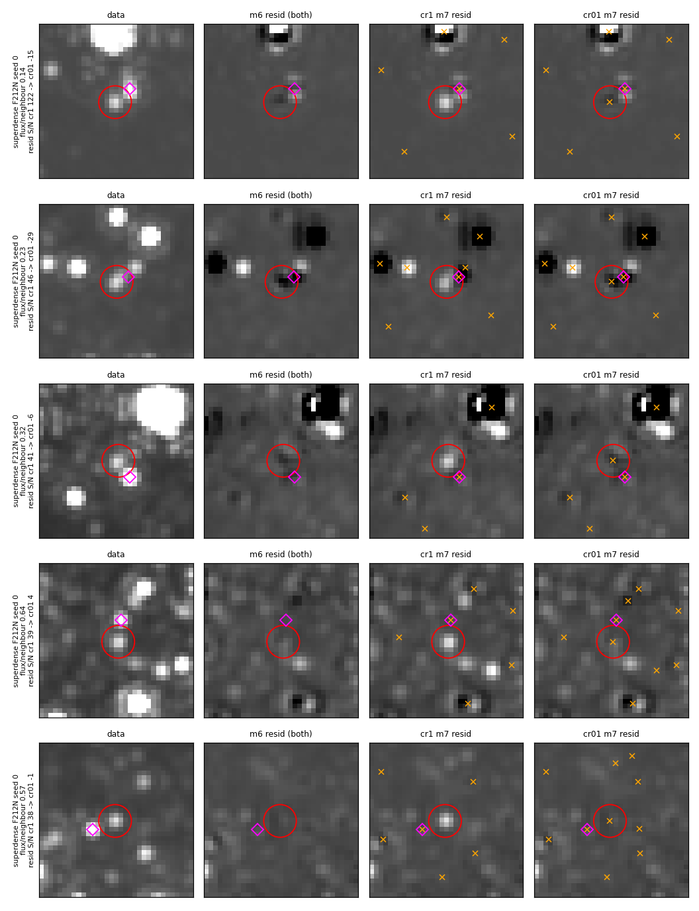
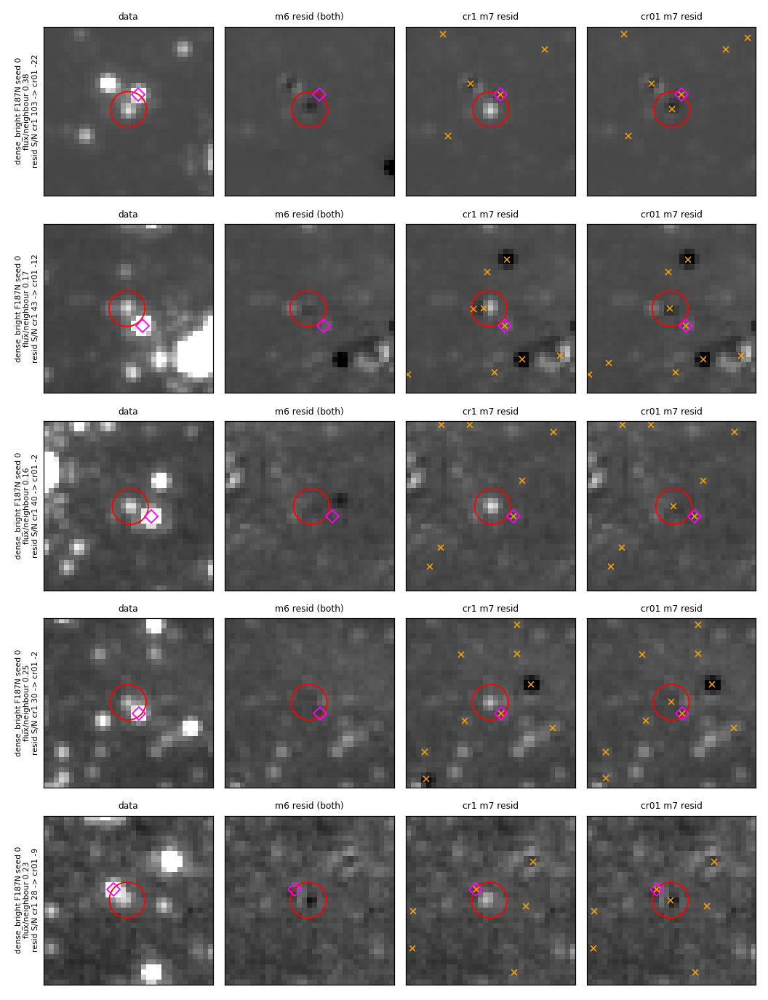
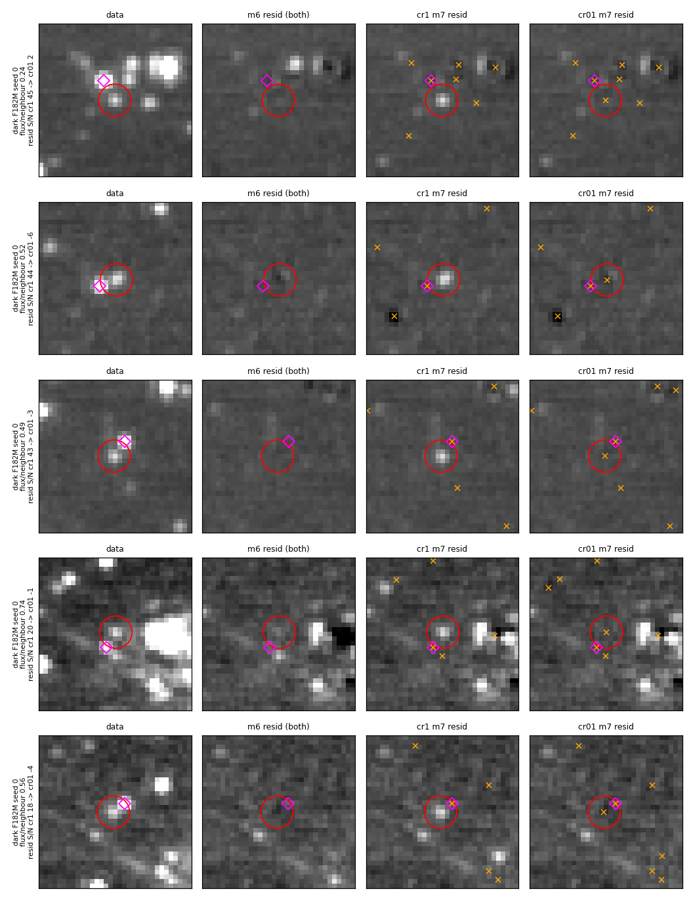
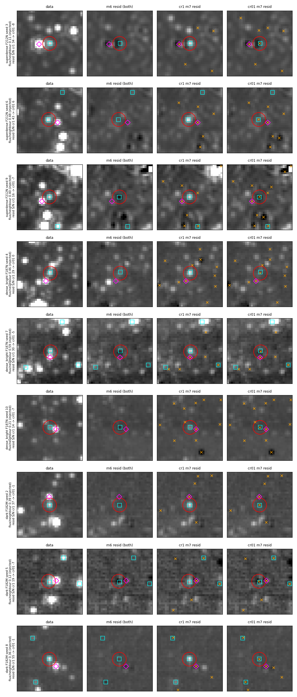
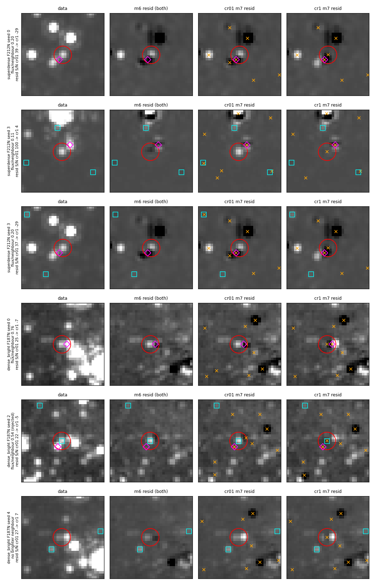

# m7 own-band seed: cut only much fainter companions (flux-ratio gate)

Stars that an earlier pass finds, fits and subtracts can vanish from the
final catalog and stay whole in the final residual.  The largest such loss
on the star fields is the m7 companion cut of the own-band seed (#1015,
AUTO-on since #1086).  This PR keeps the cut for companions much fainter
than their neighbour and drops it for the rest.

| option | before | default after |
|---|---|---|
| `manual_m7_seed_own_band_companion_max_ratio` (`--manual-m7-seed-own-band-companion-max-ratio`) | (no option; behaves as 1.0) | 0.1 |

An own-band m6 source within `manual_m7_seed_own_band_companion_fwhm`
(2.5 PSF FWHM, unchanged) of a seed source is left out of the m7 seed only
when its m6 flux is below `companion_max_ratio` times that neighbour's flux.
`1.0` reproduces the previous cut (every fainter source within the radius is
left out); values outside [0, 1] raise `ValueError`.  The value is written
to the seed table's `COMPRAT` header keyword.  Extended-emission targets and
MIRI bands are unaffected: the own-band seed is off there (#1086), so the cut
never runs.

## The mechanism

Each phase's residual is the data minus the model of that phase's vetted
catalog, and phase k+1 detects on residual k.  A star m6 vetted is therefore
already subtracted in the image m7 detects on.  If the m7 seed does not
carry it, m7 has no reason to fit it, and it stays whole in the m7 residual
(the final residual).

`scripts/phase_loss.py` follows every star vetted at any of m2..m6 to the
final (m7) catalog.  A *lost* star has no m7 vetted source within 1 mosaic
pixel; it is *starlike_left* when the final residual at its position has
PSF-matched S/N ≥ 5, a peak within 1.5 px, and at least half of the data
mosaic's flux.  Each lost star is labelled by the last phase that vetted it,
whether the next phase fit it (`vetted_out`) or not (`not_fit`), and, for
m6→m7, why the m7 seed lacked it (`own_band_off`, `companion_cut`,
`seeded`).

### Production catalogs (all predate #1086)

Starlike stars left in the final residual, per field (inner region of the
merged-module mosaic; `results/production/*_summary.json`):

| field / band | m7 vetted | lost starlike | of which m6→m7, own-band seed off |
|---|---|---|---|
| sgrb2 F182M | 336,127 | 135,846 | 119,741 |
| brick F182M | 264,057 | 116,710 | 101,010 |
| sgrc F212N | 274,302 | 106,802 | 89,253 |
| arches F212N | 204,523 | 101,240 | 85,398 |
| sgra F212N | 179,651 | 97,571 | 83,172 |
| cloudc F212N | 137,475 | 41,027 | 27,419 |
| w51 F210M | 31,821 | 5,391 | 3,963 |
| wd2 F212N | 15,641 | 4,739 | 2,909 |

These production catalogs ran with the own-band seed off, so their m7 seed
is the cross-band seed alone, and every single-band m6 star is lost this
way.  #1086 turned the own-band seed on for star fields; re-reducing them
recovers most of this column.  Stars last vetted at m2..m5 make up the
rest: 1,000–16,000 per field (see "Remaining losses").

The m7→m8 cross-band merge loses ≤ 0.6% of m7 vetted sources per band
(`results/production/m8check_*.json`: brick o001, sgrb2, w51; m8 table
≤ 0.48%, m8 dedup table ≤ 0.63%).

### With the own-band seed on: the companion cut

With #1086 the own-band m6 sources join the m7 seed, except those within
2.5 FWHM of a brighter seed source.  The companion cut came from #1015's
check against Brick 1182/o004 F200W m7 vetted: own-band sources the
production m7 lacked were confirmed at the chance rate.  That check compares
against a catalog whose m7 seed also lacks single-band companions (production
m7 everywhere ran without the own-band seed), so the o004 m7 catalog rarely
has them either.  Compared against o004's **m6** vetted catalog instead,
bright companions are confirmed:

`figures/companion_confirmation.png` (`scripts/companion_conf.py`,
`scripts/companion_fig.py`; numbers in `results/companion_conf.json`): Brick
2221/o001 F182M own-band m6 sources left out of production m7 within 3 FWHM
of a brighter seed source, binned by separation and flux ratio.  `rel` =
the flux-matched o004 match rate above chance, relative to the same rate for
the own-band sources production m7 keeps (`seed_cuts.rel_flux_matched`;
1 = confirmed as often as kept sources, 0 = chance).

- Panel 1, against o004 m7 vetted (#1015's comparison): every bin near 0.
- Panel 2, against o004 m6 vetted: ratio 0.3–1 at 1–3 FWHM `rel` 0.54–0.87;
  ratio 0.1–0.3 `rel` 0.28–0.39 below 2 FWHM and 0.84–0.90 beyond;
  ratio 0.03–0.1 `rel` 0.00–0.03 at 1–2 FWHM and 0.41 at 2–2.5 FWHM.
- Panel 3, position-angle anisotropy around the brighter star: 0.17–0.20
  for ratio 0.03–0.1 at 1–2.5 FWHM (consistent with fits to PSF features),
  0.03–0.14 for ratio 0.1–0.3, 0.01–0.04 for ratio 0.3–1 at ≥ 1 FWHM.
- Panel 4: the PA histogram at 1.5–2 FWHM; ratio 0.03–0.1 clusters at
  preferred angles, ratio 0.1–0.3 has one peak near 160–170°, ratio 0.3–1 is
  close to flat.

The 0.1 default sits at the lower edge of the 0.1–0.3 bin: that bin is mixed
(0.28–0.39 below 2 FWHM), and the reference-field runs below bracket it with
0.3.  The < 1 FWHM, ratio ≥ 0.3 bin (n = 170) has `rel` 0.33 and PA anisotropy
0.13, a small mixed group; this PR adds no minimum-separation gate for it.
Ratio 0.03–0.1 companions at 2–2.5 FWHM (`rel` 0.41, n = 2,191) stay cut; a
separation-dependent ratio could keep them and is left for later.

Caveat: 2221/o001 and 1182/o004 have similar position angles (PA_APER
88.58° and 90.54°), so PSF-feature fits at the same position relative to a
bright star could coincide in both visits and count as confirmed.  The PA
anisotropy panel is the check for that: 0.01–0.04 for ratio ≥ 0.3 and
0.03–0.14 for ratio 0.1–0.3 among the bins the gate now keeps.

## Reference-field results

The four reference fields and thresholds are in
`docs/evidence/faint_reference_fields`.  Variants, all run at code 4eee4669
(a61d456f adds only the range check): `cr1` =
`--manual-m7-seed-own-band-companion-max-ratio=1.0` (the cut before this PR),
`cr01` = the new default 0.1, `cr03` = 0.3 (star fields only).  Phase m7,
inner box, pooled over the clean run and ten injection runs per field
(`results/eval_*.txt`, `results/reffield_*.json`).  Every variant passes all
fields.

**superdense (NSC, F212N)**; thresholds: excess ≤ 2.1, over-subtracted ≤ 1.4

| variant | S/N 40-80 | 80-160 | 160-320 | 320-640 | resid excess /as² | over-subtracted /as² | bias mag |
|---|---|---|---|---|---|---|---|
| cr1 | 1/51 | 11/64 | 30/74 | 29/51 | 1.39 | 1.18 | −0.017 |
| cr03 | 2/51 | 15/64 | 38/74 | 32/51 | 1.32 | 1.11 | −0.033 |
| cr01 | 2/51 | 15/64 | 40/74 | 35/51 | 1.25 | 1.32 | −0.043 |

**dense_bright (Sgr B2, F187N)**; thresholds: excess ≤ 2.65, over-subtracted ≤ 1.25

| variant | S/N 5-10 | 10-20 | 20-40 | 40-80 | resid excess /as² | over-subtracted /as² | bias mag |
|---|---|---|---|---|---|---|---|
| cr1 | 0/49 | 1/69 | 14/58 | 36/64 | 1.73 | 1.04 | +0.046 |
| cr03 | 0/49 | 1/69 | 19/58 | 39/64 | 1.80 | 1.04 | +0.041 |
| cr01 | 0/49 | 1/69 | 22/58 | 39/64 | 1.66 | 0.97 | +0.038 |

**bright_modest (W51, F187N)**: own-band seed off (AUTO), so cr1 and cr01 are
identical (0/53, 0/56, 3/68, 34/62; excess 0.21; knots cataloged 1/4).

**dark (Brick, F182M)**; thresholds: excess ≤ 1.25, over-subtracted ≤ 1.3

| variant | S/N 5-10 | 10-20 | 20-40 | 40-80 | resid excess /as² | over-subtracted /as² | labels | bias mag |
|---|---|---|---|---|---|---|---|---|
| cr1 | 2/62 | 28/55 | 45/61 | 49/62 | 0.97 | 1.04 | 0.58 | +0.041 |
| cr03 | 3/62 | 31/55 | 48/61 | 54/62 | 0.90 | 0.83 | 0.58 | +0.037 |
| cr01 | 3/62 | 31/55 | 49/61 | 54/62 | 0.69 | 0.83 | 0.64 | +0.036 |

Injected stars gained / lost, cr01 vs cr1 (exact sign test):

| field | bin 1 | bin 2 | bin 3 | bin 4 |
|---|---|---|---|---|
| superdense | +1/−0 | +4/−0 (p=0.12) | +10/−0 (p=0.002) | +6/−0 (p=0.031) |
| dense_bright | +0/−0 | +0/−0 | +8/−0 (p=0.0078) | +4/−1 (p=0.38) |
| bright_modest | +0/−0 | +0/−0 | +0/−0 | +0/−0 |
| dark | +1/−0 | +3/−0 (p=0.25) | +4/−0 (p=0.12) | +5/−0 (p=0.062) |

Superdense over-subtraction rises from 1.18 to 1.32 /as² under cr01, inside
the 1.4 threshold (calibration run 1.247, seed std 0.057).  See "Side
effects".

### Injected stars found at m6 (truth)

`scripts/inj_track.py` + `scripts/inj_summary.py`
(`results/injection_summary.txt`): injected stars with an m6 vetted match,
and whether m7 keeps them, split by the m6 flux ratio to the brightest
brighter m6 vetted source within 2.5 FWHM.

| injected stars found at m6 | cr1 | cr01 | cr03 |
|---|---|---|---|
| brighter neighbour within 2.5 FWHM | 24/93 | 86/93 | 63/88 |
| ratio < 0.1 | 1/3 | 1/3 | 1/3 |
| ratio 0.1–0.3 | 3/26 | 25/26 | 3/25 |
| ratio ≥ 0.3 | 20/64 | 60/64 | 59/60 |
| isolated | 504/518 | 507/518 | 305/308 |

Per field, injected stars with a brighter neighbour kept at m7 (cr1 → cr01):
superdense 2/29 → 27/29, dense_bright 14/37 → 37/37, dark 7/22 → 21/22,
bright_modest 1/5 → 1/5.  (cr03 ran on the three star fields only, hence the
smaller totals.  The commit message of 4eee4669 quotes 24/97 from the
`defownm` runs of #1086, the same rule at that code.)

### Found-then-dropped stars per run

`scripts/run_ref.py` + `scripts/aggregate_ref.py`
(`results/phase_loss_ref_cr1_cr01_cr03.txt`): starlike stars left in the
final residual per run, inner box, mean over 11 runs.

| field / band | cr1 | cr03 | cr01 | of which m6 `companion_cut` (cr1 → cr03 → cr01, total) |
|---|---|---|---|---|
| superdense F212N | 34.1 | 21.6 | 14.8 | 244 → 99 → 14 |
| superdense F405N | 4.8 | 4.5 | 4.5 | 7 → 2 → 1 |
| dense_bright F187N | 15.3 | 10.3 | 2.1 | 139 → 93 → 1 |
| dense_bright F212N | 15.8 | 9.5 | 4.3 | 134 → 66 → 11 |
| dark F182M | 15.1 | 8.5 | 5.1 | 127 → 58 → 22 |
| dark F212N | 0.9 | 0.8 | 0.8 | 1 → 0 → 0 |
| bright_modest F187N | 1.3 | — | 1.3 | (own-band off) |
| bright_modest F210M | 3.3 | — | 3.3 | (own-band off) |

### Final-catalog differences, star by star

`scripts/ab_gallery.py` (`results/counts_*.json`, `results/counts_summary.txt`):
m7 vetted sources of one variant with no m7 vetted source of the other within
1 px, inner box, all 66 star-field runs, and the PSF-matched S/N each
variant's final residual leaves at that position.

- cr01 has, cr1 lacks: **676** sources; cr1 leaves S/N ≥ 5 at **652** of
  them, cr01 at 2.  670 of the 676 have a brighter cr01 m7 neighbour within
  2.5 FWHM.  Per band (cr01-only / S/N ≥ 5 left in cr1): superdense F212N
  232/224, F405N 8/5; dense_bright F187N 157/153, F212N 144/143; dark F182M
  121/116, F212N 14/11.
- cr1 has, cr01 lacks: **27** sources; cr01 leaves S/N ≥ 5 at 18 of them
  (cr1 at 5).  See "Side effects".
- cr03 vs cr1: 353 added (346 left at S/N ≥ 5 in cr1), 6 the other way.

## Figures: current and proposed catalogs and residuals

Each row is one star, cutout 1″ × 1″.  Columns: data mosaic | m6 residual
(identical in both variants: the ratio gate acts on m7 only) | cr1 m7
residual + cr1 m7 vetted | cr01 m7 residual + cr01 m7 vetted.  Red circle:
the star; orange ×: that column's m7 vetted sources; magenta diamond: the
brightest brighter cr01 m7 source within 2.5 FWHM; cyan square: injected
stars.  All panels of a row share one stretch width, set by the star's peak
in the data panel; residual panels are centred on their own local median.
The row label gives the flux ratio to the magenta neighbour and the residual
S/N at the star in cr1 → cr01.  Row numbers are in the matching
`results/*.json`.

### Clean runs (seed 0): the five largest cr1 residuals per field

`figures/ab_cr1_cr01_superdense_s0.png`: Sgr A* F212N.  Each star is
subtracted in the m6 residual, whole in the cr1 m7 residual (S/N 38–122),
and fitted again in cr01 (S/N −29 to +4).

`figures/ab_cr1_cr01_dense_bright_s0.png`: Sgr B2 F187N, residual S/N
28–103 in cr1, −22 to −2 in cr01.

`figures/ab_cr1_cr01_dark_s0.png`: Brick F182M, residual S/N 18–45 in cr1,
−6 to +2 in cr01.

### Injected stars

`figures/ab_cr1_cr01_injected.png`: one injected star per run with the
largest cr1 residual (superdense seeds 3/6/9, dense_bright 4/7/10, dark
2/5/8), flux ratios 0.11–0.59.  Residual S/N 14–55 in cr1, −8 to +6 in cr01.

### The other direction

`figures/ab_cr01_cr1_reverse_sel.png`: sources cr1 keeps and cr01 lacks,
columns ordered cr01 | cr1.  See below.

## Side effects

**Sources cr1 keeps and cr01 lacks (27, of which 18 at S/N ≥ 5, against
676 / 652 gained).**  11 are in superdense F212N, mostly the same few stars
in several seeds; 14 are in dense_bright F187N.  In every row of the reverse
figure, cr01's m7 seed holds one more own-band m6 source near the star than
cr1's (a restored companion, or in row 2 the star itself); the other nearest
seed entries are the same in both variants.

- Rows 1 and 3 (superdense, seeds 0 and 3, the same star): both seeds hold
  an m6 source 2.4 px from the star (flux 74,033 / 75,264); cr01's adds one
  at 5 px (17,001 / 17,348).  The m6 residual is +39 / +37 at the star.  cr1's
  m7 adds a source on the star and over-subtracts it (−29); cr01's m7 adds
  none and the residual stays at the m6 value.  The 5 px source is the star
  in row 2 of the superdense figure: cr1 leaves it whole (+46), cr01 fits it
  (−29).  In this blend each variant leaves one component in the residual.
- Row 2 (superdense seed 3): cr01's seed holds the star's own m6 source
  (0.1 px away, flux 29,102), yet cr01's m7 returns no source within 1 px of
  it (residual S/N +100).  cr1's seed lacks it and cr1's m7 finds it on its
  own.  This is the seeded-but-lost case of "Remaining losses".  In seed 0
  the same star is the top row of the superdense figure, kept by cr01 and
  lost by cr1.
- Rows 4–6 (dense_bright): a faint m6-residual detection (`i2d` seed, flux
  9–17) at the star, not subtracted at m6 (m6 residual +11 to +26).  cr01's
  seed adds an own-band m6 source 2.1–3.3 px away (flux 39–125); with it, m7
  drops the faint detection (row 4: fitted, then removed by vetting;
  rows 5–6: not fitted).  Row 5 is an injected star.

**m6 over-subtraction in blends carries through.**  cr01 restores m6's own
fit, including where m6 over-subtracted: dense_bright clean row 1 has m6
residual S/N −22 at the star, cr1 +103 (star left whole), cr01 −22; superdense
row 2 has −28 / +46 / −29.  This is the m6 state, pre-existing and
independent of this PR.  The superdense over-subtraction metric rises from
1.18 to 1.32 /as² under cr01, consistent with restored m6 blend fits.

## Remaining losses (follow-up, not in this PR)

With cr01, the remaining starlike losses per run are 14.8 (superdense
F212N), 5.1 (dark F182M), 4.3 (dense_bright F212N), 2.1 (dense_bright
F187N).  In superdense F212N most come from earlier phases: m2→`vetted_out`
39/39, m4→`vetted_out` 24, m4→`not_fit` 20, m6→`vetted_out` (seeded) 16.
Over all cr01 runs, 229 starlike losses are `vetted_out`: the next phase
fitted the star (median S/N 66) but vetting dropped it, with next-phase
`qfit` median 0.49 against 0.37 at the last phase that kept it.  That is
a qfit/vetting flicker between phases, a separate mechanism.

## Scripts

All run with `PYTHONPATH` at a checkout of the code the runs used.

| script | usage | output |
|---|---|---|
| `phase_loss.py` | `python phase_loss.py --catdir <target>/catalogs --pipedir <target>/<FILT>/pipeline --filter <FILT> [--obstok <tok>] [--inner ra dec half] --out <prefix> --label <name>` | `<prefix>_lost.fits`, `<prefix>_summary.json` |
| `run_ref.py` | `python run_ref.py <variant[,variant]> <outdir>` | `phase_loss` per reference run |
| `aggregate_ref.py` | `python aggregate_ref.py <variant[,variant]> <outdir>` | per-band table (stdout), `<outdir>/ref_lost_<variants>.fits` |
| `inj_track.py` | `python inj_track.py <variant> <out.fits>` | injected stars across phases |
| `inj_summary.py` | `python inj_summary.py <inj_*.fits> ...` | injection table above |
| `ab_gallery.py` | `python ab_gallery.py <out.png> <varA> <varB> <field:band:seed[:n[:inj]]> ...` | figure + `<out>.json`; `n=0` counts only |
| `lost_gallery.py` | `python lost_gallery.py <out.png> <spec.json>` | cutouts of `phase_loss` lost stars |
| `companion_conf.py` | `python companion_conf.py <seed_f182m.fits> <outdir>` | `companion_conf.json`, `companion_pa.npz` (17 MB, not committed) |
| `companion_fig.py` | `python companion_fig.py companion_conf.json companion_pa.npz out.png` | confirmation figure |
| `m8check.py` | `python m8check.py <target_dir> <obstok> <out.json>` | m7 vetted missing from m8 |

`companion_conf.py` imports `realness` and `seed_cuts` from
`docs/evidence/faint_m7_seed_union/scripts`.
