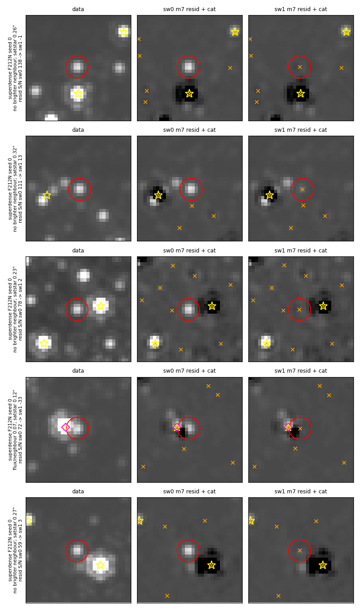
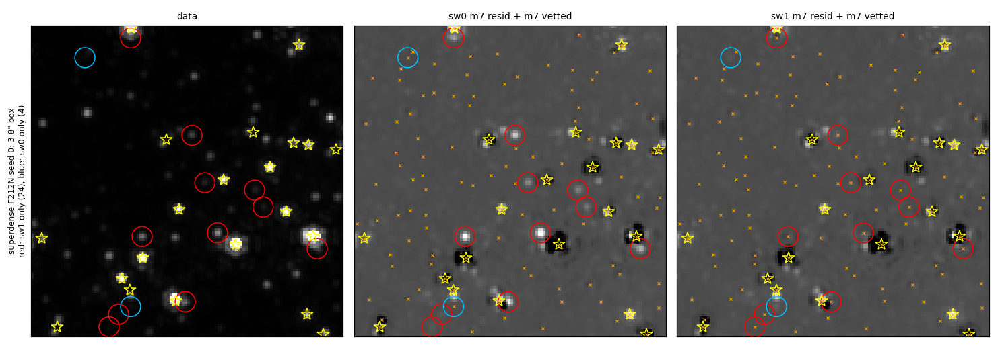
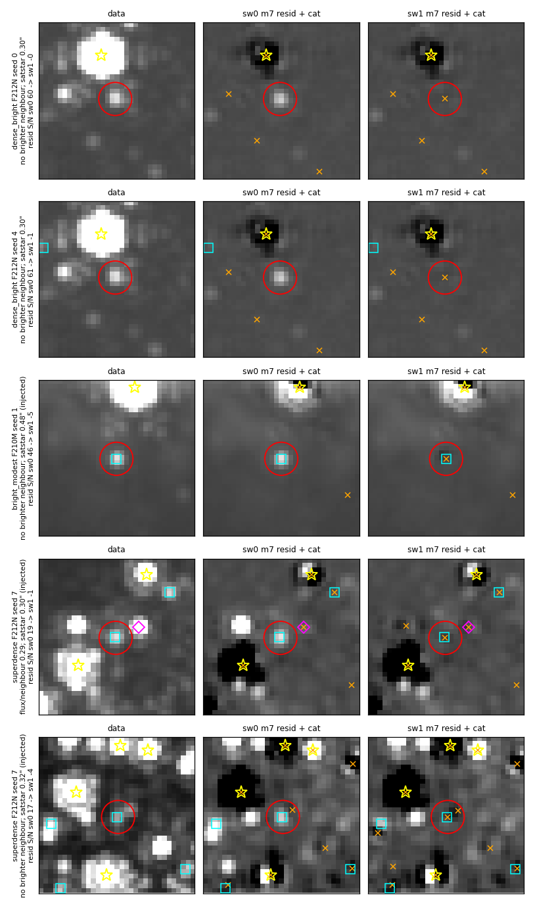
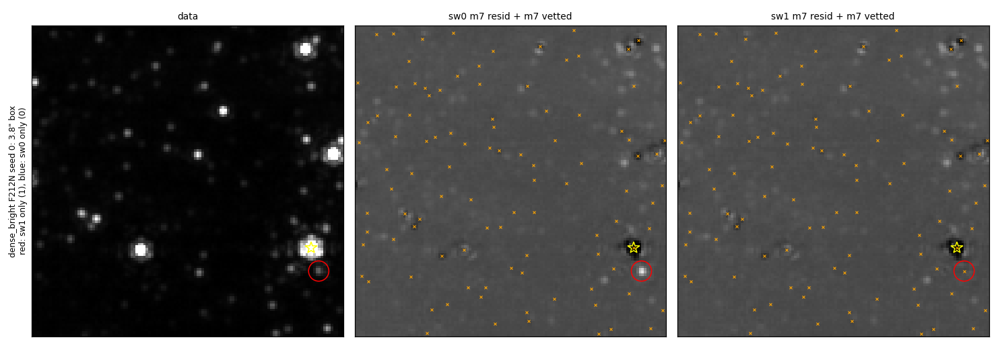
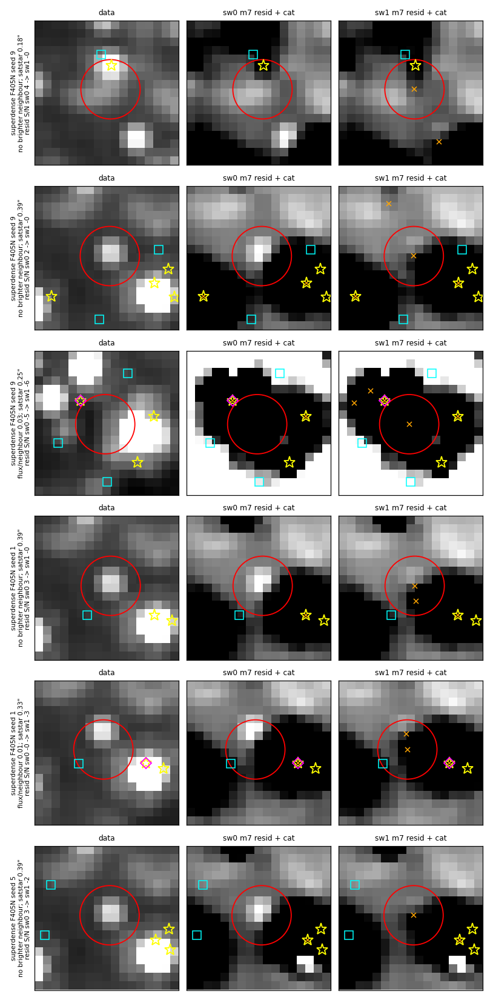
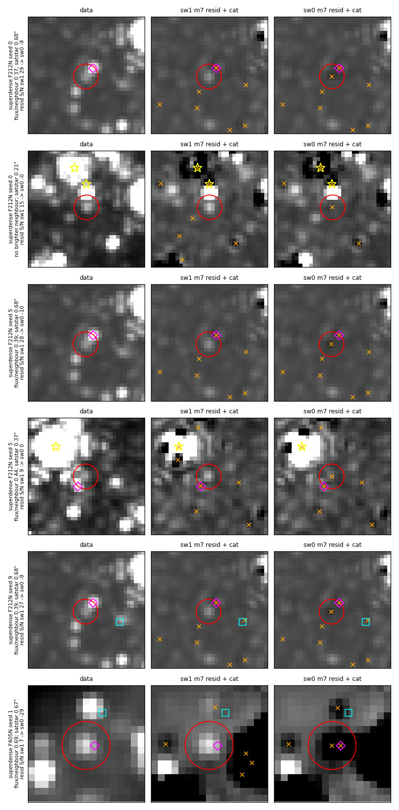

# replace_saturated: second-pass satstar radius = 1.5 × FWHM

Stars that an earlier pass finds, fits and subtracts can vanish from the
final catalog and stay whole in the final residual (`m7_companion_ratio`,
#1107).  On the superdense reference cutout, after #1107, many of the
`not_fit` losses come from a catalog swap in `replace_saturated`: a
saturated-star (satstar) fit with no daophot row of its own overwrites the
row of a neighbouring star.  This PR scales the radius of the step that
allows it with the PSF FWHM; in superdense F212N the star-like `not_fit`
losses from m2–m5 fall from 42 to 13 over 11 runs.

| setting | before | default after |
|---|---|---|
| `SATSTAR_REPLACE_RADIUS_FWHM` (env) | (no option) | 1.5 |
| `SATSTAR_REPLACE_RADIUS_ARCSEC` (env) | 0.5 (code default) | unset; when set it overrides the FWHM scaling (0.5 = before, 0 = no second pass) |

The second-pass radius is `min(0.5″, SATSTAR_REPLACE_RADIUS_FWHM × FWHM)`,
with the FWHM from the field tree's `reduction/fwhm_table.ecsv` (else the
packaged table).  A band missing from the table gets 0.5″.  Values of
`SATSTAR_REPLACE_RADIUS_FWHM` that are not finite and > 0 raise
`ValueError`.

## The mechanism

`replace_saturated` puts each consolidated satstar fit into the merged
daophot catalog.  A first pass pairs a satstar with a daophot row within a
tight per-band radius (0.05″ short-wave, 0.1″ long-wave); the row's flux
and position are overwritten with the satstar's.  A mutual-nearest second
pass then pairs the satstars the first pass missed, at up to 0.5″; a
satstar still unpaired is appended as a row of its own.

The second pass exists for satstars whose own clipped daophot row sits a
little off the satstar position.  When the satstar has no row of its own,
its nearest row is a neighbour star, and 0.5″ is 3 (F480M) to 17 (F070W)
FWHM in NIRCam.  The neighbour's row is overwritten: the neighbour vanishes
from that phase's catalog, the next phase's seed lacks it, and the residual
shows it whole.  The phase-loss tracker labels these stars `not_fit`.

The overwritten row keeps its own `flux_init` (the seed flux of the star it
was fitting), so `lr = log10(flux_init / satstar flux)` says whose row it
was: `self` (|lr| < 0.2, the satstar's own clipped row), `nbr` (lr < −0.5,
a row seeded more than 3× fainter: a neighbour), or `mid`.

### Production catalogs (all made with the 0.5″ radius)

`scripts/radius_grid.py` (`results/radius_grid_production_m4.md`):
second-pass pairings in the production m4 merged catalogs, and how many a
radius of k × FWHM would keep (`self`) or refuse (`nbr`).

| catalog (m4) | FWHM | self rows | nbr rows | k = 1.0 | k = 1.5 | k = 2.0 |
|---|---|---|---|---|---|---|
| brick F212N o001 | 0.072″ | 778 | 2001 | 591 / 1811 | 773 / 1593 | 776 / 1405 |
| brick F182M o001 | 0.062″ | 11 | 397 | 5 / 395 | 11 / 308 | 11 / 116 |
| brick F405N o001 | 0.136″ | 5 | 64 | 3 / 60 | 4 / 20 | 5 / 5 |
| brick F200W o004 | 0.066″ | 573 | 1889 | 251 / 1738 | 543 / 1398 | 568 / 1128 |
| brick F356W o004 | 0.115″ | 377 | 1854 | 102 / 1747 | 332 / 1409 | 370 / 1169 |
| sgrb2 F182M | 0.062″ | 9 | 394 | 4 / 392 | 9 / 328 | 9 / 218 |
| sgrb2 F405N | 0.136″ | 9 | 212 | 3 / 207 | 8 / 171 | 8 / 147 |
| sgra F212N | 0.072″ | 102 | 764 | 70 / 612 | 98 / 397 | 102 / 296 |
| arches F212N | 0.072″ | 47 | 662 | 27 / 632 | 46 / 596 | 47 / 562 |

Cells: self rows kept / nbr rows refused.  Neighbour pairings outnumber
self pairings in every catalog (2.6× in brick F212N, 44× in sgrb2 F182M).
At k = 1.5, 95–100% of self pairings are kept in the short-wave bands and
80–89% in the long-wave bands (brick F405N 4 of 5, brick F356W 332 of 377,
sgrb2 F405N 8 of 9); 31–90% of neighbour pairings are refused (lowest:
brick F405N, 20 of 64; sgra F212N 397 of 764).  k = 1.0 refuses more
neighbours but drops 24–73% of the self pairings; k = 2.0 keeps 89–100% of
self pairings and refuses fewer neighbours in every band.

## Reference-field results

The four reference fields and thresholds are in
`docs/evidence/faint_reference_fields`.  Variants, both run at 6d20ebbd
(this branch on main 5434f5e7, #1107 merged): `sw0` =
`SATSTAR_REPLACE_RADIUS_ARCSEC=0.5` (the radius before this PR), `sw1` =
the new default.  11 runs per field (clean run + 10 injection seeds).

### How satstars were paired

`scripts/swap_census.py` (`results/census_sw0.md`, `results/census_sw1.md`):
`replaced_saturated` rows of the merged catalogs, summed over m3..m7 and
11 runs.  `tight` = first pass (separation ≤ 0.05″ short-wave, ≤ 0.1″
long-wave); `appended` = no partner; `dup` = an
appended satstar with a non-replaced row within 0.5″ seeded within 0.2 dex
of its flux (its own clipped row left in place).

| field / band | variant | tight | 2nd self | 2nd nbr | 2nd mid | appended | dup | max nbr sep |
|---|---|---|---|---|---|---|---|---|
| superdense F212N | sw0 | 815 | 110 | 1044 | 61 | 175 | 0 | 0.456″ |
| | sw1 | 814 | 109 | 178 | 59 | 1045 | 1 | 0.101″ |
| superdense F405N | sw0 | 502 | 96 | 121 | 33 | 243 | 7 | 0.494″ |
| | sw1 | 508 | 81 | 29 | 34 | 343 | 10 | 0.203″ |
| dense_bright F212N | sw0 | 0 | 0 | 55 | 0 | 0 | 0 | 0.305″ |
| | sw1 | 0 | 0 | 0 | 0 | 55 | 0 | — |
| bright_modest F210M | sw0 | 0 | 0 | 35 | 0 | 20 | 0 | 0.485″ |
| | sw1 | 0 | 0 | 0 | 0 | 55 | 0 | — |
| dark F182M, F212N | both | 55 each | 0 | 0 | 0 | 0 | 0 | — |

dense_bright F187N and bright_modest F187N have no satstars.  In sw0, 1044
of the 1215 superdense F212N second-pass pairings overwrote a neighbour; in
sw1, 178 remain, all within 0.101″ (1.4 FWHM).  In superdense F405N the
neighbour pairings fall from 121 to 29 (all within 0.203″, 1.5 FWHM) and
the self pairings from 96 to 81.  Every second-pass pairing in dense_bright
F212N and bright_modest F210M was a neighbour.

### Scored metrics

Phase m7, inner box (`results/eval_*.txt`, `results/reffield_*.json`).
Both variants pass every field.

| field (scored band) | variant | completeness by S/N bin | resid excess /as² (seeds) | over-subtracted /as² (seeds) | threshold excess / oversub |
|---|---|---|---|---|---|
| superdense (F212N) | sw0 | 2/51, 15/64, 40/74, 35/51 | 0.97 (1.07 ± 0.22) | 1.25 (1.25 ± 0.08) | 2.1 / 1.4 |
| | sw1 | 2/51, 15/64, **44/74**, **39/51** | **0.69** (0.69 ± 0.17) | **1.39** (1.32 ± 0.13) | |
| dense_bright (F187N) | both | 0/49, 1/69, 22/58, 39/64 | 1.66 (1.52 ± 0.15) | 0.97 (1.00 ± 0.11) | 2.65 / 1.25 |
| bright_modest (F187N) | both | 0/53, 0/56, 3/68, 34/62 | 0.21 (0.17 ± 0.07) | 0.07 (0.07 ± 0.02) | 0.7 / 0.15 |
| dark (F182M) | both | 3/62, 31/55, 49/61, 54/62 | 0.69 (0.62 ± 0.08) | 0.83 (0.87 ± 0.12) | 1.25 / 1.3 |

S/N bins: superdense 40–80 / 80–160 / 160–320 / 320–640; the others 5–10 /
10–20 / 20–40 / 40–80.  Injected stars gained / lost, sw1 vs sw0 (exact
sign test): superdense 160–320 +4/−0 (p = 0.12), 320–640 +4/−0 (p = 0.12);
every other bin of every field +0/−0.  bright_modest knots cataloged: 1/4
in both.

`evaluate.py` scores the first band of each field (`filters[0]`).  For
dense_bright and bright_modest that is F187N, which has no satstars, so the
two variants score the same there by construction.  The F212N and F210M
changes appear in the phase-loss and catalog-difference counts below.

### Found-then-dropped stars per run

`run_ref.py` + `aggregate_ref.py` from `docs/evidence/m7_companion_ratio`
(`results/phase_loss_ref_sw0_sw1.txt`): starlike stars left in the final
residual, inner box, total over 11 runs (and per run).  `aggregate_ref.py`
prints a per-run mean over the runs with at least one loss; the numbers
here divide by all 11.

| field / band | sw0 | sw1 | `not_fit` starlike by last vetted phase, sw0 → sw1 |
|---|---|---|---|
| superdense F212N | 171 (15.5) | 153 (13.9) | m2 17 → 9, m3 5 → 2, m4 20 → 1, m5 0 → 1 |
| superdense F405N | 40 (3.6) | 44 (4.0) | m2 2 → 0, m3 1 → 1, m5 2 → 1 |
| dense_bright F212N | 47 (4.3) | 46 (4.2) | m2 14 → 13 |
| bright_modest F210M | 33 (3.0) | 32 (2.9) | m5 2 → 1 |
| other bands | — | — | identical |

In superdense F212N, `not_fit` starlike losses from m2–m5 fall from 42 to
13.  Other mechanisms take up part of the gain: m4 `vetted_out` 33 → 40,
m6 `companion_cut` 22 → 26, m6 `seeded` (`not_fit`) 1 → 5.  The vetting
flicker (`vetted_out`) is the subject of the companion hysteresis PR.

### Final-catalog differences, star by star

`scripts/ab_gallery_m7.py` with n = 0 (`results/counts_*.json`,
`results/counts_summary.md`) and `scripts/onlyone_stats.py`
(`results/onlyone_stats.md`): m7 vetted sources of one variant with no m7
vetted source of the other within 1 px, inner box, all 88 runs, with the
PSF-matched S/N at that position in the data and in each variant's final
residual.

| sources only in | field / band | n | data S/N ≥ 5 | left in the other variant's residual at S/N ≥ 5 | own residual S/N ≥ 5 / ≤ −3 | within 0.5″ of a satstar |
|---|---|---|---|---|---|---|
| sw1 | superdense F212N | 114 | 104 | 114 | 4 / 13 | 113 |
| sw1 | superdense F405N | 36 | 20 | 0 (13 at 2–5) | 0 / 22 | 34 |
| sw1 | dense_bright F212N | 10 | 10 | 10 | 0 / 0 | 10 |
| sw1 | bright_modest F210M | 1 (injected) | 1 | 1 | 0 / 1 | 1 |
| sw0 | superdense F212N | 10 | 6 | 10 | 0 / 3 | 5 |
| sw0 | superdense F405N | 11 | 5 | 1 | 0 / 10 | 4 |

- superdense F212N: sw1 keeps 114 stars that sw0 leaves in its residual at
  S/N ≥ 5; 113 lie within 0.5″ of a satstar, 8 are injected stars.  sw0
  keeps 10 that sw1 leaves; 5 lie near a satstar.
- dense_bright F212N: one star (0.30″ from a satstar) in 10 of the 11 runs,
  left whole by sw0 and fitted by sw1.
- superdense F405N: mixed.  20 of the 36 sw1-only sources sit on a source
  in the data (S/N ≥ 5); 19 sit where sw0's residual is already negative
  (A resid ≤ −3), inside the wings of a saturated star.  sw1's residual is
  ≤ −3 at 22 of them.

## Figures: current and proposed catalogs and residuals

Each row is one star, cutout 1″ × 1″.  Columns: data mosaic | sw0 (or
first-named variant) m7 residual + its m7 vetted | sw1 m7 residual + its m7
vetted.  Red circle: the star; orange ×: that column's m7 vetted sources;
yellow star: satstar fits (that column's variant; data column: the second
variant); magenta diamond: the brightest brighter m7 source of the second
variant within 2.5 FWHM; cyan square: injected stars.  All panels of a row
share one stretch width, set by the star's peak in the data panel (floored
at 3× the stamp's MAD σ); each panel is centred on its own local median.
Row labels give the flux ratio to the brightest brighter neighbour, the
distance to the nearest satstar (when ≤ 1″) and the residual S/N at the
star, first → second variant.  Row numbers are in the matching
`figures/*.json`.

### Superdense clean run (seed 0)

`figures/ab_sw0_sw1_superdense_s0.png`: the five sw1-only stars with the
largest sw0 residual.  They lie 0.12–0.32″ from a satstar.  sw0 leaves them
whole (residual S/N 59–138), sw1 fits them (−33 to +13).  Row 4 is a
companion 0.12″ from a satstar at flux ratio 0.07: sw1 over-subtracts it
(−33).  Row 2 keeps S/N 13 in sw1.

`figures/field_superdense_f212n_s0.png`: the whole 3.8″ evaluated box of
the same run.  Red circles: 24 sources only sw1 has; blue: 4 only sw0 has
(within 1 px matching over the whole box).

### Other fields and injected stars

`figures/ab_sw0_sw1_other.png`: rows 1–2, dense_bright F212N (seeds 0 and
4, the same star 0.30″ from a satstar), residual S/N 60–61 in sw0, −1 to 0
in sw1; row 3, the bright_modest F210M injected star 0.48″ from a satstar
(46 → −5); rows 4–5, injected superdense stars 0.30–0.32″ from a satstar
(17–19 → −4 to −1).

`figures/field_dense_bright_f212n_s0.png`: dense_bright F212N clean run,
whole box; the one sw1-only source is the star of row 1 above.

### Superdense F405N

`figures/ab_sw0_sw1_f405n.png`: sw1-only F405N sources with the largest
sw0 residual (seeds 9, 1, 5).  Rows 2, 4 and 6 are one faint source 0.39″
from a satstar in three runs (data S/N 7.5–8.1, sw0 residual 2.3–2.9, sw1
−1.7 to −0.1).  Row 1 is a source 0.18″ from a satstar (data S/N 8.1,
residual 3.7 → −0.1).  Row 3 lies 0.26″ from a satstar with no source in
the data (data S/N −0.2, residual −5.3 → −6.4): a spurious fit in the wing.
Row 5 sits at flux ratio 0.007 to its neighbour (data S/N 5.0, residual
−0.5 → −3.1).

### The other direction

`figures/ab_sw1_sw0_reverse.png`: sources sw0 keeps and sw1 lacks, columns
ordered sw1 | sw0.  Rows 1, 3 and 5 are one faint companion (flux ratio
0.37–0.39, nearest satstar 0.68″) in three runs: sw1 leaves it (S/N
27–29), sw0 fits it and over-subtracts (−9 to −10).  It lies 0.68″ from
the nearest satstar, beyond the second-pass radius of either variant, so no
satstar overwrote its row; the chain of fits that drops it in sw1 is not
traced here.  Row 2 (0.21″ from a satstar) is left at S/N 15 by sw1 and
fitted by sw0.  Row 6 (F405N) is over-subtracted in sw0 (−29).

## Side effects

- **Superdense over-subtraction rises from 1.25 to 1.39 /as²** (seeds
  1.25 ± 0.08 → 1.32 ± 0.13), inside the 1.4 threshold.  The restored
  neighbours are fitted next to a saturated star's model; row 4 of the
  superdense figure (0.12″ from the satstar) is over-subtracted, and 13 of
  the 114 sw1-only F212N stars have residual S/N ≤ −3.
- **Superdense F405N** gains are mixed (see above), and its phase-loss
  count rises from 40 to 44.
- **Own clipped rows beyond 1.5 FWHM are left unpaired.**  The satstar is
  then appended and its own clipped row stays: a duplicate.  On the
  reference runs `dup` goes 0 → 1 (superdense F212N) and 7 → 10 (F405N).
  In the production m4 catalogs 0–5% of short-wave self pairings lie beyond
  1.5 FWHM (brick F200W 30 of 573) and 11–20% of long-wave ones (brick
  F356W 45 of 377, sgrb2 F405N 1 of 9, brick F405N 1 of 5).
  `SATSTAR_REPLACE_RADIUS_FWHM=2.0` would keep 89–100% of self pairings
  (long-wave 370 of 377, 8 of 9, 5 of 5) and refuse fewer neighbours in
  every band (brick F356W 1169 of 1854 instead of 1409).

## Remaining losses

With sw1, 153 star-like losses remain in superdense F212N over 11 runs
(13.9 per run).  The largest groups by last vetted phase are m4
`vetted_out` (40), m2 `vetted_out` (37), m6 `companion_cut` (26) and m6
`vetted_out:seeded` (15).  The `vetted_out` groups are the vetting flicker
addressed by the companion hysteresis PR (`fix/vetting-hysteresis`).

## Scripts

All run with `PYTHONPATH` at a checkout of the code the runs used.

| script | usage | output |
|---|---|---|
| `radius_grid.py` | `python radius_grid.py <catalog.fits> ...` | k × FWHM grid (stdout, markdown) |
| `swap_census.py` | `python swap_census.py <variant> <out.fits>` | per-run pairing counts; table (stdout) |
| `ab_gallery_m7.py` | `python ab_gallery_m7.py <out.png> <varA> <varB> <field:band:seed[:n[:sel]]> ...` | figure + `<out>.json`; `n = 0` counts only; `sel` = `inj`, `sat`, `all` |
| `ab_counts_summary.py` | `python ab_counts_summary.py <counts.json> ...` | per-band sums (stdout) |
| `onlyone_stats.py` | `python onlyone_stats.py <varA> <varB> <field:band> ...` | data / residual S/N table (stdout) |
| `field_view.py` | `python field_view.py <out.png> <varA> <varB> <field:band:seed>` | whole-box figure |

`ab_gallery_m7.py` imports `phase_loss` from
`docs/evidence/m7_companion_ratio/scripts`; the phase-loss tables use
`run_ref.py` and `aggregate_ref.py` from there.
