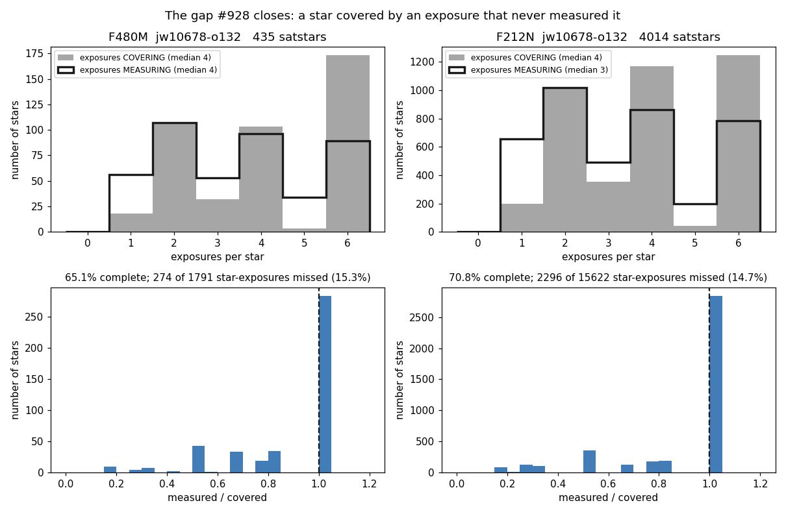
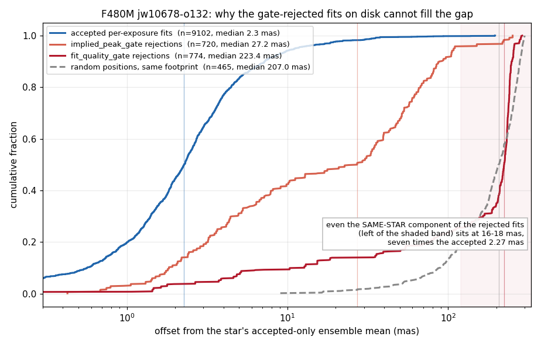
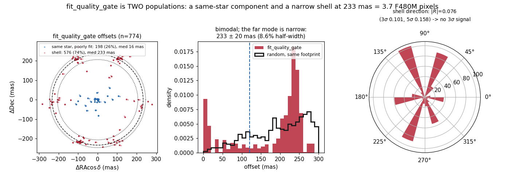

# Sibling-exposure seeding: the evidence

Backing measurements for issue #925 item 3 and PR #928. All from the delivered
`jw10678-o132` products.

**Why no plotting script is committed here.** The script that made these panels
pairs `match_to_catalog_sky` with `np.median` of the resulting positional
offsets, which is exactly the shape
`test_no_adhoc_nn_median_astrometry` forbids — the pattern behind the
brick-1182 / prop-2221 4″ errors. Clearing it would have required an `ALLOWLIST`
entry, and the justification available to it is weaker than the existing
precedents: `build_aperture_correction_table` medians flux ratios and
`measure_offsets` is protected by a runtime sparsity assertion, whereas this
script really does median positional offsets. No astrometric correction is
derived from it and nothing downstream reads it, but a diagnostic figure is a
poor reason to widen a rule that exists because this pattern kept recurring —
so the panels ship without it, matching `docs/evidence/satstar_fit_footprint/`.

Note for anyone revisiting that choice: the measurement below shows the F480M
reference is sparse by the guard's own test (5.017″ against a 3.0″ threshold),
so an `ALLOWLIST` entry here would have rested on the same footing as
`measure_offsets` — legitimate because the reference is sparse — rather than on
the weaker ground assumed when the script was dropped. The entry would still
need human review, and the panels do not need the script to be read; the
regenerability trade is open rather than settled.

Every number below states the measurement that produced it.

On whether the analysis itself was sound: the guard's criterion is the
REFERENCE catalog's own median nearest-neighbour spacing
(`match_to_catalog_sky(nthneighbor=2)`), against `max(3", 3 x match_radius)` =
3.0" here. Measured on the consolidated satstar catalogs for `o132`:

| filter | n | own median NN spacing | vs 3.0" threshold |
|---|---|---|---|
| F480M | 435 | **5.017″** | sparse — the rule does not fire |
| F212N | 4014 | 1.632″ | dense |

Every offset measurement in §2 and §3 is F480M-only, where the reference is
sparse by the rule's own test with room to spare. The F212N panels in §1 involve
no matching at all — coverage is a WCS footprint test — so nothing here medians
offsets against the dense catalog.

The 207 mas figure quoted in §2 is a different statistic: the distance from a
RANDOM position to the nearest star, i.e. the chance-coincidence scale that lets
a reader judge which offsets could be accidental. It is not a sparsity test and
should not be read as one.

## 1. The gap — `coverage_gap.png`

For each consolidated satstar, how many exposures' WCS footprints contain it
against how many produced a satstar row.

| | F480M | F212N |
|---|---|---|
| exposures covering each star (median / p10) | 4 / 2 | 4 / 2 |
| stars measured in every covering exposure | 65.1% | 70.8% |
| star-exposures covered but not measured | 274 of 1791 (15.3%) | 2296 of 15622 (14.7%) |
| single-measurement stars | 56 | 658 |
| …of those, covered by more than one exposure | 67.9% | 70.2% |

The two histograms in the top row would coincide if every covering exposure
measured its star. They do not, and the bottom row shows the shortfall is not a
tail: a third of stars are missing at least one exposure. About 70% of the
single-measurement stars — the ones with no position scatter at all — are
covered by more than one exposure, so the cause is a threshold the star
straddles frame to frame, not the edge of the dither pattern.

## 2. Why the rejected fits on disk cannot fill it — `rejected_offsets.png`

The finder already persists every seeded-but-rejected fit. A gate rejection is a
statement about *flux*, made after a fit that located the star, so those rows
looked like a way to close the gap from files that already exist — and on counts
they do (F480M ≥2-exposure coverage would go 87.1% → 94.0%).

Offset of each per-exposure fit from its own star's accepted-only ensemble mean:

| source | n | median | p84 | p99 |
|---|---|---|---|---|
| accepted per-exposure fits | 9102 | 2.27 mas | 5.09 | 35.22 |
| `implied_peak_gate` rejections | 720 | 27.17 mas | 78.19 | 240.78 |
| `fit_quality_gate` rejections | 774 | 223.44 mas | 243.16 | 283.74 |
| random positions, same footprint | — | 207.0 mas | 271.2 | 296.6 |

The last row is the **chance-coincidence scale**, not a sparsity test (see the
note at the top): a random position lands 207 mas from the nearest star, so an
offset near that value could be an accidental pairing while one at 2.27 mas
could not. The reference's own NN spacing — the quantity the rule tests — is
5.017″ for F480M.

Twelve times worse for the most defensible class. Folding a 27 mas population
into a 2.27 mas ensemble degrades the mean it is meant to improve — sufficient
on its own, and independent of what the far population turns out to be. Hence
forced measurement instead.

The `fit_quality_gate` median is a mixture of two components (§3); the one that
*is* the same star still sits at 15.7 mas, seven times the accepted 2.27 mas, so
the exclusion holds for that component too and does not rest on the mixture.

## 3. What the `fit_quality_gate` population is — `shell.png`

Not resolved here, and not needed for the PR; recorded because it is the kind of
thing that gets mis-stated once and then quoted. **The figure corrected an
earlier account of this that rested on quantiles alone.**

`fit_quality_gate` is **two populations**, which a single median hid:

| component | n | fraction | median | shape |
|---|---|---|---|---|
| same star, poorly fit (< 120 mas) | 198 | 25.6% | 15.7 mas | broad |
| **shell** (≥ 120 mas) | 576 | 74.4% | **233.2 mas** | p16–p84 206–246, **8.6% half-width** |

The 223 mas figure quoted earlier is the median of that *mixture*, not a
characteristic scale of anything. The real result is a narrow ring: 233 mas
± 20, 8.6% fractional half-width, which is 3.7 F480M pixels at 0.063″/pix
against a PSF FWHM of ~2.5 px.

`implied_peak_gate` decomposes the same way but the other way round — 95.8% near
(median 17.7 mas) with a 4.2% tail in the shell — so the shell contaminates that
class only slightly and cannot be what makes its median 27 mas.

Two readings were proposed for the far component and **both are wrong**:

- *A systematic displacement of the same star.* Ruled out by direction. On the
  shell component alone (n = 576) the Rayleigh statistic is |R̄| = 0.076 against
  critical values 3σ = 0.101 and 5σ = 0.158 — no evidence of anisotropy. The
  mean vector is 18.0 mas, 7.7% of the radius, at PA 158.3°. Testing the shell
  separately matters: mixing in a centred population dilutes any real
  anisotropy, so this is the version of the test that could have found one.
- *Wrong-object matching, the 0.3″ association picking whichever star is
  nearest.* Ruled out by radius. 200k random positions over the same footprint,
  matched to the nearest consolidated star under the same cap, give p84/median =
  1.310 and p99/median = 1.433 — and a broad distribution, not a ring with an
  8.6% width. (At this star density the capped nearest-neighbour distribution is
  indistinguishable from the uniform-disc theory values 1.296 and 1.407.)

Isotropic in direction and 8.6% wide in radius is a **shell**. A ring of
spurious detections on the saturated star's own PSF structure would look like
this. **That is a hypothesis, not a result** — what is measured is the shell,
not its cause.

Testable prediction if it is PSF structure: the residual preferred direction
should differ between NRCALONG and NRCBLONG, and should rotate with roll angle
between visits. 576 rows in F480M `o132` alone, all currently discarded as
`fit_quality_gate`.
