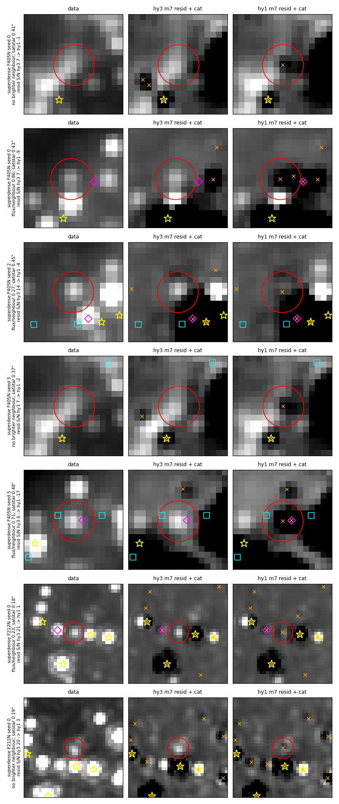
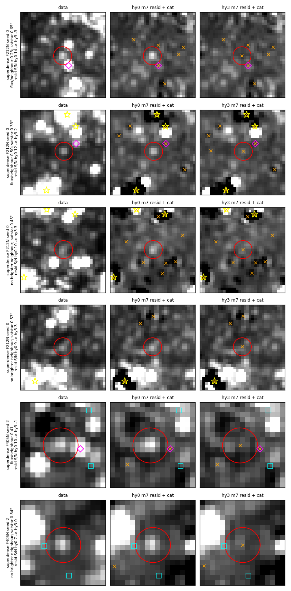
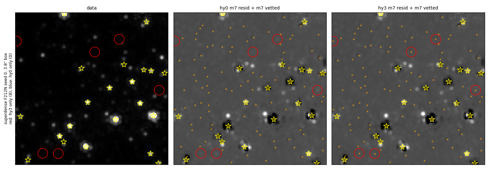
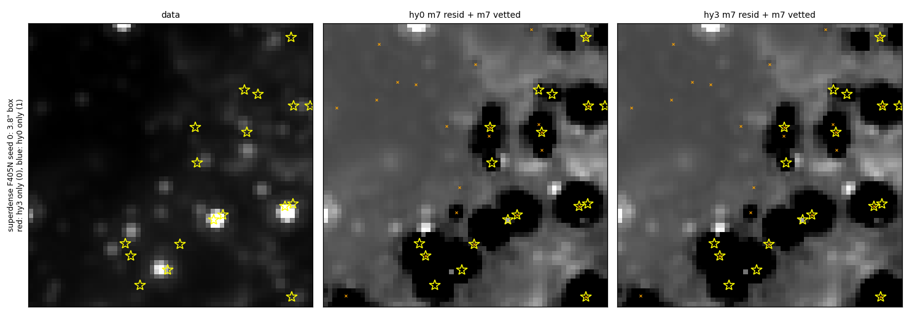
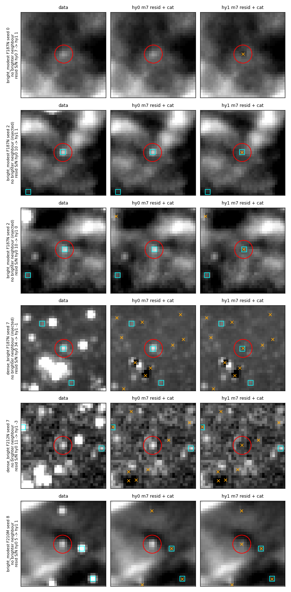
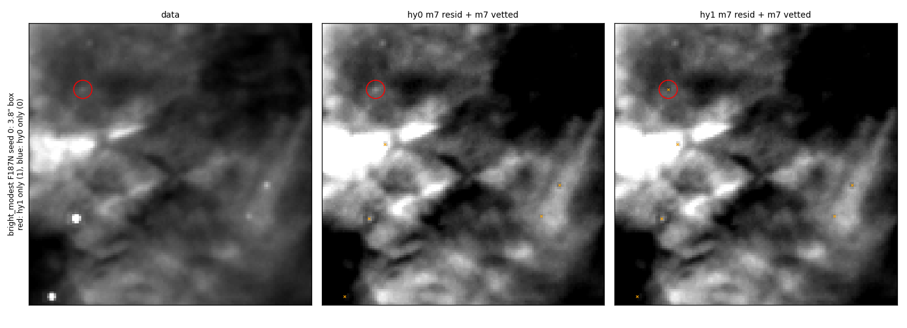
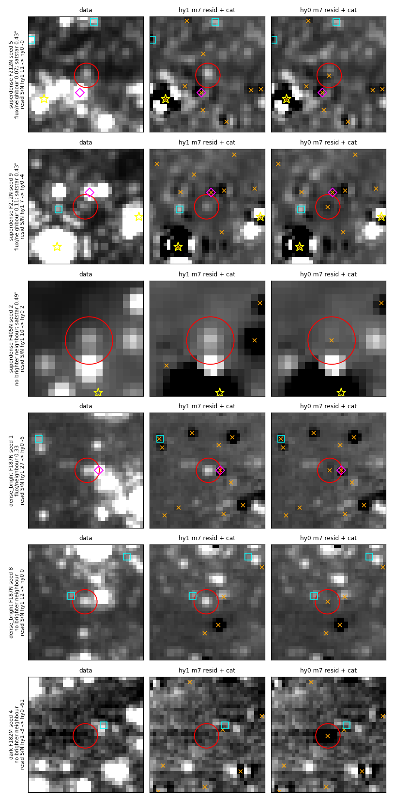

# Vetting hysteresis: keep a previous-phase star while its qfit and S/N stay plausible

Stars that an earlier pass finds, fits and subtracts can vanish from the
final catalog and stay whole in the final residual (`m7_companion_ratio`,
#1107).  After #1107, the largest group of these losses on the superdense
reference cutout is a vetting flicker: phase K vets a star, phase K+1 fits
it again, and the K+1 vetting drops it after a small change in qfit or S/N.
The K+1 residual then shows the star whole.  This PR adds a keep for a
source that the previous phase vetted, with a guard that refuses the keep
near saturated stars.  With the defaults, the star-like losses in
superdense F212N fall from 171 to 122 over 11 runs, and the `vetted_out`
part of them from 106 to 55; without the guard the keep reaches 106 and
32, and over-subtracts in superdense F405N (the satstar guard, below).

| option | before | default after |
|---|---|---|
| `manual_ext_hysteresis_qfit_max` (`--manual-ext-hysteresis-qfit-max`) | (no option) | 0.6; 0 turns the keep off |
| `manual_ext_hysteresis_snr_min` (`--manual-ext-hysteresis-snr-min`) | (no option) | 10 |
| `manual_ext_hysteresis_satstar_guard_fwhm` (`--manual-ext-hysteresis-satstar-guard-fwhm`) | (no option) | 4.5; 0 turns the guard off |

The keep, in `_filter_extended_emission`: a merged row within 0.5 FWHM
(the filter's `fwhm_table` value) of a row of the previous phase's vetted
catalog, with qfit < `manual_ext_hysteresis_qfit_max` and S/N ≥
`manual_ext_hysteresis_snr_min`, is kept, unless it lies within
`manual_ext_hysteresis_satstar_guard_fwhm` FWHM of a saturated star: an
`is_saturated` row, or a satstar row of the merged catalog before the
in-field duplicate collapse (the satstar guard, below).  The FWHM comes from the field tree's
`reduction/fwhm_table.ecsv`, else the packaged table (the table the
satstar replacement reads); a band missing from the table turns the keep
off with a log line.  It applies at m3..m7, each
against the phase before (m3 ← m2, …, m7 ← m6; m6 and m7 read the
`resbgsub` file of m5 and m6).  It is off for MIRI fields and whenever
`min_prominence > 0`.  When the previous phase's vetted file is missing
the run prints a message and vets without the keep.  The overshoot drop,
the structure prune and the extended-emission prominence gate still apply
to a kept row.  The keep re-admits only sources the previous phase already
kept, so it adds no new detections; each phase logs
`[<phase>:<band>] previous-phase keep: +N ...; M refused within R" of a
saturated star`.

## The mechanism

Each phase vets its merged catalog from scratch.  `scripts/vet_gates.py`
replays `_filter_extended_emission` on the phase K and phase K+1 merged
catalogs of every `vetted_out` loss of the #1107 reference runs (`cr01`,
11 runs × 4 fields, both bands of each field), captures the function's
intermediate keep masks, and checks the replayed kept count against the
vetted file on disk.  `scripts/gate_summary.py`
(`results/gate_summary_cr01.txt`) summarises the replay:

- 398 stars were vetted at K and vetted out at K+1; 229 of them left a
  star-like residual.
- The only keep branch they passed at K was the bright-isolated keep
  (S/N ≥ 20, qfit < 0.4, group size ≤ 1) for 142, qfit ≤ qfit_max for 55
  and flags == 1 for 53.
- In superdense F212N, 86 stars passed the bright-isolated keep alone;
  their median qfit was 0.37 at K and 0.42 at K+1, across the 0.4 cap.
  Their prominence is low (crowding), so no other branch keeps them.
- The new keep (match ≤ 0.5 FWHM, qfit < 0.6, S/N ≥ 10 at K+1) re-admits
  181 of the 398, 137 of them star-like.  The other 44 are bright (median
  S/N 53) stars whose residual did not read as a star.

| field / band | vetted_out | star-like | re-admitted | re-admitted star-like |
|---|---|---|---|---|
| superdense F212N | 113 | 102 | 96 | 87 |
| superdense F405N | 78 | 40 | 50 | 28 |
| dense_bright F187N | 47 | 18 | 5 | 4 |
| dense_bright F212N | 70 | 21 | 8 | 1 |
| bright_modest F187N | 14 | 13 | 14 | 13 |
| bright_modest F210M | 4 | 4 | 4 | 4 |
| dark F182M | 38 | 23 | 4 | 0 |
| dark F212N | 34 | 8 | 0 | 0 |

The keep leaves the dark-field flicker alone: the stars there drop at K+1
with qfit ≥ 0.6 or S/N < 10.

## Reference-field results

The four reference fields and thresholds are in
`docs/evidence/faint_reference_fields`.  Variants (all on main 5434f5e7,
#1107 merged; 11 runs per field, clean run + 10 injection seeds):

| variant | commit | keep | satstar guard centres |
|---|---|---|---|
| `hy0` | ee6a02d3, `--manual-ext-hysteresis-qfit-max=0` | off (the behaviour before this PR) | — |
| `hy1` | ee6a02d3 | on | no guard |
| `hy2` | d617e6e0 | on | `is_saturated` rows, 4.5 FWHM |
| `hy3` | b52c7048 (this PR's default) | on | `is_saturated` rows + the merge's satstar rows before the in-field collapse, 4.5 FWHM |

The W51 F210M input frames (`align_o001_crf`) were rewritten on
2026-10-07 at 13:21 (file mtime), after the hy0/hy1 bright_modest runs
(ended 12:12) and before the hy2/hy3 ones (started 14:39).  The bright_modest F210M m2 catalogs differ between hy1
and hy3 in all 11 runs (m2 precedes the keep); every other band's m2
catalogs are identical.  bright_modest F210M differences between hy0/hy1
and hy2/hy3 therefore include that input change.  F210M is not a scored
band.

### Scored metrics

Phase m7, inner box (`results/eval_hy0.txt`, `results/eval_hy1.txt`,
`results/eval_hy2_vs_hy0.txt`, `results/eval_hy3_vs_*.txt`,
`results/reffield_*.json`).  Every variant passes every field.  hy2 and
hy3 give identical scored metrics (the guard change acts on F405N; the
superdense scored band is F212N).

| field (scored band) | variant | completeness by S/N bin | resid excess /as² (seeds) | over-subtracted /as² (seeds) | flux bias | threshold excess / oversub |
|---|---|---|---|---|---|---|
| superdense (F212N) | hy0 | 2/51, 15/64, 40/74, 35/51 | 0.97 (1.07 ± 0.22) | 1.25 (1.25 ± 0.08) | −0.038 | 2.1 / 1.4 |
| | hy1 | 2/51, **16/64**, **43/74**, 35/51 | **0.76** (0.87 ± 0.24) | 1.25 (1.25 ± 0.09) | −0.036 | |
| | hy3 | 2/51, **16/64**, **42/74**, 35/51 | **0.90** (0.93 ± 0.22) | 1.25 (1.25 ± 0.09) | −0.038 | |
| dense_bright (F187N) | hy0 | 0/49, 1/69, 22/58, 39/64 | 1.66 (1.52 ± 0.15) | 0.97 (1.00 ± 0.11) | +0.038 | 2.65 / 1.25 |
| | hy1, hy3 | 0/49, 1/69, 22/58, **40/64** | 1.66 (1.59 ± 0.15) | 0.97 (1.00 ± 0.11) | +0.035 | |
| bright_modest (F187N) | hy0 | 0/53, 0/56, 3/68, 34/62 | 0.21 (0.17 ± 0.07) | 0.07 (0.07 ± 0.02) | −0.130 | 0.7 / 0.15 |
| | hy1, hy3 | 0/53, 0/56, 3/68, **36/62** | 0.21 (0.17 ± 0.07) | 0.07 (0.07 ± 0.02) | −0.121 | |
| dark (F182M) | all | 3/62, 31/55, 49/61, 54/62 | 0.69 (0.62 ± 0.08) | 0.83 (0.87 ± 0.12) | +0.036 | 1.25 / 1.3 |

S/N bins: superdense 40–80 / 80–160 / 160–320 / 320–640; the others 5–10 /
10–20 / 20–40 / 40–80.  Injected stars gained / lost, hy3 vs hy0 (exact
sign test): superdense 80–160 +1/−0, 160–320 +2/−0 (p = 0.5);
dense_bright 40–80 +1/−0; bright_modest 40–80 +2/−0 (p = 0.5); every
other bin of every field +0/−0.  hy3 vs hy1: superdense 160–320 +0/−1,
every other bin +0/−0.  bright_modest knots cataloged: 1/4 in all
variants.  Each gain is small on its own; all of them go one way.

### Found-then-dropped stars per run

`run_ref.py` + `aggregate_ref.py` from `docs/evidence/m7_companion_ratio`
(`results/phase_loss_ref_hy0_hy1.txt`, `results/phase_loss_ref_hy0_hy3.txt`):
star-like stars left in the final residual, inner box, total over 11 runs
(and per run).  `aggregate_ref.py` prints a per-run mean over the runs
with at least one loss; the numbers here divide by all 11.  A
`vetted_out` star with last vetted phase m2 was dropped by the m3 vetting.

| field / band | hy0 | hy1 | hy2 | hy3 | star-like losses by group, hy0 → hy3 |
|---|---|---|---|---|---|
| superdense F212N | 171 (15.5) | 106 (9.6) | 122 (11.1) | **122 (11.1)** | `vetted_out` m2 36 → 23, m3 5 → 1, m4 33 → 12, m5 13 → 2, m6 `vetted_out:seeded` 19 → 17; m6 `companion_cut` 22 → 23 |
| superdense F405N | 40 (3.6) | 14 (1.3) | 24 (2.2) | **29 (2.6)** | `vetted_out` m2 12 → 7, m4 13 → 10, m6 `vetted_out:seeded` 5 → 2 |
| dense_bright F187N | 23 (2.1) | 20 (1.8) | 20 | 20 (1.8) | m6 `vetted_out:seeded` 6 → 3; m5 `vetted_out` 1 → 2 |
| dense_bright F212N | 47 (4.3) | 44 (4.0) | 44 | 44 (4.0) | m6 `vetted_out:seeded` 7 → 5 |
| bright_modest F187N | 14 (1.3) | 1 (0.1) | 1 | **1 (0.1)** | m6 `vetted_out:own_band_off` 11 → 0 |
| bright_modest F210M | 33 (3.0) | 32 (2.9) | 33 | 33 (3.0) | (input change, above) |
| dark F182M | 56 (5.1) | 56 (5.1) | 56 | 56 (5.1) | m6 `vetted_out:seeded` 2 → 3 (all lost: 154 → 156) |
| dark F212N | 9 (0.8) | 9 (0.8) | 9 | 9 (0.8) | identical |

The guard returns part of the superdense losses (F212N 106 → 122, F405N
14 → 29): it refuses the keep near saturated stars, so those sources get
the hy0 vetting.  The satstar guard section gives what the guard removes
and what it costs.

### Where the keep fired

`scripts/keep_counts.py` (`results/keeps_hy1.md`, `results/keeps_hy3.md`):
the `previous-phase keep` log lines, summed over 11 runs, whole 5″ cutout
(the inner box is 3.8″).  hy3 cells: keeps / satstar-guard refusals.

| field / band | m3 | m4 | m5 | m6 | m7 | hy3 total | hy1 total |
|---|---|---|---|---|---|---|---|
| superdense F212N | 51 / 17 | 52 / 1 | 56 / 6 | 85 / 0 | 81 / 6 | 325 / 30 | 371 |
| superdense F405N | 57 / 18 | 55 / 12 | 43 / 14 | 43 / 14 | 49 / 6 | 247 / 64 | 389 |
| dense_bright F187N | 13 | 12 | 8 | 13 | 15 | 61 / 0 | 61 |
| dense_bright F212N | 7 | 7 | 1 | 1 | 1 | 17 / 0 | 17 |
| bright_modest F187N | 0 | 0 | 1 | 2 | 13 | 16 / 0 | 16 |
| bright_modest F210M | 1 | 1 | 1 | 2 | 1 | 6 / 0 | 6 |
| dark F182M | 29 | 27 | 0 | 1 | 1 | 58 / 0 | 58 |
| dark F212N | 0 | 0 | 0 | 0 | 0 | 0 / 0 | 0 |

The guard refuses keeps only in superdense.  The 58 dark F182M keeps at m3–m4 leave the
inner-box m7 catalog unchanged (one hy0-only source, no hy3-only source;
below): they lie outside the inner box or drop out at a later phase for
another reason.

### Final-catalog differences, star by star

`scripts/ab_gallery_m7.py` with n = 0 (`results/counts_*.json`) and
`scripts/onlyone_stats.py` (`results/onlyone_hy0_hy3.md`,
`results/onlyone_hy3_hy0.md`): m7 vetted sources of one variant with no m7
vetted source of the other within 1 px, inner box, all 88 runs, with the
PSF-matched S/N at that position in the data and in each variant's final
residual.

| sources only in | field / band | n | data S/N ≥ 5 | left in the other variant's residual at S/N ≥ 5 (2–5) | own residual S/N ≥ 5 / ≤ −3 | within 0.5″ of a satstar |
|---|---|---|---|---|---|---|
| hy3 | superdense F212N | 61 | 22 | 58 (3) | 0 / 4 | 40 |
| hy3 | superdense F405N | 16 | 12 | 13 (3) | 0 / **1** | 0 |
| hy3 | dense_bright F187N | 4 | 4 | 4 | 0 / 1 | 0 |
| hy3 | dense_bright F212N | 2 | 2 | 2 | 1 / 0 | 0 |
| hy3 | bright_modest F187N | 13 (3 injected) | 13 | 13 | 0 / 0 | 0 |
| hy3 | bright_modest F210M | 2 | 1 | 1 | 0 / 0 | 0 |
| hy0 | superdense F212N | 3 | 1 | 3 | 0 / 1 | 2 |
| hy0 | superdense F405N | 3 | 0 | 0 (1) | 0 / 1 | 0 |
| hy0 | dense_bright F187N | 2 | 2 | 2 | 0 / 1 | 0 |
| hy0 | bright_modest F210M | 2 | 2 | 2 | 0 / 0 | 0 |
| hy0 | dark F182M | 1 | 0 | 0 | 0 / 1 | 0 |

dark F212N, dark F182M (hy3 side) and the remaining bands have no
difference.  Summed over all bands: 98 hy3-only sources, 91 of them left
at S/N ≥ 5 in the hy0 residual and 1 left at S/N ≥ 5 in the hy3 residual;
11 hy0-only sources, 7 of them left at S/N ≥ 5 in the hy3 residual.

- superdense F212N: hy3 keeps 58 sources that hy0 leaves in its residual
  at S/N ≥ 5, and 3 more at 2–5.  21 of the 61 have data S/N < 3: the
  data S/N takes its noise from an annulus that the neighbours fill, so it
  reads low in the crowded field, and the residual S/N (neighbours
  subtracted) reads higher.
- superdense F405N: hy3 removes 13 residuals at S/N ≥ 5; 1 of its 16
  sources is over-subtracted (residual ≤ −3), 0.63″ (4.65 FWHM) from a
  satstar, just outside the 4.5 FWHM guard.  Without the guard (hy1), 27
  of 50 were over-subtracted.
- bright_modest F187N: 13 hy3-only sources: 3 injected stars and one
  compact source on the extended emission in 10 of the 11 runs (data S/N
  6.4–6.8; hy0 residual 6.4–6.8, hy3 −0.1 to 0.7).  The m6 vetting keeps
  that source in both variants; the hy0 m7 vetting drops it (the m6
  `vetted_out:own_band_off` star-like losses, 11 → 0).
- dark F182M: the one hy0-only source has data S/N −2.9 and hy0 residual
  −60.6, a spurious hy0 fit that hy3 lacks.

## The satstar guard

Without the guard (hy1), 27 of the 50 hy1-only superdense F405N sources
have residual S/N ≤ −3 in hy1 (median −13).  They are 16 distinct
positions over the 11 runs, all 0.11–0.63″ (0.8–4.7 FWHM) from a satstar
fit (16 of the 27 within 0.5″, most at 0.4–0.63″); 18 of the 27 have data
S/N ≥ 5, and 12 leave S/N ≥ 5 in the hy0 residual.  A previous phase
vetted these rows inside the satstar wings, the keep holds them, and at m7
their fitted flux exceeds the data there.  The superdense scored band is
F212N, where oversub stays 1.25 /as²; the F405N over-subtraction does not
enter the threshold check.

**Radius in FWHM.**  `scripts/satstar_guard_table.py`
(`results/satstar_guard_table_hy0_hy1.md`): the good hy1-only F212N
sources (hy0 residual ≥ 5, hy1 residual > −3) lie 2.5–9.5 FWHM
(0.18–0.68″) from a satstar, the over-subtracted F405N ones 0.8–4.7 FWHM.
A flat 0.6″ guard would remove 65 of the 70 good F212N sources; 4.5 FWHM
(0.324″ at F212N, 0.612″ at F405N) removes 12 of 70 good F212N, 26 of 27
over-subtracted F405N and 6 of 18 good F405N, measured against the
consolidated satstar fits.

**Guard centres.**  The first guard (hy2) centred on the `is_saturated`
rows of the merged catalog and left 9 of its 25 hy2-only F405N sources
over-subtracted, 0.61–0.79″ (4.5–5.8 FWHM) from the nearest
`is_saturated` row and 0.48–0.63″ from a consolidated satstar fit
(`results/satstar_guard_table_hy0_hy2.md`).  The difference comes from the
merge: `replace_saturated` places every consolidated satstar fit in the
merged catalog (overwriting the matched row or appending one), and the
consolidated catalog keeps several position estimates for some LW stars.
`_clean_offfov_dups_and_offfield` then, in its in-field `cofit` mode,
collapses `replaced_saturated` rows within 1.0″ that were never co-fit and
keeps one; in superdense F405N m7 seed 0 it collapsed 18 of 37 satstar
rows.  The kept row can sit 0.6–0.8″ from the wing structure that another
estimate of the same star lies next to.  hy3 adds the satstar rows of the
merged catalog before that collapse to the guard centres
(`_satstar_row_skycoord`, captured in `run_manual_pipeline` right after
the merged catalog is read).

| variant | guard centres | superdense F212N only-in-variant: n / good / over-sub | superdense F405N: n / good / over-sub | star-like losses F212N / F405N | superdense excess /as² |
|---|---|---|---|---|---|
| hy0 | — | — | — | 171 / 40 | 0.97 |
| hy1 | none | 83 / 70 / 3 | 50 / 18 / **27** | 106 / 14 | 0.76 |
| hy2 | `is_saturated` rows | 61 / 55 / 4 | 25 / 13 / **9** | 122 / 24 | 0.90 |
| hy3 | rows + pre-collapse satstar rows | 61 / 55 / 4 | 16 / 12 / **1** | 122 / 29 | 0.90 |

Only-in-variant: m7 vetted sources with no hy0 m7 vetted source within
1 px, inner box, 11 runs; good = hy0 residual ≥ 5 and the variant's
residual > −3; over-sub = the variant's residual ≤ −3
(`results/satstar_guard_table_hy0_hy*.md`).  F212N is identical in hy2 and
hy3: the two centre sets coincide there.  The remaining hy3 F405N
over-subtraction lies 0.63″ (4.65 FWHM) from both centre sets; a 5 FWHM
guard would also remove it, together with 1 good F405N and 14 good F212N
sources (`results/satstar_guard_table_hy0_hy3.md`).

**What the guard costs.**  `results/onlyone_hy3_hy1.md`: hy1 keeps 22
superdense F212N sources that hy3 lacks, all within 0.5″ of a satstar;
none is over-subtracted in hy1 and 16 stay at S/N ≥ 5 in the hy3
residual.  These are stars near saturated stars that the keep subtracted
correctly and the guard gives up (rows 6–7 of the guard figure).  hy1
keeps 36 superdense F405N sources that hy3 lacks: 26 over-subtracted in
hy1, 18 at S/N ≥ 5 in the hy3 residual.  Several of these show a compact
source in the data in the satstar wings (guard figure rows 1, 3, 4: data
S/N 11.8–12.3), which hy1 subtracts (residual −1.3 to −4.4) and hy3
leaves (6.8–13.6); the F405N star-like losses (14 → 29) count them.  Against
hy0, hy3 still removes 58 F212N residuals at S/N ≥ 5 for 3 hy0-only
sources, and lowers the superdense excess from 0.97 to 0.90 /as².

`figures/ab_hy3_hy1_guard.png`: sources hy1 keeps and hy3 lacks, columns
data | hy3 | hy1.  Rows 1–5, superdense F405N (seeds 0, 0, 2, 5, 5), 0.37–0.48″ from
a satstar: hy3 leaves residual S/N 6.2–13.6, hy1 −1.3 to −16.8 (rows 2,
3 and 5 over-subtracted: −9.5, −4.4, −16.8).  Row 5 is also one of the 9
sources hy2 over-subtracted (hy2 residual −16.8).  Rows 6–7, superdense F212N seed 0, 0.18–0.19″
(2.5–2.6 FWHM) from a satstar: stars in the data (S/N 11.7 and 12.1)
that hy1 subtracts (1.5, 3.4) and hy3 leaves (20.8, 19.7).

## Figures: current and proposed catalogs and residuals

Each row is one star, cutout 1″ × 1″.  Columns: data mosaic | first-named
variant m7 residual + its m7 vetted | second-named variant m7 residual +
its m7 vetted.  Red circle: the star; orange ×: that column's m7 vetted sources;
yellow star: satstar fits (that column's variant; data column: the second
variant); magenta diamond: the brightest brighter m7 source of the second
variant within 2.5 FWHM; cyan square: injected stars.  All panels of a row
share one stretch width, set by the star's peak in the data panel (floored
at 3× the stamp's MAD σ); each panel is centred on its own local median.
Row labels give the flux ratio to the brightest brighter neighbour, the
distance to the nearest satstar fit (when ≤ 1″) and the residual S/N at the
star, first → second variant.  Row numbers are in the matching
`figures/*.json`.

### Superdense clean run (seed 0) and F405N

`figures/ab_hy0_hy3_superdense_s0.png`: rows 1–4, superdense F212N seed 0,
the hy3-only stars with the largest hy0 residual: hy0 leaves residual S/N
9.4–14.3, hy3 −2.9 to 3.1.  They lie 0.33–0.65″ (4.6–9.0 FWHM) from a
satstar.  Rows 2–3 are faint in the data (S/N 3.6, in a crowded annulus)
and show S/N 10.3–11.7 in the hy0 residual.  Rows 5–6, superdense F405N
seed 2, 1.34″ and 0.84″ from a satstar: 10.5 → −0.5 and 7.2 → 0.3.

`figures/field_superdense_f212n_s0_hy3.png`: the whole 3.8″ evaluated box
of the superdense F212N clean run.  Red circles: 8 sources only hy3 has
(hy1: 12); blue: none only hy0 has (1 px matching over the whole box).

`figures/field_superdense_f405n_s0_hy3.png`: the same box in F405N.  hy3
adds no source to the clean run's F405N catalog and lacks one hy0 source.
The black patches around the saturated stars are present in both variants.

### Other fields and injected stars

`figures/ab_hy0_hy1_other.png` (hy0 | hy1; hy3 has the same catalogs as
hy1 in these bands, except bright_modest F210M after the input change):
row 1, bright_modest F187N seed 0, the
compact source on the extended emission that m6 vets and the hy0 m7
vetting drops (data S/N 6.7, residual 6.7 → 0.6); rows 2–3, injected bright_modest F187N stars (9.9 → 1.1, 9.8 →
0.5); row 4, an injected dense_bright F187N star (33.9 → −0.6); row 5,
dense_bright F212N seed 7 (11.3 → −3.0); row 6, bright_modest F210M seed 8
(data S/N 4.2, residual 5.3 → 1.0; hy1 run, before the F210M input
change).

`figures/field_bright_modest_f187n_s0.png`: bright_modest F187N clean run,
whole box (hy0 | hy1, identical in hy3); the one hy1-only source is the
star of row 1 above.  The keep adds no source on the extended emission
elsewhere in the box.

### The other direction

`figures/ab_hy1_hy0_reverse.png`: sources hy0 keeps and hy1 lacks,
columns ordered hy1 | hy0.  hy3 also lacks 2 dense_bright F187N and 1
dark F182M hy0 sources (as hy1), and 3 superdense F212N and 3 F405N hy0
sources (hy1: 3 and 7).
Row 1, superdense F212N seed 5 (flux ratio
0.07, 0.43″ from a satstar): hy1 leaves S/N 11.1, hy0 fits it (−0.2).  Row
2, superdense F212N seed 9 (data S/N 0.5, flux ratio 0.11): hy1 leaves 7.5,
hy0 fits it at −3.9.  Row 3, superdense F405N (0.49″ from a satstar): 9.6
→ 2.5.  Rows 4–5, dense_bright F187N seeds 1 and 8: hy1 leaves 27.4 and
11.6, hy0 fits them (−6.3 and 0.2).  Row 6, dark F182M seed 4: the hy0
fit with no source in the data (data S/N −2.9, hy0 residual −60.6).

## Side effects

- **The satstar guard** gives up 16 good superdense F212N subtractions
  near saturated stars and leaves 18 F405N wing sources unsubtracted
  (above).
- **More `companion_cut` losses in superdense F212N** without the guard
  (m6, 22 → 30 in hy1; 23 in hy3).  Of the 8 new hy1 ones, 7 were m2
  `vetted_out` losses in hy0: the hy0 m3 vetting dropped them.  With the
  keep they stay vetted through m6, and the #1107 own-band companion cut
  (an own-band source within 2.5 FWHM of a seed source and below 0.1 ×
  its flux is not added) then leaves them out of the m7 seed.  These stars
  are lost in both variants; the keep moves their loss from m2
  `vetted_out` to m6 `companion_cut`.
- **dense_bright seed-mean excess** rises from 1.52 ± 0.15 to 1.59 ± 0.15
  /as² (clean run 1.66 in all variants; threshold 2.65).

### Stacking with #1121

#1121 (satstar second-pass radius) alone raises superdense oversub from
1.25 to 1.39 /as² against the 1.4 threshold.  Runs with both PRs
(`sw0` = main with `SATSTAR_REPLACE_RADIUS_ARCSEC=0.5`, `sw1` = #1121;
`swhy`, `swhy2`, `swhy3` = #1121 + this PR with no guard, the
`is_saturated`-row guard, and the default guard;
`results/eval_swhy3_vs_*.txt`, `results/phase_loss_ref_stacked.txt`,
`results/onlyone_sw1_swhy*.md`):

| variant | superdense oversub /as² (thr 1.4) | excess /as² | injected gained / lost vs sw0, 80–160 / 160–320 / 320–640 | star-like losses F212N / F405N | F405N only-in-variant vs sw1: n / over-sub |
|---|---|---|---|---|---|
| sw0 | 1.25 | 0.97 | — | 171 / 40 | — |
| sw1 | 1.39 | 0.69 | +0/−0, +4/−0, +4/−0 | 153 / 44 | — |
| swhy | 1.39 | 0.55 | +2/−0, +7/−0 (p = 0.016), +4/−0 | 89 / 13 | 63 / 38 |
| swhy2 | 1.39 | 0.69 | +2/−0, +6/−0 (p = 0.031), +4/−0 | 103 / 23 | 32 / 16 |
| swhy3 | 1.39 | 0.69 | +2/−0, +6/−0 (p = 0.031), +4/−0 | 103 / 33 | 17 / **1** |

Every stacked variant passes all four fields.  This PR leaves the
superdense oversub where #1121 puts it (1.39), and with both PRs the
default guard brings the F405N over-subtraction to 1 of 17.

## Remaining losses

With hy3, 122 star-like losses remain in superdense F212N over 11 runs
(11.1 per run).  The largest groups are m6 `companion_cut` (23), m2
`vetted_out` (23), m4 `not_fit` (20), m2 `not_fit` (17), m6
`vetted_out:seeded` (17) and m4 `vetted_out` (12).  The m2 and m4
`vetted_out` groups rise from hy1 (6 and 10) because the guard refuses the
keep near saturated stars (hy1 and hy3 have identical m2 catalogs).  The m2–m5 `not_fit` losses near satstars are the subject of
#1121.  The dark-field `vetted_out` losses (dark F182M 12 at m2, 7 at m4)
drop with qfit ≥ 0.6 or S/N < 10 and stay.

## Scripts

All run with `PYTHONPATH` at a checkout of the code the runs used.

| script | usage | output |
|---|---|---|
| `vet_gates.py` | `WT=<checkout> LOST_DIR=<dir> python vet_gates.py <out.fits> <field:variant:seed:band> ...` | per-loss replay of every keep branch at K and K+1 |
| `gate_summary.py` | `python gate_summary.py <vet_gates out.fits> ...` | mechanism counts (stdout) |
| `keep_counts.py` | `python keep_counts.py <log_dir> <variant>` | keeps per phase from the run logs, and satstar-guard refusals when the logs carry them (stdout, markdown) |
| `ab_gallery_m7.py` | `python ab_gallery_m7.py <out.png> <varA> <varB> <field:band:seed[:n[:sel]]> ...` | figure + `<out>.json`; `n = 0` counts only; `sel` = `inj`, `sat`, `all` |
| `ab_counts_summary.py` | `python ab_counts_summary.py <counts.json> ...` | per-band sums (stdout) |
| `onlyone_stats.py` | `python onlyone_stats.py <varA> <varB> <field:band> ...` | data / residual S/N table (stdout) |
| `field_view.py` | `python field_view.py <out.png> <varA> <varB> <field:band:seed>` | whole-box figure |
| `satstar_guard_table.py` | `python satstar_guard_table.py <varA> <varB> <field:band> ...` | distance of the B-only sources to B's satstars (the `is_saturated` rows, and every fit of the consolidated satstar catalog); what a flat or FWHM-scaled guard radius would remove (stdout, markdown) |

`vet_gates.py` and `ab_gallery_m7.py` import `phase_loss` from
`docs/evidence/m7_companion_ratio/scripts`; the phase-loss tables
(`LOST_DIR`) use `run_ref.py` and `aggregate_ref.py` from there.
