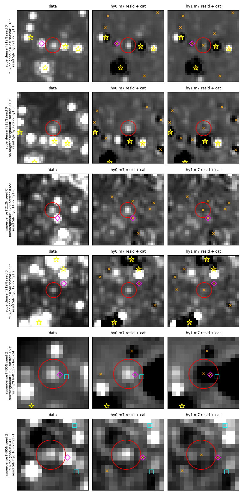
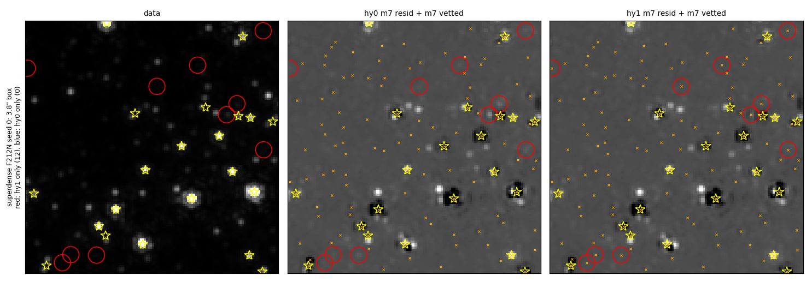

# Vetting hysteresis: keep a previous-phase star while its qfit and S/N stay plausible

Stars that an earlier pass finds, fits and subtracts can vanish from the
final catalog and stay whole in the final residual (`m7_companion_ratio`,
#1107).  After #1107, the largest group of these losses on the superdense
reference cutout is a vetting flicker: phase K vets a star, phase K+1 fits
it again, and the K+1 vetting drops it after a small change in qfit or S/N.
The K+1 residual then shows the star whole.  This PR adds a keep for a
source that the previous phase vetted.  In superdense F212N the star-like
losses fall from 171 to 106 over 11 runs, and the `vetted_out` part of them
from 106 to 32.

| option | before | default after |
|---|---|---|
| `manual_ext_hysteresis_qfit_max` (`--manual-ext-hysteresis-qfit-max`) | (no option) | 0.6; 0 turns the keep off |
| `manual_ext_hysteresis_snr_min` (`--manual-ext-hysteresis-snr-min`) | (no option) | 10 |

The keep, in `_filter_extended_emission`: a merged row within 0.5 FWHM
(the filter's `fwhm_table` value) of a row of the previous phase's vetted
catalog, with qfit < `manual_ext_hysteresis_qfit_max` and S/N ≥
`manual_ext_hysteresis_snr_min`, is kept.  It applies at m3..m7, each
against the phase before (m3 ← m2, …, m7 ← m6; m6 and m7 read the
`resbgsub` file of m5 and m6).  It is off for MIRI fields and whenever
`min_prominence > 0`.  When the previous phase's vetted file is missing
the run prints a message and vets without the keep.  The overshoot drop,
the structure prune and the extended-emission prominence gate still apply
to a kept row.  The keep re-admits only sources the previous phase already
kept, so it adds no new detections; each phase logs
`[<phase>:<band>] previous-phase keep: +N ...`.

## The mechanism

Each phase vets its merged catalog from scratch.  `scripts/vet_gates.py`
replays `_filter_extended_emission` on the phase K and phase K+1 merged
catalogs of every `vetted_out` loss of the #1107 reference runs (`cr01`,
11 runs × 4 fields, both bands of each field), captures the function's
intermediate keep masks, and checks the replayed kept count against the
vetted file on disk.  `scripts/gate_summary.py`
(`results/gate_summary_cr01.txt`) summarises the replay:

- 398 stars were vetted at K and vetted out at K+1; 229 of them left a
  star-like residual.
- The only keep branch they passed at K was the bright-isolated keep
  (S/N ≥ 20, qfit < 0.4, group size ≤ 1) for 142, qfit ≤ qfit_max for 55
  and flags == 1 for 53.
- In superdense F212N, 86 stars passed the bright-isolated keep alone;
  their median qfit was 0.37 at K and 0.42 at K+1, across the 0.4 cap.
  Their prominence is low (crowding), so no other branch keeps them.
- The new keep (match ≤ 0.5 FWHM, qfit < 0.6, S/N ≥ 10 at K+1) re-admits
  181 of the 398, 137 of them star-like.  The other 44 are bright (median
  S/N 53) stars whose residual did not read as a star.

| field / band | vetted_out | star-like | re-admitted | re-admitted star-like |
|---|---|---|---|---|
| superdense F212N | 113 | 102 | 96 | 87 |
| superdense F405N | 78 | 40 | 50 | 28 |
| dense_bright F187N | 47 | 18 | 5 | 4 |
| dense_bright F212N | 70 | 21 | 8 | 1 |
| bright_modest F187N | 14 | 13 | 14 | 13 |
| bright_modest F210M | 4 | 4 | 4 | 4 |
| dark F182M | 38 | 23 | 4 | 0 |
| dark F212N | 34 | 8 | 0 | 0 |

The keep leaves the dark-field flicker alone: the stars there drop at K+1
with qfit ≥ 0.6 or S/N < 10.

## Reference-field results

The four reference fields and thresholds are in
`docs/evidence/faint_reference_fields`.  Variants, both run at ee6a02d3
(this branch on main 5434f5e7, #1107 merged): `hy0` =
`--manual-ext-hysteresis-qfit-max=0` (keep off, the behaviour before this
PR), `hy1` = the new default.  11 runs per field (clean run + 10 injection
seeds).

### Scored metrics

Phase m7, inner box (`results/eval_hy0.txt`, `results/eval_hy1.txt`,
`results/reffield_*.json`).  Both variants pass every field.

| field (scored band) | variant | completeness by S/N bin | resid excess /as² (seeds) | over-subtracted /as² (seeds) | flux bias | threshold excess / oversub |
|---|---|---|---|---|---|---|
| superdense (F212N) | hy0 | 2/51, 15/64, 40/74, 35/51 | 0.97 (1.07 ± 0.22) | 1.25 (1.25 ± 0.08) | −0.038 | 2.1 / 1.4 |
| | hy1 | 2/51, **16/64**, **43/74**, 35/51 | **0.76** (0.87 ± 0.24) | 1.25 (1.25 ± 0.09) | −0.036 | |
| dense_bright (F187N) | hy0 | 0/49, 1/69, 22/58, 39/64 | 1.66 (1.52 ± 0.15) | 0.97 (1.00 ± 0.11) | +0.038 | 2.65 / 1.25 |
| | hy1 | 0/49, 1/69, 22/58, **40/64** | 1.66 (1.59 ± 0.15) | 0.97 (1.00 ± 0.11) | +0.035 | |
| bright_modest (F187N) | hy0 | 0/53, 0/56, 3/68, 34/62 | 0.21 (0.17 ± 0.07) | 0.07 (0.07 ± 0.02) | −0.130 | 0.7 / 0.15 |
| | hy1 | 0/53, 0/56, 3/68, **36/62** | 0.21 (0.17 ± 0.07) | 0.07 (0.07 ± 0.02) | −0.121 | |
| dark (F182M) | both | 3/62, 31/55, 49/61, 54/62 | 0.69 (0.62 ± 0.08) | 0.83 (0.87 ± 0.12) | +0.036 | 1.25 / 1.3 |

S/N bins: superdense 40–80 / 80–160 / 160–320 / 320–640; the others 5–10 /
10–20 / 20–40 / 40–80.  Injected stars gained / lost, hy1 vs hy0 (exact
sign test): superdense 80–160 +1/−0, 160–320 +3/−0 (p = 0.25);
dense_bright 40–80 +1/−0; bright_modest 40–80 +2/−0 (p = 0.5); every
other bin of every field +0/−0.  bright_modest knots cataloged: 1/4 in
both.  Each gain is small on its own; all of them go one way.

### Found-then-dropped stars per run

`run_ref.py` + `aggregate_ref.py` from `docs/evidence/m7_companion_ratio`
(`results/phase_loss_ref_hy0_hy1.txt`): star-like stars left in the final
residual, inner box, total over 11 runs (and per run).  `aggregate_ref.py`
prints a per-run mean over the runs with at least one loss; the numbers
here divide by all 11.  A `vetted_out` star with last vetted phase m2 was
dropped by the m3 vetting.

| field / band | hy0 | hy1 | star-like losses by group, hy0 → hy1 |
|---|---|---|---|
| superdense F212N | 171 (15.5) | **106 (9.6)** | `vetted_out` m2 36 → 6, m3 5 → 0, m4 33 → 10, m5 13 → 3, m6 `vetted_out:seeded` 19 → 13; m6 `companion_cut` 22 → 30 |
| superdense F405N | 40 (3.6) | **14 (1.3)** | `vetted_out` m2 12 → 1, m3 2 → 0, m4 13 → 5, m5 3 → 2, m6 `vetted_out:seeded` 5 → 1 |
| dense_bright F187N | 23 (2.1) | 20 (1.8) | m6 `vetted_out:seeded` 6 → 3; m5 `vetted_out` 1 → 2 |
| dense_bright F212N | 47 (4.3) | 44 (4.0) | m6 `vetted_out:seeded` 7 → 5 |
| bright_modest F187N | 14 (1.3) | **1 (0.1)** | m6 `vetted_out:own_band_off` 11 → 0 |
| bright_modest F210M | 33 (3.0) | 32 (2.9) | m5 `vetted_out` 2 → 1 |
| dark F182M | 56 (5.1) | 56 (5.1) | m6 `vetted_out:seeded` 2 → 3 (all lost: 154 → 156) |
| dark F212N | 9 (0.8) | 9 (0.8) | identical |

### Where the keep fired

`scripts/keep_counts.py` (`results/keeps_hy1.md`): the `previous-phase
keep: +N` log lines of the hy1 runs, summed over 11 runs, whole 5″ cutout
(the inner box is 3.8″).

| field / band | m3 | m4 | m5 | m6 | m7 | total |
|---|---|---|---|---|---|---|
| superdense F212N | 68 | 57 | 63 | 90 | 93 | 371 |
| superdense F405N | 75 | 84 | 67 | 81 | 82 | 389 |
| dense_bright F187N | 13 | 12 | 8 | 13 | 15 | 61 |
| dense_bright F212N | 7 | 7 | 1 | 1 | 1 | 17 |
| bright_modest F187N | 0 | 0 | 1 | 2 | 13 | 16 |
| bright_modest F210M | 1 | 1 | 1 | 2 | 1 | 6 |
| dark F182M | 29 | 27 | 0 | 1 | 1 | 58 |
| dark F212N | 0 | 0 | 0 | 0 | 0 | 0 |

The 58 dark F182M keeps at m3–m4 leave the inner-box m7 catalog unchanged
(one hy0-only source, no hy1-only source; below): they lie outside the
inner box or drop out at a later phase for another reason.

### Final-catalog differences, star by star

`scripts/ab_gallery_m7.py` with n = 0 (`results/counts_*.json`,
`results/counts_summary.md`) and `scripts/onlyone_stats.py`
(`results/onlyone_stats.md`): m7 vetted sources of one variant with no m7
vetted source of the other within 1 px, inner box, all 88 runs, with the
PSF-matched S/N at that position in the data and in each variant's final
residual.

| sources only in | field / band | n | data S/N ≥ 5 | left in the other variant's residual at S/N ≥ 5 (2–5) | own residual S/N ≥ 5 / ≤ −3 | within 0.5″ of a satstar |
|---|---|---|---|---|---|---|
| hy1 | superdense F212N | 83 | 31 | 72 (11) | 0 / 3 | 62 |
| hy1 | superdense F405N | 50 | 35 | 30 (8) | 0 / **27** | 21 |
| hy1 | dense_bright F187N | 4 | 4 | 4 | 0 / 1 | 0 |
| hy1 | dense_bright F212N | 2 | 2 | 2 | 1 / 0 | 0 |
| hy1 | bright_modest F187N | 13 (3 injected) | 13 | 13 | 0 / 0 | 0 |
| hy1 | bright_modest F210M | 1 | 0 | 1 | 0 / 0 | 0 |
| hy0 | superdense F212N | 3 | 1 | 3 | 0 / 1 | 2 |
| hy0 | superdense F405N | 7 | 1 | 1 (1) | 0 / 5 | 3 |
| hy0 | dense_bright F187N | 2 | 2 | 2 | 0 / 1 | 0 |
| hy0 | dark F182M | 1 | 0 | 0 | 0 / 1 | 0 |

dark F212N, dark F182M (hy1 side) and the remaining bands have no
difference.  Summed over all bands: 153 hy1-only sources, 122 of them left
at S/N ≥ 5 in the hy0 residual and 1 left at S/N ≥ 5 in the hy1 residual;
13 hy0-only sources, 6 of them left at S/N ≥ 5 in the hy1 residual.

- superdense F212N: hy1 keeps 72 sources that hy0 leaves in its residual
  at S/N ≥ 5, and 11 more at 2–5.  29 of the 83 have data S/N < 3: the
  data S/N takes its noise from an annulus that the neighbours fill, so it
  reads low in the crowded field, and the residual S/N (neighbours
  subtracted) reads higher.
- superdense F405N: mixed.  hy1 removes 30 residuals at S/N ≥ 5 and
  over-subtracts at 27 of its 50 sources (residual ≤ −3); 6 of the 50 sit
  where hy0's residual is already ≤ −3.  See the side effects.
- bright_modest F187N: 13 hy1-only sources: 3 injected stars and one
  compact source on the extended emission in 10 of the 11 runs (data S/N
  6.4–6.8; hy0 residual 6.4–6.8, hy1 −0.1 to 0.7).  The m6 vetting keeps
  that source in both variants; the hy0 m7 vetting drops it (the m6
  `vetted_out:own_band_off` star-like losses, 11 → 0 with hy1).
- dark F182M: the one hy0-only source has data S/N −2.9 and hy0 residual
  −60.6, a spurious hy0 fit that hy1 lacks.

## Figures: current and proposed catalogs and residuals

Each row is one star, cutout 1″ × 1″.  Columns: data mosaic | hy0 (or
first-named variant) m7 residual + its m7 vetted | hy1 m7 residual + its m7
vetted.  Red circle: the star; orange ×: that column's m7 vetted sources;
yellow star: satstar fits (that column's variant; data column: the second
variant); magenta diamond: the brightest brighter m7 source of the second
variant within 2.5 FWHM; cyan square: injected stars.  All panels of a row
share one stretch width, set by the star's peak in the data panel (floored
at 3× the stamp's MAD σ); each panel is centred on its own local median.
Row labels give the flux ratio to the brightest brighter neighbour, the
distance to the nearest satstar (when ≤ 1″) and the residual S/N at the
star, first → second variant.  Row numbers are in the matching
`figures/*.json`.

### Superdense clean run (seed 0) and F405N

`figures/ab_hy0_hy1_superdense_s0.png`: rows 1–4, superdense F212N seed 0,
the hy1-only stars with the largest hy0 residual: hy0 leaves residual S/N
11.7–20.8, hy1 −2.9 to 3.4.  Rows 1–2 lie 0.18–0.19″ from a satstar
(row 2 keeps S/N 3.4 in hy1); row 4 is faint in the data (S/N 3.6, in a
crowded annulus) and shows S/N 11.7 in the hy0 residual.  Rows 5–6,
superdense F405N seed 2: row 6 (flux ratio 0.41) goes from 10.5 to −0.5;
row 5 (flux ratio 0.62, 0.59″ from a satstar) goes from 11.2 to −33.8, an
over-subtraction (side effects).

`figures/field_superdense_f212n_s0.png`: the whole 3.8″ evaluated box of
the superdense F212N clean run.  Red circles: 12 sources only hy1 has;
blue: none only hy0 has (1 px matching over the whole box).

### Other fields and injected stars

`figures/ab_hy0_hy1_other.png`: row 1, bright_modest F187N seed 0, the
compact source on the extended emission that m6 vets and the hy0 m7
vetting drops (data S/N 6.7, residual 6.7 → 0.6); rows 2–3, injected bright_modest F187N stars (9.9 → 1.1, 9.8 →
0.5); row 4, an injected dense_bright F187N star (33.9 → −0.6); row 5,
dense_bright F212N seed 7 (11.3 → −3.0); row 6, bright_modest F210M seed 8
(data S/N 4.2, residual 5.3 → 1.0).

`figures/field_bright_modest_f187n_s0.png`: bright_modest F187N clean run,
whole box; the one hy1-only source is the star of row 1 above.  hy1 adds
no source on the extended emission elsewhere in the box.

### The other direction

`figures/ab_hy1_hy0_reverse.png`: sources hy0 keeps and hy1 lacks,
columns ordered hy1 | hy0.  Row 1, superdense F212N seed 5 (flux ratio
0.07, 0.43″ from a satstar): hy1 leaves S/N 11.1, hy0 fits it (−0.2).  Row
2, superdense F212N seed 9 (data S/N 0.5, flux ratio 0.11): hy1 leaves 7.5,
hy0 fits it at −3.9.  Row 3, superdense F405N (0.49″ from a satstar): 9.6
→ 2.5.  Rows 4–5, dense_bright F187N seeds 1 and 8: hy1 leaves 27.4 and
11.6, hy0 fits them (−6.3 and 0.2).  Row 6, dark F182M seed 4: the hy0
fit with no source in the data (data S/N −2.9, hy0 residual −60.6).

## Side effects

- **Superdense F405N over-subtraction.**  27 of the 50 hy1-only F405N
  sources have residual S/N ≤ −3 in hy1 (median −13; row 5 of the
  superdense figure, −33.8).  They are 16 distinct positions over the 11
  runs, all 0.11–0.60″ from a satstar (16 of the 27 within 0.5″, most at
  0.4–0.6″); 18 of the 27 have data S/N ≥ 5, and 12 leave S/N ≥ 5 in the
  hy0 residual.  A previous phase vetted these rows inside the satstar
  wings, the keep holds them, and at m7 their fitted flux exceeds the data
  there.  The scored band of superdense is F212N, where oversub stays 1.25
  /as²; the F405N over-subtraction does not enter the threshold check.
  F405N is one field (superdense) in the reference set.  A satstar-distance
  exclusion for the keep would remove these rows; it is untested.
- **More `companion_cut` losses in superdense F212N** (m6, 22 → 30).  The
  22 hy0 `companion_cut` stars are lost the same way in hy1; of the 8 new
  ones, 7 were m2 `vetted_out` losses in hy0.  The keep holds them through
  m6, and the #1107 own-band companion cut then removes them from the m7
  seed.
- **dense_bright seed-mean excess** rises from 1.52 ± 0.15 to 1.59 ± 0.15
  /as² (clean run 1.66 in both; threshold 2.65).
- **Stacking with #1121** (satstar second-pass radius).  #1121 alone raises
  superdense oversub from 1.25 to 1.39 /as² against the 1.4 threshold.
  This PR alone leaves it at 1.25.  A run with both PRs (variant `swhy`)
  is in progress; its oversub will be posted on both PRs.

## Remaining losses

With hy1, 106 star-like losses remain in superdense F212N over 11 runs
(9.6 per run).  The largest groups are m6 `companion_cut` (30), m4
`not_fit` (20), m2 `not_fit` (17), m6 `vetted_out:seeded` (13) and m4
`vetted_out` (10).  The m2–m5 `not_fit` losses near satstars are the
subject of #1121.  The dark-field `vetted_out` losses (dark F182M 12 at m2,
7 at m4) drop with qfit ≥ 0.6 or S/N < 10 and stay.

## Scripts

All run with `PYTHONPATH` at a checkout of the code the runs used.

| script | usage | output |
|---|---|---|
| `vet_gates.py` | `WT=<checkout> LOST_DIR=<dir> python vet_gates.py <out.fits> <field:variant:seed:band> ...` | per-loss replay of every keep branch at K and K+1 |
| `gate_summary.py` | `python gate_summary.py <vet_gates out.fits> ...` | mechanism counts (stdout) |
| `keep_counts.py` | `python keep_counts.py <log_dir> <variant>` | keeps per phase from the run logs (stdout, markdown) |
| `ab_gallery_m7.py` | `python ab_gallery_m7.py <out.png> <varA> <varB> <field:band:seed[:n[:sel]]> ...` | figure + `<out>.json`; `n = 0` counts only; `sel` = `inj`, `sat`, `all` |
| `ab_counts_summary.py` | `python ab_counts_summary.py <counts.json> ...` | per-band sums (stdout) |
| `onlyone_stats.py` | `python onlyone_stats.py <varA> <varB> <field:band> ...` | data / residual S/N table (stdout) |
| `field_view.py` | `python field_view.py <out.png> <varA> <varB> <field:band:seed>` | whole-box figure |

`vet_gates.py` and `ab_gallery_m7.py` import `phase_loss` from
`docs/evidence/m7_companion_ratio/scripts`; the phase-loss tables
(`LOST_DIR`) use `run_ref.py` and `aggregate_ref.py` from there.
