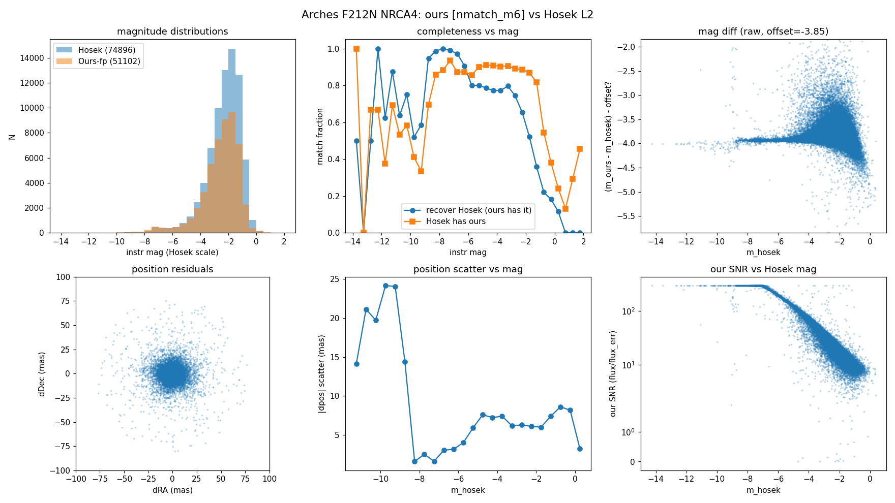
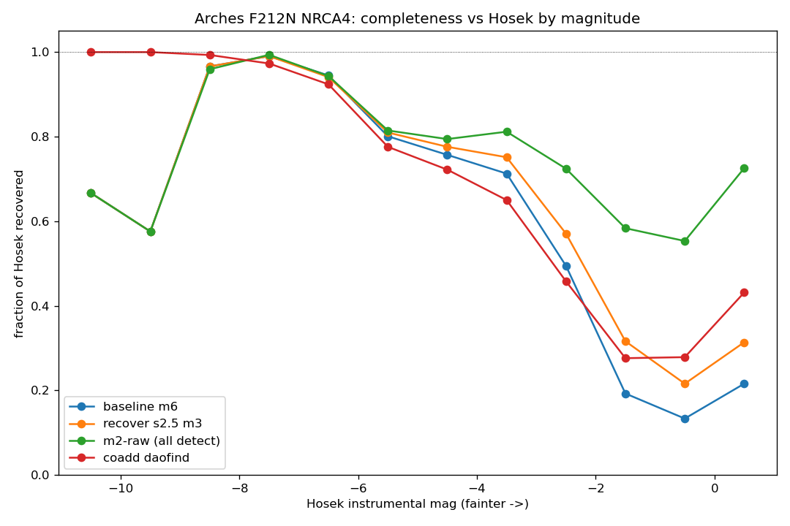
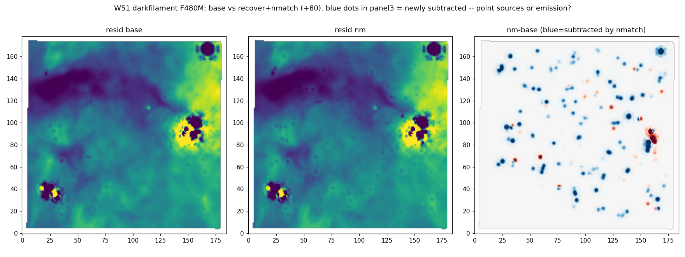
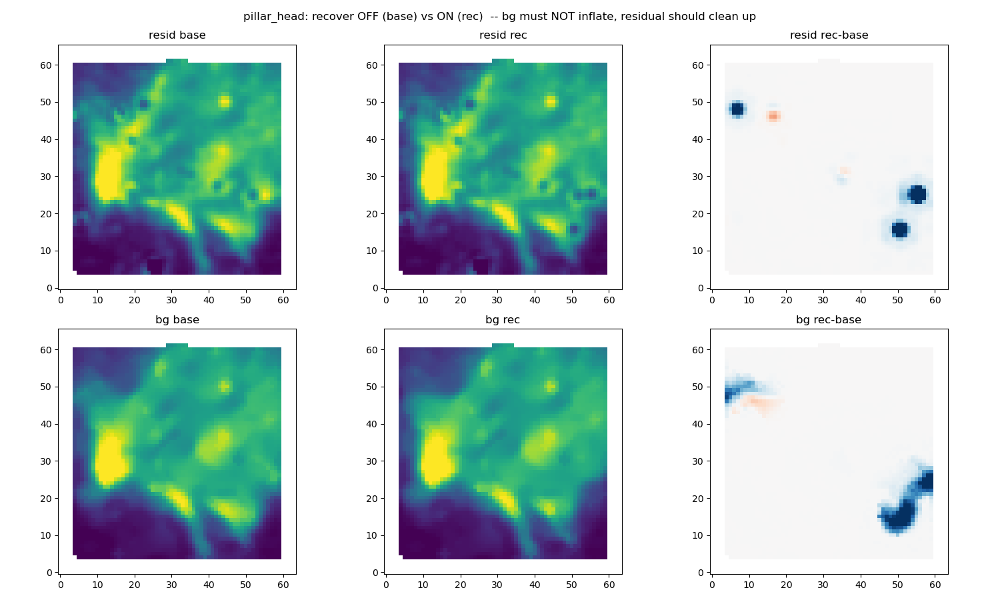
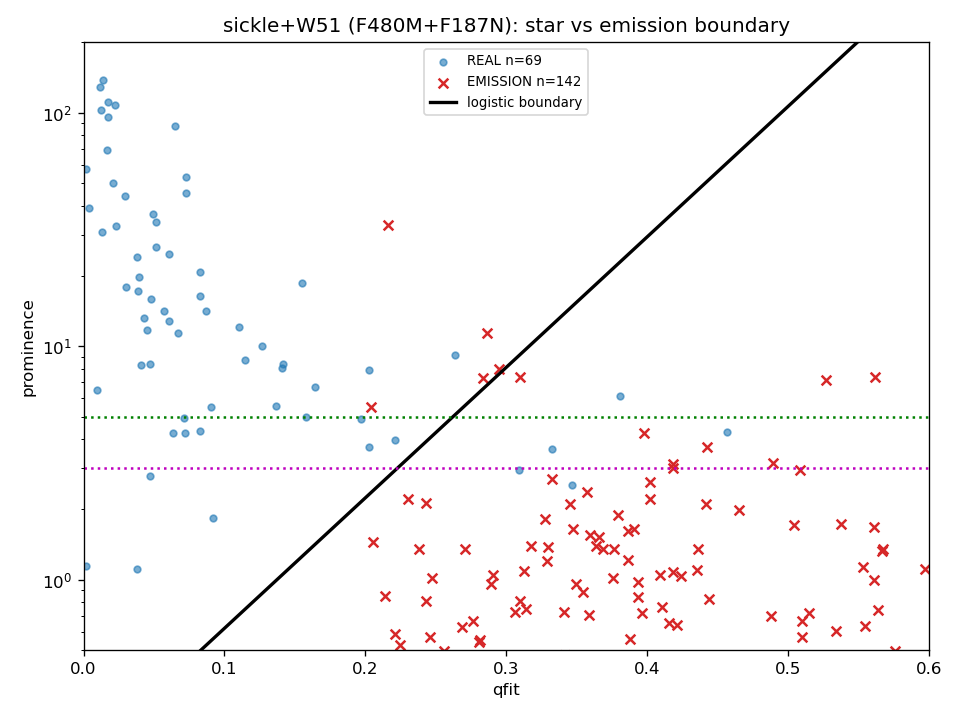

# Multi-frame-confirmation keep — verification & regression notes

This documents the depth benchmark and the extended-emission regression checks for
the recover tier + multi-frame-confirmation keep (Hosek `ndet≥3` style) added to
`_filter_extended_emission`.

## What & why

Benchmarking the Arches F212N NRCA4 catalog against Matt Hosek's UCLA pipeline
showed we were ~1–2 mag shallower. Investigation established the deficit is **not
detection** — our per-frame detection already finds 68% of Hosek's stars (a
DAOStarFinder pass on the deep coadd is *worse*, 43%, from crowding). The loss is
**survival**: the first extended-emission vetting drops faint *detected* stars
(completeness 0.64 → 0.42). Hosek's depth edge is that he keeps faint marginal
stars via `ndet≥3`; we were dropping them per-vetting on single-catalog `qfit`/`snr`.

The fix (opt-in, default OFF): keep any source with `nmatch ≥ N` and
`qfit ≤ cap`, regardless of the qfit/snr cuts. Because emission is fixed on-sky
and also repeats across dithers, an optional **position-stability guard**
(`--manual-ext-nmatch-confirm-maxpos-mas`) requires a tight across-exposure
centroid (real stars ~3–7 mas; emission-knot daofind centroids wander).

## Depth benchmark vs Hosek (Arches F212N NRCA4, 74,896 Hosek sources)

Completeness ladder (fraction of Hosek recovered, full pipeline m1–m6):

| catalog | ours in footprint | matched to Hosek | completeness | Hosek-only |
|---|---|---|---|---|
| baseline (no recover) | 32,343 | 28,931 | 0.386 | 45,965 |
| recover tier | 36,963 | 32,502 | 0.434 | 42,394 |
| **+ multi-frame keep** | **51,102** | **43,650** | **0.583** | **31,246** |

**+14,719 real Hosek matches over baseline (0.386 → 0.583).** Positions stay
tight (median separation 3.1 mas, robust 2.2–2.8 mas). Ours-only = 7,452
(spurious, acceptable on a dense field where Hosek carries spurious too). The
remaining ~31k Hosek-only is ≈ half his own artifacts (spikes/emission) plus his
sub-3-frame faint detections — near the fair-match ceiling.



### Detection is not the bottleneck — survival is

Completeness vs Hosek instrumental magnitude. We fully match Hosek at the bright
end (m<−6 ≈ 1.0). `m2-raw` (green, all detections) stays high even at the faint
end — we *detect* the faint stars — but the final catalogs collapse; that gap is
the detected-but-dropped population the multi-frame keep recovers. The deep-coadd
daofind (red) is worse than per-frame, so detecting harder does not help.



## Regression verification

### Unit tests — `test_recover_tier_vetting.py` (18 pass)
- Recover tier: no-op default; admit blended real; reject emission/low-snr/near-satstar;
  sloped-prominence admit/reject on a synthetic i2d; persisted `prominence`/`peak_sb` columns.
- Multi-frame keep (5 new): default-off; admit faint multi-frame star; respect qfit
  ceiling; require ≥N frames; **position guard rejects a wandering (100 mas) source and
  keeps the tight (3 mas) one**.

### Full photometry suite
`pytest jwst_gc_pipeline/photometry/tests/` → **205 passed** (0 failures). The
merge, satstar, box-artifact, off-FOV, and integration regressions all stay green.

### Extended-emission cutouts (the key check)
All 5 cutouts re-run end-to-end with recover + multi-frame keep *enabled*
(`--manual-ext-nmatch-confirm=3 --manual-ext-nmatch-confirm-qfit-max=0.6
--manual-ext-nmatch-confirm-maxpos-mas=20`), compared to the recover-off baseline:

| cutout (type) | vetted base→nm | bg median | bg max | over-sub min |
|---|---|---|---|---|
| pillar_head (sickle emission) | 12 → 15 | 54.4 → 53.7 ↓ | 139.9 = | unchanged |
| pillar_with_satstar (sickle) | 37 → 53 | 6.55 → 6.32 ↓ | ~= | unchanged |
| w51 darkfilament F480M (emission) | 106 → 186 | 56.0 → 55.4 ↓ | 478.8 = | unchanged |
| w51 darkfilament F187N (emission) | 69 → 84 | 14.8 → 14.8 = | 191.3 = | unchanged |
| low_background (star field) | 46 → 66 | 1.03 → 0.78 ↓ | = | unchanged |

**Every emission field's background median goes DOWN (never inflates), maxes are
unchanged, residuals are cleaner, and no new over-subtraction holes appear** — the
extended-emission scheme is preserved.

Visual confirmation on the emission-heaviest field (W51 dark filament, +80
sources). Panel 3 (nm − base) shows the newly-subtracted sources are **discrete
point stars scattered across the field, not the continuous emission ridges** —
the ridge structure in panels 1–2 is unchanged between base and nm. The position
guard did its job.





### Recover-tier prominence boundary (context)

The recover tier's sloped `(qfit, log prominence)` gate, fit on labelled sickle +
W51 cutouts (real = blue, emission = red). Keeps 63/69 real at 5/142 emission.



## Reproduce

```
# depth ladder + detection ceiling
python .../depth_ceiling_test.py
# emission-cutout regression (recover + nmatch), base vs nm
sbatch cutout_nm.sbatch            # 5 cutouts, --manual-ext-nmatch-confirm=3 ...
# full-frame Arches (definitive)
sbatch arches_nmatch.sbatch        # slope-5.6 recover + nmatch=3 + maxpos=20
```

Default OFF (`--manual-ext-nmatch-confirm 0`) is byte-identical to prior behaviour.
