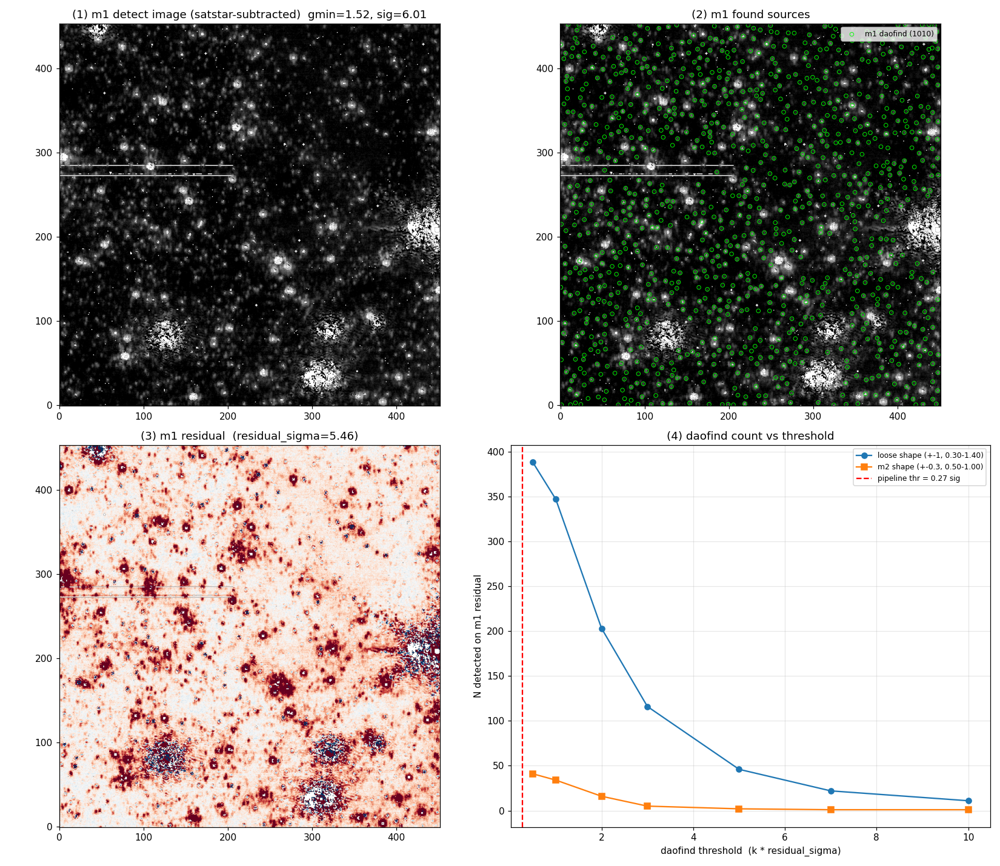
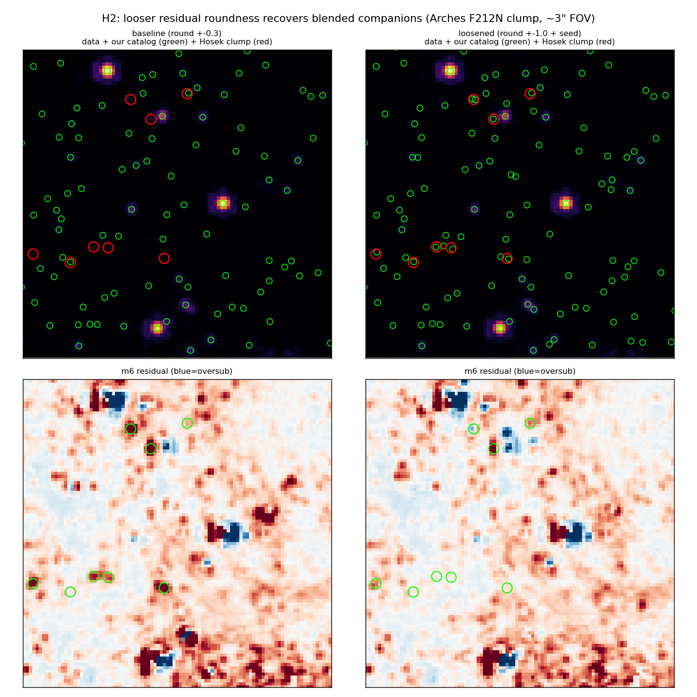
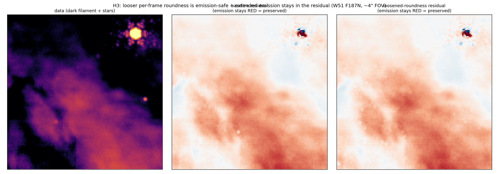
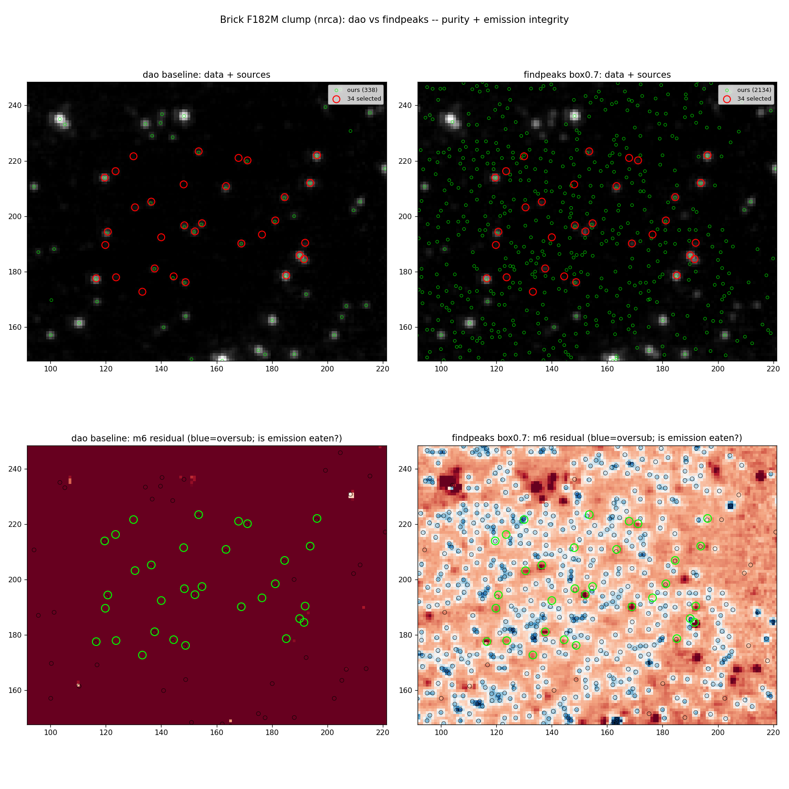
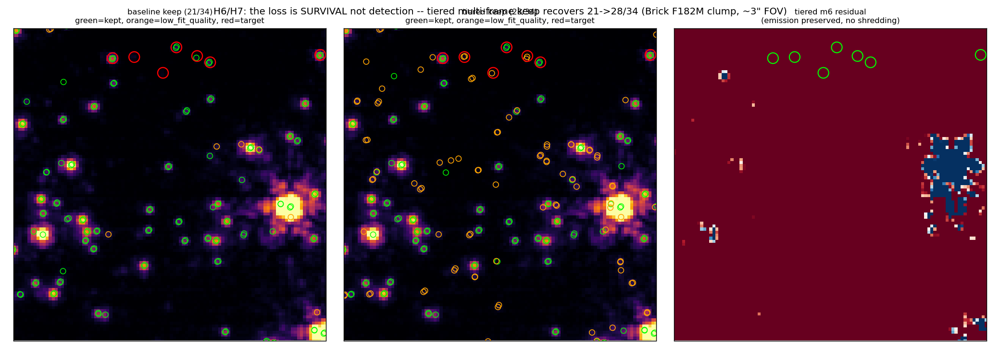
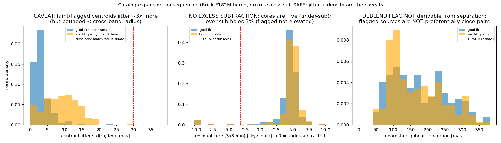

# Recovering faint blended + on-emission stars — investigation writeup (PR #57)

Goal: recover real stars the PSF-photometry pipeline was dropping, benchmarked against
Matt Hosek's UCLA Arches F212N NRCA4 catalog and a hand-selected Brick F182M dense clump
(`jwst_cat_f182m_selected_stars.reg`). Each hypothesis below was tested with a cutout run
and confirmed visually on ~2" zoom-ins (data + catalog overlays + residuals).

Base rates before this PR: Arches completeness vs Hosek **0.583**; Brick F182M selected-star
clump **21/34** recovered (tight 25 mas match).

---

## H1 — "The detection threshold is the limiter." → FALSE

If we detect fewer faint stars because the daofind threshold is too high, lowering it should
find more. Test: sweep the per-frame detection-floor scale (min-noise floor × {1.0, 0.5, 0.25}).

**Result:** the raw daofind counts were *byte-identical* across a 4× threshold change — the
floor `min(noise_map)` already sits at ~0.27σ ("over-detect-everything"). daofind *does*
respond to threshold (right panel: count falls monotonically with a proper σ-scaled threshold),
the pipeline just already sits at the bottom. **Threshold is not the limiter.**

---

## H2 — "The roundness cut rejects real blended companions." → TRUE (shipped)

daofind's roundness/sharpness shape cut on the residual passes was hardcoded tight (round ±0.3).
A faint companion on a brighter neighbour's PSF wing is intrinsically *less round*, so the cut
rejects it. Test: loosen the per-frame residual roundness to ±1.0 (+ optional coadd-seed loosen).

**Result:** on the Arches clump the Hosek stars that had **no** catalog match under the tight cut
(red circles, no green point, left) are **recovered** under the looser cut (green point inside the
red, right). Completeness 0.490→0.564 on the clump, purity unchanged. **This is the shipped
default change (±0.3 → ±1.0).**

---

## H3 — "Looser roundness will eat extended emission." → SAFE (per-frame)

Looser shape cuts could admit non-round *emission* knots as stars and subtract them, carving
holes in the nebula. Test: the loosened config on the W51 F187N dark filament + sickle pillar.

**Result:** the m6 residual stays **red (positive) across the whole filament** under the looser
per-frame roundness — the extended emission is left in the residual, not subtracted. Over-subtraction
fraction is unchanged. **The per-frame roundness default is emission-safe.** (The *coadd-seed*
loosening is more aggressive on emission and is kept a star-field opt-in.)

---

## H4 — "A raw peak-finder (find_peaks) resolves sub-FWHM pairs daofind merges." → FALSE WIN

DAOStarFinder convolves with a ~FWHM kernel before finding maxima, which merges close pairs.
`find_peaks` (raw local maxima) resolves them. Test: swap the finder on the Brick clump.

**Result:** find_peaks *appeared* to recover more (29/34 at 100 mas) but this was **chance** — it
floods the field with 2134 sources (6× dao) that carpet blank sky, and the m6 residual is **shredded
into over-subtraction holes** (right): the extended emission is destroyed. At a tight (1 px) match it
collapses to 15/34, the worst. Raw find_peaks removes the shape cut, which is the only discriminator
between faint stars and emission peaks. **Rejected.** (Constrained "hybrid" variants that split only
near a confirmed dao detection kept emission safe but recovered no *real* stars either.)

---

## H5/H6 — "The remaining gap is DETECTION." → FALSE; it's SURVIVAL

On the Brick F182M clump we detect **31/34** stars in the raw per-frame catalogs (tight match),
but only **21/34** survive to the vetted catalog. The lost 10 are the faintest, on structured
emission, so the PSF fits them poorly (qfit ~1.0 vs 0.30 for survivors) — and the multi-frame keep
gate dropped them because qfit exceeded its 0.6 ceiling, **despite** up to 7-frame positional
confirmation. **The loss was survival (vetting), not detection.**

## H7 — "A tiered keep, protecting many-frame detections regardless of qfit, recovers them." → TRUE (shipped, opt-in)

A source at a fixed sky position in ≥N frames is real even if the PSF fits it badly. Add a STRONG
tier (`--manual-ext-nmatch-confirm-strong=N`, keeps any qfit) and flag such survivors
`low_fit_quality` (positions solid, flux unreliable → photometry cuts, astrometry keeps).

**Result:** Brick clump **21/34 → 28/34** (+7 = exactly the detected-but-dropped stars), all flagged;
the m6 residual is unchanged (emission preserved, no shredding). Left→middle: the red target stars gain
green catalog points (orange = `low_fit_quality`). The remaining 6: 2 outside the cutout, 1 borderline,
3 seen in only 2 frames.

---

## What ships in this PR

1. **Per-frame residual roundness default ±0.3 → ±1.0** (H2) — emission-safe (H3), regression-verified.
   Recovers blended companions. Arches clump 0.490→0.564; full-field 0.583→0.630.
2. **Tiered multi-frame keep + `low_fit_quality` flag** (H7) — opt-in (default off = byte-identical).
   Recovers faint on-emission survival losses (Brick 21→28/34) without polluting photometry.

Dead ends (not shipped): lowering the detection threshold (H1), raw find_peaks / hybrid deblenders (H4).

## Reproduce

`python docs/pr57_recovery_investigation/make_figs.py` regenerates the figures from the on-disk
cutout products (Arches `groupA_{baseline,bothloose}`, W51 `w51df187_{base,loose}`, Brick
`f182m_kt_{baseline,tiered}`). Cutout configs are in the benchmark workspace sbatches.

---

## Consequences & caveats of the expansion

Measured on the Brick F182M tiered cutout (nrca; has `low_fit_quality`, `std_ra/dec`, `nmatch`).

### Negative consequences checked

1. **Excess subtraction in the residual maps (the worry) — NOT happening.** Residual cores at source
   positions are **+4.7σ (under-subtracted, not over)**; over-subtraction holes (core < −3σ) barely rise
   (2.7% → 3.2%) and are **not** elevated for flagged sources (3.5% vs 3.0% good). The faint keep-tier
   sources are fit with low flux, so they don't carve holes. **Safe.**

2. **Bad SW seeds → excessive LW deblending — blocked for uncertain sources.** The cross-band seed
   (`_build_crossband_seed`) requires `qfit < 0.2` **and** confirmation in `≥ min_filters` (default 2).
   The expansion's uncertain sources (recover-tier qfit 0.2–0.5, tiered-keep qfit > 0.6, all
   `low_fit_quality`) **fail the qfit<0.2 gate and never seed cross-band.** Residual risk: a *genuine*
   SW close pair confirmed in two SW filters could seed an LW fit below LW resolution → LW over-deblend;
   this is pre-existing behaviour, modestly amplified, and **should be verified on a full multi-band m7
   run** (the Arches benchmark is single-filter).

3. **False cross-wavelength matches — density-scaled risk.** Source density rises **+39%**
   (nrca 5.4 → 7.5 / arcsec²). At the 30 mas cross-band match radius the chance-match probability per
   source is ~2%, rising ~in proportion to density.

### Caveats for downstream analysis

- **Centroid jitter:** faint / `low_fit_quality` sources jitter **~3× more** (median std(ra,dec)
  9.4 mas vs 2.9 mas for good fits), but bounded — 90th pct 16.5 mas, **none exceed the 30 mas
  cross-band radius**. Positions are usable but downweight by `std_ra`/`std_dec`.
- **A deblend/uncertainty flag is NOT derivable from source separation.** The flagged/faint sources are
  **not** preferentially close pairs — their nearest-neighbour distribution matches the good sources
  (frac < 1 FWHM: 4% vs 6%). Separation ≠ reliability, so the **`low_fit_quality` flag is necessary and
  non-redundant** (it captures fit quality on emission that separation cannot).

### Safeguards

1. **`low_fit_quality` flag (shipped)** — propagate through the cross-band merge; photometry users cut it,
   astrometry/completeness users keep it.
2. **`std_ra`/`std_dec` (already in the catalog)** — per-source position uncertainty for match weighting.
3. **Cross-band seed already gates `qfit<0.2` + `min_filters≥2`** — uncertain expansion sources don't propagate.
4. **Recommended:** a tighter cross-band match tolerance (or `std_ra/dec` weighting) for `low_fit_quality`
   sources (~10 mas jitter vs the 30 mas default), and a full multi-band m7 run to confirm no LW over-deblend.
