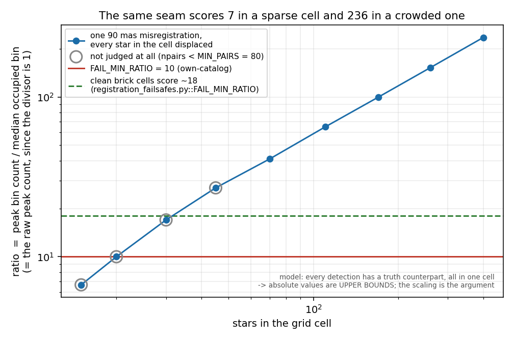

# The registration seam check's confidence number is a star count

**Summary: the number the release gate uses to decide whether a suspicious patch
of a mosaic is trustworthy is, arithmetically, the raw number of star pairs in
one histogram bin. It grows with star density, so one and the same
misregistration is silently ignored in a sparse patch and fails the release in a
crowded one.**

Reproduce with:

```bash
python scripts/analysis/registration_contrast_statistic.py
```

Background for issue #170, which was filed in shorthand ("the FAIL discriminant
is density-coupled") and could not be reviewed on those terms.



(`.gitignore` carries a blanket `*.png` under a comment saying figures live in
the Overleaf project — but report figures here are force-added in practice:
`docs/reports/apphot/` holds 13 and `docs/evidence/satstar_fit_footprint/` 2.
This one is committed the same way.)

## Glossary

Everything below is written for someone who does not work on this pipeline.

| term | meaning |
|---|---|
| **mosaic** | one combined image of a field in one filter, made by resampling ("drizzling") many exposures onto a common grid |
| **module** | NIRCam images through two detector modules, A and B (`nrca`, `nrcb`). Their footprints overlap on the sky |
| **seam** | the strip where the two modules' data are stitched together — where a misregistration between them appears |
| **registration** | whether a star's position on the mosaic is where the star actually is |
| **truth set** | a second list of positions that ought to agree with the mosaic's detections |
| **mas** | milliarcsecond, 1/3 600 000 of a degree. Pixels here are ~30 mas; the effects in question are 60–90 mas |
| **H** | the 2-D histogram of star-pair separations, described below |

## Where in the pipeline this happens

At the very end, in the **release gate** — after a field has been reduced,
drizzled into mosaics and cataloged, and immediately before its images and
catalogs would be published. `scripts/release/registration_failsafes.py` runs
there and can refuse the release.

A whole-field average is not enough, and that is known from a specific failure:
the brick field (proposal 1182, filter F356W, July 2026) carried several
arcseconds of misregistration confined to the module seam, while the field
average was about zero. So the check is spatially resolved — a 20×20 grid over
the mosaic, and the question asked separately in each cell.

## What it does inside one cell

Take every bright source detected on the mosaic, and a **truth set** — a second
list of positions that ought to agree with it. Pair each detection with every
truth position within 2.5 arcsec, and histogram those pair separations into
40 × 40 mas bins.

- A star paired with **itself** — seen once in the mosaic, once in the truth set
  — lands at the separation between the two, and every such pair in the cell
  lands at the *same* separation, so they pile into one bin.
- A star paired with an unrelated **neighbour** lands somewhere arbitrary, and
  those spread thinly over the whole search disk.

So the histogram is one peak on a thin floor, and **where the peak sits is the
cell's measured misregistration**. Two numbers come out:

```python
off   = distance of the peak bin from zero, in mas      # the measurement
ratio = H.max() / median(H[H > 0])                       # "is that peak real?"
```

A cell **fails** — and one failing cell fails the whole field, blocking the
release — when *all* of:

```
npair >= MIN_PAIRS (80)  and  ratio >= MIN_PEAK_RATIO (5)     [ "verified" ]
off   >  OFF_MAX (60 mas)
ratio >= FAIL_MIN_RATIO
```

`FAIL_MIN_RATIO` is **10** for the own-catalog check and **5** for the
cross-band one. There are three outcomes, not two: below the `verified` bar a
cell is **unverified** — neither passed nor failed, and not reported as a
problem.

### Which checks actually run

Three truth sets exist in the module, but `--scan`, which is what the release
gate runs, uses **two**:

| check | truth set | runs at the gate? |
|---|---|---|
| cross-band | the same stars detected in another filter | **yes** |
| own-catalog | the mosaic's own vetted source catalog | **yes** |
| per-module | the same band's single-module (`nrca` / `nrcb`) mosaics | only from the single-filter command line, and as a fallback view when a band has no combined mosaic |

None uses an external reference catalogue, deliberately: crowding and extinction
cannot fool a check whose two sides both come from JWST.

**The own-catalog check has a known blind spot**, recorded in `CLAUDE.md` and
worth repeating because it bounds how much the gate is worth: the mosaic and its
own catalog derive from the same calibrated exposures, so a per-visit residual is
self-referential and **cancels** — both are wrong the same way, they agree, and
the cell passes. A green `registration_failsafes` is not sufficient on its own.

## Why `ratio` does not mean what its name says

### Table 1 — the divisor is 1

The 2.5 arcsec search disk contains **12,281** bins of 40 × 40 mas (counting
bins whose centres fall inside it). A grid cell holds tens to hundreds of pairs.
With far more bins than pairs, essentially every occupied bin outside the peak
holds exactly one pair:

| stars in the cell | 15 | 20 | 30 | 45 | 70 | 110 | 170 | 260 | 400 |
|---|---|---|---|---|---|---|---|---|---|
| pairs | 16 | 23 | 37 | 63 | 116 | 226 | 440 | 888 | 1886 |
| `median(H[H>0])` | 1.5 | **1.0** | **1.0** | **1.0** | **1.0** | **1.0** | **1.0** | **1.0** | **1.0** |

(The 15-star cell reads 1.5 because with only 16 pairs the median is taken over
a handful of bins. That cell is far below `MIN_PAIRS` and is never judged; every
density the gate actually looks at reads exactly 1.)

So `ratio` is `H.max() / 1` — **the raw number of pairs in the peak bin**. It is
not a ratio and nothing normalises it. `FAIL_MIN_RATIO = 10` means, literally,
"the peak bin must contain at least ten pairs".

### Table 2 — so the bar is crossed at a star density

One misregistration — 90 mas, **every star in the cell displaced by it** —
measured by the real estimator at different star densities. The seam is
identical in every row; only the number of stars changes. (`off` reads 80 for a
90 mas injection because the 40 mas bin edges fall at …, −20, 20, 60, 100 — the
real gate quantises the same way.)

| stars in the cell | pairs | `off` (mas) | `ratio` | verdict |
|---|---|---|---|---|
| 15 | 16 | 80 | 7 | unverified — not judged at all |
| 20 | 23 | 80 | 10 | unverified — not judged at all |
| 30 | 37 | 80 | 17 | unverified — not judged at all |
| 45 | 63 | 80 | 27 | unverified — not judged at all |
| 70 | 116 | 80 | 41 | **FAIL** |
| 110 | 226 | 80 | 65 | **FAIL** |
| 170 | 440 | 80 | 100 | **FAIL** |
| 260 | 888 | 80 | 153 | **FAIL** |
| 400 | 1886 | 80 | 236 | **FAIL** |

Read down the `ratio` column: the same seam scores **7** in a sparse cell and
**236** in a crowded one, a factor of 34. The verdict flips from "not judged" to
"blocks the release" purely on how many stars the cell happens to contain.

Two thresholds are doing that, and both are counts:

- `MIN_PAIRS = 80` — below roughly 50 stars per cell the check does not run at
  all, and the cell is silently unverified.
- `FAIL_MIN_RATIO` — above the pair floor, the peak-bin count must reach 10.

The scaling is the expected one and it is worth stating so the numbers are not
mistaken for a fitted curve: the peak grows as the number of stars *n*, while
the chance-pair background grows as *n²*, so `ratio` ∝ *n* ∝ √(pairs). Density
coupling is arithmetic here, not an empirical finding.

And the bar is hardest to clear in the sparsest cells, while the crowded cells
where it is easiest are the Galactic Centre field interiors — where a seam
matters most and where chance-pair confusion is also worst.

## The false alarm that set the current threshold

In July 2026 the own-catalog check failed the brick field's F405N band on seven
cells, each reading an 80 mas offset at `ratio` 5–8. An independent same-star
comparison — matching the individual stars between the two lists and taking the
median displacement, rather than histogramming all pairs — read ≤ 22 mas over
those same regions. So the cells were not misregistered and the failure was
spurious. #166/#172 responded by raising the own-catalog bar from 5 to 10, which
removed those seven, and left the cross-band check at 5.

Those seven cells held 232–323 pairs at `ratio` 5–8 — their peak bins held
**1.7–2.5%** of their pairs (median 2.2%), i.e. no coherent same-star signal at
all, which is what makes them false positives.

**The threshold sits below what a correctly-registered cell scores.** The best
evidence for that is not this document's model but the gate's own record, at
`registration_failsafes.py:52-54`: *"the clean brick cells verify at median
contrast ~18"*. So `FAIL_MIN_RATIO = 10` is under the contrast a **clean** cell
of that field produces — a factor of ~1.8 — which puts the bar in the noise, and
means raising it from 5 to 10 removed those seven cells without ever having
distinguished them from a seam. A sparse cell's genuine seam scores 7 (Table 2,
15 stars) and lands in the same place. The threshold separated the two
populations on this band by luck of density, not because the statistic
distinguishes them. That is the whole of #170.

**Where the model and the real data disagree, and it is worth saying.** Table 2
puts a fully misregistered cell of 232–323 pairs at `ratio` **69–79**, against
that recorded ~18 for real clean brick cells of comparable density — a factor of
about four. The model assumes every detection has a truth-set counterpart and
that all of them sit in the one cell; real catalogs are incomplete and real
cells are not that clean, so **Table 2's absolute values are upper bounds**.
What the argument rests on is the *scaling* — `ratio` growing linearly with star
count while the thresholds stay fixed — and that is arithmetic, unaffected by
the normalisation. Anyone re-deriving a threshold from this must calibrate on
real cells, not on Table 2.

## What would replace it

Two changes, both still unimplemented:

1. **A density-flat significance.** Not `(H.max() − bg)/√bg` with the same `bg`
   — with `bg` pinned at 1 that is identically `ratio − 1` and adds nothing
   (measured: the seven brick cells go 5,5,5,6,6,6,8 → 4,4,4,5,5,5,7). It has to
   use the *expected* chance-pair background, `lam = npairs / n_disk_bins`,
   which is fractional and keeps scaling with density where the median saturates
   at 1. The peak grows as *n* and `lam` as *n²*, so the significance is flat in
   density where the raw count is linear in it.

2. **Contiguity, as an independent second axis.** A misregistration is a
   connected patch of cells; chance-pair noise is scattered singletons. It needs
   no new measurement — the offsets and the verified flags are already on the
   grid — and in the #179 trial it was much the stronger of the two, firing on
   365 / 179 / 45 cells of three synthetic seams injected into real data (a whole
   field, half a field, and a narrow declination band) against the raw count's
   273 / 127 / 29, and on **zero** cells across the ten brick bands and five cloudc bands
   #179 tested (brick has eleven band directories today and cloudc eight, so
   that sweep did not cover every band even then).

   One measured constraint: the minimum patch has to be **3 cells, not 2**. Two
   of the seven brick false positives are edge-adjacent on the grid, so a 2-cell
   bar re-creates the exact false alarm this is meant to remove.

An attempt at both, PR #179, was closed without a stated reason, and nothing from
it is on `main` — verified at `a2e1533`: `FAIL_MIN_RATIO = 10.0` is still at
`registration_failsafes.py:51`, and neither `FAIL_MIN_SIG` nor `MIN_SEAM_CELLS`
exists anywhere in the tree.

## Loose end

All seven brick F405N cells peak at the **same vector**, +80 mas in RA, to the
bin. Chance pairs would not agree on a direction. That looks more like a small
localized systematic between the F405N mosaic and its own catalog than like
noise — the ≤ 22 mas same-star reading is what makes us call them false
positives, but the two measurements are not obviously measuring the same thing
(mosaic-versus-catalog here, catalog-versus-catalog there). If they *are* real,
both the current threshold and any replacement calibrated against them are
suppressing a genuine 80 mas signal in seven cells. Not chased down.

## Caveats

- Both tables run the **real** estimator — the same bin geometry, the same
  `H.max() / median(H[H>0])`, the same peak selection — over **synthetic** star
  fields. That is deliberate: it shows a property of the statistic rather than of
  any one field, and it reproduces without the archive. It is not a measurement
  of any real seam.
- A cell is modelled as *n* detections and their *n* truth counterparts in a
  45-arcsec box, with chance pairs arising on their own from the other truth
  stars inside the search radius. An earlier version of this document instead
  modelled a cell that a seam only *clips* as "a few displaced pairs plus uniform
  noise", which silently deleted the correctly-registered stars in the rest of
  that cell. With those present the peak sits at **zero** and the cell is never
  even a fail candidate, so that curve described nothing real. It has been
  removed; a partially clipped cell is not the interesting case.
- The 45-arcsec cell size and the 15 mas per-star scatter are representative,
  not fitted. The shape of Table 2 — a count linear in star number, crossing
  fixed bars — does not depend on them.
- `median(H[H>0]) = 1` holds up to a few thousand pairs per cell and breaks
  around 20 000, which no cell in this survey approaches. The only real per-cell
  pair counts on record are the seven brick cells' 232–323; the scan results
  under `registration_scan_results/` do not record `npairs` or `ratio` for
  passing cells, so there is no on-disk confirmation of the divisor across the
  survey.
