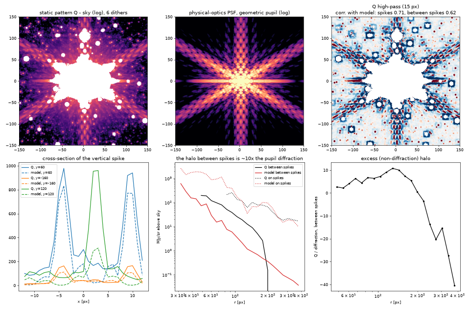
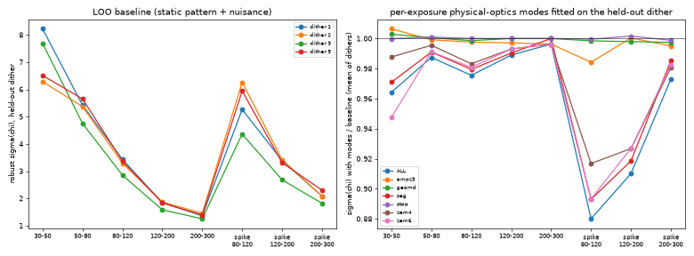

# Poisson-limited subtraction of a heavily saturated NIRCam star (10678, F480M)

Goal: fit and remove one of the brightest saturated stars in the Galactic Center
Treasury program (GO-10678) so that **every modeled pixel has a residual consistent
with Poisson noise**, with the claim tested **out of sample**.

**Status: not reached everywhere.**

- **Outer wing (r ≳ 200 px, 12″):** held-out dithers are predicted to a robust
  σ(χ) of 1.2–1.3. The remaining excess is not structure in the saturated star's
  PSF (see §4).
- **Inner halo (r ≲ 150 px, 9″):** the residual is 2–8σ, about **4–5% of the
  star's local intensity**. The cause is a dither-to-dither change in the star's
  halo. It is real in the raw ramps, happens only in the LW channel, stays fixed
  within an exposure, and has PSF-scale (λ/D) structure. No model built from
  the other dithers can predict it (§3).

This directory holds the tooling, the diagnostics that isolate the floor, and
the numbers. Nothing here is wired into the pipeline yet.

## 1. Target and data

| | |
|---|---|
| star | RA 266.5090307, Dec −28.9565882 (obs 061, NRCB5) |
| filter | F480M, BRIGHT2, 4 groups × 2 integrations, 172 s, FULLBOX 6-point dither |
| saturation | 11 188 px carry the any-group SATURATED flag (a 160×128 px ellipse); 2 504 px are lost (NaN) |
| brightness | brightest isolated star in the 136 public 10678 LW first dithers (`scan`, §6) |

MAST (`mast.stsci.edu`) is not reachable from the sandbox. The same public
products come from the AWS open-data mirror via `s3data.py`
(`https://stpubdata.s3.amazonaws.com/jwst/public/jw10678/...`).

STPSF and Jay Anderson's PSF libraries need STScI hosts that are not reachable
here either. The PSF, and everything else, is therefore empirical and built from
the data.

## 2. Method (what the code does)

1. **Geometry comes from the GWCS, never SIP (CLAUDE.md rule #2).** `cutout.py`
   stores per-pixel V2V3 coordinates for a 1024² cutout of each dither.
   Differential distortion between dithers is large. Relative to a pure
   translation it reaches **2.7 px at r=200 px and 6.4 px at r=500 px**
   (`diagnostics.differential_distortion`). A detector-pixel PSF or stack
   therefore cannot be shared between dithers.
2. **Band-limited representation.** F480M is Nyquist-sampled: the optical cutoff
   at 4.63 µm is D/λ = 0.435 cycles per 0.063″ pixel. The model lives on a grid
   in the ideal (V2V3) frame, as Fourier coefficients inside |k| ≤ 0.45. It is
   evaluated exactly at every distorted pixel position with a type-2 NUFFT
   (`bandpsf.py`, finufft), and the adjoint is exact (dot-test in `bandpsf.py`).
3. **Why not "PSF + fitted neighbours".** In F480M the Galactic Center is
   confusion-limited. A 5 000–8 000-star neighbour fit leaves robust χ≈15
   everywhere: residuals of ~9 MJy/sr against σ≈0.5. Everything sky-fixed is
   common to the 6 dithers: faint stars, nebulosity, and the saturated star's
   PSF itself, since all dithers share one roll (PA_V3 = 90.1°–90.2° for every
   public 10678 visit).
4. **The model (`patternfit.py`).** One static band-limited pattern Q(q) is
   solved by preconditioned CG. Solver details that mattered:
   - band-projected Jacobi preconditioner;
   - proximal term, weighted by the hole-filled weight density;
   - round-off guard on the saturated-hole mask.

   Each exposure then gets a small nuisance model, fitted by Gauss–Newton:
   - flux scale, pedestal and gradient;
   - a cubic-polynomial distortion correction (20 parameters);
   - a first-order PSF-width kernel (3 parameters);
   - smooth halos around the target and the 4 brightest other saturated stars
     (B-splines in log r × Fourier m≤4).

   Only this nuisance (~250 parameters) is refitted on the held-out dither, so
   **leave-one-dither-out (LOO) is a true out-of-sample prediction**. The
   residual is normalised by √(VAR_POISSON + VAR_RNOISE + model variance).
5. **Cost.** 4 cores, ~10–25 min per held-out dither. `patternfit_rank2.py` adds
   a learned variable template H × smooth per-exposure amplitude.

## 3. Results


Robust σ(χ), leave-one-dither-out, pixels without SAT/JUMP flags:

| r [px] | dither 1 | dither 2 | dither 3 | dither 5 |
|---|---|---|---|---|
| 50–80 | 5.5 | 5.0 | 4.8 | 5.4 |
| 80–120 | 3.5 | 3.0 | 2.9 | 3.0 |
| 120–200 | 1.85 | 1.7 | 1.6 | 1.7 |
| 200–300 | 1.36 | 1.4 | 1.25 | 1.3 |
| 300–500 | 1.22 | 1.3 | 1.18 | 1.25 |

- **SAT-flagged pixels** (partially saturated ramps, 1–3 good groups; the
  160×128 px ellipse): σ(χ) ≈ 6.
- **JUMP-flagged pixels** (the ring just outside it, where ~40% of pixels at
  r<120 are flagged): ≈ 2.

Each iteration and what it bought (robust σ(χ), all held-out pixels of dither 1):

| model | σ(χ) | r 80–120 |
|---|---|---|
| detector-pixel dither differencing (no distortion) | 4–13 | – |
| static Q, translation only, unconverged CG | 2.18 | – |
| + per-exposure smooth star halo, converged CG | 1.48 | 3.5 |
| + cubic distortion, PSF-width kernel, secondary halos | 1.42 | 3.47 |
| + learned variable template (rank 2) | 1.43 | 3.44 |
| band limit 0.45 → 0.5 cycles/px (600 px crop) | – | 3.49 |
| super-resolved Q: 0.5 px grid, band 0.75 cycles/px (600 px crop) | – | 3.67 |
| + per-exposure row(×amp)/column offsets for 1/f (`ROWCOL=1`) | 1.41 | 3.45 |

### What limits the inner halo: evidence


1. **The star's halo flux changes between dithers; its spikes do not.** Dither
   ratios on the same sky, using exact GWCS resampling (fig 3), are
   azimuthally uniform:

   | dither | halo relative to dither 1 |
   |---|---|
   | e2 | +2 to +3% |
   | e3 | −15 to −19% |
   | e4 | −16 to −20% |
   | e5 | +6 to +8% |
   | e6 | −8% |

   The diffraction spikes stay at ratio ≈1.
2. **It is in the raw data.** The `_uncal` group differences at r=45–70 px are
   4236 / 4390 / 3616 / 3620 / 4614 / 3988 DN per group for dithers 1–6, while
   the far field stays at ~430 (fig 4a).
3. **It is constant within an exposure.** int2/int1 is 1.000 ± 0.0005 at r>70.
   The LOO residuals of the two integrations correlate at 0.97 at r=50–80
   (fig 4b), while int1−int2 is pure noise (σ(χ)=0.88).
4. **It is LW-only.** The simultaneous F212N (NRCB1) halo of the same star is
   stable to a few per cent across the same dithers. Telescope wavefront changes
   would show up more strongly at 2 µm, not less.
5. **It has PSF-scale structure.** Residual autocorrelation is 0.68 / 0.40 / 0.27
   / 0.10 at lags 1 / 2 / 3 / 5 px. It is neither white per-pixel noise nor a
   smooth field.
6. **Ruled out, each with a direct test:**

   | candidate | test and result |
   |---|---|
   | stellar variability | spikes do not change; the changes are step-like between exposures |
   | pipeline | the raw ramps show it |
   | persistence | at the previous dither's saturated core the excess is +10% (below/left) vs −10% (above/right), mean ≈0: PSF asymmetry, not afterglow |
   | distortion or WCS error | the cubic per-exposure correction gains nothing |
   | PSF width / jitter | the ∂²Q kernel gains nothing |
   | smooth additive or multiplicative halo | no gain up to m≤12, 500 parameters |
   | star-centred warp | no gain up to 364 parameters |
   | brighter-fatter effect | the δQ ∝ ∇·(Q∇K∗Q) regression gains nothing |
   | detector-fixed flat errors | cross-dither correlation of relative residuals at the same detector pixel is only +0.08–0.10 |
   | a shared low-rank template | the SVD of the six in-sample residual maps is full-rank (70, 18, 12, 11, 7, 4 × noise) |
   | aliasing of power above the optical cutoff | a single exposure does carry power at 0.45–0.5 cycles/px near the star, but neither a 0.5 band limit nor a super-resolved pattern (0.5 px grid, band 0.75, de-aliased by the dithers' sub-pixel phases) predicts the held-out dither any better |
7. **Other stars do not predict it.** A spike-normalised halo index varies from
   dither to dither for all 8 bright NRCB5 stars in other visits. The pattern
   partly follows the dither x-offset: fine-structure deviations of the target
   and of the obs-116 star (½ the flux) correlate at ≈+0.1 for the same x-offset
   and ≈−0.1 for the opposite. That is a weak shared field-dependent component;
   90% is star- and exposure-specific.

**Interpretation.** For this star, the LW halo at 3–10″ is, per exposure, a
different realisation at the 4–5% level of local intensity. Nothing in the other
dithers or in other stars carries the information needed to predict it. The
per-exposure PSF would have to come from a physical optics model with
per-exposure pupil or wavefront modes (phase retrieval on the star's own wings),
or from dither patterns that revisit the same field position.

**The limitation is specific to the brightest stars.** A 4–5% relative excess
equals Poisson noise for a star ~10× fainter than this one at the same radius.

## 4. The outer-wing / far-field floor (σ(χ) ≈ 1.1–1.3), not saturated-star PSF

- **Pixels more than 10 px from any field star, r>300:** σ(χ)=1.095. Row and
  column means of χ scatter 2× more than independent noise allows, but
  per-exposure row(×amplifier) and column offsets (`ROWCOL=1`) change nothing
  (r=300–500 px: 1.224 → 1.226). So this is not 1/f striping; it is coherent
  residual from stars that the rows and columns cross.
- **Within 6 px of field stars:** σ(χ)=1.4–1.55. The field-star PSF core varies
  slightly between the six detector positions.
- **Detector-fixed flat residuals:** correlation +0.08–0.10 across dithers at the
  same pixel. Flat self-calibration over the program's many LW exposures would
  address this.

## 5. Next steps

1. Replace the static field-star content of Q with explicit point sources
   rendered through a detector-position-dependent PSF library, Anderson-style,
   built from the thousands of NRCB5 F480M stars across all 10678 exposures.
   Add a flat self-calibration on top. The far-field and outer-wing excess
   (σ(χ)≈1.1–1.3) is field-star PSF variation between detector positions plus a
   ~10% detector-fixed part, which is what these two address.
2. Run `patternfit.py` on the next-brightest stars (obs 116/069/126, 2–5×
   fainter) to measure where along the brightness sequence the inner halo
   becomes Poisson-limited. The scaling above predicts ≲10× fainter.
3. ~~For the very brightest stars: a physical LW PSF model with per-exposure
   low-order pupil/WFE modes.~~ Done in §7: low-order physics does **not**
   predict the per-dither halo. What is left is either a full per-exposure
   phase retrieval (unconstrained by the saturated core; see §7.4), or an
   observing strategy that revisits the same field position.

## 6. Files

| file | purpose |
|---|---|
| `s3data.py` | list/fetch public JWST products from the stpubdata S3 mirror |
| `cutout.py` | star-centred cutouts with GWCS V2V3 per pixel |
| `bandpsf.py` | band-limited periodic PSF/pattern: NUFFT evaluation, exact adjoint, gradients |
| `exposure.py` | cutout container, weights, local Jacobians, sparse B-spline bases |
| `halobasis.py` | star-centred log-r B-spline × Fourier basis |
| `patternfit.py` | static pattern + per-exposure nuisance, joint fit and LOO (main model) |
| `patternfit_rank2.py` | + learned variable template with smooth per-exposure amplitude |
| `loo_crop.py` | LOO on a crop, for band-limit / super-resolution (`KMAX`, `QH`, `QN`) tests |
| `evaluate_loo.py` | χ statistics by DQ class, radius and model brightness |
| `diagnostics.py` | distortion, dither-ratio, raw-ramp, integration and halo-index tests |
| `make_figures.py` | the figures above |
| `physpsf.py` | physical-optics JWST + NIRCam LW PSF on the pattern grid, exact adjoint and forward derivatives (§7) |
| `physfit.py` | pupil geometry fit and OPD phase retrieval against Q (§7) |
| `physloo.py` | per-exposure physical modes fitted to the held-out LOO residual; injection and control tests (§7) |
| `make_physfigs.py` | figures 11–12 (§7) |

Reproduce (about 1 h on 4 cores):

```
python s3data.py 10678 061 nrcblong cal uncal rate rateints     # into ../data
python cutout.py 266.5090306896523 -28.95658817641266 512 tgt ../data/jw10678061001_02101_0000{1..6}_nrcblong_cal.fits
NJOINT=3 LOO=1,2,3,5 python patternfit.py q3
python evaluate_loo.py 1 q3 ; python make_figures.py figures
```

## 7. Physical-optics PSF with per-exposure pupil/wavefront modes (issue #994)

Hypothesis tested: the dither-to-dither halo change of §3 is a low-dimensional
physical change of the pupil or wavefront (LW pupil-stop shear or vignetting,
low-order LW-internal WFE, segment WFE), so that a physical-optics model with a
few parameters per exposure predicts it.

**Answer: no.** Low-order per-exposure physics absorbs part of the change *on the
diffraction spikes* (σ(χ) −5…−25% at r=80–120 px), but almost none of the change
*between* the spikes (−1…−3%), which is where the inner-halo floor is. An
injection test shows the fit would have found a low-order change of that size.

### 7.1 Model (`physpsf.py`)

- **Pupil.** STPSF pupils could not be downloaded, so the pupil is built
  geometrically: 18 flat-topped hexagonal segments (1.32 m flat-to-flat,
  7 mm gaps), a 0.74 m secondary obscuration, one strut along +V3 and two at
  ±30° from −V3. An optional circular stop with shear, and a linear
  transmission gradient, are also available. Edges are anti-aliased with a
  signed distance. The OPD is a 256² map in metres, bilinearly interpolated
  to each wavelength's samples. The interpolation is a sparse matrix, so its
  transpose is exact.
- **Sampling.** The pupil is sampled at u(m) = λ/(C·N)·J1⁻ᵀ·m, where J1 is the
  GWCS d(V2,V3)/d(x,y) at the star. One FFT of size N=1152 then gives the
  field *exactly on the pattern grid of `patternfit.py`*, with no resampling.
- **Band and detector.** 12 wavelengths over 4.63–4.99 µm. The detector
  response is a pixel box × Gaussian charge diffusion × IPC, band-limited to
  0.45 cycles/px like Q. Sources are placed with exact Fourier shifts.
- **Derivatives.** Exact adjoint for the gradient in OPD and amplitude
  (finite-difference checked, `python physpsf.py`), and forward-mode
  derivatives (`jvp`) for the mode images.
- **Cost.** One polychromatic PSF takes 1.4 s on 4 cores.

### 7.2 Static fit against Q (`physfit.py`)



- **Geometry** (`physfit.py geometry`). Coordinate descent on the correlation
  of high-passed Q with the high-passed geometric (OPD = 0) model, on the
  spikes. Spikes are pure pupil diffraction, so they fix the geometry without
  any wavefront. Result:
  - pupil scale 0.985 (plate-scale × pupil-size product), rotation 0.0°,
    anisotropy 1.000, strut width 0.12 m;
  - the star is at q = (+2.6, −0.6) px from the catalogue position;
  - σ_diffusion = 0.3 px.

  The geometric model reproduces the spike structure: its correlation with Q's
  15-px high-pass is 0.71 on the spikes and 0.62 between them. That includes
  the characteristic pair of vertical spike lines at x ≈ −4 and +10 px (fig 11,
  lower left; at first sight this looks like a binary, but it is not one).
- **The halo between the spikes is not pupil diffraction.** At r = 50–150 px it
  is 3–10× the geometric diffraction (fig 11, lower middle and right). It is
  smooth: its fine-structure contrast is 17–23%, most of which is the
  geometric diffraction pattern. So 70–90% of the light between the spikes,
  which is exactly the component that changes from dither to dither, is an
  extended scattered halo with a steep profile (∝ r^−3.3). A perfect-optics
  pupil model does not contain it.
- **OPD phase retrieval** (`physfit.py static`) tries to create that halo with
  mid-frequency WFE. It fails:
  - From any small random start, L-BFGS grows the OPD to 120–160 nm rms, i.e.
    it buys the halo with fully developed speckle. Speckle then dominates the
    residual: relative misfit 0.22–0.28 at r=25–120 px, against 0.14–0.32 for
    the geometric model plus a smooth star-centred halo.
  - Neither the gradient penalty nor a Gaussian prior (40–100 nm per node)
    gives a physical solution.
  - The core that would constrain the low orders is saturated
    (r ≲ 30–60 px).

  Because of this, the per-exposure tests below linearise about the geometric
  pupil (OPD = 0). Q itself, from the other five dithers, carries the true
  static PSF and scene.

### 7.3 Per-exposure modes on the held-out dither (`physloo.py`)

**Setup.** For each held-out dither k, the residual of the §3 LOO prediction,
r_k = d_k − pred_k, is fitted as a sum of mode images. Each mode image is
a_k·K_k·D[∂I/∂θ_j], evaluated at the dither's own distorted positions q_k (with
its cubic distortion correction and PSF-width kernel). The fit is IRLS, jointly
with a refit of the dither's smooth nuisance (pedestal, gradient, star-centred
halo B-splines). The coefficients are fitted **on the held-out dither only**:
a few dozen parameters against ~500 000 pixels, so this remains out of sample
for everything static.

**Mode families** (amplitudes as fitted; the physically sensible range was
checked by injection):

| family | modes | what it represents |
|---|---|---|
| `zern4` | 12 | Zernike n=2–4 WFE (defocus, astigmatism, coma, trefoil, spherical, …) |
| `zern6` | 25 | Zernike n=2–6 |
| `seg` | 54 | piston/tip/tilt of the 18 segments |
| `ampz3` | 9 | pupil transmission Zernikes n=1–3: vignetting, apodisation, LW stop shear seen as transmission gradients |
| `stop` | 3 | a hard circular stop at the pupil corners: radius and shear |
| `geomd` | 5 | pupil magnification, rotation, strut width, segment size, spectral tilt |
| `ALL` | 108 | everything together |

**Results.** Robust σ(χ), clean pixels (no SAT/JUMP), bins in r [px]. "spk" is
within 1.5° of a spike; the other bins are all azimuths. The baseline is the
§3 LOO prediction with its nuisance refitted (it equals the §3 table, and for
e1 it matches the k45 crop to ±0.3).

| dither | model | 30–50 | 50–80 | 80–120 | 120–200 | 200–300 | spk 80–120 | spk 120–200 | spk 200–300 |
|---|---|---|---|---|---|---|---|---|---|
| e1 | baseline | 8.22 | 5.42 | 3.43 | 1.84 | 1.36 | 5.26 | 3.39 | 2.08 |
| e1 | + ALL 108 | 7.54 | 5.43 | 3.38 | 1.83 | 1.36 | 5.13 | 3.08 | 2.04 |
| e2 | baseline | 6.28 | 5.37 | 3.29 | 1.87 | 1.45 | 6.26 | 3.42 | 2.08 |
| e2 | + ALL 108 | 5.97 | 5.28 | 3.19 | 1.83 | 1.44 | 4.71 | 3.03 | 2.01 |
| e3 | baseline | 7.69 | 4.75 | 2.85 | 1.58 | 1.25 | 4.36 | 2.68 | 1.82 |
| e3 | + ALL 108 | 7.04 | 4.70 | 2.80 | 1.57 | 1.24 | 4.13 | 2.55 | 1.79 |
| e5 | baseline | 6.51 | 5.65 | 3.37 | 1.83 | 1.39 | 5.94 | 3.31 | 2.30 |
| e5 | + ALL 108 | 6.99 | 5.51 | 3.25 | 1.81 | 1.39 | 5.02 | 2.96 | 2.21 |



- **On the spikes the per-exposure WFE is real.** Zernike and segment modes
  cut the on-spike σ(χ) by 4–25% at r=80–120 and by 5–11% at r=120–200, for
  every dither. The spikes' fine structure (their radial fringes and width)
  does change a little between exposures, in the way a few-nm low-order WFE
  change predicts.
- **Between the spikes, where the floor is, it is not.** At r = 50–80 and
  80–120 px (all azimuths, dominated by the between-spike halo) the gain is
  1–3%. The 30–50 bin moves by up to ±8%, but it is a thin, heavily flagged
  ring next to the saturated core, where tens of free modes can also chase
  core-edge residuals: e5 gets *worse* with all 108 modes.
- **Families that do nothing** (<1% in every bin): pupil-transmission modes
  (vignetting or LW-stop shear), hard-stop radius/shear, and pupil
  magnification, rotation, strut and segment size and spectral tilt. A
  sheared or vignetting LW pupil stop is therefore ruled out as the cause of
  the ±20% halo change. Such a change would have to show up in the edge
  diffraction, and it does not.
- **Injection-recovery (dither 1).** A known perturbation was added to the
  residual, with 0.55× the rms of the real on-spike residual: 15 nm rms
  random segment piston, or 20 nm rms Zernike n≤4. It was rendered through a
  "true" PSF whose static OPD differs from the fiducial one by a 30 nm-rms
  random screen, so it is non-linear and mis-modelled on purpose. The
  corresponding family removes it completely:
  - Zernike: spike 80–120 goes 6.16 → 5.31, against 5.30 without injection;
    spike 120–200 goes 3.89 → 3.10, against 3.10.
  - Segment: spike 80–120 goes 5.30 → 5.12, against 5.10.

  So the linearised physics is sensitive and robust to a wrong static
  wavefront. The real between-spike change is simply not in its span.
- **Controls** (e1, e5): the same families built on a pupil rotated by 15°,
  i.e. physically shaped maps whose spikes do not line up with the star's, and
  an empirical per-exposure detector-MTF polynomial (12 terms) applied to Q.
  - On the spikes the rotated-pupil modes gain nothing: 5.27/5.96 against a
    baseline of 5.26/5.94 at spike 80–120. So the on-spike gain of the real
    modes is specific to this star's optics.
  - Between the spikes they gain as much as the real modes: e5 50–80 goes to
    5.57 (control) against 5.51 (real), and e5 80–120 to 3.34 against 3.25.
    The 30–50 bin moves by similar amounts (e1: 7.90–7.98 control against
    7.54–7.79 real). The between-spike "gain" is therefore the generic effect
    of adding free λ/D-structured maps, not physics.
  - The MTF polynomial gains nothing (≤1%).

### 7.4 Conclusion

The per-dither inner-halo change of §3 is not a low-order physical change of
the pupil or wavefront:

- neither Zernike WFE up to n=6, nor segment piston/tip/tilt;
- nor LW pupil-stop shear or vignetting, nor a hard stop;
- nor pupil magnification or rotation, nor a spectral tilt.

These predict the small per-exposure change of the diffraction *spikes*, but
not the between-spike halo that sets the floor. The physical-optics model shows
why:

- Between the spikes, 70–90% of the light at r = 3–10″ is **not diffraction by
  the pupil** at all. It is a smooth scattered halo (∝ r^−3.3), 3–10× the
  geometric diffraction.
- It is this component that varies by −20…+8% between dithers, only in LW,
  constant within an exposure.

That points to wide-angle scatter inside the LW channel (a surface far from a
pupil, or the detector or its substrate) rather than to a wavefront error.
Wide-angle scatter can change with field position. A wavefront model with a few
parameters cannot represent it, and a full per-exposure mid-frequency phase
retrieval is not constrained, because the core is saturated and the halo carries
almost no phase information (§7.2). A predictive model would need that
scattered halo to be calibrated as a function of detector position, from the
many bright LW stars in the program. Otherwise, the per-exposure halo stays a
free, unpredictable component for the ≲10 brightest stars.

Reproduce, in the working directory of §6, about 1.5 h on 4 cores:

```
python physfit.py weights
python physfit.py geometry Q_q3.npy geo2                         # static geometry
for k in 1 2 3 5; do OUT=g2 python physloo.py geo2.npz q3 $k zern4,zern6,seg,ampz3,stop,geomd; done
OUT=inj INJECT=zern4:20 INJ_OPD=30 python physloo.py geo2.npz q3 1 zern4,seg    # injection test
OUT=ctl CONTROL_ROT=15 MTFQ=Q_q3.npy python physloo.py geo2.npz q3 1 zern4,seg  # controls
python make_physfigs.py geo2.npz figures loo_g2_e*.log
```
