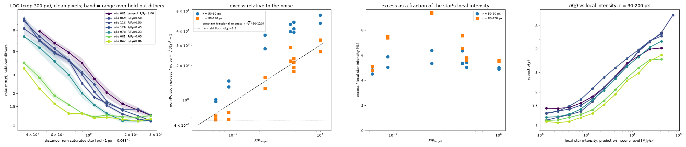
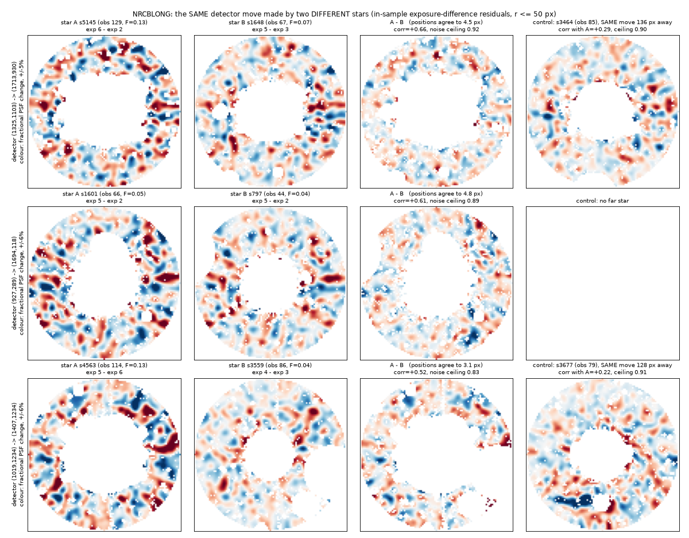
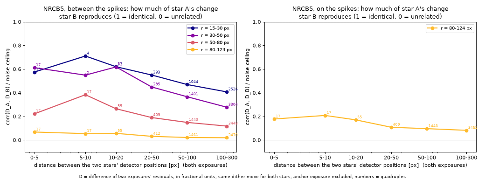
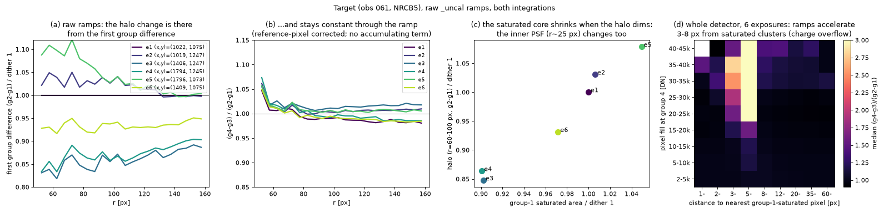

# Poisson-limited subtraction of a heavily saturated NIRCam star (10678, F480M)

Goal: fit and remove one of the brightest saturated stars in the Galactic Center
Treasury program (GO-10678) so that **every modeled pixel has a residual consistent
with Poisson noise**, with the claim tested **out of sample**.

**Status: not reached everywhere.**

- **Outer wing (r ≳ 200 px, 12″):** held-out dithers are predicted to a robust
  σ(χ) of 1.2–1.3. The remaining excess is not structure in the saturated star's
  PSF (see §4).
- **Inner halo (r ≲ 150 px, 9″):** the residual is 2–8σ, about **4–5% of the
  star's local intensity**. The cause is a dither-to-dither change in the star's
  halo. It is real in the raw ramps, happens only in the LW channel, stays fixed
  within an exposure, and has PSF-scale (λ/D) structure. No model built from
  the other dithers can predict it (§3).
- **Brightness sequence (§5):** the same ≈5% relative halo error is present in
  six fainter saturated stars (F/F_target = 0.5 → 0.064). The residual is
  Poisson-limited only where the star's halo is below ~10 MJy/sr above the
  scene: beyond ≈80 px (5″) for a star 10× fainter, ≈60 px for 16× fainter.

This directory holds the tooling, the diagnostics that isolate the floor, and
the numbers. Nothing here is wired into the pipeline yet.

## 1. Target and data

| | |
|---|---|
| star | RA 266.5090307, Dec −28.9565882 (obs 061, NRCB5) |
| filter | F480M, BRIGHT2, 4 groups × 2 integrations, 172 s, FULLBOX 6-point dither |
| saturation | 11 188 px carry the any-group SATURATED flag (a 160×128 px ellipse); 2 504 px are lost (NaN) |
| brightness | brightest isolated star in the 136 public 10678 LW first dithers (`scan`, §7) |

MAST (`mast.stsci.edu`) is not reachable from the sandbox. The same public
products come from the AWS open-data mirror via `s3data.py`
(`https://stpubdata.s3.amazonaws.com/jwst/public/jw10678/...`).

STPSF and Jay Anderson's PSF libraries need STScI hosts that are not reachable
here either. The PSF, and everything else, is therefore empirical and built from
the data.

## 2. Method (what the code does)

1. **Geometry comes from the GWCS, never SIP (CLAUDE.md rule #2).** `cutout.py`
   stores per-pixel V2V3 coordinates for a 1024² cutout of each dither.
   Differential distortion between dithers is large. Relative to a pure
   translation it reaches **2.7 px at r=200 px and 6.4 px at r=500 px**
   (`diagnostics.differential_distortion`). A detector-pixel PSF or stack
   therefore cannot be shared between dithers.
2. **Band-limited representation.** F480M is Nyquist-sampled: the optical cutoff
   at 4.63 µm is D/λ = 0.435 cycles per 0.063″ pixel. The model lives on a grid
   in the ideal (V2V3) frame, as Fourier coefficients inside |k| ≤ 0.45. It is
   evaluated exactly at every distorted pixel position with a type-2 NUFFT
   (`bandpsf.py`, finufft), and the adjoint is exact (dot-test in `bandpsf.py`).
3. **Why not "PSF + fitted neighbours".** In F480M the Galactic Center is
   confusion-limited. A 5 000–8 000-star neighbour fit leaves robust χ≈15
   everywhere: residuals of ~9 MJy/sr against σ≈0.5. Everything sky-fixed is
   common to the 6 dithers: faint stars, nebulosity, and the saturated star's
   PSF itself, since all dithers share one roll (PA_V3 = 90.1°–90.2° for every
   public 10678 visit).
4. **The model (`patternfit.py`).** One static band-limited pattern Q(q) is
   solved by preconditioned CG. Solver details that mattered:
   - band-projected Jacobi preconditioner;
   - proximal term, weighted by the hole-filled weight density;
   - round-off guard on the saturated-hole mask.

   Each exposure then gets a small nuisance model, fitted by Gauss–Newton:
   - flux scale, pedestal and gradient;
   - a cubic-polynomial distortion correction (20 parameters);
   - a first-order PSF-width kernel (3 parameters);
   - smooth halos around the target and the 4 brightest other saturated stars
     (B-splines in log r × Fourier m≤4).

   Only this nuisance (~250 parameters) is refitted on the held-out dither, so
   **leave-one-dither-out (LOO) is a true out-of-sample prediction**. The
   residual is normalised by √(VAR_POISSON + VAR_RNOISE + model variance).
5. **Cost.** 4 cores, ~10–25 min per held-out dither. `patternfit_rank2.py` adds
   a learned variable template H × smooth per-exposure amplitude.

## 3. Results


Robust σ(χ), leave-one-dither-out, pixels without SAT/JUMP flags:

| r [px] | dither 1 | dither 2 | dither 3 | dither 5 |
|---|---|---|---|---|
| 50–80 | 5.5 | 5.0 | 4.8 | 5.4 |
| 80–120 | 3.5 | 3.0 | 2.9 | 3.0 |
| 120–200 | 1.85 | 1.7 | 1.6 | 1.7 |
| 200–300 | 1.36 | 1.4 | 1.25 | 1.3 |
| 300–500 | 1.22 | 1.3 | 1.18 | 1.25 |

- **SAT-flagged pixels** (partially saturated ramps, 1–3 good groups; the
  160×128 px ellipse): σ(χ) ≈ 6.
- **JUMP-flagged pixels** (the ring just outside it, where ~40% of pixels at
  r<120 are flagged): ≈ 2.

Each iteration and what it bought (robust σ(χ), all held-out pixels of dither 1):

| model | σ(χ) | r 80–120 |
|---|---|---|
| detector-pixel dither differencing (no distortion) | 4–13 | – |
| static Q, translation only, unconverged CG | 2.18 | – |
| + per-exposure smooth star halo, converged CG | 1.48 | 3.5 |
| + cubic distortion, PSF-width kernel, secondary halos | 1.42 | 3.47 |
| + learned variable template (rank 2) | 1.43 | 3.44 |
| band limit 0.45 → 0.5 cycles/px (600 px crop) | – | 3.49 |
| super-resolved Q: 0.5 px grid, band 0.75 cycles/px (600 px crop) | – | 3.67 |
| + per-exposure row(×amp)/column offsets for 1/f (`ROWCOL=1`) | 1.41 | 3.45 |

### What limits the inner halo: evidence


1. **The star's halo flux changes between dithers; its spikes do not.** Dither
   ratios on the same sky, using exact GWCS resampling (fig 3), are
   azimuthally uniform:

   | dither | halo relative to dither 1 |
   |---|---|
   | e2 | +2 to +3% |
   | e3 | −15 to −19% |
   | e4 | −16 to −20% |
   | e5 | +6 to +8% |
   | e6 | −8% |

   The diffraction spikes stay at ratio ≈1.
2. **It is in the raw data.** The `_uncal` group differences at r=45–70 px are
   4236 / 4390 / 3616 / 3620 / 4614 / 3988 DN per group for dithers 1–6, while
   the far field stays at ~430 (fig 4a).
3. **It is constant within an exposure.** int2/int1 is 1.000 ± 0.0005 at r>70.
   The LOO residuals of the two integrations correlate at 0.97 at r=50–80
   (fig 4b), while int1−int2 is pure noise (σ(χ)=0.88).
4. **It is LW-only.** The simultaneous F212N (NRCB1) halo of the same star is
   stable to a few per cent across the same dithers. Telescope wavefront changes
   would show up more strongly at 2 µm, not less.
5. **It has PSF-scale structure.** Residual autocorrelation is 0.68 / 0.40 / 0.27
   / 0.10 at lags 1 / 2 / 3 / 5 px. It is neither white per-pixel noise nor a
   smooth field.
6. **Ruled out, each with a direct test:**

   | candidate | test and result |
   |---|---|
   | stellar variability | spikes do not change; the changes are step-like between exposures |
   | pipeline | the raw ramps show it |
   | persistence | at the previous dither's saturated core the excess is +10% (below/left) vs −10% (above/right), mean ≈0: PSF asymmetry, not afterglow |
   | distortion or WCS error | the cubic per-exposure correction gains nothing |
   | PSF width / jitter | the ∂²Q kernel gains nothing |
   | smooth additive or multiplicative halo | no gain up to m≤12, 500 parameters |
   | star-centred warp | no gain up to 364 parameters |
   | brighter-fatter effect | the δQ ∝ ∇·(Q∇K∗Q) regression gains nothing |
   | detector-fixed flat errors | cross-dither correlation of relative residuals at the same detector pixel is only +0.08–0.10 |
   | a shared low-rank template | the SVD of the six in-sample residual maps is full-rank (70, 18, 12, 11, 7, 4 × noise) |
   | aliasing of power above the optical cutoff | a single exposure does carry power at 0.45–0.5 cycles/px near the star, but neither a 0.5 band limit nor a super-resolved pattern (0.5 px grid, band 0.75, de-aliased by the dithers' sub-pixel phases) predicts the held-out dither any better |
7. **Other stars do not predict it.** A spike-normalised halo index varies from
   dither to dither for all 8 bright NRCB5 stars in other visits. The pattern
   partly follows the dither x-offset: fine-structure deviations of the target
   and of the obs-116 star (½ the flux) correlate at ≈+0.1 for the same x-offset
   and ≈−0.1 for the opposite. That is a weak shared field-dependent component;
   90% is star- and exposure-specific.

**Interpretation.** For this star, the LW halo at 3–10″ is, per exposure, a
different realisation at the 4–5% level of local intensity. Nothing in the other
dithers or in other stars carries the information needed to predict it. The
per-exposure PSF would have to come from a physical optics model with
per-exposure pupil or wavefront modes (phase retrieval on the star's own wings),
or from dither patterns that revisit the same field position.

**The limitation is not specific to the brightest stars.** The same ≈5% relative
excess is found for stars down to 1/16 of this one's flux (§5); it equals
Poisson noise where the halo falls below ~10 MJy/sr above the scene.

## 4. The outer-wing / far-field floor (σ(χ) ≈ 1.1–1.3), not saturated-star PSF

- **Pixels more than 10 px from any field star, r>300:** σ(χ)=1.095. Row and
  column means of χ scatter 2× more than independent noise allows, but
  per-exposure row(×amplifier) and column offsets (`ROWCOL=1`) change nothing
  (r=300–500 px: 1.224 → 1.226). So this is not 1/f striping; it is coherent
  residual from stars that the rows and columns cross.
- **Within 6 px of field stars:** σ(χ)=1.4–1.55. The field-star PSF core varies
  slightly between the six detector positions.
- **Detector-fixed flat residuals:** correlation +0.08–0.10 across dithers at the
  same pixel. Flat self-calibration over the program's many LW exposures would
  address this.

## 5. Brightness sequence: where the inner halo becomes Poisson-limited (issue #995)



The same LOO test (`loo_crop.py`, crop ±300 px, `QN=640 KMAX=0.45`, held-out
dithers 1 and 3, all other dithers as training) was run on the target and on six
fainter saturated NRCB5 F480M stars from other 10678 visits. The noise model is
unchanged: χ = (data − prediction)/√(VAR_POISSON + VAR_RNOISE + model variance),
over pixels without SAT(2)/JUMP(4) flags and with ≥3 training dithers at the
pattern node.

**Brightness** (`brightness.py`): F/F_target is the ratio of the star's
background-subtracted, off-spike halo profile to the target's, at r = 40–85 px
(median over dithers, then over four annuli). The inner halo is used because
there the star dominates the confused scene. The saturated-core size is an
independent check: it scales as F^0.75 over the whole sequence.

| star (obs) | F/F_t | SAT core [px] | lost core [px] | 30–50 | 50–80 | 80–120 | 120–200 | 200–300 | excess/I at 30–50 / 50–80 / 80–120 | r(σ=1.5) [px] |
|---|---|---|---|---|---|---|---|---|---|---|
| 061 (target) | 1.00 | 11 223 | 2 179 | 7.8 | 5.2 | 3.2 | 1.72 | 1.30 | 5.4 / 5.0 / 5.5 % | 193 |
| 116 | 0.50 | 6 364 | 1 346 | 7.2 | 4.6 | 2.4 | 1.36 | 1.12 | 5.1 / 5.4 / 5.7 % | 139 |
| 069 | 0.50 | 6 304 | 1 275 | 6.7 | 4.5 | 2.1 | 1.47 | 1.32 | 5.1 / 5.4 / 5.8 % | 154 |
| 126 | 0.45 | 5 608 | 1 167 | 6.7 | 4.4 | 2.7 | 1.47 | 1.16 | 6.0 / 5.8 / 7.0 % | 156 |
| 078 | 0.23 | 3 716 | 967 | 5.7 | 3.4 | 1.74 | 1.16 | 1.11 | 5.1 / 5.9 / (9.4) % | 114 |
| 063 | 0.089 | 1 874 | 513 | 3.2 | 1.70 | 1.24 | 1.21 | 1.21 | 4.4 / 5.4 / (7.5) % | 76 |
| 042 | 0.064 | 1 532 | 435 | 2.6 | 1.40 | 1.22 | 1.15 | 1.12 | 4.5 / 4.7 / 5.0 % | 61 |

Columns 30–50 … 200–300: robust σ(χ) (1.4826·median|χ|) in radial bins [px],
mean of the two held-out dithers (the two differ by 5–20%;
`docs/evidence/satstar_poisson/brightness_sequence.json` has each).
Excess/I = √(σ(χ)²−1) · median σ_tot / median(prediction − scene level): the
non-Poisson residual as a fraction of the star's local intensity. Values in
parentheses are bins where the star's intensity is only ~5–8 MJy/sr and the
excess there is mostly the far-field floor (§4), not the halo. r(σ=1.5): radius
at which σ(χ) falls to 1.5. obs 042 has only 4 dithers (the star is off the
detector in 4 and 5); 046 and 070 (2 dithers each, F/F_t = 0.06 and 0.17) were
not run, because a LOO with a single training dither is not comparable.

**Findings.**

1. **The excess is a fixed fraction of the local halo intensity, ≈5% (4.4–6%),
   for every star, across a factor 16 in brightness** (fig. panel 3). It is not a
   peculiarity of the brightest star: every saturated LW star's halo changes
   between dithers by about the same relative amount.
2. **σ(χ) is, to first order, a function of the local star intensity alone**
   (panel 4): ≈1.2 (the far-field floor) below ~5 MJy/sr above the scene, √2
   (excess = noise) at ~10–15 MJy/sr, 2 at ~20–40, 3 at ~70 MJy/sr, for all
   stars. With σ_tot ≈ 0.5–0.8 MJy/sr this is just 0.05·I = σ_tot.
3. **At fixed radius**, the excess/noise ratio therefore scales as ≈√F (panel 2).
   - r = 80–120 px (5–7.5″): reaches the far-field floor (σ(χ) ≈ 1.2) at
     F/F_t ≲ 0.1 (obs 063, 042). The "~10× fainter" prediction of §3 holds here.
   - r = 50–80 px (3–5″): σ(χ) = 1.7 at F/F_t = 0.09 and 1.4 at 0.064. Reaching
     the floor needs F/F_t ≈ 0.03.
   - r = 30–50 px (2–3″): still 2.6 at F/F_t = 0.064. Extrapolating √F, the
     floor needs F/F_t ≲ 0.01.
4. **The Poisson-limited radius shrinks as r ∝ F^0.4** (r(σ=1.5) = 193 px for
   the target, 61 px for obs 042), as expected for a halo I ∝ r^−2.5 with a
   fixed 5% error.

**Conclusion.** No brightness makes the whole halo Poisson-limited. The static
pattern model leaves a ~5% per-dither halo error for every saturated F480M
star. The residual is Poisson-limited wherever the star's own halo is below
~10 MJy/sr above the scene (≈20× the per-pixel noise). For a star 10× fainter
than the target, that is beyond ≈80 px (5″); for 16× fainter, beyond ≈60 px.
Inside that radius a better per-exposure PSF (§6, item 3) is needed for every
saturated star, not only the brightest.

Reproduce (from a directory holding the cutouts; ~35 min per star on 4 cores):

```
python brightness.py trn_116 trn_069 trn_126 trn_078 trn_063 trn_042    # brightness.json
for p in tgt trn_116 trn_069 trn_126 trn_078 trn_063 trn_042; do
  QN=640 KMAX=0.45 python loo_crop.py bs_$p 300 1,3 --prefix $p; done
python seq_eval.py ../../../docs/evidence/satstar_poisson 'bs_{p}' tgt trn_116 trn_069 trn_126 trn_078 trn_063 trn_042
```
The training-star cutouts are `cutout.py` runs at each star's position in
dither 1, applied to all six dithers of its visit (star detector positions in
dither 1: 116 (1140,1619), 069 (1187,1391), 126 (196,1814), 078 (1165,469),
063 (705,1565), 042 (1536,975), 070 (1705,1463), 046 (1707,735)).

## 6. Next steps

1. Replace the static field-star content of Q with explicit point sources
   rendered through a detector-position-dependent PSF library, Anderson-style,
   built from the thousands of NRCB5 F480M stars across all 10678 exposures.
   Add a flat self-calibration on top. The far-field and outer-wing excess
   (σ(χ)≈1.1–1.3) is field-star PSF variation between detector positions plus a
   ~10% detector-fixed part, which is what these two address.
2. (Done, §5.) The brightness sequence shows the ~5% per-dither halo error is
   common to all saturated F480M stars; the inner halo is Poisson-limited only
   where the halo is below ~10 MJy/sr above the scene.
3. For the very brightest stars: build a physical LW PSF model (JWST pupil +
   NIRCam LW pupil stop, polychromatic, phase retrieval) with per-exposure
   low-order pupil-shear/WFE modes fitted to each exposure's own wings. That is
   the only route left that can predict the per-dither halo.

## 7. Program-wide halo calibration: is the per-dither PSF change a function of detector position?

All 808 LW `_cal` frames of 10678 (F480M, 68 visits × 6 dithers × NRCALONG/NRCBLONG,
one dither pattern, one roll) were searched for saturated stars
(`halocal_extract.py`: DQ-SAT regions ≥250 px, cutouts + the frame's GWCS). Each
star was centred by point symmetry of its spikes, linked across exposures, and its
halo measured in 12 sectors × 12 annuli (`halocal_measure.py`; 16 361 cutouts).
In-sample pattern fits of the 49 largest and ~190 mid-size stars
(`halocal_patterns.py`) give per-exposure residual maps on a star-centred grid.





| test | result |
|---|---|
| smooth halo index vs position, Legendre cubic (`halocal_fit.py`) | removes ≤40% of the excess (A5, r=20–40), 0–14% (B5) |
| a per-exposure term common to all stars in the exposure | none: it always worsens the CV |
| detector-fixed multiplicative error, i.e. flat self-calibration (`halocal_flat.py`) | the two halves' maps correlate +0.02–0.04; applying one to the other worsens χ² at every radius |
| 24 learned modes of the change (`halocal_modes.py`, 3-fold CV by star) | 45 / 38 / 28 / 11% of the excess at r = 15–30 / 30–50 / 50–80 / 80–124, vs 36 / 26 / 16 / 9% for the same modes rotated 15° |
| **same detector move made by two different stars** (`halocal_samepos.py`, 10 824 quadruples) | see below |
| brightness dependence at fixed r | none: fractional residual 2–5%, flat within ×1.5 for F = 0.02–1 |
| raw-ramp shape (`ramp_satedge.py`, `ramp_fig.py`) | the target's halo change is in the first group difference; (g4−g3)/(g2−g1) is the same in all 6 dithers to ±2% |
| saturated-core area vs halo | bright stars: corr +0.87 (r=20–40), +0.78 (30–80); target: area 1.00 / 1.01 / 0.90 / 0.90 / 1.05 / 0.97 vs halo 1.00 / 1.03 / 0.85 / 0.86 / 1.08 / 0.93 |

**Same position, different star (fig. 14, 16).** A residual map of one exposure
depends on which other positions entered the star's mean pattern. That dependence
cancels in the difference of two exposures, D = r_k/a_k − r_i/a_i. If the PSF is a
function of detector position alone, two stars whose exposures i, k sit on the same
pixels as the other star's j, l have D_A = D_B up to noise. Normalised by the noise
ceiling √(f_A f_B), with the anchor exposure excluded:

| r [px] | stars < 20 px apart | same move, 100–300 px apart |
|---|---|---|
| 15–30 | 0.58–0.71 | 0.41 |
| 30–50 | 0.55–0.62 | 0.28 |
| 50–80 | 0.22–0.38 | 0.12 |
| 80–124 (between spikes) | 0.05–0.07 | 0.02 |
| 80–124 (spikes) | 0.18–0.21 | 0.08 |

Inside 50 px (3″) about 60% of the change is shared by a different star at the same
place. About half of that shared part is still shared 100–300 px away, so it is
smooth in field position. Beyond 80 px, different stars at the same place show
different structure.

**Ramps.** The target's halo change is already present in the first group
difference and is constant through the ramp. The saturated core shrinks and grows
with it, so the change reaches in to r ≈ 25 px while the spikes stay fixed. It is
incoming flux, not an accumulating detector effect: not overflow, not growing
brighter-fatter, not persistence build-up. Separately, whole-detector ramps
accelerate 3–8 px from clusters saturated in group 1 ((g4−g3)/(g2−g1) up to 3–6 at
20–40 kDN fill; ≤1.03 beyond 12 px). That is charge overflow from saturated pixels.
It is confined to within ~8 px of saturated pixels, and at the target it is +5% at
r ≤ 55 px. Pixels that close to a core should be masked, but they are not the
source of the halo change.

A first version of the brightness test appeared to show a strong dependence on
saturation depth. Nine stars with failed pattern fits (in-sample χ² 100–700)
produced it; they are now excluded (`QCUT`).

## 8. Files

| file | purpose |
|---|---|
| `s3data.py` | list/fetch public JWST products from the stpubdata S3 mirror |
| `cutout.py` | star-centred cutouts with GWCS V2V3 per pixel |
| `bandpsf.py` | band-limited periodic PSF/pattern: NUFFT evaluation, exact adjoint, gradients |
| `exposure.py` | cutout container, weights, local Jacobians, sparse B-spline bases |
| `halobasis.py` | star-centred log-r B-spline × Fourier basis |
| `patternfit.py` | static pattern + per-exposure nuisance, joint fit and LOO (main model) |
| `patternfit_rank2.py` | + learned variable template with smooth per-exposure amplitude |
| `loo_crop.py` | LOO on a crop, for band-limit / super-resolution (`KMAX`, `QH`, `QN`) tests and the brightness sequence (`--prefix`) |
| `brightness.py` | relative brightness (halo-profile ratio) and saturated-core size of each star |
| `seq_eval.py` | brightness-sequence χ statistics, excess fraction, fig. 11 |
| `evaluate_loo.py` | χ statistics by DQ class, radius and model brightness |
| `diagnostics.py` | distortion, dither-ratio, raw-ramp, integration and halo-index tests |
| `halocal_extract.py` | program-wide saturated-star cutouts + GWCS from the S3 mirror (§7) |
| `halocal_measure.py` | symmetry centring, linking, sector/annulus halo measurement (§7) |
| `halocal_fit.py` | smooth halo change vs position / exposure, cross-validated (§7) |
| `halocal_patterns.py` | per-star in-sample pattern fits, residual maps for §7 |
| `halocal_flat.py` | detector-fixed multiplicative error (flat self-cal) test (§7) |
| `halocal_correlation.py` | halo and residual-map correlation vs dither-1 separation (§7) |
| `halocal_modes.py` | learned modes of the PSF change, CV with a rotated control (§7) |
| `halocal_psfcal.py` | Legendre-position × map calibration; star amplitudes (§7) |
| `halocal_loo.py` | target LOO with a program-wide calibration or learned modes (§7) |
| `halocal_samepos.py` | same-detector-position, different-star test; brightness test (§7) |
| `halocal_samepos_fig.py`, `halocal_samepos_summary.py` | figs. 14, 16 |
| `ramp_satedge.py`, `ramp_fig.py` | raw-ramp shape vs distance to saturated pixels; fig. 15 |
| `make_figures.py` | the figures above |

Reproduce (about 1 h on 4 cores):

```
python s3data.py 10678 061 nrcblong cal uncal rate rateints     # into ../data
python cutout.py 266.5090306896523 -28.95658817641266 512 tgt ../data/jw10678061001_02101_0000{1..6}_nrcblong_cal.fits
NJOINT=3 LOO=1,2,3,5 python patternfit.py q3
python evaluate_loo.py 1 q3 ; python make_figures.py figures
```
